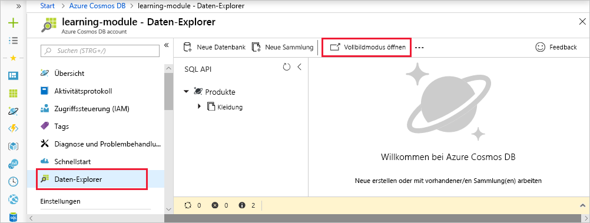
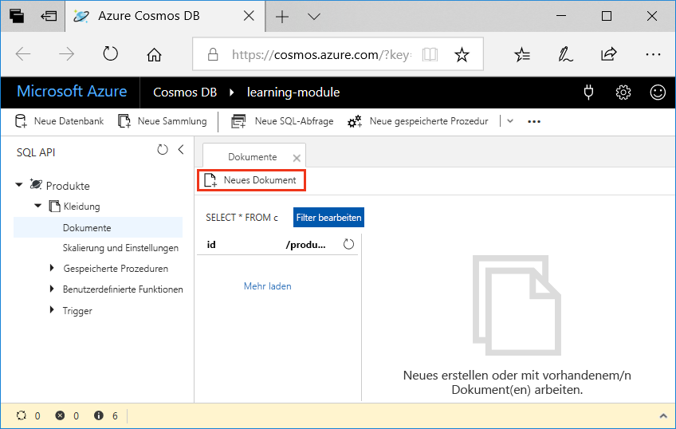
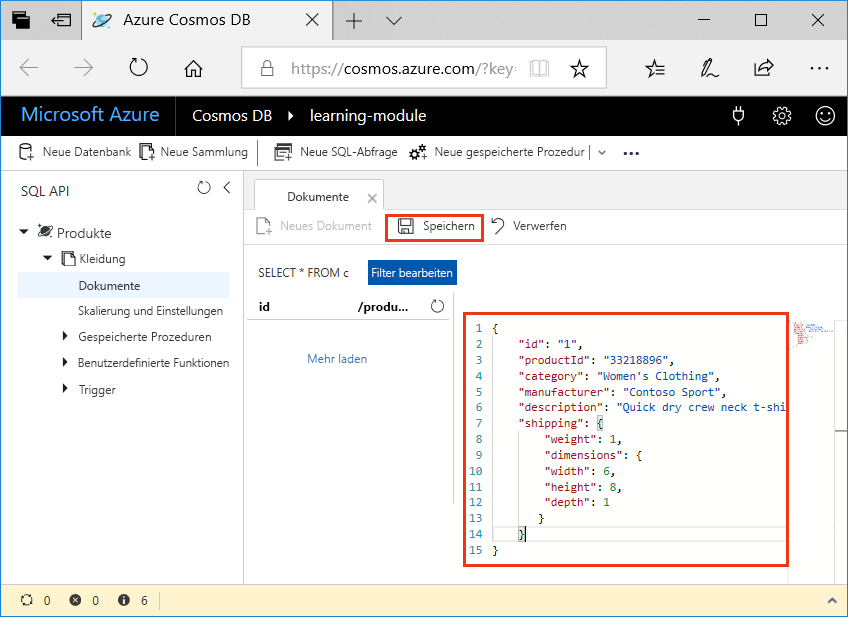

Adding data to your Azure Cosmos DB database is simple. You open the Azure portal, navigate to your database, and use the Data Explorer to add JSON documents to the database. There are more advanced ways to add data, but we'll start here because the Data Explorer is a great tool to get you acquainted with the inner workings and functionality provided by Azure Cosmos DB.

## What is the Data Explorer?
The Azure Cosmos DB Data Explorer is a tool included in the Azure portal that is used to manage data stored in an Azure Cosmos DB. It provides a UI for viewing and navigating data collections, as well as for editing documents within the database.

## Add data using the Data Explorer

1. If you're continuing from the previous module, click **Data Explorer** in the Azure portal window, and then click **Open Full Screen**.

    Otherwise, sign in to the [Azure portal](https://portal.azure.com/?azure-portal=true), click **All services** > **Databases** > **Azure Cosmos DB**. Then select your account, click **Data Explorer**, and then click **Open Full Screen**.
 
   

2. In the **Open Full Screen** box, click **Open**.

    The web browser displays the new full-screen Data Explorer, which gives you more space and a dedicated environment for working with your database.

3. To create a new JSON document, click **New Document**.

   

4. Now, add a document to the collection with the following structure. Just copy and paste the following code into the **Documents** tab:

     ```
    {
        "id": "1",
        "productId": "33218896",
        "category": "Women's Clothing",
        "manufacturer": "Contoso Sport",
        "description": "Quick dry crew neck t-shirt",
        "shipping": {
            "weight": 1,
            "dimensions": {
            "width": 6,
            "height": 8,
            "depth": 1
           }
        }
     ```

5. Once you've added the JSON to the **Documents** tab, click **Save**.

    

6. Create and save one more document by copying the following JSON object into Data Explorer and clicking **Save**.

     ```
    {
        "id": "2",
        "productId": "33218897",
        "category": "Women's Outerwear",
        "manufacturer": "Contoso",
        "description": "Black wool pea-coat",
        "shipping": {
            "weight": 2,
            "dimensions": {
            "width": 8,
            "height": 11,
            "depth": 3
           }
        }
    }
     ```

7. Confirm the documents have been saved by clicking **Documents** on the left-hand menu. 

    Data Explorer displays the two documents in the **Documents** tab.

## Summary

In this module, you added two documents, each representing a product in your product catalog, to your database by using the Data Explorer. The Data Explorer is a good way to create documents, modify documents, and get started with Azure Cosmos DB.  
