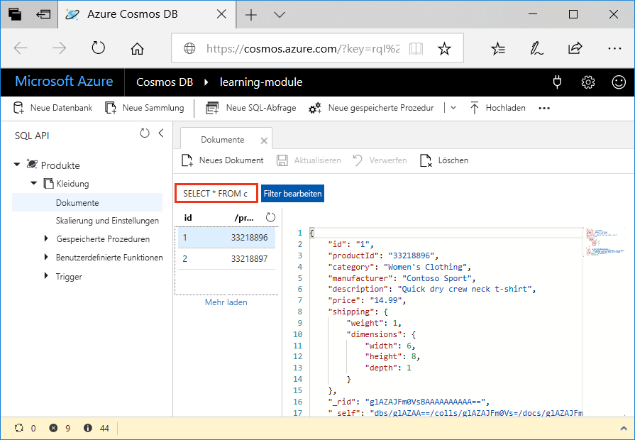
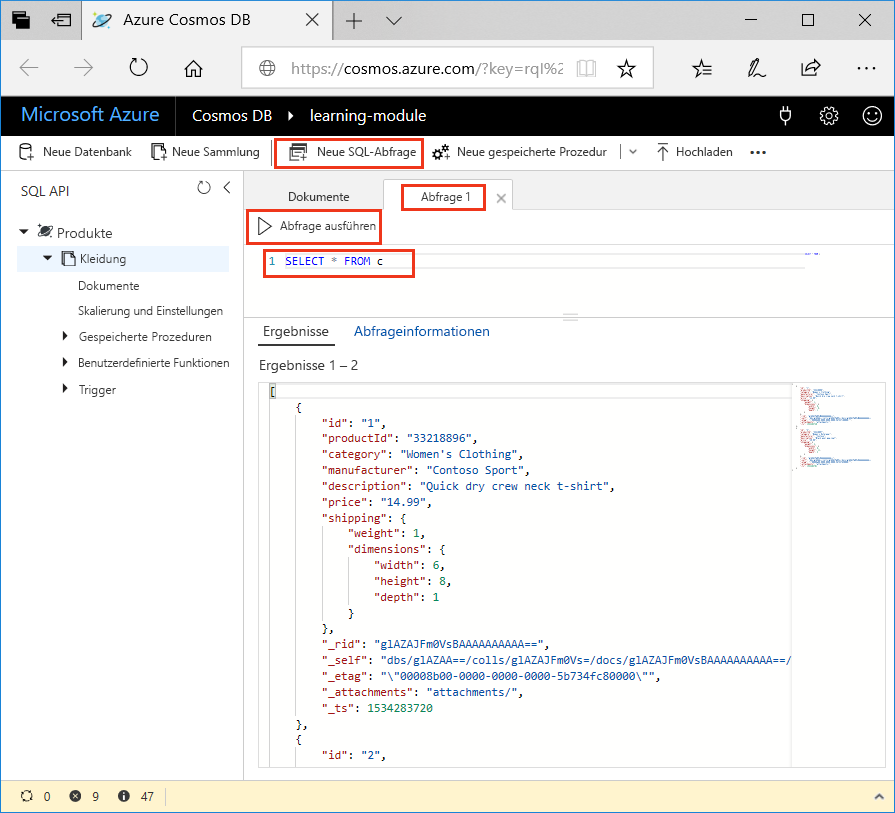
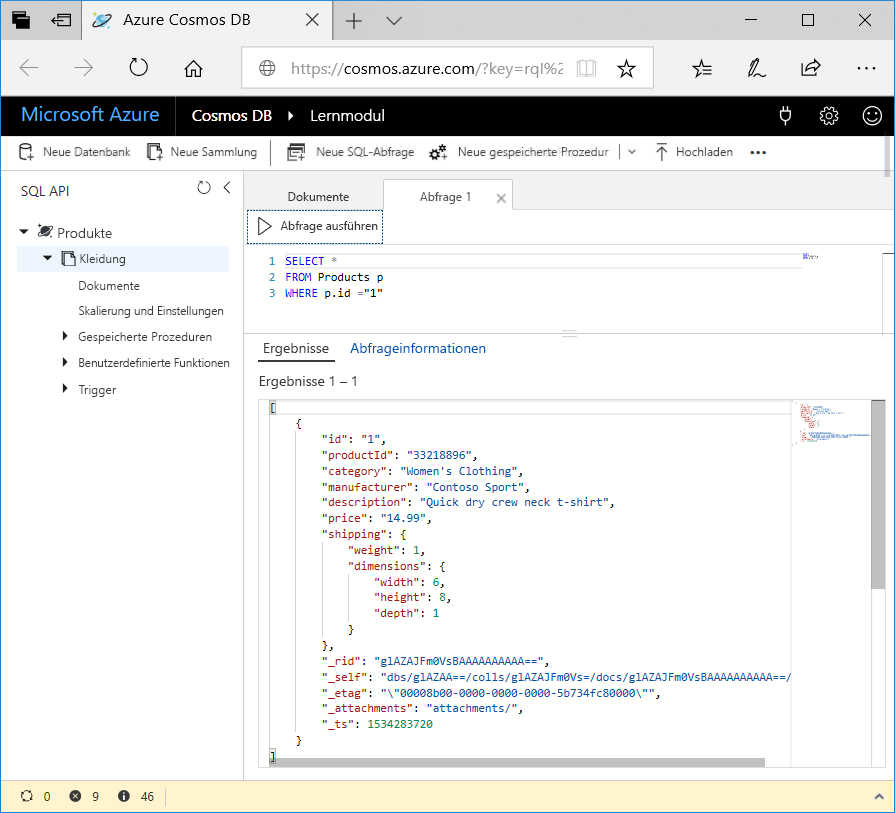

Now that you've learned about what kinds of queries you can create, let's use the Data Explorer in the Azure portal to retrieve and filter your product data.

In your Data Explorer window, note that by default, the query on the **Document** tab is set to `SELECT * FROM c`. This default query retrieves and displays all documents in the collection.



## Create a new query

1. In Data Explorer, click the **New SQL Query** tab. Note that the default query on the new  **Query 1** tab is `SELECT * from c`, and then click **Execute Query**. This query returns all results in the database.

    

2. Now, let's run some of the queries discussed in the previous unit. On the query tab, delete `SELECT * from c`, copy and paste the following query, and then click **Execute Query**:

    ```
    SELECT *
    FROM Products p
    WHERE p.id ="1"
    ```

    The results return the product whose `productId` is 1.

    

3. Delete the previous query, copy and paste the following query, and click **Execute Query**. This query returns the price, description, and product ID for all products, ordered by price, in ascending order.
 
    ```
    SELECT p.price, p.description, p.productId
    FROM Products p
    ORDER BY p.price ASC
    ```

## Summary

You have now completed some basic queries on your data in Azure Cosmos DB. 