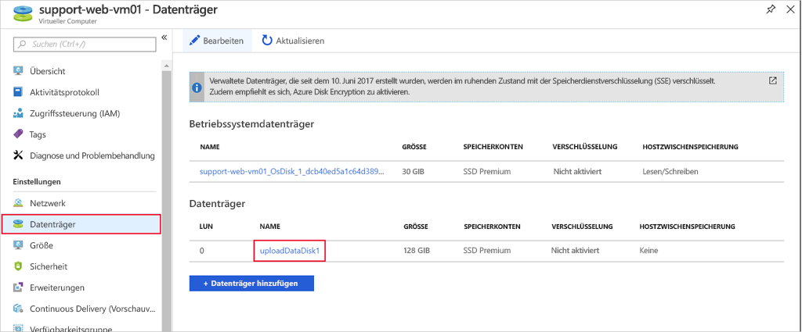
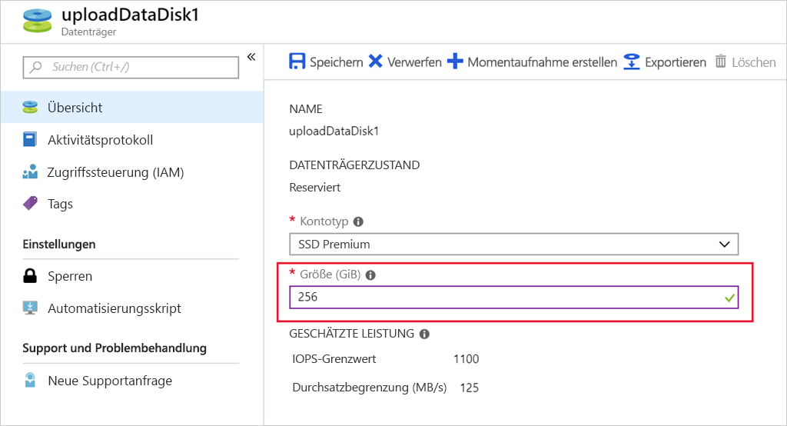

<span data-ttu-id="72e8d-101">In Azure werden Ihre VHD-Images in einem Azure Storage-Konto als Seitenblobs gespeichert.</span><span class="sxs-lookup"><span data-stu-id="72e8d-101">Azure stores your VHD images as page blobs in an Azure Storage account.</span></span> <span data-ttu-id="72e8d-102">Bei verwalteten Datenträgern übernimmt Azure die Verwaltung des Speichers in Ihrem Auftrag. Dies ist einer der besten Gründe, sich für verwaltete Datenträger zu entscheiden.</span><span class="sxs-lookup"><span data-stu-id="72e8d-102">With managed disks, Azure takes care of managing the storage on your behalf - it's one of the best reasons to choose managed disks.</span></span>

<span data-ttu-id="72e8d-103">Wenn Sie die VM erstellen, wird eine Größe für den Betriebssystem-Datenträger gewählt.</span><span class="sxs-lookup"><span data-stu-id="72e8d-103">When you create the VM, it chooses a size for the OS disk.</span></span> <span data-ttu-id="72e8d-104">Die genaue Größe basiert auf dem Image, das Sie auswählen.</span><span class="sxs-lookup"><span data-stu-id="72e8d-104">The specific size is based on the image you select.</span></span> <span data-ttu-id="72e8d-105">Unter Linux ist die Größe meist ca. 30 GB, unter Windows 127 GB.</span><span class="sxs-lookup"><span data-stu-id="72e8d-105">On Linux, it's often around 30 GB, and on Windows about 127 GB.</span></span>

<span data-ttu-id="72e8d-106">Sie können Datenträger hinzufügen, um zusätzlichen Speicherplatz bereitzustellen. Sie können aber auch einen vorhandenen Datenträger erweitern. Möglicherweise kann eine ältere Anwendung ihre Daten nicht auf Laufwerke verteilen, oder Sie migrieren das Laufwerk eines physischen PCs nach Azure und benötigen ein größeres Betriebssystem-Laufwerk.</span><span class="sxs-lookup"><span data-stu-id="72e8d-106">You can add data disks to provide for additional storage space, but you may also wish to expand an existing disk - perhaps a legacy application cannot split its data across drives, or you are migrating a physical PC's drive to Azure and need a larger OS drive.</span></span>

> [!NOTE]
> <span data-ttu-id="72e8d-107">Sie können einen Datenträger nur _vergrößern_.</span><span class="sxs-lookup"><span data-stu-id="72e8d-107">You can only resize a disk to a _larger_ size.</span></span> <span data-ttu-id="72e8d-108">Das Verkleinern verwalteter Datenträger wird derzeit nicht unterstützt.</span><span class="sxs-lookup"><span data-stu-id="72e8d-108">Shrinking managed disks is not supported today.</span></span>

<span data-ttu-id="72e8d-109">Durch das Ändern der Größe des Datenträgers kann sich auch die Ebene des Datenträgers ändern (z.B. von P10 in P20).</span><span class="sxs-lookup"><span data-stu-id="72e8d-109">Changing the size of the disk can also change the level of the disk (for example from P10 to P20).</span></span> <span data-ttu-id="72e8d-110">Denken Sie daran, da dies für leistungsbezogene Upgrades von Vorteil sein kann. Es fallen aber auch höhere Kosten an, wenn Sie sich im Premium-Tarif nach oben bewegen.</span><span class="sxs-lookup"><span data-stu-id="72e8d-110">Keep this in mind - this can be beneficial for performance upgrades, but will also cost more as you move up the premium tiers.</span></span>

## <a name="vm-size-vs-disk-size"></a><span data-ttu-id="72e8d-111">Größe der VM im Vergleich mit der Datenträgergröße</span><span class="sxs-lookup"><span data-stu-id="72e8d-111">VM size vs. Disk size</span></span>

<span data-ttu-id="72e8d-112">Die VM-Größe, die Sie auswählen, wenn Sie die VM erstellen, bestimmt, wie viele Ressourcen ihr zugewiesen werden können.</span><span class="sxs-lookup"><span data-stu-id="72e8d-112">The VM size you choose when you create your VM will determine how many resources it can allocate.</span></span> <span data-ttu-id="72e8d-113">Bei der Speicherung steuert die Größe die Anzahl der Datenträger, die Sie der VM hinzufügen können, und die maximale Größe der einzelnen Datenträger.</span><span class="sxs-lookup"><span data-stu-id="72e8d-113">For storage, the size will control the number of disks you can add to the VM and the max size of each disk.</span></span> 

<span data-ttu-id="72e8d-114">Wie in der vorherigen Einheit bereits erwähnt, unterstützen einige VM-Größen nur Standard-Speicherlaufwerke, was die E/A-Leistung einschränkt.</span><span class="sxs-lookup"><span data-stu-id="72e8d-114">As mentioned in the previous unit, some VM sizes only support Standard storage drives - limiting the I/O performance.</span></span>

<span data-ttu-id="72e8d-115">Wenn Sie feststellen, dass Sie mehr Speicherplatz benötigen, als Ihre VM-Größe zulässt, können Sie die VM-Größe ändern.</span><span class="sxs-lookup"><span data-stu-id="72e8d-115">If you find that you need more storage than what your VM size allows for, you can change the VM size.</span></span> <span data-ttu-id="72e8d-116">Wir behandeln dieses Thema im Modul **Einführung in Azure Virtual Machines**.</span><span class="sxs-lookup"><span data-stu-id="72e8d-116">We cover that topic in the **Introduction to Azure Virtual Machines** module.</span></span>

## <a name="expanding-a-disk-using-the-azure-cli"></a><span data-ttu-id="72e8d-117">Erweitern eines Datenträgers mit der Azure CLI</span><span class="sxs-lookup"><span data-stu-id="72e8d-117">Expanding a disk using the Azure CLI</span></span>

> [!WARNING]
> <span data-ttu-id="72e8d-118">Bevor Sie Änderungen an der Größe von Datenträgern vornehmen, sollten Sie Ihre Daten unbedingt immer zunächst sichern!</span><span class="sxs-lookup"><span data-stu-id="72e8d-118">Always make sure that you back up your data before performing disk resize operations!</span></span>

<span data-ttu-id="72e8d-119">Vorgänge auf VHDs können nicht durchgeführt werden, wenn die VM ausgeführt wird.</span><span class="sxs-lookup"><span data-stu-id="72e8d-119">Operations on VHDs cannot be performed with the VM running.</span></span> <span data-ttu-id="72e8d-120">Der erste Schritt besteht darin, die VM zu beenden und die Zuordnung mit `az vm deallocate` unter Angabe des Namens der VM und der Ressourcengruppe aufzuheben.</span><span class="sxs-lookup"><span data-stu-id="72e8d-120">The first step is to stop and deallocate the VM with `az vm deallocate` supplying the VM name and resource group name.</span></span>

<span data-ttu-id="72e8d-121">Bei der Aufhebung der Zuordnung einer VM werden anders als beim bloßen _Beenden_ einer VM die zugehörigen IT-Ressourcen freigegeben, sodass Azure Konfigurationsänderungen an der virtualisierten Hardware vornehmen kann.</span><span class="sxs-lookup"><span data-stu-id="72e8d-121">Deallocating a VM, unlike just _stopping_ a VM releases the associated computing resources and allows Azure to make configuration changes to the virtualized hardware.</span></span>

```azurecli
az vm deallocate --resource-group <resource-group-name> --name <vm-name>
```

<span data-ttu-id="72e8d-122">Um anschließend die Größe eines Datenträgers zu ändern, verwenden Sie `az disk update` und übergeben den Datenträgernamen, den Namen der Ressourcengruppe und die neu angeforderte Größe.</span><span class="sxs-lookup"><span data-stu-id="72e8d-122">Next, to resize a disk, you use `az disk update`, passing the disk name, resource group name, and newly requested size.</span></span> <span data-ttu-id="72e8d-123">Wenn Sie einen verwalteten Datenträger erweitern, wird die angegebene Größe der nächsten verwalteten Datenträgergröße zugeordnet.</span><span class="sxs-lookup"><span data-stu-id="72e8d-123">When you expand a managed disk, the specified size is mapped to the nearest managed disk size.</span></span>

```azurecli
az disk update \
    --resource-group <resource-group-name> \
    --name <disk-name> \
    --size-gb 200
```

<span data-ttu-id="72e8d-124">Abschließend starten Sie die VM mit `az vm start` neu:</span><span class="sxs-lookup"><span data-stu-id="72e8d-124">Finally, you start the VM again with `az vm start`:</span></span>

```azurecli
az vm start --resource-group <resource-group-name> --name <vm-name>
```

## <a name="expanding-a-disk-using-the-azure-portal"></a><span data-ttu-id="72e8d-125">Erweitern eines Datenträgers im Azure-Portal</span><span class="sxs-lookup"><span data-stu-id="72e8d-125">Expanding a disk using the Azure portal</span></span>

<span data-ttu-id="72e8d-126">Das Erweitern eines Datenträgers im Azure-Portal ist noch einfacher.</span><span class="sxs-lookup"><span data-stu-id="72e8d-126">Expanding a disk using the Azure portal is even easier.</span></span>

1. <span data-ttu-id="72e8d-127">Beenden Sie die VM in ihrer Ansicht **Übersicht** über die Schaltfläche **Beenden** auf der Symbolleiste.</span><span class="sxs-lookup"><span data-stu-id="72e8d-127">Stop the VM using the **Stop** button in the toolbar on the **Overview** view of the VM.</span></span>

1. <span data-ttu-id="72e8d-128">Klicken Sie im Abschnitt **Einstellungen** auf **Datenträger**.</span><span class="sxs-lookup"><span data-stu-id="72e8d-128">Click **Disks** in the **Settings** section.</span></span>

1. <span data-ttu-id="72e8d-129">Wählen Sie den Datenträger aus, dessen Größe Sie ändern möchten.</span><span class="sxs-lookup"><span data-stu-id="72e8d-129">Select the data disk you want to resize.</span></span>

    

1. <span data-ttu-id="72e8d-131">Geben Sie in den Datenträgerdetails eine Größe ein, die _höher_ als die aktuelle Größe ist.</span><span class="sxs-lookup"><span data-stu-id="72e8d-131">In the disk details, type a size _larger_ than the current size.</span></span> <span data-ttu-id="72e8d-132">Sie können hier auch von Premium zu Standard (oder umgekehrt) wechseln.</span><span class="sxs-lookup"><span data-stu-id="72e8d-132">You can also change from Premium to Standard (or vice-versa) here.</span></span> <span data-ttu-id="72e8d-133">Diese Einstellungen wirken sich auf Ihre Leistung aus, wie im Abschnitt über die vorhergesagten IOPS gezeigt.</span><span class="sxs-lookup"><span data-stu-id="72e8d-133">These settings will adjust your performance as shown in the predicted IOPS section.</span></span>

    

1. <span data-ttu-id="72e8d-135">Klicken Sie zum Speichern der Änderungen auf **Speichern**.</span><span class="sxs-lookup"><span data-stu-id="72e8d-135">Click **Save** to save the changes.</span></span>

1. <span data-ttu-id="72e8d-136">Starten Sie die VM neu.</span><span class="sxs-lookup"><span data-stu-id="72e8d-136">Restart the VM.</span></span>


### <a name="expanding-the-partition"></a><span data-ttu-id="72e8d-137">Erweitern der Partition</span><span class="sxs-lookup"><span data-stu-id="72e8d-137">Expanding the partition</span></span>

<span data-ttu-id="72e8d-138">Genau wie beim Hinzufügen eines neuen Datenträgers wird mit einem erweiterten Datenträger erst dann nutzbarer Speicherplatz hinzugefügt, wenn Sie die Partition und das Dateisystem erweitern.</span><span class="sxs-lookup"><span data-stu-id="72e8d-138">Just like adding a new data disk, an expanded disk won't add any usable space until you expand the partition and filesystem.</span></span> <span data-ttu-id="72e8d-139">Dies muss mit den der VM zur Verfügung stehenden Betriebssystemtools erfolgen.</span><span class="sxs-lookup"><span data-stu-id="72e8d-139">This must be done using the OS tools available to the VM.</span></span> 

<span data-ttu-id="72e8d-140">Unter Windows verwenden wir das Tool „Datenträgerverwaltung“ oder Befehlszeilentool `diskpart`.</span><span class="sxs-lookup"><span data-stu-id="72e8d-140">On Windows, we would use the Disk Manager tool or the `diskpart` command line tool.</span></span>

<span data-ttu-id="72e8d-141">Unter Linux verwenden Sie `parted` und `resize2fs`.</span><span class="sxs-lookup"><span data-stu-id="72e8d-141">On Linux, you will use `parted` and `resize2fs`.</span></span>

<span data-ttu-id="72e8d-142">Lassen Sie uns einige dieser Befehle ausprobieren.</span><span class="sxs-lookup"><span data-stu-id="72e8d-142">Let's try out some of these commands.</span></span>