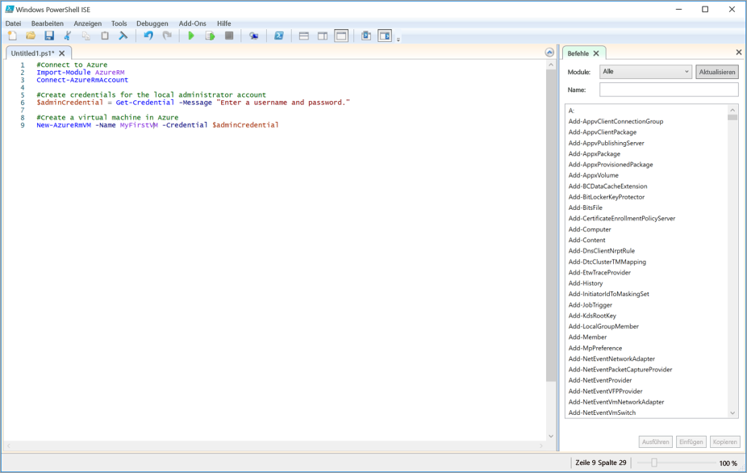

<span data-ttu-id="62950-101">Komplexe oder wiederkehrende Aufgaben erfordern häufig viel Zeit für die Verwaltung.</span><span class="sxs-lookup"><span data-stu-id="62950-101">Complex or repetitive tasks often take a great deal of administrative time.</span></span> <span data-ttu-id="62950-102">Organisationen bevorzugen, diese Aufgaben zu automatisieren, um Kosten zu senken und Fehler zu vermeiden.</span><span class="sxs-lookup"><span data-stu-id="62950-102">Organizations prefer to automate these tasks to reduce costs and avoid errors.</span></span>

<span data-ttu-id="62950-103">Dies ist im Customer Relationship Management-Unternehmensbeispiel wichtig.</span><span class="sxs-lookup"><span data-stu-id="62950-103">This is important in the Customer Relationship Management (CRM) company example.</span></span> <span data-ttu-id="62950-104">Dort testen Sie Ihre Software auf mehreren virtuellen Linux-Computern, die Sie kontinuierlich löschen und neu erstellen müssen.</span><span class="sxs-lookup"><span data-stu-id="62950-104">There, you test your software on multiple Linux Virtual Machines (VMs) that you need to continuously delete and recreate.</span></span> <span data-ttu-id="62950-105">Sie sollten ein PowerShell-Skript zum Automatisieren der Erstellung von VMs verwenden, anstatt sie jedes Mal auf die gleiche Weise wie eben manuell zu erstellen.</span><span class="sxs-lookup"><span data-stu-id="62950-105">You want to use a PowerShell script to automate the creation of the VMs vs. creating them manually each time like we just did.</span></span>

<span data-ttu-id="62950-106">Bevor Sie einen virtuellen Computer erstellen, müssen einige zusätzliche Voraussetzungen für das Skript erfüllt sein.</span><span class="sxs-lookup"><span data-stu-id="62950-106">Beyond the core operation of creating a VM you have a few additional requirements for your script.</span></span> 
- <span data-ttu-id="62950-107">Sie erstellen mehrere virtuelle Computer, deshalb sollte die Erstellung in einer Schleife stattfinden.</span><span class="sxs-lookup"><span data-stu-id="62950-107">You will create multiple VMs, so you want to put the creation inside a loop</span></span>
- <span data-ttu-id="62950-108">Sie müssen virtuelle Computer in drei verschiedenen Ressourcengruppen erstellen, der Name der Ressourcengruppe sollte dem Skript also als Parameter übergeben werden.</span><span class="sxs-lookup"><span data-stu-id="62950-108">You need to create VMs in three different resource groups, so the name of the resource group should be passed to the script as a parameter</span></span>

<span data-ttu-id="62950-109">In diesem Abschnitt sehen Sie, wie Sie ein Azure PowerShell-Skript schreiben und ausführen, das diese Anforderungen erfüllt.</span><span class="sxs-lookup"><span data-stu-id="62950-109">In this section, you will see how to write and execute an Azure PowerShell script that meets these requirements.</span></span>

## <a name="what-is-a-powershell-script"></a><span data-ttu-id="62950-110">Was ist ein PowerShell-Skript?</span><span class="sxs-lookup"><span data-stu-id="62950-110">What is a PowerShell script?</span></span>
<span data-ttu-id="62950-111">Ein PowerShell-Skript ist eine Textdatei, die Befehle und Steuerelementkonstrukte enthält.</span><span class="sxs-lookup"><span data-stu-id="62950-111">A PowerShell script is a text file containing commands and control constructs.</span></span> <span data-ttu-id="62950-112">Bei diesen Befehlen handelt es sich um Aufrufe von Cmdlets.</span><span class="sxs-lookup"><span data-stu-id="62950-112">The commands are invocations of cmdlets.</span></span> <span data-ttu-id="62950-113">Die Steuerelementkonstrukte sind beispielsweise Schleifen, Variablen, Parameter, Kommentare, die von PowerShell bereitgestellt werden.</span><span class="sxs-lookup"><span data-stu-id="62950-113">The control constructs are programming features like loops, variables, parameters, comments, etc. supplied by PowerShell.</span></span>

<span data-ttu-id="62950-114">PowerShell-Skriptdateien haben die Erweiterung **PS1**.</span><span class="sxs-lookup"><span data-stu-id="62950-114">PowerShell script files have a **.ps1** file extension.</span></span> <span data-ttu-id="62950-115">Sie können diese Dateien mit jedem Text-Editor erstellen und speichern.</span><span class="sxs-lookup"><span data-stu-id="62950-115">You can create and save these files with any text editor.</span></span> 

> [!TIP]
> <span data-ttu-id="62950-116">Wenn Sie PowerShell-Skripts unter Windows schreiben, können Sie PowerShell ISE (Integrated Scripting Environment) verwenden.</span><span class="sxs-lookup"><span data-stu-id="62950-116">If you’re writing PowerShell scripts under Windows, you can use the Windows PowerShell Integrated Scripting Environment (ISE).</span></span> <span data-ttu-id="62950-117">Dieser Editor stellt Features wie die Syntaxkennzeichnung und eine Liste der verfügbaren Cmdlets bereit.</span><span class="sxs-lookup"><span data-stu-id="62950-117">This editor provides features such as syntax coloring and a list of available cmdlets.</span></span>
>
<span data-ttu-id="62950-118">Der folgende Screenshot zeigt die Windows PowerShell Integrated Scripting Environment (ISE) mit einem Beispielskript zum Verbinden mit Azure und Erstellen eines virtuellen Computers in Azure.</span><span class="sxs-lookup"><span data-stu-id="62950-118">The following screenshot shows the Windows PowerShell Integrated Scripting Environment (ISE) with a sample script to connect to Azure and create a virtual machine in Azure.</span></span>

>

<span data-ttu-id="62950-120">Sobald Sie dieses Skript geschrieben haben, führen Sie dieses über die PowerShell-Befehlszeile aus, indem Sie den Namen der Datei mit einem vorangestellten Punkt und Schrägstrich übergeben:</span><span class="sxs-lookup"><span data-stu-id="62950-120">Once you have written the script, execute it from the PowerShell command line by passing the name of the file preceded by a dot and a backslash:</span></span>

```powershell
.\myScript.ps1
```

## <a name="powershell-techniques"></a><span data-ttu-id="62950-121">PowerShell-Verfahren</span><span class="sxs-lookup"><span data-stu-id="62950-121">PowerShell techniques</span></span>
<span data-ttu-id="62950-122">PowerShell hat viele Features, die auch in typischen Programmiersprachen vorhanden sind.</span><span class="sxs-lookup"><span data-stu-id="62950-122">PowerShell has many features found in typical programming languages.</span></span> <span data-ttu-id="62950-123">Sie können Variablen definieren, Branches und Schleifen verwenden, Befehlszeilenparameter erfassen, Funktionen schreiben, Kommentare hinzufügen und vieles mehr.</span><span class="sxs-lookup"><span data-stu-id="62950-123">You can define variables, use branches and loops, capture command-line parameters, write functions, add comments, and so on.</span></span> <span data-ttu-id="62950-124">Für unser Skript sind drei Features erforderlich: Variablen, Schleifen und Parameter.</span><span class="sxs-lookup"><span data-stu-id="62950-124">We will need three features for our script: variables, loops, and parameters.</span></span>

### <a name="variables"></a><span data-ttu-id="62950-125">Variablen</span><span class="sxs-lookup"><span data-stu-id="62950-125">Variables</span></span>
<span data-ttu-id="62950-126">Wie Sie bereits in der vorherigen Einheit erfahren haben, unterstützt PowerShell die Verwendung von Variablen.</span><span class="sxs-lookup"><span data-stu-id="62950-126">As you saw in the last unit, PowerShell supports variables.</span></span> <span data-ttu-id="62950-127">Verwenden Sie **$** zum Deklarieren einer Variablen, und verwenden Sie **=** zum Zuweisen eines Werts.</span><span class="sxs-lookup"><span data-stu-id="62950-127">Use **$** to declare a variable and **=** to assign a value.</span></span> <span data-ttu-id="62950-128">Beispiel:</span><span class="sxs-lookup"><span data-stu-id="62950-128">For example:</span></span>

```powershell
$loc = "East US"
$iterations = 3
```

<span data-ttu-id="62950-129">Variablen können Objekte enthalten.</span><span class="sxs-lookup"><span data-stu-id="62950-129">Variables can hold objects.</span></span> <span data-ttu-id="62950-130">Die folgende Definition legt die Variable **adminCredential** beispielsweise auf das Objekt fest, das vom Cmdlet **Get-Credential** zurückgegeben wird.</span><span class="sxs-lookup"><span data-stu-id="62950-130">For example, the following definition sets the **adminCredential** variable to the object returned by the **Get-Credential** cmdlet.</span></span>

```powershell
$adminCredential = Get-Credential
```

<span data-ttu-id="62950-131">Verwenden Sie das Präfix **$** und seinen Namen wie im Folgenden dargestellt, um den Wert abzurufen, der in einer Variable gespeichert ist:</span><span class="sxs-lookup"><span data-stu-id="62950-131">To obtain the value stored in a variable, use the **$** prefix and its name as shown below:</span></span> 

```powershell
$loc = "East US"
New-AzureRmResourceGroup -Name "MyResourceGroup" -Location $loc
```

### <a name="loops"></a><span data-ttu-id="62950-132">Schleifen</span><span class="sxs-lookup"><span data-stu-id="62950-132">Loops</span></span>
<span data-ttu-id="62950-133">PowerShell verfügt über mehrere Schleifen, z.B. **For**, **Do...While** und **For...Each**.</span><span class="sxs-lookup"><span data-stu-id="62950-133">PowerShell has several loops: **For**, **Do...While**, **For...Each**, and so on.</span></span> <span data-ttu-id="62950-134">Die **For**-Schleife ist für unsere Anforderungen am besten geeignet, da wir ein Cmdlet mit einer festgelegten Häufigkeit ausführen.</span><span class="sxs-lookup"><span data-stu-id="62950-134">The **For** loop is the best match for our needs because we will execute a cmdlet a fixed number of times.</span></span>

<span data-ttu-id="62950-135">Die Hauptsyntax wird im Folgenden dargestellt. Das Beispiel wird für zwei Iterationen ausgeführt und gibt jedes Mal den Wert von **i** aus.</span><span class="sxs-lookup"><span data-stu-id="62950-135">The core syntax is shown below; the example runs for two iterations and prints the value of **i** each time.</span></span> <span data-ttu-id="62950-136">Die Vergleichsoperatoren lauten z.B. **-lt** (kleiner als), **-le** (kleiner als oder gleich), **eq** (gleich) oder **ne** (nicht gleich).</span><span class="sxs-lookup"><span data-stu-id="62950-136">The comparison operators are written **-lt** for "less than", **-le** for "less than or equal", **eq** for "equal", **ne** for "not equal", etc.</span></span>

```powershell
For ($i = 1; $i -lt 3; $i++)
{
    $i
}
```

### <a name="parameters"></a><span data-ttu-id="62950-137">Parameter</span><span class="sxs-lookup"><span data-stu-id="62950-137">Parameters</span></span>
<span data-ttu-id="62950-138">Wenn Sie ein Skript ausführen, können Sie Argumente über die Befehlszeile übergeben.</span><span class="sxs-lookup"><span data-stu-id="62950-138">When you execute a script, you can pass arguments on the command line.</span></span> <span data-ttu-id="62950-139">Sie können ebenfalls Namen für jeden Parameter bereitstellen, damit das Skript die Werte extrahieren kann.</span><span class="sxs-lookup"><span data-stu-id="62950-139">You can provide names for each parameter to help the script extract the values.</span></span> <span data-ttu-id="62950-140">Beispiel: </span><span class="sxs-lookup"><span data-stu-id="62950-140">For example:</span></span>

```powershell
.\setupEnvironment.ps1 -size 5 -location "East US"
```

<span data-ttu-id="62950-141">Innerhalb des Skripts erfassen Sie die Werte in Variablen.</span><span class="sxs-lookup"><span data-stu-id="62950-141">Inside the script, you capture the values into variables.</span></span> <span data-ttu-id="62950-142">In diesem Beispiel werden die Parameter nach Namen abgeglichen:</span><span class="sxs-lookup"><span data-stu-id="62950-142">In this example, the parameters are matched by name:</span></span>

```powershell
param([string]$location, [int]$size)
```

<span data-ttu-id="62950-143">Sie können die Namen weglassen, wenn Sie die Befehlszeile verwenden.</span><span class="sxs-lookup"><span data-stu-id="62950-143">You can omit the names from the command line.</span></span> <span data-ttu-id="62950-144">Beispiel: </span><span class="sxs-lookup"><span data-stu-id="62950-144">For example:</span></span>

```powershell
.\setupEnvironment.ps1 5 "East US"
```

<span data-ttu-id="62950-145">Im Skript verlassen Sie sich auf die Position beim Abgleich, wenn die Parameter nicht benannt sind:</span><span class="sxs-lookup"><span data-stu-id="62950-145">Inside the script, you rely on position for matching when the parameters are unnamed:</span></span>

```powershell
param([int]$size, [string]$location)
```

<span data-ttu-id="62950-146">Sie können diese Parameter als Eingabe nutzen, und eine Schleife verwenden, um mehrere VMs anhand der angegebenen Parameter zu erstellen.</span><span class="sxs-lookup"><span data-stu-id="62950-146">We could take these parameters as input, and use a loop to create a set of VMs from the given parameters.</span></span> <span data-ttu-id="62950-147">Das sehen Sie sich als Nächstes an.</span><span class="sxs-lookup"><span data-stu-id="62950-147">We'll try that next.</span></span>

<span data-ttu-id="62950-148">Durch die Kombination von PowerShell und Azure PowerShell können Sie alle Tools nutzen, die Sie für die Automatisierung von Azure benötigen.</span><span class="sxs-lookup"><span data-stu-id="62950-148">The combination of PowerShell and Azure PowerShell gives you all the tools you need to automate Azure.</span></span> <span data-ttu-id="62950-149">In unserem CRM-Beispiel können wir mehrere virtuelle Linux-Computer mithilfe eines Parameters erstellen, damit das Skript generisch bleibt. Außerdem kann eine Schleife erstellt werden, um wiederholten Code zu vermeiden.</span><span class="sxs-lookup"><span data-stu-id="62950-149">In our CRM example, we will be able to create multiple Linux VMs using a parameter to keep the script generic and a loop to avoid repeated code.</span></span> <span data-ttu-id="62950-150">Das bedeutet, dass ein zuvor komplexer Vorgang nun in einem einzigen Schritt ausgeführt werden kann.</span><span class="sxs-lookup"><span data-stu-id="62950-150">This means that a formerly complex operation can now be executed in a single step.</span></span>