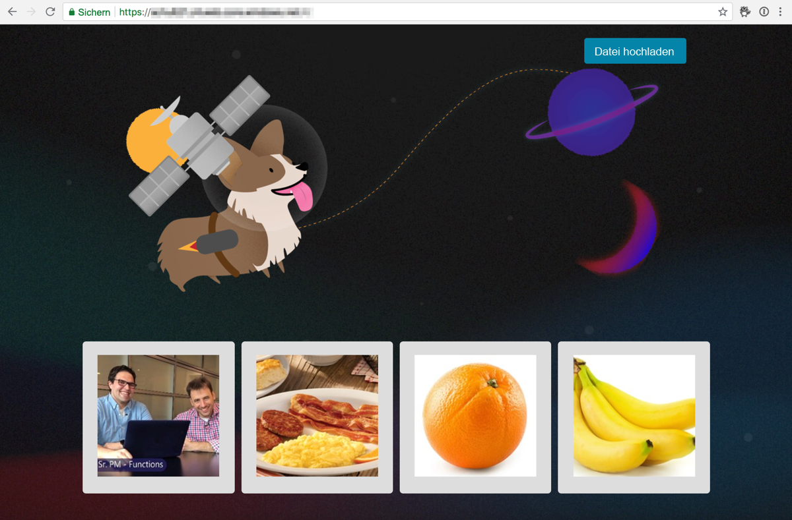
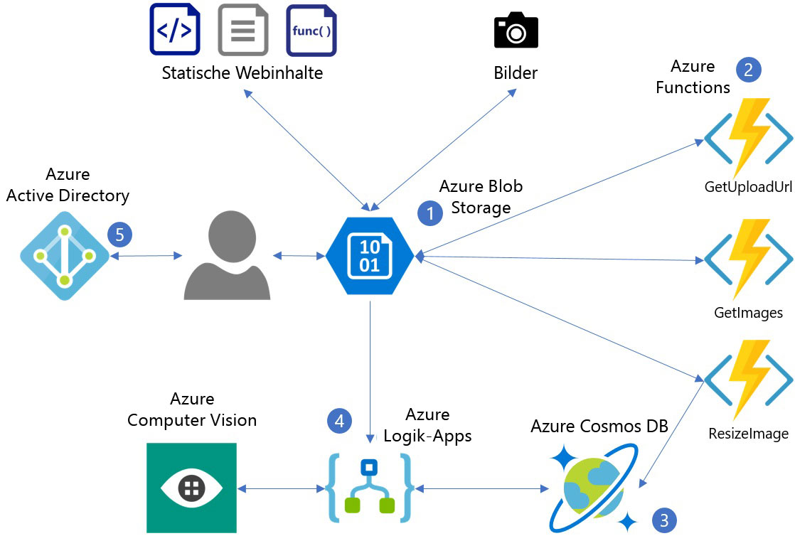
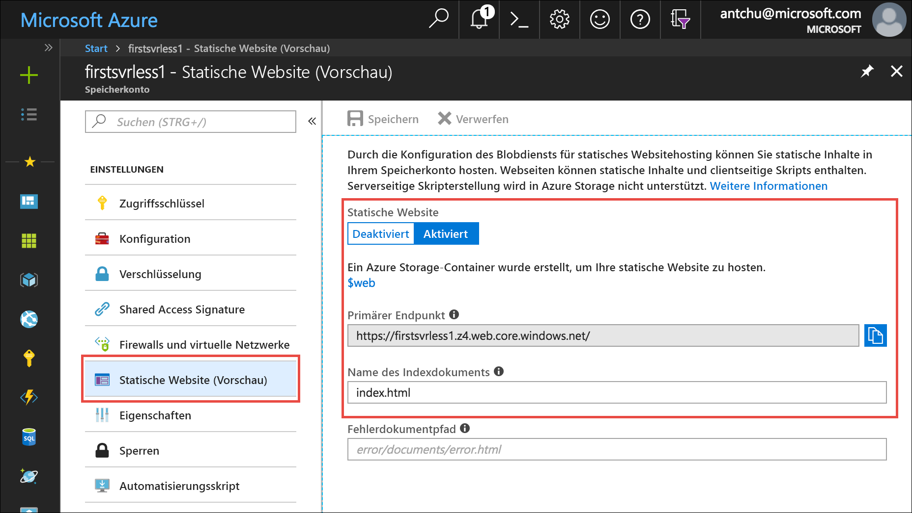
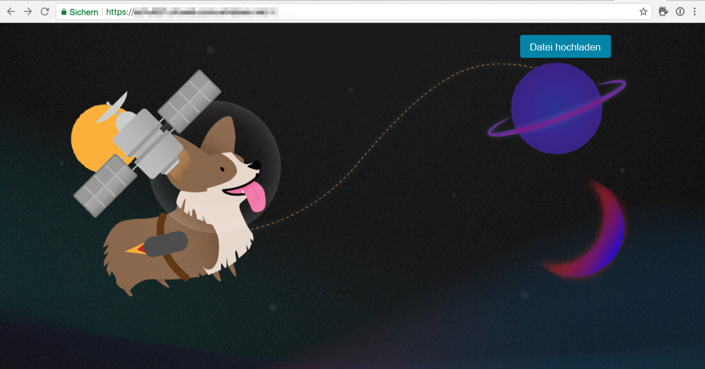

In this module, you will deploy a simple web application that presents an HTML-based user interface. A serverless back end enables the application to upload images and automatically generate descriptive captions.



The following diagram shows the Azure services that are used by the application.



1. Azure Blob storage serves static web content (HTML, CSS, JS) and stores images.
2. Azure Functions manages image uploads, resizing, and metadata storage.
3. Azure Cosmos DB stores image metadata.
4. Azure Logic Apps retrieves image captions from the Cognitive Services Computer Vision API.
5. Azure Active Directory manages user authentication.

Azure Blob storage is a low-cost and massively scalable service that can be used to host static files. In this module, you will use Blob storage to serve static content (for example, HTML, JavaScript, or CSS) for a web app you build.

## Create an Azure Storage account
<!---TODO: Update for sandbox?--->

An Azure Storage account is an Azure resource that allows you to store tables, queues, files, blobs (objects), and virtual machine disks.

1. Select the **Enter focus mode** button to launch Azure Cloud Shell (Bash). This button is at the top right or the bottom of the page, depending on how wide your browser window is. Focus mode docks a Cloud Shell window on the right side of your browser window, so you can easily execute commands that are shown in the tutorial.

1. In Azure, a resource group is a container that holds related Azure resources for ease of management. Create a new resource group named **first-serverless-app**.

    ```azurecli
    az group create -n first-serverless-app -l westcentralus
    ```

1. The static content (HTML, CSS, and JavaScript files) for this tutorial is hosted in Blob storage. Blob storage requires a Storage account. Create a general-purpose v2 (GPv2) Storage account in the resource group. Replace `<storage account name>` with a unique name.

    ```azurecli
    az storage account create -n <storage account name> -g first-serverless-app --kind StorageV2 -l westcentralus --https-only true --sku Standard_LRS
    ```
    
1. Use the Search bar at the top of the [Azure portal](https://portal.azure.com/?azure-portal=true) to find the storage account that you just created. Open the account.

1. On the left navigation, select **Static website (preview)** to configure a container for static website hosting.
    - Select **Enabled** to enable a static website.
    - Enter **index.html** as the index document name. The box already has *index.html* in a gray font, but this is only example text. You still have to enter **index.html** in the box.
    - Click **Save**.
    
    

1. Save the **Primary Endpoint** in a place where you can conveniently copy it from while working through the tutorial. This endpoint is the URL of your web application.

## Upload the web application

1. The source files for the application that you build in this tutorial are located in a [GitHub repository](https://github.com/Azure-Samples/functions-first-serverless-web-application). Go to your home directory in Cloud Shell and clone this repository.

    ```azurecli
    cd ~
    git clone https://github.com/Azure-Samples/functions-first-serverless-web-application
    ```

    The repository is cloned to `/home/<username>/functions-first-serverless-web-application`.

1. The client-side web application is located in the **www** folder and is built using the Vue.js JavaScript framework. Open the **www** folder and run **npm** commands to install the application dependencies and build the application. The last of these commands might take several minutes to complete.

    ```azurecli
    cd ~/functions-first-serverless-web-application/www
    npm install
    npm run generate
    ```

    The application is generated in the **dist** folder.

1. Change the current directory to the **dist** folder and upload the application to the **$web** blob container.

    ```azurecli
    cd dist
    az storage blob upload-batch -s . -d \$web --account-name <storage account name>
    ```

1. To view the application, open the static website’s primary endpoint URL in a web browser.

    


## Summary

In this unit, you created a resource group named **first-serverless-app** that contains a Storage account. A blob container named **$web** in the Storage account stores the static content for your web application and makes the content publicly available. Next, you will learn how to use a serverless function to upload images to Blob storage from this web application.