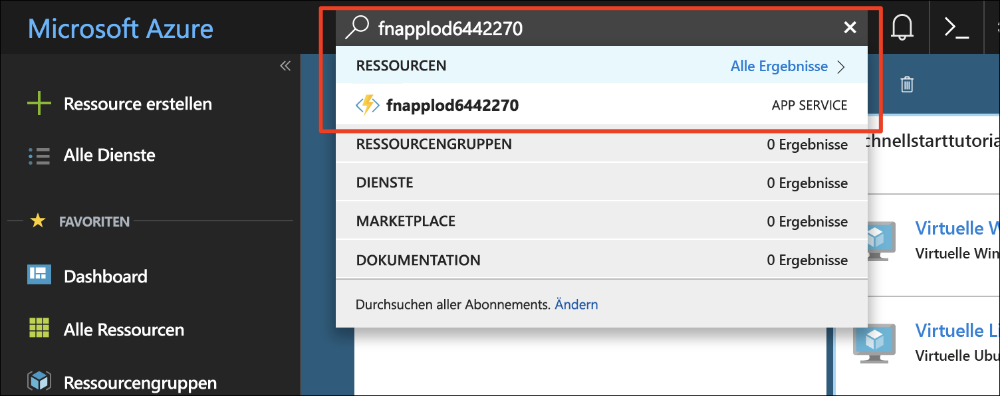
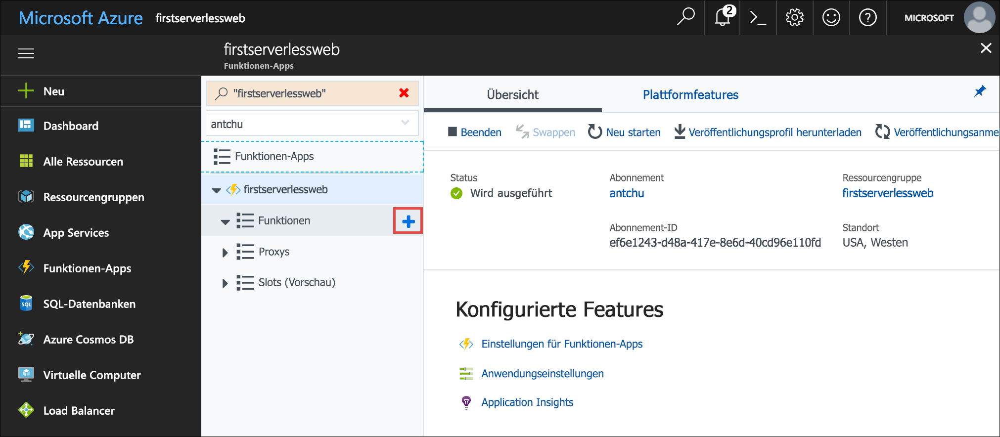
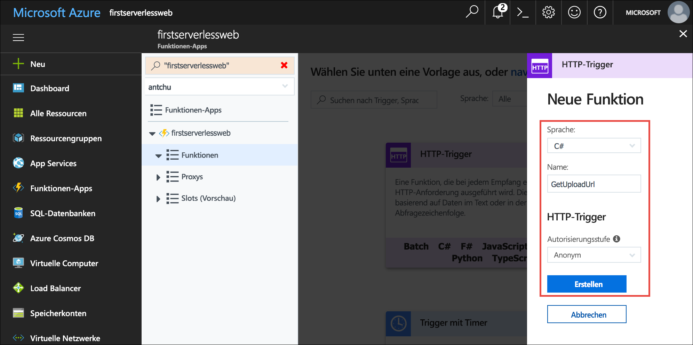
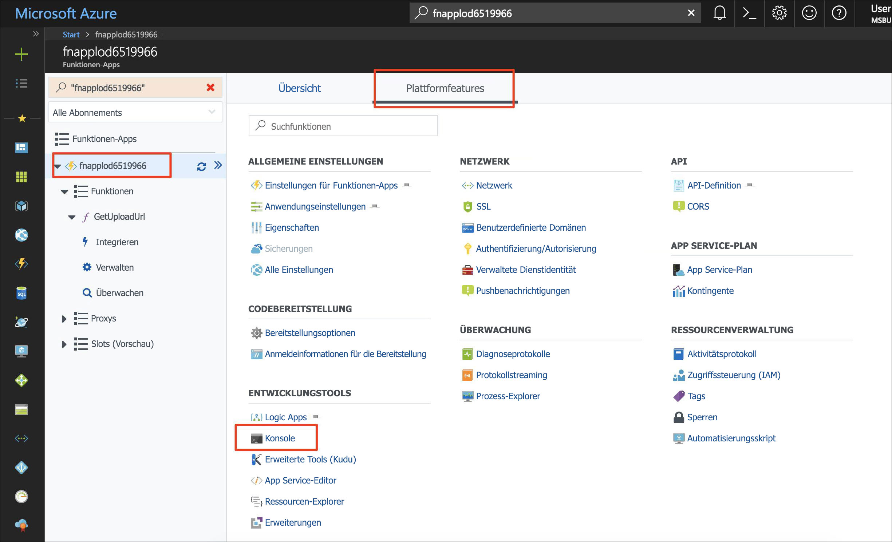
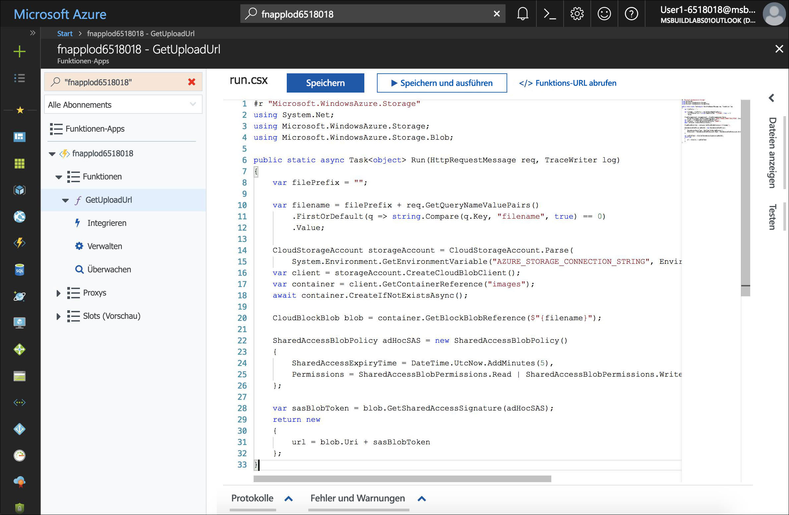
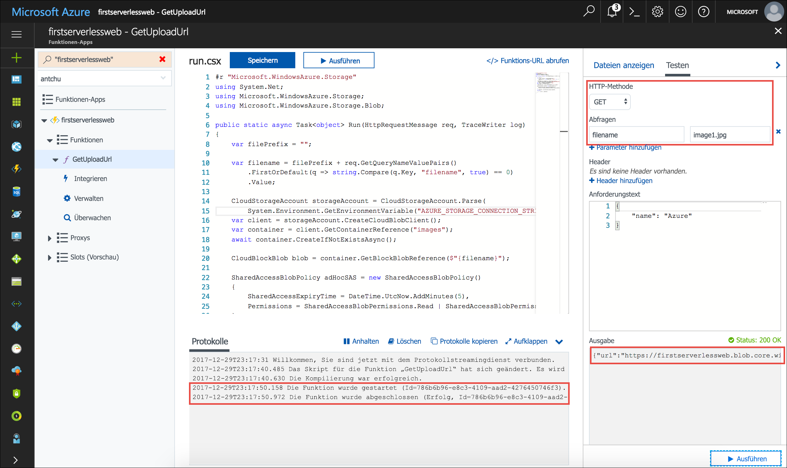
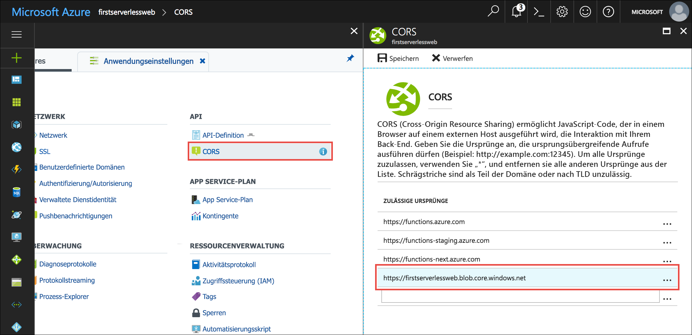

Bei der von Ihnen erstellten Anwendung handelt es sich um eine Fotogalerie. Es wird clientseitiger JavaScript-Code verwendet, um APIs zum Hochladen und Anzeigen von Bildern aufzurufen. In diesem Modul erstellen Sie eine API, indem Sie eine serverlose Funktion verwenden, mit der eine URL mit zeitlicher Beschränkung zum Hochladen eines Bilds generiert wird. Die Webanwendung nutzt die generierte URL zum Hochladen eines Bilds in Blob Storage mit der [Blob Storage-REST-API](https://docs.microsoft.com/rest/api/storageservices/blob-service-rest-api).

## <a name="create-a-blob-storage-container-for-images"></a>Erstellen eines Blob Storage-Containers für Bilder

Für die Anwendung ist ein separater Speichercontainer erforderlich, um Bilder hochladen und hosten zu können.

1. Stellen Sie sicher, dass Sie noch bei der Azure Cloud Shell (Bash) angemeldet sind. Wählen Sie andernfalls die Option **Enter focus mode** (Fokusmodus aktivieren), um ein Cloud Shell-Fenster zu öffnen.

1.  Erstellen Sie unter Ihrem Speicherkonto einen neuen Container mit dem Namen **images**, der über öffentlichen Zugriff auf alle Blobs verfügt.

    ```azurecli
    az storage container create -n images --account-name <storage account name> --public-access blob
    ```

## <a name="create-an-azure-functions-app"></a>Erstellen einer Azure Functions-App

Azure Functions ist ein Dienst zum Ausführen serverloser Funktionen. Eine serverlose Funktion kann von Ereignissen, z.B. einer HTTP-Anforderung, oder bei Erstellung eines Blobs in einem Speichercontainer ausgelöst (aufgerufen) werden.

Eine Azure Functions-App ist ein Container für mindestens eine serverlose Funktion.

- Erstellen Sie eine neue Azure Functions-App mit einem eindeutigen Namen in der Ressourcengruppe **first-serverless-app**, die Sie zuvor erstellt haben. Azure Functions-Apps erfordern ein Speicherkonto. In diesem Tutorial verwenden Sie das vorhandene Speicherkonto.

    ```azurecli
    az functionapp create -n <function app name> -g first-serverless-app -s <storage account name> -c westcentralus
    ```

## <a name="create-an-http-triggered-serverless-function"></a>Erstellen einer per HTTP ausgelösten serverlosen Funktion

Um ein Bild sicher in Blob Storage hochzuladen, richtet die Fotogalerie-Web-App eine HTTP-Anforderung an die serverlose Funktion, damit eine zeitlich begrenzte URL generiert wird. Die Funktion wird per HTTP-Anforderung ausgelöst und verwendet das Azure Storage SDK, um die sichere URL zu generieren und zurückzugeben.

1. Nachdem die Funktionen-App erstellt wurde, können Sie im Azure-Portal über das Feld **Suchen** danach suchen. Klicken Sie auf die App, um sie zu öffnen.

    


1. Zeigen Sie im Fenster „Funktionen-App“ im linken Navigationsbereich auf **Funktionen**, und klicken Sie auf das Pluszeichen (+), um eine neue serverlose Funktion zu erstellen.

    

1. Klicken Sie auf **Benutzerdefinierte Funktion**, um eine Liste mit Funktionsvorlagen anzuzeigen.

1. Suchen Sie nach der Vorlage **HttpTrigger**, und klicken Sie auf die gewünschte Sprache (C# oder JavaScript).

1. Verwenden Sie die folgenden Werte, um eine Funktion zu erstellen, mit der eine URL für das Hochladen in ein Blob generiert wird:

    | Einstellung      |  Empfohlener Wert   | Beschreibung                                        |
    | --- | --- | ---|
    | **Sprache** | C# oder JavaScript | Wählen Sie die Sprache aus, die Sie verwenden möchten. |
    | **Name Ihrer Funktion** | GetUploadUrl | Geben Sie diesen Namen genau wie hier angezeigt ein, damit die Anwendung die Funktion ermitteln kann. |
    | **Autorisierungsstufe** | Anonym | Lässt den schnellen Zugriff auf die Funktion zu. |

    

1. Klicken Sie auf **Erstellen**, um die Funktion zu erstellen.

::: zone pivot="csharp"
1. **C#** 

    Wenn der Quellcode der Funktion angezeigt wird, ersetzen Sie den gesamten Inhalt der Datei **run.csx** durch den Inhalt der Datei [**csharp/GetUploadUrl/run.csx**](https://raw.githubusercontent.com/Azure-Samples/functions-first-serverless-web-application/master/csharp/GetUploadUrl/run.csx).

::: zone-end

::: zone pivot="javascript"
1. **JavaScript** 

    1. (JavaScript) Für diese Funktion ist das `azure-storage`-Paket von npm erforderlich. Das Paket generiert das SAS-Token (Shared Access Signature), das zum Erstellen der sicheren URL erforderlich ist. Klicken Sie zum Installieren des npm-Pakets im linken Navigationsbereich auf die Funktionen-App und dann auf **Plattformfeatures**.

    1. (JavaScript) Klicken Sie auf **Konsole**, um ein Konsolenfenster anzuzeigen.

        

    1. (JavaScript) Vergewissern Sie sich, dass **d:\home\site\wwwroot** das aktuelle Verzeichnis ist, indem Sie den Befehl `cd d:\home\site\wwwroot` ausführen.

    1. (JavaScript) Führen Sie den Befehl `npm init -y` aus, um eine leere Datei mit dem Namen **package.json** zu erstellen.

    1. (JavaScript) Führen Sie den Befehl `npm install --save azure-storage` in der Konsole aus, um das Paket zu installieren. Speichern Sie das Paket als **package.JSON**. Es kann einige Minuten dauern, bis der Vorgang abgeschlossen ist.

    1. (JavaScript) Klicken Sie im linken Navigationsbereich auf die Funktion (**GetUploadUrl**), um sie anzuzeigen. Ersetzen Sie den gesamten Inhalt der Datei **index.js** durch den Inhalt der Datei [**javascript/GetUploadUrl/index.js**](https://raw.githubusercontent.com/Azure-Samples/functions-first-serverless-web-application/master/javascript/GetUploadUrl/index.js).
    
        

::: zone-end

1. Klicken Sie unter dem Codefenster auf **Protokolle**, um den Protokollbereich zu erweitern.

1. Klicken Sie auf **Speichern**. Überprüfen Sie den Protokollbereich, um sicherzustellen, dass die Funktion erfolgreich kompiliert wird.

Mit der Funktion wird eine sog. SAS-URL (Shared Access Signature) generiert, die zum Hochladen einer Datei in Blob Storage genutzt wird. Die SAS-URL ist nur für kurze Zeit gültig und lässt nur das Hochladen einer einzelnen Datei zu. Die Dokumentation zu Blob Storage enthält weitere Informationen zur [Verwendung von Shared Access Signatures](https://docs.microsoft.com/azure/storage/common/storage-dotnet-shared-access-signature-part-1).


## <a name="add-an-environment-variable-for-the-storage-connection-string"></a>Hinzufügen einer Umgebungsvariablen für die Speicher-Verbindungszeichenfolge

Für die erstellte Funktion wird eine Verbindungszeichenfolge für das Speicherkonto benötigt, damit die SAS-URL generiert werden kann. Anstatt die Verbindungszeichenfolge im Text der Funktion hartzucodieren, kann sie als Anwendungseinstellung gespeichert werden. Auf Anwendungseinstellungen kann von allen Funktionen der Funktionen-App in Form von Umgebungsvariablen zugegriffen werden.

1. Fragen Sie in Cloud Shell die Speicherkonto-Verbindungszeichenfolge ab, und speichern Sie sie in einer Bash-Variablen mit dem Namen **STORAGE_CONNECTION_STRING**.

    ```azurecli
    export STORAGE_CONNECTION_STRING=$(az storage account show-connection-string -n <storage account name> -g first-serverless-app --query "connectionString" --output tsv)
    ```

    Vergewissern Sie sich, dass das Festlegen der Variablen erfolgreich war.

    ```azurecli
    echo $STORAGE_CONNECTION_STRING
    ```

1. Erstellen Sie eine neue Anwendungseinstellung mit dem Namen **AZURE_STORAGE_CONNECTION_STRING**, indem Sie den im vorherigen Schritt gespeicherten Wert verwenden.

    ```azurecli
    az functionapp config appsettings set -n <function app name> -g first-serverless-app --settings AZURE_STORAGE_CONNECTION_STRING=$STORAGE_CONNECTION_STRING -o table
    ```

    Stellen Sie sicher, dass die Ausgabe des Befehls die neue Anwendungseinstellung mit dem richtigen Wert enthält.


## <a name="test-the-serverless-function"></a>Testen der serverlosen Funktion

Zusätzlich zum Erstellen und Bearbeiten von Funktionen enthält das Azure-Portal auch ein integriertes Tool zum Testen von Funktionen.

1. Klicken Sie zum Testen der serverlosen HTTP-Funktion rechts im Codefenster auf die Registerkarte **Test** (Testen), um den Testbereich zu erweitern.

1. Ändern Sie die **HTTP-Methode** in **GET**.

1. Klicken Sie unter **Abfrage** auf **Parameter hinzufügen**, und fügen Sie den folgenden Parameter hinzu:

    | Name      |  Wert   | 
    | --- | --- |
    | **filename** | image1.jpg |

1. Klicken Sie im Testbereich auf **Ausführen**, um eine HTTP-Anforderung an die Funktion zu senden.

1. Die Funktion gibt in der Ausgabe eine Upload-URL zurück. Die Funktionsausführung wird im Protokollbereich angezeigt.

    


## <a name="configure-cors-in-the-functions-app"></a>Konfigurieren von CORS in der Funktionen-App

Da das Front-End der Funktion in Blob Storage gehostet wird, verfügt es über einen anderen Domänennamen als die Azure Functions-App. Damit der clientseitige JavaScript-Code die erstellte Funktion erfolgreich aufrufen kann, muss die Funktionen-App für Cross-Origin Resource Sharing (CORS) konfiguriert sein.

1. Klicken Sie im Fenster der Funktionen-App im linken Navigationsbereich auf den Namen Ihrer Funktionen-App.

1. Klicken Sie auf **Plattformfeatures**, um eine Liste mit erweiterten Features anzuzeigen.

1. Klicken Sie unter **API** auf **CORS**.

    

1. Fügen Sie aus dem vorherigen Modul einen zulässigen Ursprung für die Anwendungs-URL hinzu, und lassen Sie den nachgestellten Schrägstrich (/) weg. Beispiel: `https://firstserverlessweb.z4.web.core.windows.net`.

    

1. Klicken Sie auf **Speichern**.

1. **C#**:

   1. (C#) Navigieren Sie zurück zur Funktion `GetUploadUrl`, und wählen Sie die Registerkarte **Integrieren** aus.

   1. (C#) Wählen Sie unter **Ausgewählte HTTP-Methoden** die Option **OPTIONS**.

      **GET**, **POST** und **OPTIONS** sollten jeweils ausgewählt sein. Für CORS wird die **OPTIONS**-Methode verwendet, die für C#-Funktionen nicht standardmäßig ausgewählt ist.  

   1. (C#) Klicken Sie auf **Speichern**.

1. Navigieren Sie im Azure-Portal zur Funktionen-App. Klicken Sie auf die Registerkarte **Übersicht**. Klicken Sie auf **Neu starten**, um sicherzustellen, dass die Änderungen für CORS wirksam werden.

## <a name="configure-cors-in-the-storage-account"></a>Konfigurieren von CORS im Speicherkonto

Da die Funktionen-App auch clientseitige JavaScript-Aufrufe zum Hochladen von Dateien an Blob Storage richtet, müssen Sie das Speicherkonto für CORS konfigurieren.

- Führen Sie den folgenden Befehl aus, um für alle Ursprungsorte das Hochladen in das Speicherkonto zuzulassen:

    ```azurecli
    az storage cors add --methods OPTIONS PUT --origins '*' --exposed-headers '*' --allowed-headers '*' --services b --account-name <storage account name>
    ```


## <a name="modify-the-web-app-to-upload-images"></a>Ändern der Web-App zum Hochladen von Bildern

Die Web-App ruft Einstellungen aus einer Datei mit dem Namen **settings.js** ab. In den folgenden Schritten erstellen Sie die Datei mit Cloud Shell. Sie legen `window.apiBaseUrl` auf die URL der Funktionen-App und `window.blobBaseUrl` auf die URL des Azure Blob Storage-Endpunkts fest.

1. Stellen Sie in Cloud Shell sicher, dass das aktuelle Verzeichnis der Ordner **www/dist** ist.

    ```azurecli
    cd ~/functions-first-serverless-web-application/www/dist
    ```

1. Fragen Sie die URL der Funktionen-App ab, und speichern Sie sie in einer Bash-Variablen mit dem Namen **FUNCTION_APP_URL**.

    ```azurecli
    export FUNCTION_APP_URL="https://"$(az functionapp show -n <function app name> -g first-serverless-app --query "defaultHostName" --output tsv)
    ```

    Vergewissern Sie sich, dass die Variable richtig festgelegt wurde.

    ```azurecli
    echo $FUNCTION_APP_URL
    ```

1. Um den Basis-URI für API-Aufrufe Ihrer Funktionen-App festzulegen, erstellen Sie die Datei **settings.js**. Fügen Sie die URL der Funktionen-App wie im folgenden Beispiel hinzu:

    `window.apiBaseUrl = 'https://fnapp@lab.GlobalLabInstanceId.azurewebsites.net'`

    Sie können die Änderung vornehmen, indem Sie den folgenden Befehl ausführen oder einen Befehlszeilen-Editor wie VIM verwenden.

    ```azurecli
    echo "window.apiBaseUrl = '$FUNCTION_APP_URL'" > settings.js
    ```

    Vergewissern Sie sich, dass das Schreiben der Datei erfolgreich war.

    ```azurecli
    cat settings.js
    ```

1. Fragen Sie die Blob Storage-Basis-URL ab, und speichern Sie sie in einer Bash-Variablen mit dem Namen **BLOB_BASE_URL**.

    ```azurecli
    export BLOB_BASE_URL=$(az storage account show -n <storage account name> -g first-serverless-app --query primaryEndpoints.blob -o tsv | sed 's/\/$//')
    ```

    Vergewissern Sie sich, dass die Variable richtig festgelegt wurde.

    ```azurecli
    echo $BLOB_BASE_URL
    ```

1. Um den Basis-URI für API-Aufrufe an Ihre Funktionen-App festzulegen, fügen Sie die Blob Storage-URL wie im folgenden Beispiel an die Datei **settings.js** an:

    `window.blobBaseUrl = 'https://mystorage.blob.core.windows.net'`

    Sie können die Änderung vornehmen, indem Sie den folgenden Befehl ausführen oder einen Befehlszeilen-Editor wie VIM verwenden.

    ```azurecli
    echo "window.blobBaseUrl = '$BLOB_BASE_URL'" >> settings.js
    ```

    Vergewissern Sie sich, dass das Schreiben der Datei erfolgreich war und dass sie jetzt zwei Zeilen enthält.

    ```azurecli
    cat settings.js
    ```

1. Laden Sie die Datei in Blog Storage hoch.

    ```azurecli
    az storage blob upload -c \$web --account-name <storage account name> -f settings.js -n settings.js
    ```


## <a name="test-the-web-application"></a>Testen der Webanwendung

An diesem Punkt kann die Galerieanwendung ein Bild in Blog Storage hochladen, aber sie kann noch keine Bilder anzeigen. Die Anwendung versucht, die Funktion `GetImages` aufzurufen. Diese ist aber noch nicht vorhanden, da Sie sie erst in einem späteren Modul erstellen. Der Aufruf ist nicht erfolgreich, und scheinbar hängt die Webseite mit einem Hinweis der Art „Wird analysiert...“, aber der Upload des gewählten Bilds ist trotzdem erfolgreich.

Sie können sich vergewissern, ob ein Bild erfolgreich hochgeladen wurde, indem Sie im Azure-Portal den Inhalt des Containers **images** überprüfen.

1. Navigieren Sie in einem Browserfenster zur Anwendung. Wählen Sie eine Bilddatei aus, und laden Sie sie hoch. Der Upload wird abgeschlossen. Da wir aber noch nicht die Möglichkeit zum Anzeigen von Bildern hinzugefügt haben, wird das hochgeladene Bild von der App nicht angezeigt. (Die Webseite scheint beim Vorgang „Bild wird analysiert...“ zu hängen. Dies beheben Sie später.)

1. Vergewissern Sie sich in Cloud Shell, dass das Bild in den Container **images** hochgeladen wurde.

    ```azurecli
    az storage blob list --account-name <storage account name> -c images -o table
    ```

1. Löschen Sie alle Dateien im Container **images**, bevor Sie mit dem nächsten Tutorial fortfahren.

    ```azurecli
    az storage blob delete-batch -s images --account-name <storage account name>
    ```


## <a name="summary"></a>Zusammenfassung

In dieser Einheit haben Sie eine Azure Functions-App erstellt und erfahren, wie Sie eine serverlose Funktion verwenden, um für eine Webanwendung das Hochladen von Bildern in Blob Storage zuzulassen. Als Nächstes erfahren Sie, wie Sie Miniaturansichten für die hochgeladenen Bilder erstellen, indem Sie eine per Blob ausgelöste serverlose Funktion verwenden.