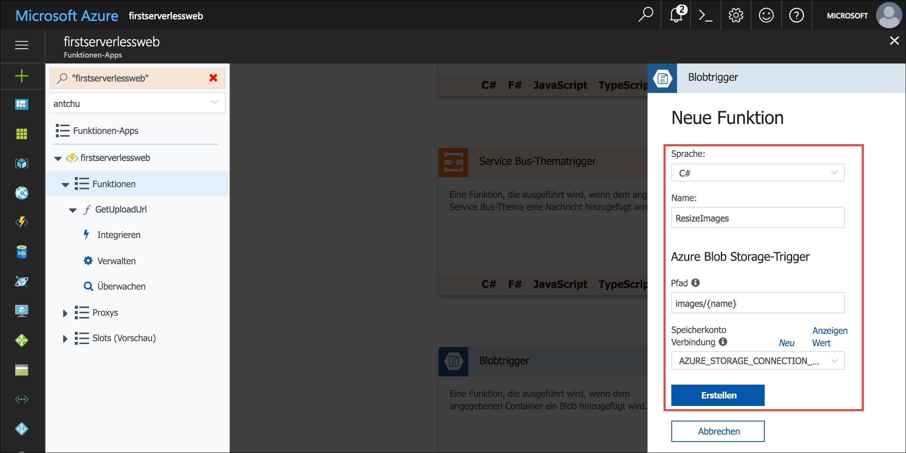
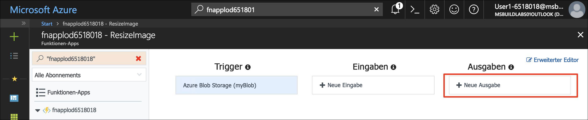
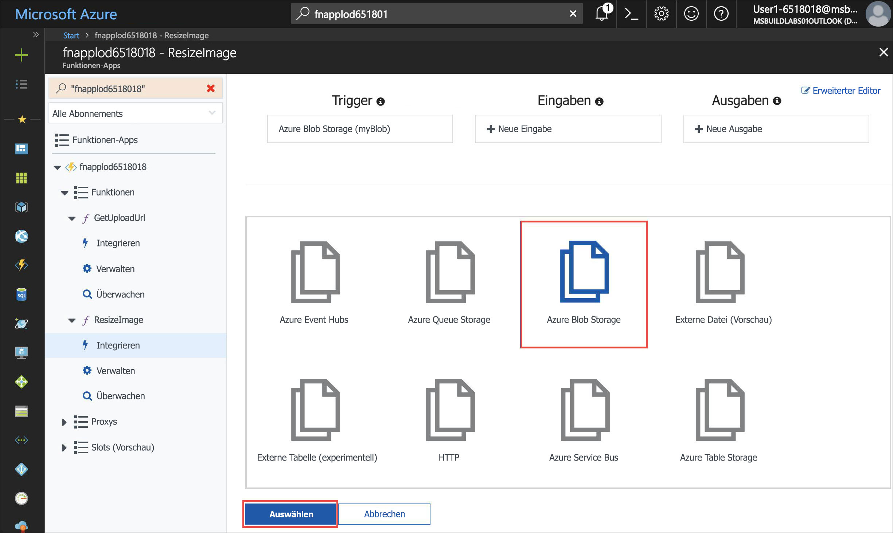
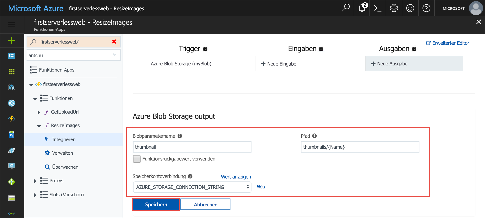
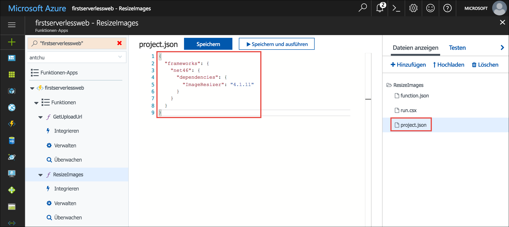

In der vorherigen Einheit wurde beschrieben, wie mit einer serverlosen Funktion das sichere Hochladen von Bildern in Blobspeicher aus einer Webanwendung möglich ist. In diesem Modul erstellen Sie eine weitere serverlose Funktion, um hochgeladene Bilder zu ermitteln und daraus Miniaturansichten zu erstellen.

## <a name="create-a-blob-storage-container-for-thumbnails"></a>Erstellen eines Blobspeichercontainers für Miniaturansichten

Die Bilder mit vollständiger Größe werden in einem Container mit dem Namen **images** gespeichert. Sie benötigen einen weiteren Container, um die Miniaturansichten dieser Bilder zu speichern.

Erstellen Sie unter Ihrem Speicherkonto einen neuen Container mit dem Namen **thumbnails**, der über öffentlichen Zugriff auf alle Blobs verfügt.

```azurecli
az storage container create -n thumbnails --account-name <storage account name> --public-access blob
```

## <a name="create-a-blob-triggered-serverless-function"></a>Erstellen einer per Blob ausgelösten serverlosen Funktion

Ein Trigger definiert, wie eine Funktion aufgerufen wird. Die Funktion, die Sie als Nächstes erstellen, verwendet einen Blobtrigger. Die Funktion wird automatisch aufgerufen, wenn ein Blob (Bilddatei) in den Container **images** hochgeladen wird. Eine Funktion muss über einen Trigger verfügen. Trigger haben zugeordnete Daten, die üblicherweise mit der Nutzlast identisch sind, von der die Funktion ausgelöst wurde.

Mit Bindungen wird definiert, wie eine Funktion das Lesen oder Schreiben von Daten in Azure oder Drittanbieterdiensten durchführt. Diese Funktion erstellt eine Miniaturansichtsversion des Bilds, von dem sie ausgelöst wird, und speichert die Miniaturansicht im Container *thumbnails*.

1. Melden Sie sich beim [Azure-Portal](https://portal.azure.com/triplecrownlabs.onmicrosoft.com?azure-portal=true) mit dem gleichen Konto an, über das Sie die Sandbox aktiviert haben.

1. Öffnen Sie Ihre Funktions-App, und verwenden Sie das Feld **Suche** oben im Portal, um anhand des Namens zu suchen.

1. Zeigen Sie im linken Navigationsbereich des Fensters der Funktions-App auf **Funktionen**, und klicken Sie auf das Pluszeichen (+), um eine neue serverlose Funktion zu erstellen. Klicken Sie bei der Anzeige einer Schnellstartseite auf **Benutzerdefinierte Funktion**, um eine Liste mit Funktionsvorlagen anzuzeigen.

1. Suchen Sie nach der Vorlage **BlobTrigger**, und wählen Sie sie aus.

1. Verwenden Sie diese Werte, um eine Funktion zu erstellen, mit der beim Hochladen von Bildern Miniaturansichten erstellt werden:

    | Einstellung      |  Empfohlener Wert   | Beschreibung                                        |
    | --- | --- | ---|
    | **Sprache** | C# oder JavaScript | Wählen Sie Ihre bevorzugte Sprache aus. |
    | **Name Ihrer Funktion** | ResizeImage | Geben Sie diesen Namen genau wie hier angezeigt ein, damit die Anwendung die Funktion ermitteln kann. |
    | **Pfad** | images/{Name} | Führen Sie die Funktion aus, wenn im Container **images** eine Datei angezeigt wird. |
    | **Speicherkontoinformationen** | AZURE_STORAGE_CONNECTION_STRING | Verwenden Sie die Umgebungsvariable, die zuvor mit der Verbindungszeichenfolge erstellt wurde. |

    

1. Klicken Sie auf **Erstellen**, um die Funktion zu erstellen.

1. Klicken Sie nach dem Erstellen der Funktion auf **Integrieren**, um die Trigger-, Eingabe- und Ausgabebindungen anzuzeigen.

1. Klicken Sie auf **Neue Ausgabe**, um eine neue Ausgabebindung zu erstellen.

    

1. Wählen Sie **Azure Blob Storage** aus, und klicken Sie auf **Auswählen**. Unter Umständen müssen Sie nach unten scrollen, damit die Schaltfläche **Auswählen** angezeigt wird.

    

1. Geben Sie die folgenden Werte ein:

    | Einstellung      |  Empfohlener Wert   | Beschreibung                                        |
    | --- | --- | ---|
    | **Blobparametername** | thumbnail | Für die Funktion wird der Parameter mit diesem Namen verwendet, um die Miniaturansicht zu schreiben. |
    | **Funktionsrückgabewert verwenden** | Nein |  |
    | **Pfad** | thumbnails/{Name} | Die Miniaturansichten werden in einen Container mit dem Namen **thumbnails** geschrieben. |
    | **Speicherkontoverbindung** | AZURE_STORAGE_CONNECTION_STRING | Verwenden Sie die Umgebungsvariable, die zuvor mit der Verbindungszeichenfolge erstellt wurde. |

    

1. Klicken Sie zum Speichern der Änderungen auf **Speichern**.

::: zone pivot="javascript"

11. Klicken Sie oben rechts im Fenster auf **Erweiterter Editor**, um den JSON-Code für die Bindungen anzuzeigen.

1. Fügen Sie in der Bindung `blobTrigger` eine Eigenschaft mit dem Namen `dataType` und dem Wert `binary` hinzu. Hiermit wird die Bindung so konfiguriert, dass der Blobinhalt in Form von binären Daten an die Funktion übergeben wird.

    ```json
    {
        "name": "myBlob",
        "type": "blobTrigger",
        "direction": "in",
        "path": "images/{name}",
        "connection": "AZURE_STORAGE_CONNECTION_STRING",
        "dataType": "binary"
    }
    ```

1. Klicken Sie auf **Speichern**, um die neue Bindung zu erstellen.

::: zone-end

::: zone pivot="csharp"

11. Wählen Sie im linken Navigationsbereich den Funktionsnamen **ResizeImage** aus, um den Quellcode der Funktion zu öffnen.

1. Für die Funktion ist ein NuGet-Paket mit dem Namen **ImageResizer** erforderlich, um die Miniaturansichten zu generieren. NuGet-Pakete werden über die Datei **project.json** zu C#-Funktionen hinzugefügt. Klicken Sie zum Erstellen der Datei rechts auf **Dateien anzeigen**, um die Dateien anzuzeigen, aus denen die Funktion besteht.

1. Klicken Sie auf **Hinzufügen**, um eine neue Datei mit dem Namen **project.json** hinzuzufügen. Drücken Sie auf die **Eingabetaste**, wenn Sie die Datei hinzugefügt haben.

1. Kopieren Sie den Inhalt der Datei [**/csharp/ResizeImage/project.json**](https://raw.githubusercontent.com/Azure-Samples/functions-first-serverless-web-application/master/csharp/ResizeImage/project.json) in die neu erstellte Datei. Speichern Sie die Datei. Pakete werden automatisch wiederhergestellt, wenn die Datei aktualisiert wird.

    

1. Wählen Sie unter **Dateien anzeigen** die Datei **run.csx** aus. Ersetzen Sie den Inhalt durch den Inhalt von [**/csharp/ResizeImage/run.csx**](https://raw.githubusercontent.com/Azure-Samples/functions-first-serverless-web-application/master/csharp/ResizeImage/run.csx).

1. Klicken Sie unter dem Codefenster auf **Protokolle**, um den Protokollbereich zu erweitern.

1. Klicken Sie auf **Speichern**. Überprüfen Sie den Protokollbereich, um sicherzustellen, dass die Funktion erfolgreich gespeichert wird und keine Fehler aufgetreten sind.

::: zone-end

::: zone pivot="javascript"

14. Für diese Funktion ist das `jimp`-Paket von npm erforderlich, um die Größe des Fotos zu ändern. Klicken Sie zum Installieren des npm-Pakets im linken Navigationsbereich erst auf den Namen der Funktions-App und dann auf **Plattformfeatures**.

1. Klicken Sie auf **Konsole**, um ein Konsolenfenster anzuzeigen.

1. Führen Sie den Befehl `npm install jimp` in der Konsole aus. Es kann einige Minuten dauern, bis der Vorgang abgeschlossen ist.

1. Klicken Sie im Navigationsbereich auf der linken Seite auf den Funktionsnamen **ResizeImage**, um die Funktion anzuzeigen. Ersetzen Sie den gesamten Inhalt der Datei **index.js** durch den Inhalt der Datei [**/javascript/ResizeImage/index.js**](https://raw.githubusercontent.com/Azure-Samples/functions-first-serverless-web-application/master/javascript/ResizeImage/index.js).

1. Klicken Sie unter dem Codefenster auf **Protokolle**, um den Protokollbereich zu erweitern.

1. Klicken Sie auf **Speichern**. Überprüfen Sie den Protokollbereich, um sicherzustellen, dass die Funktion erfolgreich gespeichert wird und keine Fehler aufgetreten sind.

::: zone-end

## <a name="test-the-serverless-function"></a>Testen der serverlosen Funktion

1. Öffnen Sie die Anwendung in einem Browser. Wählen Sie eine Bilddatei aus, und laden Sie sie hoch. Der Upload wird abgeschlossen. Da die Möglichkeit zum Anzeigen von Bildern jedoch noch nicht hinzugefügt wurde, wird das hochgeladene Bild von der App nicht angezeigt.

1. Vergewissern Sie sich in Cloud Shell, dass das Bild in den Container **images** hochgeladen wurde.

    ```azurecli
    az storage blob list \
        --account-name <storage account name> \
        -c images \
        -o table
    ```

1. Vergewissern Sie sich, dass die Miniaturansicht in einem Container mit dem Namen **thumbnails** erstellt wurde.

    ```azurecli
    az storage blob list \
        --account-name <storage account name> \
        -c thumbnails \
        -o table
    ```

1. Rufen Sie die URL für die Miniaturansicht ab.

    ```azurecli
    az storage blob url \
        --account-name <storage account name> \
        -c thumbnails \
        -n <filename> \
        --output tsv
    ```

    Öffnen Sie die URL in einem Browser, und stellen Sie sicher, dass die Miniaturansicht richtig erstellt wurde.

1. Löschen Sie alle Dateien in den Containern **images** und **thumbnails**, bevor Sie mit der nächsten Einheit fortfahren.

    ```azurecli
    az storage blob delete-batch \
        -s images \
        --account-name <storage account name>
    ```

    ```azurecli
    az storage blob delete-batch \
        -s thumbnails \
        --account-name <storage account name>
    ```

## <a name="summary"></a>Zusammenfassung

In dieser Einheit haben Sie eine serverlose Funktion erstellt, um eine Miniaturansicht zu erstellen, wenn ein Bild in einen Blobspeichercontainer hochgeladen wird. Als Nächstes erfahren Sie, wie Sie Azure Cosmos DB zum Speichern und Auflisten von Bildmetadaten verwenden.