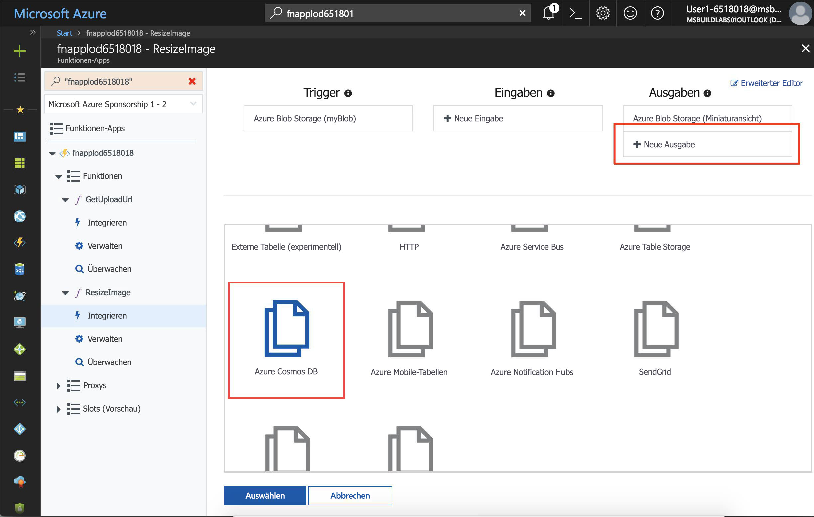
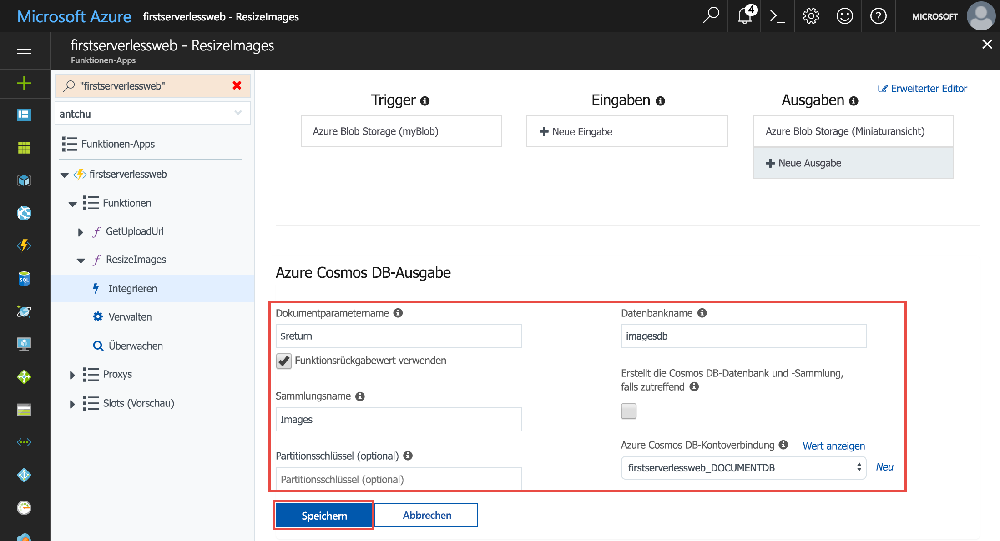
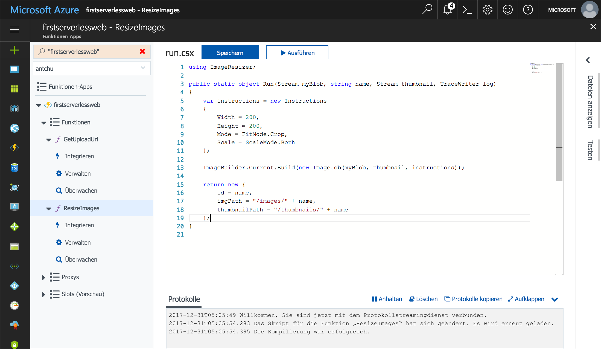
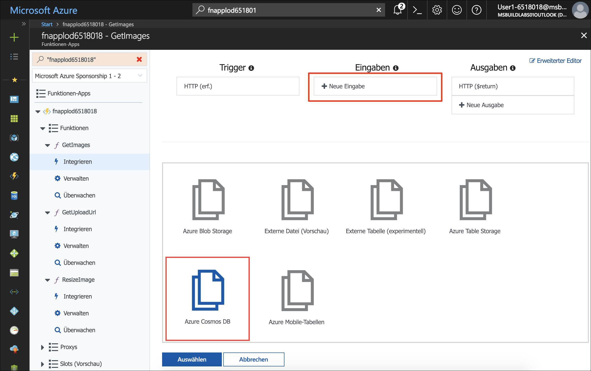
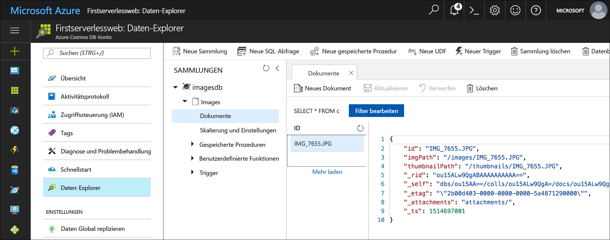

<span data-ttu-id="ee242-101">Azure Cosmos DB ist der serverlose, global verteilte Microsoft-Datenbankdienst mit mehreren Modellen.</span><span class="sxs-lookup"><span data-stu-id="ee242-101">Azure Cosmos DB is Microsoft's serverless, globally distributed, multi-model database.</span></span> <span data-ttu-id="ee242-102">In diesem Modul erfahren Sie, wie Sie Azure Functions zum Speichern und Abrufen von Bildmetadaten als JSON-Dokumente in Azure Cosmos DB verwenden.</span><span class="sxs-lookup"><span data-stu-id="ee242-102">In this module, you learn how to use Azure Functions to store and retrieve image metadata as JSON documents in Azure Cosmos DB.</span></span>

## <a name="create-an-azure-cosmos-db-account-database-and-collection"></a><span data-ttu-id="ee242-103">Erstellen eines Kontos, einer Datenbank und einer Sammlung für Azure Cosmos DB</span><span class="sxs-lookup"><span data-stu-id="ee242-103">Create an Azure Cosmos DB account, database, and collection</span></span>

<span data-ttu-id="ee242-104">Ein Azure Cosmos DB-Konto ist eine Azure-Ressource, die Azure Cosmos DB-Datenbanken enthält.</span><span class="sxs-lookup"><span data-stu-id="ee242-104">An Azure Cosmos DB account is an Azure resource that contains Azure Cosmos DB databases.</span></span>

1. <span data-ttu-id="ee242-105">Erstellen Sie ein Azure Cosmos DB-Konto mit einem eindeutigen Namen in der Ressourcengruppe, in der Sie auch die anderen Ressourcen dieses Moduls erstellt haben.</span><span class="sxs-lookup"><span data-stu-id="ee242-105">Create an Azure Cosmos DB account with a unique name in the same resource group as the other resources in this module.</span></span> <span data-ttu-id="ee242-106">Die Ausführung dieses Befehls dauert unter Umständen ein bis zwei Minuten.</span><span class="sxs-lookup"><span data-stu-id="ee242-106">This command may take a minute or two to complete.</span></span>

    ```azurecli
    az cosmosdb create \
        -g <rgn>[Sandbox resource group name]</rgn> \
        -n <cosmos db account name>
    ```

1. <span data-ttu-id="ee242-107">Erstellen Sie nach dem Anlegen des Azure Cosmos DB-Kontos darin eine neue Datenbank mit dem Namen **imagesdb**.</span><span class="sxs-lookup"><span data-stu-id="ee242-107">After the Azure Cosmos DB account is created, create a new database named **imagesdb** in the account.</span></span>

    ```azurecli
    az cosmosdb database create \
        -g <rgn>[Sandbox resource group name]</rgn> \
        -n <cosmos db account name> \
        --db-name imagesdb
    ```

1. <span data-ttu-id="ee242-108">Erstellen Sie nach der Erstellung der Datenbank eine neue Sammlung namens **images** darin, die über einen Durchsatz von 400 Anforderungseinheiten (Request Units, RUs) verfügt.</span><span class="sxs-lookup"><span data-stu-id="ee242-108">After the database is created, create a new collection named **images** in the database with a throughput of 400 request units (RUs).</span></span>

    ```azurecli
    az cosmosdb collection create \
        -g <rgn>[Sandbox resource group name]</rgn> \
        -n <cosmos db account name> \
        --db-name imagesdb \
        --collection-name images \
        --throughput 400
    ```

## <a name="save-a-document-to-azure-cosmos-db-when-a-thumbnail-is-created"></a><span data-ttu-id="ee242-109">Speichern eines Dokuments in Azure Cosmos DB bei der Erstellung einer Miniaturansicht</span><span class="sxs-lookup"><span data-stu-id="ee242-109">Save a document to Azure Cosmos DB when a thumbnail is created</span></span>

<span data-ttu-id="ee242-110">Mit der Azure Cosmos DB-Ausgabebindung können Sie Dokumente in einer Azure Cosmos DB-Sammlung über Azure Functions erstellen.</span><span class="sxs-lookup"><span data-stu-id="ee242-110">The Azure Cosmos DB output binding lets you create documents in an Azure Cosmos DB collection from Azure Functions.</span></span> <span data-ttu-id="ee242-111">In den folgenden Schritten konfigurieren Sie eine Azure Cosmos DB-Ausgabebindung in der Funktion **ResizeImage** und ändern die Funktion, um ein zu speicherndes Dokument (Objekt) zurückzugeben.</span><span class="sxs-lookup"><span data-stu-id="ee242-111">In the following steps, you configure an Azure Cosmos DB output binding in the **ResizeImage** function and modify the function to return a document (object) to be saved.</span></span>

1. <span data-ttu-id="ee242-112">Melden Sie sich beim [Azure-Portal](https://portal.azure.com/triplecrownlabs.onmicrosoft.com?azure-portal=true) mit dem Konto an, über das Sie die Sandbox aktiviert haben.</span><span class="sxs-lookup"><span data-stu-id="ee242-112">Sign into the [Azure portal](https://portal.azure.com/triplecrownlabs.onmicrosoft.com?azure-portal=true) using the same account you activated the sandbox with.</span></span>

1. <span data-ttu-id="ee242-113">Öffnen Sie die Funktions-App.</span><span class="sxs-lookup"><span data-stu-id="ee242-113">Open the function app.</span></span>

1. <span data-ttu-id="ee242-114">Erweitern Sie im linken Navigationsbereich die Funktion **ResizeImage**, und wählen Sie dann **Integrieren** aus.</span><span class="sxs-lookup"><span data-stu-id="ee242-114">In the left navigation, expand the **ResizeImage** function, and then select **Integrate**.</span></span>

1. <span data-ttu-id="ee242-115">Klicken Sie unter **Ausgaben** auf **Neue Ausgabe**.</span><span class="sxs-lookup"><span data-stu-id="ee242-115">Under **Outputs**, click **New Output**.</span></span>

1. <span data-ttu-id="ee242-116">Suchen Sie nach dem Element **Azure Cosmos DB**, und wählen Sie es aus.</span><span class="sxs-lookup"><span data-stu-id="ee242-116">Find the **Azure Cosmos DB** item and select it.</span></span> <span data-ttu-id="ee242-117">Klicken Sie dann auf **Auswählen**.</span><span class="sxs-lookup"><span data-stu-id="ee242-117">Then click **Select**.</span></span>

    

1. <span data-ttu-id="ee242-119">Füllen Sie die Felder der **Azure Cosmos DB-Ausgabe** mit den unten angegebenen Werten.</span><span class="sxs-lookup"><span data-stu-id="ee242-119">Fill out the fields under **Azure Cosmos DB output** with the following values.</span></span>

    | <span data-ttu-id="ee242-120">Einstellung</span><span class="sxs-lookup"><span data-stu-id="ee242-120">Setting</span></span>      |  <span data-ttu-id="ee242-121">Empfohlener Wert</span><span class="sxs-lookup"><span data-stu-id="ee242-121">Suggested value</span></span>   | <span data-ttu-id="ee242-122">Beschreibung</span><span class="sxs-lookup"><span data-stu-id="ee242-122">Description</span></span>                                        |
    | --- | --- | ---|
    | <span data-ttu-id="ee242-123">**Dokumentparametername**</span><span class="sxs-lookup"><span data-stu-id="ee242-123">**Document parameter name**</span></span> | <span data-ttu-id="ee242-124">Wählen Sie **Funktionsrückgabewert verwenden** aus.</span><span class="sxs-lookup"><span data-stu-id="ee242-124">Select **Use function return value**.</span></span> | <span data-ttu-id="ee242-125">Der Wert im Feld wird automatisch auf **$return** festgelegt.</span><span class="sxs-lookup"><span data-stu-id="ee242-125">The value in the box is automatically set to **$return**.</span></span> |
    | <span data-ttu-id="ee242-126">**Datenbankname**</span><span class="sxs-lookup"><span data-stu-id="ee242-126">**Database name**</span></span> | <span data-ttu-id="ee242-127">imagesdb</span><span class="sxs-lookup"><span data-stu-id="ee242-127">imagesdb</span></span> | <span data-ttu-id="ee242-128">Verwenden Sie den Namen der Datenbank, die Sie erstellt haben.</span><span class="sxs-lookup"><span data-stu-id="ee242-128">Use the name of the database that you created.</span></span> |
    | <span data-ttu-id="ee242-129">**Sammlungsname**</span><span class="sxs-lookup"><span data-stu-id="ee242-129">**Collection name**</span></span> | <span data-ttu-id="ee242-130">images</span><span class="sxs-lookup"><span data-stu-id="ee242-130">images</span></span> | <span data-ttu-id="ee242-131">Verwenden Sie den Namen der Sammlung, die Sie erstellt haben.</span><span class="sxs-lookup"><span data-stu-id="ee242-131">Use the name of the collection that you created.</span></span> |

1. <span data-ttu-id="ee242-132">Klicken Sie neben **Azure Cosmos DB-Kontoverbindung** auf **Neu**.</span><span class="sxs-lookup"><span data-stu-id="ee242-132">Next to **Azure Cosmos DB account connection**, click **new**.</span></span> <span data-ttu-id="ee242-133">Wählen Sie das Azure Cosmos DB-Konto aus, das Sie zuvor erstellt haben.</span><span class="sxs-lookup"><span data-stu-id="ee242-133">Select the Azure Cosmos DB account that you previously created.</span></span>

    

1. <span data-ttu-id="ee242-135">Klicken Sie auf **Speichern**, um die Azure Cosmos DB-Ausgabebindung zu erstellen.</span><span class="sxs-lookup"><span data-stu-id="ee242-135">Click **Save** to create the Azure Cosmos DB output binding.</span></span>

1. <span data-ttu-id="ee242-136">Klicken Sie links auf den Funktionsnamen **ResizeImage**, um die Funktion zu öffnen.</span><span class="sxs-lookup"><span data-stu-id="ee242-136">Click on the **ResizeImage** function name on the left to open the function.</span></span>

<span data-ttu-id="ee242-137">::: zone pivot="csharp"</span><span class="sxs-lookup"><span data-stu-id="ee242-137">::: zone pivot="csharp"</span></span>

10. <span data-ttu-id="ee242-138">Schließen Sie das Popup mit dem Fehler, und ändern Sie den Rückgabetyp der Funktion von **void** in **object**.</span><span class="sxs-lookup"><span data-stu-id="ee242-138">Close the error popup and change the return type of the function from **void** to **object**.</span></span>

1. <span data-ttu-id="ee242-139">Fügen Sie am Ende der Funktion den folgenden Codeblock hinzu, um das zu speichernde Dokument zurückzugeben:</span><span class="sxs-lookup"><span data-stu-id="ee242-139">At the end of the function, add the following code block to return the document to be saved:</span></span>

    ```csharp
    return new {
        id = name,
        imgPath = "/images/" + name,
        thumbnailPath = "/thumbnails/" + name
    };
    ```

    

1. <span data-ttu-id="ee242-141">Klicken Sie unter dem Codefenster auf **Protokolle**, um den Protokollbereich zu erweitern.</span><span class="sxs-lookup"><span data-stu-id="ee242-141">Click **Logs** below the code window to expand the logs panel.</span></span>

1. <span data-ttu-id="ee242-142">Klicken Sie auf **Speichern**.</span><span class="sxs-lookup"><span data-stu-id="ee242-142">Click **Save**.</span></span> <span data-ttu-id="ee242-143">Überprüfen Sie den Protokollbereich, um sicherzustellen, dass die Funktion erfolgreich gespeichert wurde und keine Fehler vorliegen.</span><span class="sxs-lookup"><span data-stu-id="ee242-143">Check the logs panel to ensure the function is successfully saved and there are no errors.</span></span>

<span data-ttu-id="ee242-144">::: zone-end</span><span class="sxs-lookup"><span data-stu-id="ee242-144">::: zone-end</span></span>

<span data-ttu-id="ee242-145">::: zone pivot="javascript"</span><span class="sxs-lookup"><span data-stu-id="ee242-145">::: zone pivot="javascript"</span></span>

10. <span data-ttu-id="ee242-146">Ändern Sie die `context.done()`-Anweisung in der `else`-Klausel, um das in Azure Cosmos DB zu speichernde Dokument zurückzugeben.</span><span class="sxs-lookup"><span data-stu-id="ee242-146">Change the `context.done()` statement in the `else` clause to return the document to be saved to Azure Cosmos DB.</span></span>

    ```javascript
    if (error) {
        context.done(error);
    } else {
        context.bindings.thumbnail = stream;
        context.done(null, {
            id: context.bindingData.name,
            imgPath: "/images/" + context.bindingData.name,
            thumbnailPath: "/thumbnails/" + context.bindingData.name
        });
    }
    ```
1. <span data-ttu-id="ee242-147">Klicken Sie unter dem Codefenster auf **Protokolle**, um den Protokollbereich zu erweitern.</span><span class="sxs-lookup"><span data-stu-id="ee242-147">Click **Logs** below the code window to expand the logs panel.</span></span>

1. <span data-ttu-id="ee242-148">Klicken Sie auf **Speichern**.</span><span class="sxs-lookup"><span data-stu-id="ee242-148">Click **Save**.</span></span> <span data-ttu-id="ee242-149">Überprüfen Sie den Protokollbereich, um sicherzustellen, dass die Funktion erfolgreich gespeichert wurde und keine Fehler vorliegen.</span><span class="sxs-lookup"><span data-stu-id="ee242-149">Check the logs panel to ensure the function is successfully saved and there are no errors.</span></span>

<span data-ttu-id="ee242-150">::: zone-end</span><span class="sxs-lookup"><span data-stu-id="ee242-150">::: zone-end</span></span>

## <a name="create-a-function-to-list-images-from-azure-cosmos-db"></a><span data-ttu-id="ee242-151">Erstellen einer Funktion zum Auflisten von Bildern aus Azure Cosmos DB</span><span class="sxs-lookup"><span data-stu-id="ee242-151">Create a function to list images from Azure Cosmos DB</span></span>

<span data-ttu-id="ee242-152">Für die Webanwendung ist eine API zum Abrufen der Bildmetadaten aus Azure Cosmos DB erforderlich.</span><span class="sxs-lookup"><span data-stu-id="ee242-152">The web application requires an API to retrieve image metadata from Azure Cosmos DB.</span></span> <span data-ttu-id="ee242-153">In den folgenden Schritten erstellen Sie eine per HTTP ausgelöste Funktion, bei der eine Azure Cosmos DB-Eingabebindung erstellt wird, um die Datenbanksammlung abzufragen.</span><span class="sxs-lookup"><span data-stu-id="ee242-153">In the following steps, you create an HTTP-triggered function that uses an Azure Cosmos DB input binding to query the database collection.</span></span>

1. <span data-ttu-id="ee242-154">Zeigen Sie in Ihrer Funktions-App auf der linken Seite auf **Funktionen**, und klicken Sie auf das Pluszeichen (+), um eine neue Funktion zu erstellen.</span><span class="sxs-lookup"><span data-stu-id="ee242-154">In your function app, point to **Functions** on the left and click the plus sign (+) to create a new function.</span></span>

1. <span data-ttu-id="ee242-155">Suchen Sie nach der Vorlage **HttpTrigger**, und wählen Sie sie aus.</span><span class="sxs-lookup"><span data-stu-id="ee242-155">Find the **HttpTrigger** template and select it.</span></span>

1. <span data-ttu-id="ee242-156">Verwenden Sie diese Werte, um eine Funktion zu erstellen, mit der eine URL zum Abrufen von Bildern generiert wird:</span><span class="sxs-lookup"><span data-stu-id="ee242-156">Use these values to create a function that generates a get images URL:</span></span>

    | <span data-ttu-id="ee242-157">Einstellung</span><span class="sxs-lookup"><span data-stu-id="ee242-157">Setting</span></span>      |  <span data-ttu-id="ee242-158">Empfohlener Wert</span><span class="sxs-lookup"><span data-stu-id="ee242-158">Suggested value</span></span>   | <span data-ttu-id="ee242-159">Beschreibung</span><span class="sxs-lookup"><span data-stu-id="ee242-159">Description</span></span>                                        |
    | --- | --- | ---|
    | <span data-ttu-id="ee242-160">**Name Ihrer Funktion**</span><span class="sxs-lookup"><span data-stu-id="ee242-160">**Name your function**</span></span> | <span data-ttu-id="ee242-161">GetImages</span><span class="sxs-lookup"><span data-stu-id="ee242-161">GetImages</span></span> | <span data-ttu-id="ee242-162">Geben Sie diesen Namen genau wie hier angezeigt ein, damit die Anwendung die Funktion ermitteln kann.</span><span class="sxs-lookup"><span data-stu-id="ee242-162">Enter this name exactly as shown, so the application can discover the function.</span></span> |
    | <span data-ttu-id="ee242-163">**Autorisierungsstufe**</span><span class="sxs-lookup"><span data-stu-id="ee242-163">**Authorization level**</span></span> | <span data-ttu-id="ee242-164">Anonym</span><span class="sxs-lookup"><span data-stu-id="ee242-164">Anonymous</span></span> | <span data-ttu-id="ee242-165">Lässt den öffentlichen Zugriff auf die Funktion zu.</span><span class="sxs-lookup"><span data-stu-id="ee242-165">Allow the function to be accessed publicly.</span></span> |

1. <span data-ttu-id="ee242-166">Klicken Sie auf **Erstellen**.</span><span class="sxs-lookup"><span data-stu-id="ee242-166">Click **Create**.</span></span>

1. <span data-ttu-id="ee242-167">Klicken Sie nach der Erstellung der neuen Funktion im linken Navigationsbereich unter dem Namen der Funktion auf **Integrieren**.</span><span class="sxs-lookup"><span data-stu-id="ee242-167">When the new function is created, click **Integrate** under the function name on the left navigation.</span></span>

1. <span data-ttu-id="ee242-168">Klicken Sie auf **Neue Eingabe**, und wählen Sie **Azure Cosmos DB** aus.</span><span class="sxs-lookup"><span data-stu-id="ee242-168">Click **New Input** and select **Azure Cosmos DB**.</span></span>

    

1. <span data-ttu-id="ee242-170">Klicken Sie auf **Auswählen**.</span><span class="sxs-lookup"><span data-stu-id="ee242-170">Click **Select**.</span></span>

1. <span data-ttu-id="ee242-171">Geben Sie die folgenden Werte an:</span><span class="sxs-lookup"><span data-stu-id="ee242-171">Fill out the following values:</span></span>

    | <span data-ttu-id="ee242-172">Einstellung</span><span class="sxs-lookup"><span data-stu-id="ee242-172">Setting</span></span>      |  <span data-ttu-id="ee242-173">Empfohlener Wert</span><span class="sxs-lookup"><span data-stu-id="ee242-173">Suggested value</span></span>   | <span data-ttu-id="ee242-174">Beschreibung</span><span class="sxs-lookup"><span data-stu-id="ee242-174">Description</span></span>                                        |
    | --- | --- | ---|
    | <span data-ttu-id="ee242-175">**Dokumentparametername**</span><span class="sxs-lookup"><span data-stu-id="ee242-175">**Document parameter name**</span></span> | <span data-ttu-id="ee242-176">documents</span><span class="sxs-lookup"><span data-stu-id="ee242-176">documents</span></span> | <span data-ttu-id="ee242-177">Entspricht dem Parameternamen in der Funktion.</span><span class="sxs-lookup"><span data-stu-id="ee242-177">Matches the parameter name in the function.</span></span> |
    | <span data-ttu-id="ee242-178">**Datenbankname**</span><span class="sxs-lookup"><span data-stu-id="ee242-178">**Database name**</span></span> | <span data-ttu-id="ee242-179">imagesdb</span><span class="sxs-lookup"><span data-stu-id="ee242-179">imagesdb</span></span> |  |
    | <span data-ttu-id="ee242-180">**Sammlungsname**</span><span class="sxs-lookup"><span data-stu-id="ee242-180">**Collection name**</span></span> | <span data-ttu-id="ee242-181">images</span><span class="sxs-lookup"><span data-stu-id="ee242-181">images</span></span> |  |
    | <span data-ttu-id="ee242-182">**SQL-Abfrage**</span><span class="sxs-lookup"><span data-stu-id="ee242-182">**SQL query**</span></span> | <span data-ttu-id="ee242-183">SELECT \* FROM c ORDER BY c._ts DESC</span><span class="sxs-lookup"><span data-stu-id="ee242-183">select \* from c order by c._ts desc</span></span> | <span data-ttu-id="ee242-184">Dient zum Abrufen von Dokumenten (letzte Dokumente zuerst).</span><span class="sxs-lookup"><span data-stu-id="ee242-184">Get documents, latest documents first.</span></span> |
    | <span data-ttu-id="ee242-185">**Azure Cosmos DB-Kontoverbindung**</span><span class="sxs-lookup"><span data-stu-id="ee242-185">**Azure Cosmos DB account connection**</span></span> | <span data-ttu-id="ee242-186">Auswählen der vorhandenen Verbindungszeichenfolge</span><span class="sxs-lookup"><span data-stu-id="ee242-186">Select the existing connection string.</span></span> |  |

1. <span data-ttu-id="ee242-187">Klicken Sie auf **Speichern**, um die Eingabebindung zu erstellen.</span><span class="sxs-lookup"><span data-stu-id="ee242-187">Click **Save** to create the input binding.</span></span>

<span data-ttu-id="ee242-188">::: zone pivot="csharp"</span><span class="sxs-lookup"><span data-stu-id="ee242-188">::: zone pivot="csharp"</span></span>

10. <span data-ttu-id="ee242-189">Klicken Sie auf den Funktionsnamen, um das Codefenster zu öffnen.</span><span class="sxs-lookup"><span data-stu-id="ee242-189">Click the function name to open the code window.</span></span> <span data-ttu-id="ee242-190">Ersetzen Sie den gesamten Inhalt der Datei **run.csx** durch den Inhalt der Datei [**/csharp/GetImages/run.csx**](https://raw.githubusercontent.com/Azure-Samples/functions-first-serverless-web-application/master/csharp/GetImages/run.csx).</span><span class="sxs-lookup"><span data-stu-id="ee242-190">Replace all of the **run.csx** file with the content in the [**/csharp/GetImages/run.csx**](https://raw.githubusercontent.com/Azure-Samples/functions-first-serverless-web-application/master/csharp/GetImages/run.csx) file.</span></span>

<span data-ttu-id="ee242-191">::: zone-end</span><span class="sxs-lookup"><span data-stu-id="ee242-191">::: zone-end</span></span>

<span data-ttu-id="ee242-192">::: zone pivot="javascript"</span><span class="sxs-lookup"><span data-stu-id="ee242-192">::: zone pivot="javascript"</span></span>

10. <span data-ttu-id="ee242-193">Klicken Sie auf den Funktionsnamen, um das Codefenster zu öffnen.</span><span class="sxs-lookup"><span data-stu-id="ee242-193">Click the function name to open the code window.</span></span> <span data-ttu-id="ee242-194">Ersetzen Sie den gesamten Inhalt der Datei **index.js** durch den Inhalt der Datei [**/javascript/GetImages/index.js**](https://raw.githubusercontent.com/Azure-Samples/functions-first-serverless-web-application/master/javascript/GetImages/index.js).</span><span class="sxs-lookup"><span data-stu-id="ee242-194">Replace all of the **index.js** file with the content in the [**/javascript/GetImages/index.js**](https://raw.githubusercontent.com/Azure-Samples/functions-first-serverless-web-application/master/javascript/GetImages/index.js) file.</span></span>

<span data-ttu-id="ee242-195">::: zone-end</span><span class="sxs-lookup"><span data-stu-id="ee242-195">::: zone-end</span></span>

11. <span data-ttu-id="ee242-196">Klicken Sie unter dem Codefenster auf **Protokolle**, um den Protokollbereich zu erweitern.</span><span class="sxs-lookup"><span data-stu-id="ee242-196">Click **Logs** below the code window to expand the Logs panel.</span></span>

1. <span data-ttu-id="ee242-197">Klicken Sie auf **Speichern**.</span><span class="sxs-lookup"><span data-stu-id="ee242-197">Click **Save**.</span></span> <span data-ttu-id="ee242-198">Überprüfen Sie den Protokollbereich, um sicherzustellen, dass die Funktion erfolgreich gespeichert wird und keine Fehler aufgetreten sind.</span><span class="sxs-lookup"><span data-stu-id="ee242-198">Check the Logs panel to ensure the function is successfully saved and there are no errors.</span></span>

## <a name="test-the-application"></a><span data-ttu-id="ee242-199">Testen der Anwendung</span><span class="sxs-lookup"><span data-stu-id="ee242-199">Test the application</span></span>

1. <span data-ttu-id="ee242-200">Öffnen Sie die Anwendung in einem Browser.</span><span class="sxs-lookup"><span data-stu-id="ee242-200">Open the application in a browser.</span></span> <span data-ttu-id="ee242-201">Wählen Sie eine Bilddatei aus, und laden Sie sie hoch.</span><span class="sxs-lookup"><span data-stu-id="ee242-201">Select an image file and upload it.</span></span>

1. <span data-ttu-id="ee242-202">Nach einigen Sekunden wird die Miniaturansicht des neuen Bilds auf der Seite angezeigt.</span><span class="sxs-lookup"><span data-stu-id="ee242-202">After a few seconds, the thumbnail of the new image appears on the page.</span></span>

1. <span data-ttu-id="ee242-203">Verwenden Sie im Azure-Portal das **Suchfeld**, um anhand des Namens nach Ihrem Azure Cosmos DB-Konto zu suchen.</span><span class="sxs-lookup"><span data-stu-id="ee242-203">In the Azure portal, use the **Search** box to search for your Azure Cosmos DB account by name.</span></span> <span data-ttu-id="ee242-204">Klicken Sie auf den Namen, um das Konto zu öffnen.</span><span class="sxs-lookup"><span data-stu-id="ee242-204">Click on the name to open the account.</span></span>

1. <span data-ttu-id="ee242-205">Klicken Sie links auf **Daten-Explorer**, um Sammlungen und Dokumente zu durchsuchen.</span><span class="sxs-lookup"><span data-stu-id="ee242-205">Click **Data Explorer** on the left to browse collections and documents.</span></span>

1. <span data-ttu-id="ee242-206">Wählen Sie unter der Datenbank **imagesdb** die Sammlung **images** aus.</span><span class="sxs-lookup"><span data-stu-id="ee242-206">Under the **imagesdb** database, select the **images** collection.</span></span>

1. <span data-ttu-id="ee242-207">Vergewissern Sie sich, dass ein Dokument für das hochgeladene Bild erstellt wurde.</span><span class="sxs-lookup"><span data-stu-id="ee242-207">Confirm that a document was created for the uploaded image.</span></span>

    

## <a name="summary"></a><span data-ttu-id="ee242-209">Zusammenfassung</span><span class="sxs-lookup"><span data-stu-id="ee242-209">Summary</span></span>

<span data-ttu-id="ee242-210">In dieser Einheit haben Sie erfahren, wie Sie ein Konto, eine Datenbank und eine Sammlung für Azure Cosmos DB erstellen.</span><span class="sxs-lookup"><span data-stu-id="ee242-210">In this unit, you learned how to create an Azure Cosmos DB account, database, and collection.</span></span> <span data-ttu-id="ee242-211">Außerdem wurde beschrieben, wie Sie die Azure Cosmos DB-Bindungen zum Speichern und Abrufen von Bildmetadaten in der Azure Cosmos DB-Sammlung verwenden.</span><span class="sxs-lookup"><span data-stu-id="ee242-211">You also learned how to use the Azure Cosmos DB bindings to save and retrieve image metadata in the Azure Cosmos DB collection.</span></span> <span data-ttu-id="ee242-212">Als Nächstes wird beschrieben, wie Sie für jedes hochgeladene Bild mit Microsoft Cognitive Services automatisch einen Bildtitel generieren können.</span><span class="sxs-lookup"><span data-stu-id="ee242-212">Next, you will learn how to automatically generate a caption for each uploaded image using Microsoft Cognitive Services.</span></span>