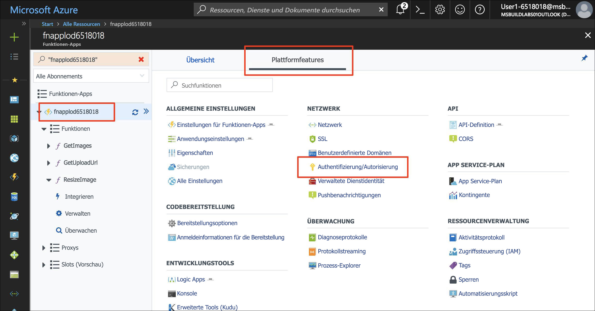
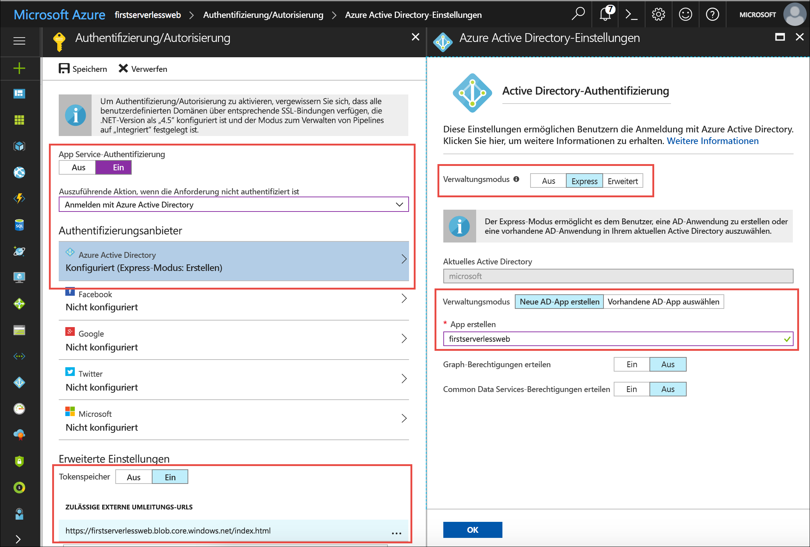
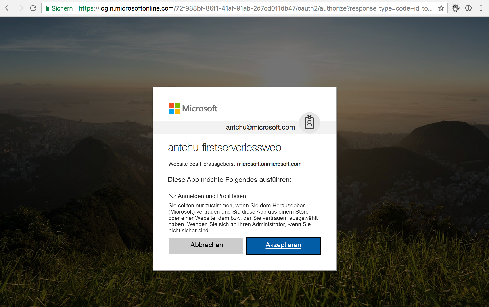

Die Azure App Service-Authentifizierung ermöglicht in einer Azure Functions-App die Unterstützung der Authentifizierung ohne weiteren Einrichtungsaufwand. Sie kann nahtlos in Facebook, Twitter, Microsoft-Konten, Google und Azure Active Directory integriert werden. Sie fügen die App Service-Authentifizierung hinzu, um die Back-End-APIs für Ihre Web-App zu schützen.

## <a name="enable-app-service-authentication"></a>Aktivieren der App Service-Authentifizierung

1. Öffnen Sie die Funktions-App im [Azure-Portal](https://portal.azure.com/?azure-portal=true).

1. Wählen Sie unter **Plattformfeatures** die Option **Authentifizierung/Autorisierung** aus.

    

1. Wählen Sie folgende Werte aus:
    
    | Einstellung      |  Empfohlener Wert   | Beschreibung                                        |
    | --- | --- | ---|
    | **App Service-Authentifizierung** | Ein | Aktiviert die Authentifizierung. |
    | **Aktion, wenn die Anforderung nicht authentifiziert ist** | Anmeldung mit Azure Active Directory. | Auswahl einer konfigurierte Authentifizierungsmethode (siehe unten). |
    | **Authentifizierungsanbieter** | Siehe unten. | Siehe unten. |
    | **Tokenspeicher** | Ein | Ermöglicht App Service das Speichern und Verwalten von Token. |
    | **Zulässige externe Umleitungs-URLs** | Die URL Ihrer Anwendung, z.B. https://firstserverlessweb.z4.web.core.windows.net/. | URLs, an die App Service Anforderungen umleiten darf, nachdem ein Benutzer authentifiziert wurde. |

1. Wählen Sie **Azure Active Directory**, um die **Azure Active Directory-Einstellungen** anzuzeigen.

    1. Wählen Sie **Express** als **Verwaltungsmodus** aus, und fügen Sie die unten angegebenen Informationen ein.
    
        | Einstellung      |  Empfohlener Wert   | Beschreibung                                        |
        | --- | --- | ---|
        | **Verwaltungsmodus** | Express: Neue AD-App erstellen | Automatische Einrichtung eines Dienstprinzipal und der Azure Active Directory-Authentifizierung. |
        | **App erstellen** | my-serverless-webapp | Eingabe eines eindeutigen Anwendungsnamens. |
    
    1. Klicken Sie auf **OK**, um die Azure Active Directory-Einstellungen zu speichern.

    


1. Klicken Sie auf **Speichern**.


## <a name="modify-the-web-app-to-enable-authentication"></a>Ändern der Web-App zum Aktivieren der Authentifizierung

1. Stellen Sie in Cloud Shell sicher, dass das aktuelle Verzeichnis der Ordner **www/dist** ist.

    ```azurecli
    cd ~/functions-first-serverless-web-application/www/dist
    ```

1. Fügen Sie der Datei **settings.js** die folgende Codezeile hinzu, um die Authentifizierung in Ihrer Funktions-App zu aktivieren:

    `window.authEnabled = true`

    Nehmen Sie die Änderung vor, und zeigen Sie das Ergebnis an, indem Sie die folgenden Befehle oder einen Befehlszeilen-Editor wie VIM verwenden.

    ```azurecli
    echo "window.authEnabled = true" >> settings.js
    ```

    Vergewissern Sie sich, dass die Änderung an der Datei vorgenommen wurde.

    ```azurecli
    cat settings.js
    ```

1. Laden Sie die Datei in Blob Storage hoch.

    ```azurecli
    az storage blob upload -c \$web --account-name <storage account name> -f settings.js -n settings.js
    ```


## <a name="test-the-application"></a>Testen der Anwendung

1. Öffnen Sie die Anwendung in einem Browser. Klicken Sie auf **Anmelden**, und melden Sie sich an.

1. Wählen Sie eine Bilddatei aus, und laden Sie sie hoch.

    
    

## <a name="summary"></a>Zusammenfassung

In dieser Einheit wurde beschrieben, wie Sie der Anwendung mithilfe der Azure App Service-Authentifizierung Authentifizierungsfunktionalität hinzufügen.