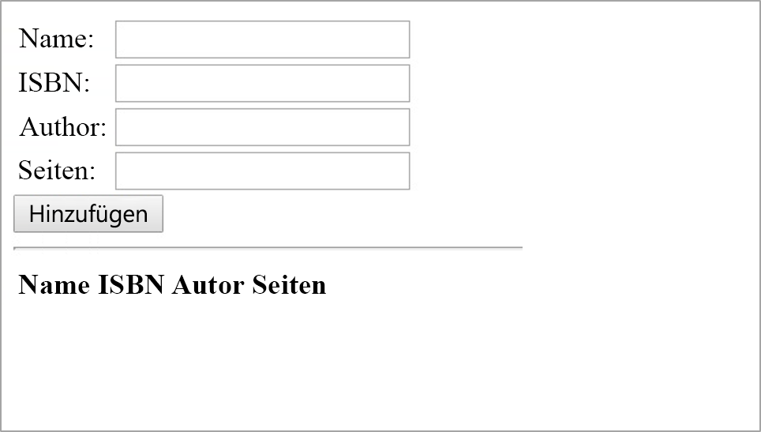

<span data-ttu-id="012ab-101">In dieser Übung erstellen Sie eine einfache, in Node.js gehostete AngularJS-Anwendung und verwenden Express für das Routing.</span><span class="sxs-lookup"><span data-stu-id="012ab-101">In this unit, you're going to create a simple AngularJS application hosted in Node.js and use Express for routing.</span></span> <span data-ttu-id="012ab-102">Auf dem Back-End dient Ihnen MongoDB als Datenspeicher.</span><span class="sxs-lookup"><span data-stu-id="012ab-102">On the back end, MongoDB will serve as your data store.</span></span> <span data-ttu-id="012ab-103">Die Anwendung ist eine Buchdatenbank, in der Sie Bücher auflisten, hinzufügen und löschen können.</span><span class="sxs-lookup"><span data-stu-id="012ab-103">The application is a book database, where you will be able to list, add, and delete books.</span></span>

> [!Important]
> <span data-ttu-id="012ab-104">Dies ist eine einfache Anwendung.</span><span class="sxs-lookup"><span data-stu-id="012ab-104">This is a simple application.</span></span> <span data-ttu-id="012ab-105">Sie dient zum Testen des neu installierten MEAN-Stapels.</span><span class="sxs-lookup"><span data-stu-id="012ab-105">Its purpose is to test the newly installed MEAN stack.</span></span> <span data-ttu-id="012ab-106">Diese Anwendung ist weder ausreichend sicher noch bereit für die Produktion.</span><span class="sxs-lookup"><span data-stu-id="012ab-106">This application is not sufficiently secure or ready for production use.</span></span>

## <a name="create-the-application"></a><span data-ttu-id="012ab-107">Erstellen der Anwendung</span><span class="sxs-lookup"><span data-stu-id="012ab-107">Create the application</span></span>

<span data-ttu-id="012ab-108">Zuerst erstellen wir für Ihre Anwendung den Code, das Skript und die HTML-Dateien.</span><span class="sxs-lookup"><span data-stu-id="012ab-108">First, we're going to create the code, script and HTML files for our application.</span></span> <span data-ttu-id="012ab-109">Hierfür verwenden wir den Cloud Shell-Editor und kopieren die Dateien dann auf die VM.</span><span class="sxs-lookup"><span data-stu-id="012ab-109">We'll do this in the Cloud Shell editor then copy the files to the VM.</span></span>

1. <span data-ttu-id="012ab-110">Wenn die SSH-Verbindung mit Ihrer VM noch besteht, können Sie in Cloud Shell `exit` verwenden, um zum Cloud Shell-Dateisystem zurückzukehren.</span><span class="sxs-lookup"><span data-stu-id="012ab-110">In Cloud Shell, if you are still SSHed into your VM, use `exit` to return to the Cloud Shell filesystem.</span></span>

    ```bash
    exit
    ```

1. <span data-ttu-id="012ab-111">Erstellen Sie die Ordner und Dateien für Ihre Anwendung, und öffnen Sie sie im Cloud Shell-Editor.</span><span class="sxs-lookup"><span data-stu-id="012ab-111">Create the folders and files for your application and open them in the Cloud Shell editor.</span></span>

    ```bash
    cd ~
    mkdir Books
    mkdir Books/app
    mkdir Books/public
    touch Books/app/model.js
    touch Books/app/routes.js
    touch Books/server.js
    touch Books/public/script.js
    touch Books/public/index.html
    code Books
    ```

    <span data-ttu-id="012ab-112">Es wird ein Ordner mit dem Namen „Books“ für die App und die zugehörigen Abhängigkeiten Ihres Projekts erstellt.</span><span class="sxs-lookup"><span data-stu-id="012ab-112">This creates a folder called "Books" to contain your project's app and its dependencies.</span></span> <span data-ttu-id="012ab-113">In diesem Ordner haben Sie einen Ordner „app“ erstellt, der alle Ihre Anwendungsressourcen und Skripts enthält.</span><span class="sxs-lookup"><span data-stu-id="012ab-113">Within that folder, you created an "app" folder to contain all your application resources and scripts.</span></span> <span data-ttu-id="012ab-114">Schließlich erstellen wir auch einen „public“-Ordner zum Speichern aller clientseitigen Dateien, die direkt auf entsprechende HTTP-Anforderungen hin bereitgestellt werden.</span><span class="sxs-lookup"><span data-stu-id="012ab-114">Finally, we will also create a "public" folder to hold all of the client-side files that will be served up directly to appropriate HTTP requests.</span></span>

## <a name="create-the-application"></a><span data-ttu-id="012ab-115">Erstellen der Anwendung</span><span class="sxs-lookup"><span data-stu-id="012ab-115">Create the application</span></span>

1. <span data-ttu-id="012ab-116">Erstellen Sie das Mongoose-Datenmodell.</span><span class="sxs-lookup"><span data-stu-id="012ab-116">Create the Mongoose data model.</span></span> <span data-ttu-id="012ab-117">Öffnen Sie im Editor die Datei `app/model.js`, und fügen Sie den folgenden Code ein.</span><span class="sxs-lookup"><span data-stu-id="012ab-117">In the editor, open `app/model.js` and paste in the following code.</span></span>

    ```javascript
    var mongoose = require('mongoose');
    var dbHost = 'mongodb://localhost:27017/Books';
    mongoose.connect(dbHost,  { useNewUrlParser: true } );
    mongoose.connection;
    mongoose.set('debug', true);
    var bookSchema = mongoose.Schema( {
        name: String,
        isbn: {type: String, index: true},
        author: String,
        pages: Number
    });
    var Book = mongoose.model('Book', bookSchema);
    module.exports = Book // mongoose.model('Book', bookSchema);
    ```

    > [!IMPORTANT]
    > <span data-ttu-id="012ab-118">Achten Sie beim Einfügen oder Ändern von Code in einer Datei im Editor darauf, dass Sie anschließend speichern, indem Sie das Menü unter „...“ oder die Tastenkombination (<kbd>STRG+S</kbd> unter Windows und Linux, <kbd>Cmd+S</kbd> unter macOS) verwenden.</span><span class="sxs-lookup"><span data-stu-id="012ab-118">Whenever you paste or change code into a file in the editor, make sure to save afterwards using the "..." menu, or the accelerator key (<kbd>Ctrl+S</kbd> on Windows and Linux, <kbd>Cmd+S</kbd> on macOS).</span></span>

    <span data-ttu-id="012ab-119">Dieser Code stellt eine Verbindung mit einer Datenbank namens „Books“ auf dem MongoDB-Server des lokalen virtuellen Computers her.</span><span class="sxs-lookup"><span data-stu-id="012ab-119">This code is connecting to a database called "Books" on the local VM's MongoDB server.</span></span> <span data-ttu-id="012ab-120">Er erstellt dann ein Datenbankdokument namens „Book“ mit dem von der `bookSchema`-Variablen definierten Schema.</span><span class="sxs-lookup"><span data-stu-id="012ab-120">It then creates a database document called "Book" with the schema defined by the `bookSchema` variable.</span></span>

2. <span data-ttu-id="012ab-121">Erstellen Sie die ExpressRoute-Verbindungen, mit denen die HTTP-Anforderungen behandelt werden.</span><span class="sxs-lookup"><span data-stu-id="012ab-121">Create the Express routes that will handle HTTP requests.</span></span> <span data-ttu-id="012ab-122">Öffnen Sie im Editor die Datei `app/routes.js`, und fügen Sie den folgenden Code ein.</span><span class="sxs-lookup"><span data-stu-id="012ab-122">Open `app/routes.js` in the editor and paste in the following code.</span></span>

    ```javascript
    var path = require('path');
    var Book = require('./model');
    var routes = function(app) {
        app.get('/book', function(req, res) {
            Book.find({}, function(err, result) {
                if ( err ) throw err;
                res.json(result);
            });
        });
        app.post('/book', function(req, res) {
            var book = new Book( {
                name:req.body.name,
                isbn:req.body.isbn,
                author:req.body.author,
                pages:req.body.pages
            });
            book.save(function(err, result) {
                if ( err ) throw err;
                res.json( {
                    message:"Successfully added book",
                    book:result
                });
            });
        });
        app.delete("/book/:isbn", function(req, res) {
            Book.findOneAndRemove(req.query, function(err, result) {
                if ( err ) throw err;
                res.json( {
                    message: "Successfully deleted the book",
                    book: result
                });
            });
        });
        app.get('*', function(req, res) {
            res.sendFile(path.join(__dirname + '/public', 'index.html'));
        });
    };
    module.exports = routes;
    ```

    <span data-ttu-id="012ab-123">Dieser Code erstellt vier Routen für die Anwendung.</span><span class="sxs-lookup"><span data-stu-id="012ab-123">This code will create four routes for our application.</span></span> <span data-ttu-id="012ab-124">Die ersten drei geben an, was zu tun ist, wenn jemand eine API-GET-, POST- oder DELETE-Anforderung an die `/book`-Ressource sendet.</span><span class="sxs-lookup"><span data-stu-id="012ab-124">The first three specify what to do when someone sends an API GET, POST, or DELETE request to the `/book` resource.</span></span> <span data-ttu-id="012ab-125">Die letzte ist eine alles abfangende Route, die die anfordernde Person zur Indexseite leitet.</span><span class="sxs-lookup"><span data-stu-id="012ab-125">The last one is a catch-all route to send the requester to the index page.</span></span>

    <span data-ttu-id="012ab-126">Express kann HTTP-Antworten direkt an den Routenverarbeitungscode leiten oder statischen Inhalt aus Dateien bereitstellen.</span><span class="sxs-lookup"><span data-stu-id="012ab-126">Express can serve up HTTP responses directly in the route handling code, or it can serve up static content from files.</span></span> <span data-ttu-id="012ab-127">In dieser Beispielwebanwendung wird beides durchgeführt.</span><span class="sxs-lookup"><span data-stu-id="012ab-127">We are doing both in this sample web application.</span></span> <span data-ttu-id="012ab-128">Wir antworten mit JSON-Daten auf Buch-API-Anforderungen und mit HTML-Daten direkt aus der Datei „index.html“.</span><span class="sxs-lookup"><span data-stu-id="012ab-128">We respond with JSON data for book API requests and with HTML data direct from the index.html file.</span></span>

3. <span data-ttu-id="012ab-129">Erstellen Sie den Express-Server, um die Anwendung zu hosten.</span><span class="sxs-lookup"><span data-stu-id="012ab-129">Create the Express server to host the application.</span></span> <span data-ttu-id="012ab-130">Öffnen Sie im Editor die Datei `server.js`, und fügen Sie den folgenden Code ein:</span><span class="sxs-lookup"><span data-stu-id="012ab-130">Open `server.js` in the editor and paste in the following code:</span></span>

    ```javascript
    var express = require('express');
    var bodyParser = require('body-parser');
    var app = express();
    app.use(express.static(__dirname + '/public'));
    app.use(bodyParser.json());
    require('./app/routes')(app);
    app.set('port', 80);
    app.listen(app.get('port'), function() {
        console.log('Server up: http://localhost:' + app.get('port'));
    });
    ```

    <span data-ttu-id="012ab-131">Mit diesem Code wird die eigentliche Webanwendung erstellt.</span><span class="sxs-lookup"><span data-stu-id="012ab-131">This code creates the web application itself.</span></span> <span data-ttu-id="012ab-132">Er stellt statische Dateien aus einem Ordner mit dem Namen **public** (wird als Nächstes erstellt) bereit und verwendet die im vorherigen Schritt definierten Routen.</span><span class="sxs-lookup"><span data-stu-id="012ab-132">It will serve static files from a folder named **public** (created next) and will use the routes defined in the previous step.</span></span>

4. <span data-ttu-id="012ab-133">Erstellen Sie die clientseitige JavaScript-Anwendung.</span><span class="sxs-lookup"><span data-stu-id="012ab-133">Create the client-side JavaScript application.</span></span> <span data-ttu-id="012ab-134">Öffnen Sie die Datei `public/script.js` im Editor, und fügen Sie diesen Code ein:</span><span class="sxs-lookup"><span data-stu-id="012ab-134">Open `public/script.js` in the editor and paste in this code:</span></span>

    ```javascript
    var app = angular.module('myApp', []);
    app.controller('myCtrl', function($scope, $http) {
        var getData = function() {
            return $http( {
                method: 'GET',
                url: '/book'
            }).then(function successCallback(response) {
                $scope.books = response.data;
            }, function errorCallback(response) {
                console.log('Error: ' + response);
            });
        };
        getData();
        $scope.del_book = function(book) {
            $http( {
                method: 'DELETE',
                url: '/book/:isbn',
                params: {'isbn': book.isbn}
            }).then(function successCallback(response) {
                console.log(response);
                return getData();
            }, function errorCallback(response) {
                console.log('Error: ' + response);
            });
        };
        $scope.add_book = function() {
            var body = '{ "name": "' + $scope.Name +
            '", "isbn": "' + $scope.Isbn +
            '", "author": "' + $scope.Author +
            '", "pages": "' + $scope.Pages + '" }';
            $http({
                method: 'POST',
                url: '/book',
                data: body
            }).then(function successCallback(response) {
                console.log(response);
                return getData();
            }, function errorCallback(response) {
                console.log('Error: ' + response);
            });
        };
    });
    ```

    <span data-ttu-id="012ab-135">Dieser clientseitige AngularJS-Code erstellt eine neue Angular-Anwendung `myApp`, die den Controller `myCtrl` enthält.</span><span class="sxs-lookup"><span data-stu-id="012ab-135">This client-side AngularJS code creates a new angular application `myApp` containing one controller `myCtrl`.</span></span> <span data-ttu-id="012ab-136">Wenn die Anwendung im Browser des Betrachters ausgeführt wird, wird eine HTTP GET-Anforderung zum Abrufen der Bücherliste in der Datenbank ausgegeben.</span><span class="sxs-lookup"><span data-stu-id="012ab-136">When the application is run in the viewer's browser, it will issue an HTTP GET request to retrieve the list of books in the database.</span></span>

5. <span data-ttu-id="012ab-137">Erstellen Sie die Benutzeroberfläche für die App.</span><span class="sxs-lookup"><span data-stu-id="012ab-137">Create the user interface for the app.</span></span> <span data-ttu-id="012ab-138">Öffnen Sie die Datei `public/index.html` im Editor, und fügen Sie diesen Code ein:</span><span class="sxs-lookup"><span data-stu-id="012ab-138">Open `public/index.html` in the editor and paste in this code:</span></span>

    ```html
    <!doctype html>
    <html ng-app="myApp" ng-controller="myCtrl">
    <head>
        <script src="https://ajax.googleapis.com/ajax/libs/angularjs/1.7.2/angular.min.js"></script>
        <script src="script.js"></script>
    </head>
    <body>
        <div>
        <table>
            <tr>
            <td>Name:</td>
            <td><input type="text" ng-model="Name"></td>
            </tr>
            <tr>
            <td>Isbn:</td>
            <td><input type="text" ng-model="Isbn"></td>
            </tr>
            <tr>
            <td>Author:</td>
            <td><input type="text" ng-model="Author"></td>
            </tr>
            <tr>
            <td>Pages:</td>
            <td><input type="number" ng-model="Pages"></td>
            </tr>
        </table>
        <button ng-click="add_book()">Add</button>
        </div>
        <hr>
        <div>
        <table>
            <tr>
            <th>Name</th>
            <th>Isbn</th>
            <th>Author</th>
            <th>Pages</th>
            </tr>
            <tr ng-repeat="book in books">
            <td><input type="button" value="Delete" data-ng-click="del_book(book)"></td>
            <td>{{book.name}}</td>
            <td>{{book.isbn}}</td>
            <td>{{book.author}}</td>
            <td>{{book.pages}}</td>
            </tr>
        </table>
        </div>
    </body>
    </html>
    ```

    <span data-ttu-id="012ab-139">Dieser Code erstellt ein einfaches HTML-Formular mit vier Feldern zum Übermitteln von neuen Buchdaten und einer Tabelle zum Anzeigen aller Bücher, die bereits in der Datenbank gespeichert sind.</span><span class="sxs-lookup"><span data-stu-id="012ab-139">This code will create a simple HTML form with four fields to submit new book data and a table to display all the books already stored in the database.</span></span> <span data-ttu-id="012ab-140">Die verschiedenen `ng-`-HTML-Attribute verknüpfen den AngularJS-Code mit der Benutzeroberfläche.</span><span class="sxs-lookup"><span data-stu-id="012ab-140">The various `ng-` HTML attributes will wire up the AngularJS code to the UI.</span></span>

6. <span data-ttu-id="012ab-141">Wir sind mit dem Bearbeiten der Dateien jetzt fertig.</span><span class="sxs-lookup"><span data-stu-id="012ab-141">We're done editing files.</span></span> <span data-ttu-id="012ab-142">Vergewissern Sie sich, dass Sie alle Dateien gespeichert haben, und führen Sie dann den folgenden Befehl aus, um sie auf die VM zu kopieren.</span><span class="sxs-lookup"><span data-stu-id="012ab-142">Make sure you have saved all of them, then run the following command to copy them to the VM.</span></span> <span data-ttu-id="012ab-143">Geben Sie Ihr Kennwort ein, wenn Sie dazu aufgefordert werden.</span><span class="sxs-lookup"><span data-stu-id="012ab-143">Enter your password when prompted.</span></span>

    ```bash
    scp -r ~/Books <vm-admin-username>@<vm-public-ip>:~/Books
    ```

## <a name="install-node-packages"></a><span data-ttu-id="012ab-144">Installieren von Node-Paketen</span><span class="sxs-lookup"><span data-stu-id="012ab-144">Install Node packages</span></span>

1. <span data-ttu-id="012ab-145">Wechseln Sie für die SSH-Verbindung wieder auf Ihre VM.</span><span class="sxs-lookup"><span data-stu-id="012ab-145">SSH back into your VM.</span></span>

    ```bash
    ssh <vm-admin-username>@<vm-public-ip>
    ```

1. <span data-ttu-id="012ab-146">Wechseln Sie in das Verzeichnis `Books`.</span><span class="sxs-lookup"><span data-stu-id="012ab-146">Change directories to the `Books` directory.</span></span>

    ```bash
    cd ~/Books
    ```

1. <span data-ttu-id="012ab-147">Installieren Sie **Express** zur Verarbeitung des Routings Ihrer HTTP-Anforderungen, wobei entschieden wird, welche Inhalte an einen Benutzer Ihrer Webanwendung zurückgegeben werden.</span><span class="sxs-lookup"><span data-stu-id="012ab-147">Install **Express** to handle routing of your HTTP requests, to decide what content to return to a user of your web application.</span></span>

    <span data-ttu-id="012ab-148">Führen Sie den folgenden Befehl zum Hinzufügen von Express als Paket für Ihre zu verwendende Webanwendung aus.</span><span class="sxs-lookup"><span data-stu-id="012ab-148">Run the following command to add Express as a package for your web application to use.</span></span>

    ```bash
    npm install express
    ```

1. <span data-ttu-id="012ab-149">Installieren Sie **Mongoose** zur Unterstützung des Weiterleitens Ihrer Buchdaten zwischen MongoDB und dem HTTP-Anforderungsrouting.</span><span class="sxs-lookup"><span data-stu-id="012ab-149">Install **Mongoose** to help relay your book data between MongoDB and the HTTP request routing.</span></span>

    <span data-ttu-id="012ab-150">Die Buchinformationen werden über REST-API-Anforderungen abgefragt.</span><span class="sxs-lookup"><span data-stu-id="012ab-150">The book information will be queried via REST API requests.</span></span> <span data-ttu-id="012ab-151">Um die Übertragung von Daten in MongoDB und heraus an unsere API zu vereinfachen, verwenden wir Mongoose.</span><span class="sxs-lookup"><span data-stu-id="012ab-151">To simplify the transfer of data in and out of MongoDB to our API, we will use Mongoose.</span></span> <span data-ttu-id="012ab-152">Mongoose ist ein schemabasiertes System für die Modellierung von Daten.</span><span class="sxs-lookup"><span data-stu-id="012ab-152">Mongoose is a schema-based system for modeling data.</span></span> <span data-ttu-id="012ab-153">Wir werden es in unserer Beispielanwendung verwenden, um unsere Datenmodelle über die verschiedenen GET-, POST- und DELETE-HTTP-Anforderungen hinweg konsistent zu halten.</span><span class="sxs-lookup"><span data-stu-id="012ab-153">We will be using it in our sample application to keep our data models consistent through the various GET, POST, and DELETE HTTP requests.</span></span>

    <span data-ttu-id="012ab-154">Führen Sie den folgenden Befehl zum Hinzufügen von Mongoose als Paket für Ihre zu verwendende Webanwendung aus.</span><span class="sxs-lookup"><span data-stu-id="012ab-154">Run the following command to add Mongoose as a package for your web application to use.</span></span>

      ```bash
      npm install mongoose
      ```

1. <span data-ttu-id="012ab-155">Installieren Sie **body-parser**, um JSON-Anforderungsdaten für die Verwendung in unserem Express-Routing vorzuverarbeiten.</span><span class="sxs-lookup"><span data-stu-id="012ab-155">Install **body-parser** to pre-process JSON request data for use in our Express routing.</span></span>

    <span data-ttu-id="012ab-156">Auf dem Back-End dient `body-parser` als Middleware zwischen Node.js und Express zum Analysieren der eingehenden JSON-Anforderungsdaten.</span><span class="sxs-lookup"><span data-stu-id="012ab-156">On the back end, `body-parser` will serve as a middleware between Node.js and Express for parsing incoming JSON request data.</span></span>

    <span data-ttu-id="012ab-157">Führen Sie den folgenden Befehl zum Hinzufügen von `body-parser` als Paket für Ihre zu verwendende Webanwendung aus.</span><span class="sxs-lookup"><span data-stu-id="012ab-157">Run the following command to add `body-parser` as a package for your web application to use.</span></span>

      ```bash
      npm install body-parser
      ```

    > [!TIP]
    > <span data-ttu-id="012ab-158">Wenn Sie mehrere npm-Pakete installieren, können Sie alle in einen einzigen Befehl wie diesen einschließen:</span><span class="sxs-lookup"><span data-stu-id="012ab-158">When installing multiple npm packages, you can include them all in a single command such as this:</span></span>
    >
    > ```bash
    > npm install express mongoose body-parser
    > ```

## <a name="test-the-application"></a><span data-ttu-id="012ab-159">Testen der Anwendung</span><span class="sxs-lookup"><span data-stu-id="012ab-159">Test the application</span></span>

1. <span data-ttu-id="012ab-160">Starten Sie die Anwendung mit dem folgenden Befehl mit Node.js.</span><span class="sxs-lookup"><span data-stu-id="012ab-160">Start the application with Node.js with the following command.</span></span>

    ```bash
    sudo node server.js
    ```

    <span data-ttu-id="012ab-161">Dadurch wird das Back-End der Anwendung gestartet, das dann an Port 80 auf eingehende HTTP-Anforderungen lauscht.</span><span class="sxs-lookup"><span data-stu-id="012ab-161">This will start the back end of our application, which will then start listening on port 80 for incoming HTTP requests.</span></span>

1. <span data-ttu-id="012ab-162">Testen Sie die Anwendungsfunktionalität.</span><span class="sxs-lookup"><span data-stu-id="012ab-162">Test the application functionality.</span></span>

    <span data-ttu-id="012ab-163">Öffnen Sie Ihren bevorzugten Browser, und navigieren Sie zur öffentlichen IP-Adresse Ihrer Azure-VM als URL ([http://X.X.X.X](http://X.X.X.X)).</span><span class="sxs-lookup"><span data-stu-id="012ab-163">Open your preferred browser, and navigate to the public IP address of your Azure VM as the URL ([http://X.X.X.X](http://X.X.X.X)).</span></span>

    <span data-ttu-id="012ab-164">Wenn alles in Ordnung ist, sehen Sie etwa folgenden Bildschirm:</span><span class="sxs-lookup"><span data-stu-id="012ab-164">If everything is in order, you should see a screen similar to this:</span></span>

    <span data-ttu-id="012ab-165">Der folgende Screenshot zeigt die Benutzeroberfläche zum Übermitteln von Buchdetails zur Speicherung in der MongoDB-Datenbank.</span><span class="sxs-lookup"><span data-stu-id="012ab-165">The following screenshot displays the user interface to submit book details for storage in the MongoDB database.</span></span>

    

    <span data-ttu-id="012ab-167">Sie sollten jetzt Bücher zum Speichern in der MongoDB-Datenbank übermitteln können.</span><span class="sxs-lookup"><span data-stu-id="012ab-167">You should now be able to submit books to save to the MongoDB database.</span></span> <span data-ttu-id="012ab-168">Außerdem sehen Sie die vollständige Liste der aus der Datenbank geladenen Bücher.</span><span class="sxs-lookup"><span data-stu-id="012ab-168">As well, you can see the full list of books loaded from the database.</span></span>