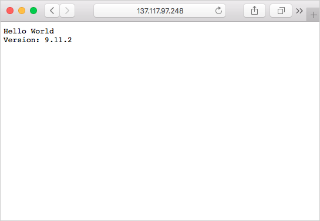

Container images can be pulled from Azure Container Registry from many container management platforms, such as Azure Container Instances, Azure Kubernetes Registry, and Docker for Windows or Mac. When running container images from Azure Container Registry, authentication credentials may be needed. It is recommended to use an Azure service principal for authentication with Container Registry. Furthermore, it is also recommended to secure the Azure service principal credentials in Azure Key Vault.

In this unit, you will create a service principal for your Azure container registry, store it in Azure Key Vault, and then deploy the container to Azure Container Instances using the service principal's credentials.

## Configure registry authentication

All production scenarios should use service principals to access an Azure container registry. Service principals allow you to provide role-based access control (RBAC) to your container images. For example, you can configure a service principal with pull-only access to a registry.

If you don't already have a vault in Azure Key Vault, create one with the Azure CLI using the following commands.

First, create a variable with the name of your container registry. This variable is used throughout this unit.

```azurecli
ACR_NAME=<acrName>
```

Create an Azure key vault with the `az keyvault create` command.

```azurecli
az keyvault create --resource-group myResourceGroup --name $ACR_NAME-keyvault
```

Now, you need to create a service principal and store its credentials in your key vault.

Use the `az ad sp create-for-rbac` command to create the service principal. The `--role` argument configures the service principal with the *reader* role, which grants it pull-only access to the registry. To grant both push and pull access, change the `--role` argument to *contributor*.

```azurecli
az ad sp create-for-rbac --scopes $(az acr show --name $ACR_NAME --query id --output tsv) --role reader
```

This is what the output of the service principal creation will look like. Take note of the `appId` and the `password` values. These will be stored in the Azure key vault.

```bash
{
  "appId": "1fa05179-0000-0000-0000-e269a4e97c41",
  "displayName": "azure-cli-2018-08-19-22-35-26",
  "name": "http://azure-cli-2018-08-19-22-35-26",
  "password": "72377509-0000-0000-0000-c8edbcb2d950",
  "tenant": "00000000-0000-0000-0000-000000000000"
}
```

Next, use the `az keyvault secret set` command to store the service principal's *appId* in the vault. Replace `<appId>` with the `appId` of the service principal.

```azurecli
az keyvault secret set --vault-name $ACR_NAME-keyvault --name $ACR_NAME-pull-usr --value <appId>
```

Now, use the `az keyvault secret set` command to store the service principal's *password* in the vault. Replace `<password>` with the `password` of the service principal.

```azurecli
az keyvault secret set --vault-name $ACR_NAME-keyvault --name $ACR_NAME-pull-pwd --value <password>
```

You've created an Azure key vault and stored two secrets in it:

* `$ACR_NAME-pull-usr`: The service principal ID, for use as the container registry **username**.
* `$ACR_NAME-pull-pwd`: The service principal password, for use as the container registry **password**.

You can now reference these secrets by name when you or your applications and services pull images from the registry.

### Deploy a container with Azure CLI

Now that the service principal credentials are stored in Azure Key Vault, your applications and services can use them to access your private registry.

Execute the following `az container create` command to deploy a container instance. The command uses the service principal's credentials stored in Azure Key Vault to authenticate to your container registry.

```azurecli
az container create \
    --resource-group myResourceGroup \
    --name acr-build \
    --image $ACR_NAME.azurecr.io/helloacrbuild:v1 \
    --registry-login-server $ACR_NAME.azurecr.io \
    --ip-address Public \
    --registry-username $(az keyvault secret show --vault-name $ACR_NAME-keyvault --name $ACR_NAME-pull-usr --query value -o tsv) \
    --registry-password $(az keyvault secret show --vault-name $ACR_NAME-keyvault --name $ACR_NAME-pull-pwd --query value -o tsv)
```

Get the IP address of the Azure container instance.

```azurecli
az container show --resource-group myResourceGroup --name acr-build --query ipAddress.ip --output table
```

Open up a browser and navigate to the IP address of the container. If everything has been configured correctly, you should see the following results:



