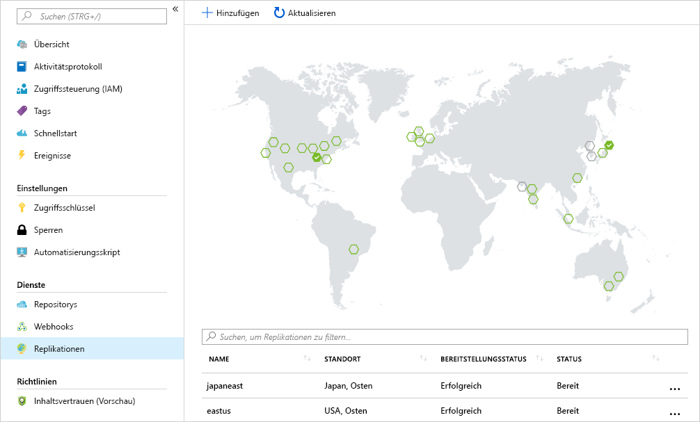

<span data-ttu-id="ba65a-101">Angenommen, Ihr Unternehmen stellt Computeworkloads in verschiedenen Regionen bereit, damit Sie lokale Präsenz für Ihren verteilten Kundenstamm zeigen.</span><span class="sxs-lookup"><span data-stu-id="ba65a-101">Suppose your company has compute workloads deployed to several regions to make sure you have a local presence to serve your distributed customer base.</span></span> 

<span data-ttu-id="ba65a-102">Das Ziel ist, eine Containerregistrierung in jeder Region zu platzieren, in der Images ausgeführt werden.</span><span class="sxs-lookup"><span data-stu-id="ba65a-102">Your aim is to place a container registry in each region where images are run.</span></span> <span data-ttu-id="ba65a-103">Durch diese Strategie werden netzwerknahe Vorgänge und dadurch schnelle, zuverlässige Übertragungen auf Imageebene gewährleistet.</span><span class="sxs-lookup"><span data-stu-id="ba65a-103">This strategy will allow for network-close operations, enabling fast, reliable image layer transfers.</span></span> 

<span data-ttu-id="ba65a-104">Mit der Georeplikation kann eine Azure-Containerregistrierung als zentrale Registrierung verwendet werden, die mehreren Regionen regionale Multimasterregistrierungen zur Verfügung stellt.</span><span class="sxs-lookup"><span data-stu-id="ba65a-104">Geo-replication enables an Azure container registry to function as a single registry, serving several regions with multi-master regional registries.</span></span>

<span data-ttu-id="ba65a-105">Eine Registrierung mit Georeplikation bietet folgende Vorteile:</span><span class="sxs-lookup"><span data-stu-id="ba65a-105">A geo-replicated registry provides the following benefits:</span></span>

- <span data-ttu-id="ba65a-106">einzelner Registrierungs-/Image-/Tagname in mehreren Regionen verwendbar</span><span class="sxs-lookup"><span data-stu-id="ba65a-106">Single registry/image/tag names can be used across multiple regions</span></span>
- <span data-ttu-id="ba65a-107">Netzwerknaher Registrierungszugriff in regionalen Bereitstellungen</span><span class="sxs-lookup"><span data-stu-id="ba65a-107">Network-close registry access from regional deployments</span></span>
- <span data-ttu-id="ba65a-108">Keine zusätzlichen Ausgangsgebühren, da Images aus einer lokalen, replizierten Registrierung in der gleichen Region wie Ihr Containerhost abgerufen werden</span><span class="sxs-lookup"><span data-stu-id="ba65a-108">No additional egress fees, as images are pulled from a local, replicated registry in the same region as your container host</span></span>
- <span data-ttu-id="ba65a-109">Zentrale Verwaltung einer Registrierung für mehrere Regionen</span><span class="sxs-lookup"><span data-stu-id="ba65a-109">Single management of a registry across multiple regions</span></span>

## <a name="replicate-an-image-to-multiple-locations"></a><span data-ttu-id="ba65a-110">Replizieren eines Images für mehrere Standorte</span><span class="sxs-lookup"><span data-stu-id="ba65a-110">Replicate an image to multiple locations</span></span>

<span data-ttu-id="ba65a-111">Sie verwenden den Azure CLI-Befehl `az acr replication create`, um Ihre Containerimages aus einer Region in eine andere zu replizieren.</span><span class="sxs-lookup"><span data-stu-id="ba65a-111">You'll use the `az acr replication create` Azure CLI command to replicate your container images from one region to another.</span></span> <span data-ttu-id="ba65a-112">In diesem Beispiel wird eine Replikation für die Region `japaneast` erstellt.</span><span class="sxs-lookup"><span data-stu-id="ba65a-112">In this example, you'll create a replication for the `japaneast` region.</span></span> <span data-ttu-id="ba65a-113">Ersetzen Sie `<acrName>` durch den Namen Ihrer Containerregistrierung.</span><span class="sxs-lookup"><span data-stu-id="ba65a-113">Update `<acrName>` with the name of your Container Registry.</span></span>

```azurecli
az acr replication create --registry <acrName> --location japaneast
```

<span data-ttu-id="ba65a-114">Die Ausgabe sollte in etwa wie folgt aussehen:</span><span class="sxs-lookup"><span data-stu-id="ba65a-114">The output should look similar to the following:</span></span>

```output
{
  "id": "/subscriptions/00000000-0000-0000-0000-000000000000/resourceGroups/myresourcegroup/providers/Microsoft.ContainerRegistry/registries/myACR0007/replications/japaneast",
  "location": "japaneast",
  "name": "japaneast",
  "provisioningState": "Succeeded",
  "resourceGroup": "myresourcegroup",
  "status": {
    "displayStatus": "Syncing",
    "message": null,
    "timestamp": "2018-08-15T20:22:09.275792+00:00"
  },
  "tags": {},
  "type": "Microsoft.ContainerRegistry/registries/replications"
}
```

<span data-ttu-id="ba65a-115">Als letzten Schritt können Sie alle erstellten Replikate von Containerimages abrufen.</span><span class="sxs-lookup"><span data-stu-id="ba65a-115">As a final step, you're able to retrieve all container image replicas created.</span></span> <span data-ttu-id="ba65a-116">Verwenden Sie den Befehl `az acr replication list` zum Abrufen dieser Liste.</span><span class="sxs-lookup"><span data-stu-id="ba65a-116">You'll use the `az acr replication list` command to retrieve this list.</span></span> <span data-ttu-id="ba65a-117">Ersetzen Sie `<acrName>` durch den Namen Ihrer Containerregistrierung.</span><span class="sxs-lookup"><span data-stu-id="ba65a-117">Update `<acrName>` with the name of your Container Registry.</span></span>

```azurecli
az acr replication list --registry <acrName> --output table
```

<span data-ttu-id="ba65a-118">Die Ausgabe sollte in etwa wie folgt aussehen:</span><span class="sxs-lookup"><span data-stu-id="ba65a-118">The output should look similar to the following:</span></span>

```console
NAME       LOCATION    PROVISIONING STATE    STATUS
---------  ----------  --------------------  --------
japaneast  japaneast   Succeeded             Ready
eastus     eastus      Succeeded             Ready
```

<span data-ttu-id="ba65a-119">Bedenken Sie, dass Sie für das Auflisten der Imagereplikate nicht nur Azure CLI verwenden können.</span><span class="sxs-lookup"><span data-stu-id="ba65a-119">Keep in mind that you are not limited to the Azure CLI to list your image replicas.</span></span> <span data-ttu-id="ba65a-120">Wenn Sie im Azure-Portal `Replications` für eine Azure-Containerregistrierung auswählen, wird eine Karte mit den aktuellen Replikationen angezeigt.</span><span class="sxs-lookup"><span data-stu-id="ba65a-120">From within the Azure portal, selecting `Replications` for an Azure Container Registry displays a map that details current replications.</span></span> <span data-ttu-id="ba65a-121">Containerimages können in zusätzliche Regionen repliziert werden, indem die Regionen auf der Karte ausgewählt werden.</span><span class="sxs-lookup"><span data-stu-id="ba65a-121">Container images can be replicated to additional regions by selecting the regions on the map.</span></span>



<!-- Cleanup sandbox -->
[!include[](../../../includes/azure-sandbox-cleanup.md)]
 

## <a name="summary"></a><span data-ttu-id="ba65a-123">Zusammenfassung</span><span class="sxs-lookup"><span data-stu-id="ba65a-123">Summary</span></span>

<span data-ttu-id="ba65a-124">Sie haben nun mit der Azure CLI erfolgreich ein Containerimage in mehreren Azure-Rechenzentren repliziert.</span><span class="sxs-lookup"><span data-stu-id="ba65a-124">You've now successfully replicated a container image to multiple Azure datacenters using the Azure CLI.</span></span> 