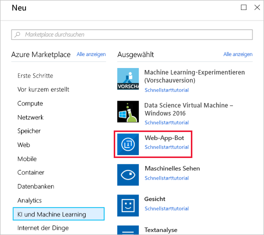
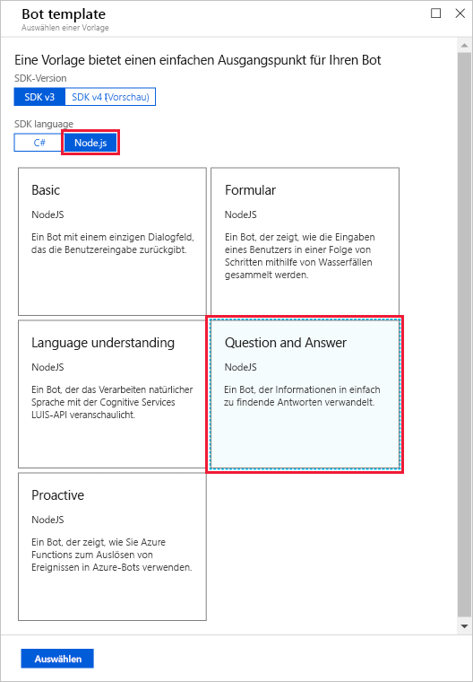
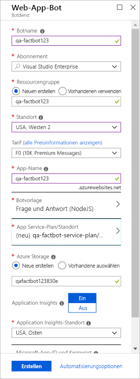

The first step in creating a bot is to provide a location for the bot to be hosted in Azure. The [Web Apps](https://azure.microsoft.com/services/app-service/web/) feature of Azure App Service is perfect for hosting bot applications, and the Azure Bot Service is designed to provision them for you. In this unit, you will use the Azure portal to provision an Azure web app bot.

<!---TODO: Update for sandbox?--->
1. Open the [Azure portal](https://portal.azure.com/?azure-portal=true) in your browser. If you are asked to sign in, do so using your Microsoft account.

1. Click **+ Create a resource**, followed by **AI + Machine Learning**, and then **Web App Bot**.

    

1. Enter a name, such as "qa-factbot", into the **App name** box. *This name must be unique within Azure, so make sure a green check mark appears next to it.* Select **Create new** under **Resource group** and enter the resource group name "factbot-rg." Select the location nearest you and select the free **F0** pricing tier. Then, click **Bot template**.

1. Select **Node.js** as the SDK language and **Question and Answer** as the template type. Then, click **Select** at the bottom of the blade.

    

1. Now, click **App service plan/Location**, followed by **Create New**, and then create an App Service plan named "qa-factbot-service-plan" or something similar in the same region that you selected in Step 3. Once that's done, click **Create** at the bottom of the "Web App Bot" blade to start the deployment.

    

1. Click **Resource groups** in the ribbon on the left side of the portal. Then, click **factbot-rg** to open the resource group created for the Azure web app bot. Wait until "Deploying" changes to "Succeeded" at the top of the blade, which indicates that the Azure web app bot was successfully deployed. Deployment generally requires two minutes or less. Periodically click **Refresh** at the top of the blade to refresh the deployment status.

Behind the scenes, a lot happened when the Azure web app bot was deployed. A bot was created and registered, an [Azure web app](https://azure.microsoft.com/services/app-service/web/) was created to host it, and the bot was configured to work with [Microsoft QnA Maker](https://www.qnamaker.ai/). The next step is to use QnA Maker to create a knowledge base of questions and answers to infuse the bot with intelligence.
