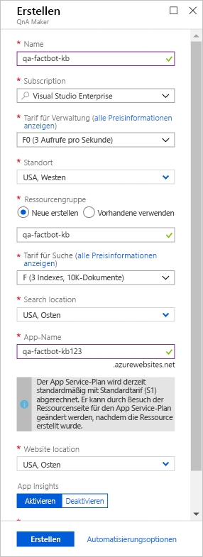
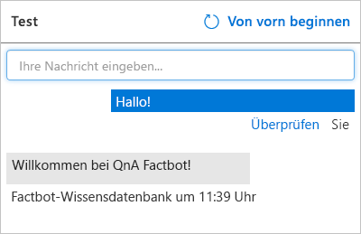

[!INCLUDE [0-vm-note](0-vm-note.md)]

[QnA Maker](https://www.qnamaker.ai/) ist Teil der [Azure Cognitive Services](https://www.microsoft.com/cognitive-services/), einer Sammlung von Diensten und APIs zum Erstellen intelligenter Apps, die durch künstliche Intelligenz (KI) und Machine Learning unterstützt werden.[QnA Maker](https://www.qnamaker.ai/) is part of [Azure Cognitive Services](https://www.microsoft.com/cognitive-services/), which is a suite of services and APIs for building intelligent apps backed by artificial intelligence (AI) and machine learning. Anstatt einen Bot zu codieren, um alle Fragen vorwegzunehmen, die ein Benutzer stellen könnte, und eine Antwort bereitzuhalten, können Sie eine Verbindung zwischen dem Bot und einer Wissensdatenbank herstellen, die mit QnA Maker erstellte Fragen und Antworten enthält.Rather than code a bot to anticipate every question a user might ask and provide a response, you can connect it to a knowledge base of questions and answers created with QnA Maker. Ein allgemeines Verwendungsszenario ist das Erstellen einer Wissensdatenbank über die URL einer FAQ-Seite, damit der Bot domänenspezifische Fragen beantworten kann, z.B.: „Wie finde ich meinen Windows-Produktschlüssel“ oder „Wo kann ich Visual Studio Code herunterladen?“A common usage scenario is to create a knowledge base from the URL of a FAQ page so the bot can answer domain-specific questions such as "How do I find my Windows product key" or "Where can I download Visual Studio Code?"

In dieser Einheit erstellen Sie mit QnA Maker eine Wissensdatenbank, z.B. mit folgenden Fragen: „Welche NFL-Teams haben die meisten Super Bowls gewonnen?“ und „Wie heißt die größte Stadt der Welt?“In this unit, you will use QnA Maker to create a knowledge base containing questions such as "What NFL teams have won the most Super Bowls" and "What is the largest city in the world?" Anschließend stellen Sie die Wissensdatenbank in einer Azure-Web-App bereit, damit über einen HTTPS-Endpunkt darauf zugegriffen werden kann.Then, you will deploy the knowledge base in an Azure web app so that it can be accessed via an HTTPS endpoint.

1. Öffnen Sie das QnA Maker-Portal, indem Sie https://www.qnamaker.ai im VM-Browser öffnen und auf **Anmelden** klicken, um sich mit dem gleichen Lab-Konto anzumelden, mit dem Sie sich beim Azure-Portal angemeldet haben.Open the QnA Maker portal by opening https://www.qnamaker.ai in the VM browser, and select **Sign in** to sign in with the same lab account that you used to sign into the Azure portal. 

1. Klicken Sie auf das Hamburger-Menü und dann auf **Create a knowledge base** (Wissensdatenbank erstellen).Select the hamburger menu, then **Create a knowledge base**. 

1. Klicken Sie auf **Create a QnA service** (QnA-Dienst erstellen).Select **Create a QnA service**.

1. Geben Sie in der neu geöffneten Registerkarte des Azure-Portals einen Namen in das Feld **Name** ein.In the newly-opened Azure portal tab, enter a name into the **Name** box. Dieser Name muss innerhalb von Azure eindeutig sein. Stellen Sie deshalb sicher, dass daneben *und* im Feld **App-Name** weiter unten auf dem Blatt ein grünes Häkchen angezeigt wird.This name must be unique within Azure, so make sure a green check mark appears next to it *and* in the **App name** box further down the blade.

1. Klicken Sie unter **Ressourcengruppe** auf **Vorhandene verwenden**, und wählen Sie anschließend auf die Übungsressourcengruppe aus, die zuvor für diese Übung erstellt wurde.Select **Use existing** under **Resource group**, then select the exercise resource group pre-created for this exercise.

1. Wählen Sie einen **Standort** aus der Dropdownliste aus.Select a **Location** from the list available in the dropdown. 

1. Wählen Sie **F0** als **Tarif für Verwaltung** aus.Select **F0** as the **Management pricing tier**. 

1. Wählen Sie **F** als **Tarif für Suche** aus.Select **F** for the **Search pricing tier**. 

1. Stellen Sie sicher, dass der **App-Name** in Azure eindeutig ist.Verify the **App name** is unique to Azure.

1. Wählen Sie in beiden Dropdownlisten für den Standort den Ihnen nächstgelegenen aus, und klicken Sie unten auf dem Blatt auf die Schaltfläche **Erstellen**.Select the location nearest you in both location drop-downs, then select the **Create** button at the bottom of the blade.

    

1. Klicken Sie im Menüband auf der linken Seite im Portal auf **Ressourcengruppen**, und öffnen Sie die zuvor erstellte Übungsressourcengruppe.Select **Resource groups** in the ribbon on the left side of the portal, and open the pre-created exercise resource group. Warten Sie, bis sich „Wird bereitgestellt“ am oberen Rand des Blatts in „Erfolgreich“ ändert, um anzuzeigen, dass der QnA-Dienst und die zugehörigen Ressourcen erfolgreich bereitgestellt wurden.Wait until "Deploying" changes to "Succeeded" at the top of the blade, indicating that the QnA service and the resources associated with it were successfully deployed. Wenn die Meldung nicht mehr angezeigt wird, können Sie in der Menüleiste auf das Glockensymbol klicken, um den Status anzuzeigen.If the message disappears, you can select the bell icon in the menu bar to view the status. Sie können auch oben auf dem Blatt auf **Aktualisieren** klicken, um den Bereitstellungsstatus zu aktualisieren.You can also select **Refresh** at the top of the blade to refresh the deployment status.

1. Kehren Sie zu **Create a knowledge base** (Wissensdatenbank erstellen) zurück, indem Sie https://www.qnamaker.ai/Create im VM-Browser öffnen und zu **Schritt 2** scrollen, um eine Verbindung mit dem QnA-Dienst herzustellen.Return to **Create a knowledge base** by opening https://www.qnamaker.ai/Create in the VM browser and scroll to **Step 2** to connect to our QnA service.

1. Wählen Sie unter **Microsoft Azure Directory ID** **Microsoft Learn Hosting** aus.Under **Microsoft Azure Directory ID**, choose **Microsoft Learn Hosting**.

1. Wählen Sie **Microsoft Learn Hosting** aus der Dropdownliste **Azure-Abonnementnamen** aus.Select **Microsoft Learn Hosting** from the **Azure subscription name** drop-down list.

1. Wählen Sie unter **Azure QnA-Dienst** den QnA-Dienstnamen aus, den Sie zuvor angegeben haben.Under **Azure QnA service**, select the QnA service name you specified previously. Wenn keine Dienste aufgeführt sind, müssen Sie die Seite möglicherweise aktualisieren.If no services are listed, you may need to refresh the page.

1. Weisen Sie der Wissensdatenbank dann einen Namen wie „Factbot Knowledge Base“ zu.Then, assign the knowledge base a name, such as "Factbot Knowledge Base".

1. Sie können Fragen und Antworten manuell in eine QnA Maker-Wissensdatenbank eingeben oder sie aus Online-FAQs oder lokalen Dateien importieren.You can enter questions and answers into a QnA Maker knowledge base manually, or you can import them from online FAQs or local files. Zu den unterstützten Formaten gehören Textdateien mit Tabstopptrennzeichen, Microsoft Word-Dokumente, Excel-Kalkulationstabellen und PDF-Dateien.Supported formats include tab-delimited text files, Microsoft Word documents, Excel spreadsheets, and PDF files.

    Öffnen Sie https://github.com/MicrosoftDocs/mslearn-build-chat-bot-with-azure-bot-service/blob/master/Factbot.tsv.zip zur Veranschaulichung im VM-Browser, und laden Sie dann die Datei **Factbot.tsv.zip** herunter.To demonstrate, open https://github.com/MicrosoftDocs/mslearn-build-chat-bot-with-azure-bot-service/blob/master/Factbot.tsv.zip in the VM browser, then download the **Factbot.tsv.zip** file. Dieser ZIP-Ordner enthält eine Textdatei namens **Factbot.tsv**.This zip folder contains a text file named **Factbot.tsv**. Extrahieren und kopieren Sie die Datei auf Ihren Computer.Extract and copy the file to your computer. Scrollen Sie dann im QnA Maker-Portal im VM-Browser nach unten, klicken Sie auf **+ Datei hinzufügen**, und wählen Sie dann die Datei **Factbot.tsv** aus.Then, scroll down in the QnA Maker portal in the VM browser, select **+ Add file**, and select **Factbot.tsv**. Diese Datei enthält 20 Fragen und Antworten im Format mit Tabstopptrennzeichen.This file contains 20 questions and answers in tab-delimited format.

1. Klicken Sie am unteren Rand der Seite auf **Create your KB** (Ihre Wissensdatenbank erstellen), und warten Sie darauf, dass die Wissensdatenbank erstellt wird.Select **Create your KB** at the bottom of the page, and wait for the knowledge base to be created. Dieser Vorgang dauert normalerweise weniger als eine Minute.It should take less than a minute.

1. Vergewissern Sie sich, dass die aus **Factbot.tsv** importierten Fragen und Antworten in der Wissensdatenbank angezeigt werden.Confirm that the questions and answers imported from **Factbot.tsv** appear in the knowledge base. Klicken Sie dann auf **Speichern und trainieren**, und warten Sie, bis das Training abgeschlossen ist.Then, select **Save and train** and wait for training to complete.

    

1. Klicken Sie rechts neben der Schaltfläche **Speichern und trainieren** auf **Testen**.Select the **Test** button to the right of the **Save and train** button. Geben Sie „Hi“ in das Nachrichtenfeld ein, und drücken Sie die **EINGABETASTE**.Type "Hi" into the message box and press **Enter**. Vergewissern Sie sich, dass die Antwort wie unten dargestellt „Welcome to the QnA Factbot“ lautet.Confirm that the response is "Welcome to the QnA Factbot," as shown below.

    

1. Geben Sie „What book has sold the most copies?“ (Von welchem Buch wurden die meisten Exemplare verkauft?)Type "What book has sold the most copies?" in das Nachrichtenfeld ein, und drücken Sie die **EINGABETASTE**.into the message box and press **Enter**. Wie lautet die Antwort?What is the response?

1. Klicken Sie erneut auf **Testen**, um den Testbereich auszublenden.Select the **Test** button again to collapse the Test panel. 
1. Klicken Sie im Menü am oberen Rand der Seite auf **Veröffentlichen** und am unteren Seitenrand auf die Schaltfläche **Veröffentlichen**, um die Wissensdatenbank zu veröffentlichen.Select **Publish** in the menu at the top of the page, and select the **Publish** button at the bottom of the page to publish the knowledge base. Mit *Veröffentlichen* wird die Wissensdatenbank an einem HTTPS-Endpunkt zur Verfügung gestellt.*Publishing* makes the knowledge base available at an HTTPS endpoint.

Warten Sie auf den Abschluss des Veröffentlichungsprozesses, und bestätigen Sie, dass der QnA-Dienst bereitgestellt wurde.Wait for the publication process to complete and confirm that the QnA service has been deployed. Die Wissensdatenbank wird nun in einer eigenen Azure-Web-App gehostet, und im nächsten Schritt wird ein Bot bereitgestellt, der sie verwenden kann.With the knowledge base now hosted in an Azure web app of its own, the next step is to deploy a bot that can use it.
