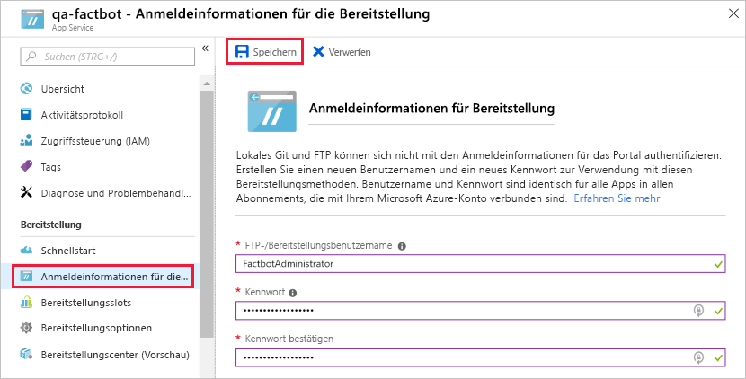

When you created an Azure web app bot in [Exercise 1](#Exercise1), an Azure web app was deployed to host it. But the bot does require some code, and it still needs to be deployed to the Azure web app. Fortunately, the code was generated for you by the Azure Bot Service. In this unit, you will use Visual Studio Code to place the code in a local Git repository and publish the bot to Azure by pushing changes from the local repository to a remote repository connected to the Azure web app that hosts the bot — a process known as [continuous integration](https://en.wikipedia.org/wiki/Continuous_integration).

1. If [Git](https://git-scm.com/) isn't installed on your PC, go to https://git-scm.com/downloads and install the Git client for your operating system. Git is a free and open-source distributed version control system, and it integrates seamlessly into Visual Studio Code. If you aren't sure whether Git is installed, open a Command Prompt or terminal window and execute the following command:

    ```bash
    git --version
    ```

    If a version number is displayed, then the Git client is installed.

1. If Node.js isn't installed on your PC, go to https://nodejs.org/ and install the latest LTS version. You can determine whether Node.js is installed by opening a Command Prompt or terminal window and typing the following command:

    ```bash
    node --version
    ```

    If Node is installed, the version number will be displayed.

1. If Visual Studio Code isn't installed on your PC, go to https://code.visualstudio.com/ and install it now.

1. Create a folder named "Factbot" in the location of your choice on your hard disk to hold the bot's source code.

<!---TODO: Update for sandbox?--->
1. Return to the Azure portal and open the "factbot-rg" resource group. Then, click the web app bot you created in the prior exercise.

1. Click **Build** in the menu on the left, and then click **Download zip file** to prepare a zip file containing the bot's source code. Once the zip file is prepared, click the **Download zip file** button to download it. When the download is complete, copy the contents of the zip file to the "Factbot" folder that you created in Step 4.

1. Still on the "Build" blade, click **Configure continuous deployment**. Click **Setup** at the top of the ensuing blade, followed by **Choose Source**. Then, select **Local Git Repository** as the deployment source and click **OK**.

1. Close the "Deployments" blade and click **All App service settings** in the menu on the left.

1. Click **Deployment credentials**, and then enter a user name and password. You will probably have to enter a user name other than "FactbotAdministrator" because the name must be unique within Azure. Then, click **Save** and close the blade.

    

1. Start Visual Studio Code and use the **File** > **Open Folder...** command to open the "Factbot" folder that you copied the bot's source code to in Step 6.

1. Click the **Source Control** button in the activity bar on the left side of Visual Studio Code, and click the **Initialize Repository** icon at the top. Then, click the **Initialize Repository** button in the ensuing dialog.

1. Type "First commit." into the message box, and then click the check mark to commit your changes.

1. Select **Integrated Terminal** from Visual Studio Code's **View** menu to open an integrated terminal. Then, execute the following command in the integrated terminal, replacing BOT_NAME in two places with the bot name you entered in Exercise 1, Step 3.

    ```bash
    git remote add qna-factbot https://BOT_NAME.scm.azurewebsites.net:443/BOT_NAME.git
    ```

1. Click the ellipsis (the three dots) at the top of the SOURCE CONTROL panel and select **Publish Branch** from the menu to push the bot code from the local repository to Azure. If prompted for credentials, enter the user name and password you specified in Step 9 of this exercise.

Your bot has been published to Azure. But before you test it there, let's run it locally and learn how to debug it in Visual Studio Code.
