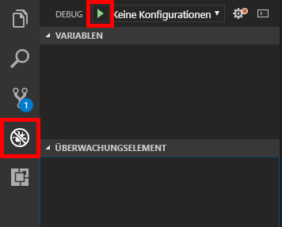

Wie bei jedem Anwendungscode, den Sie schreiben, müssen Änderungen des Botcodes lokal getestet und gedebuggt werden, bevor er in der Produktionsumgebung bereitgestellt wird. Um das Debuggen von Bots zu vereinfachen, bietet Microsoft den [Bot Framework Emulator](https://emulator.botframework.com/). In dieser Einheit lernen Sie, wie Sie Ihre Bots mit Visual Studio Code und dem Emulator debuggen.

1. Wenn Sie den Microsoft Bot Framework Emulator nicht installiert haben, können Sie dies jetzt nachzuholen. Sie können ihn von https://emulator.botframework.com/ herunterladen. Versionen für Windows, macOS und Linux sind verfügbar.

1. Führen Sie den folgenden Befehl im integrierten Terminal von Visual Studio Code aus, um [Restify](http://restify.com/) zu installieren, ein beliebtes Node.js-Paket zum Erstellen und Nutzen von RESTful-Webdiensten:

    ```bash
    npm install restify
    ```

1. Wiederholen Sie diesen Schritt für die folgenden Befehle zum Installieren des [Microsoft Bot Framework Bot Builder SDK für Node.js](https://docs.microsoft.com/bot-framework/nodejs/bot-builder-nodejs-quickstart):

    ```bash
    npm install botbuilder
    npm install botbuilder-azure
    npm install botbuilder-cognitiveservices
    ```

1. Klicken Sie in der Aktivitätsleiste von Visual Studio Code auf die **Explorer**-Schaltfläche. Wählen Sie dann **app.js** aus, um die Datei im Code-Editor zu öffnen. Diese Datei enthält den Code, der den Bot steuert – Code, der vom Azure Bot Service generiert und aus dem Azure-Portal heruntergeladen wurde.

1. Ersetzen Sie den Inhalt von **app.js** durch den folgenden Code, und speichern Sie dann die Datei.

    ```JavaScript
    "use strict";
    var builder = require("botbuilder");
    var botbuilder_azure = require("botbuilder-azure");

    var useEmulator = true;
    var userName = "";
    var yearsCoding = "";
    var selectedLanguage = "";

    var connector = useEmulator ? new builder.ChatConnector() : new botbuilder_azure.BotServiceConnector({
        appId: process.env.MicrosoftAppId,
        appPassword: process.env.MicrosoftAppPassword
    });

    var bot = new builder.UniversalBot(connector);

    bot.dialog('/', [

    function (session) {
        builder.Prompts.text(session, "Hello, and welcome to QnA Factbot! What's your name?");
    },

    function (session, results) {
        userName = results.response;
        builder.Prompts.number(session, "Hi " + userName + ", how many years have you been writing code?");
    },

    function (session, results) {
        yearsCoding = results.response;
        builder.Prompts.choice(session, "What language do you love the most?", ["C#", "Python", "Node.js", "Visual FoxPro"]);
    },

    function (session, results) {
        selectedLanguage = results.response.entity;

        session.send("Okay, " + userName + ", I think I've got it:" +
            " You've been writing code for " + yearsCoding + " years," +
            " and prefer to use " + selectedLanguage + ".");
    }]);

    var restify = require('restify');
    var server = restify.createServer();

    server.listen(3978, function() {
        console.log('test bot endpoint at http://localhost:3978/api/messages');
    });

    server.post('/api/messages', connector.listen());
    ```

1. Legen Sie für die Zeilen 20, 25 und 30 durch Klicken auf den Rand auf der linken Seite Haltepunkte fest.

1. Klicken Sie auf der Aktivitätsleiste auf die Schaltfläche **Debuggen** und dann auf den grünen Pfeil, um eine Debugsitzung zu starten. Überprüfen Sie, ob „Bot-Endpunkt bei http://localhost:3978/api/messages testen“ in der Debugkonsole angezeigt wird.

    

1. Ihr Botcode wird jetzt lokal ausgeführt. Starten Sie den Bot Framework Emulator, und klicken Sie auf **Neue Botkonfiguration erstellen**. Geben Sie den Botnamen und die Bot-URL ein, die im vorherigen Schritt in der Debugkonsole angezeigt wurden. Klicken Sie dann auf **Speichern und verbinden**, und speichern Sie die Konfigurationsdatei am Speicherort Ihrer Wahl.

    > In Zukunft können Sie die Verbindung mit dem Bot wiederherstellen, indem Sie einfach unter „Meine Bots“ auf den Namen des Bots klicken.

    

1. Geben Sie „hi“ in das Feld am unteren Rand des Emulators ein, und drücken Sie die **EINGABETASTE**. Vergewissern Sie sich, dass Visual Studio Code in Zeile 20 von **app.js** anhält. Klicken Sie dann auf der Debugsymbolleiste von Visual Studio Code auf die Schaltfläche **Weiter**, und kehren Sie zum Emulator zurück, um die Antwort des Bots anzuzeigen.

1. Der Bot wird Ihnen eine Reihe von Fragen stellen. Beantworten Sie diese, und klicken Sie jedes Mal dann in Visual Studio Code auf **Weiter**, wenn ein Haltepunkt erreicht wird. Wenn Sie fertig sind, klicken Sie in der Debugsymbolleiste auf die **Beenden**-Schaltfläche, um die Debugsitzung zu beenden.

An diesem Punkt verfügen Sie über einen voll funktionsfähigen Bot und wissen, wie Sie ihn durch lokale Ausführung im Microsoft Bot Framework Emulator debuggen können. Der nächste Schritt besteht darin, den Bot durch Herstellen einer Verbindung mit der Wissensdatenbank, die Sie veröffentlicht haben, intelligenter zu machen.