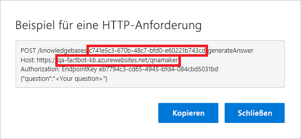

[!INCLUDE [0-vm-note](0-vm-note.md)]

<span data-ttu-id="9c16f-101">In dieser Einheit stellen Sie eine Verbindung zwischen Ihrem Bot und der QnA Maker-Wissensdatenbank her, die Sie zuvor erstellt haben, damit der Bot weiterhin intelligente Konversation betreiben kann.</span><span class="sxs-lookup"><span data-stu-id="9c16f-101">In this unit, you will connect your bot to the QnA Maker knowledge base you built earlier so that the bot can carry on an intelligent conversation.</span></span> <span data-ttu-id="9c16f-102">Das Herstellen einer Verbindung mit der Wissensdatenbank ist mit dem Abrufen einiger Informationen aus dem QnA Maker-Portal, deren Kopieren in das Azure-Portal, dem Aktualisieren des Botcodes und dann dem erneuten Bereitstellen des Bots verbunden.</span><span class="sxs-lookup"><span data-stu-id="9c16f-102">Connecting to the knowledge base involves retrieving some information from the QnA Maker portal, copying it into the Azure portal, updating the bot code, and then redeploying the bot to Azure.</span></span>

1. <span data-ttu-id="9c16f-103">Kehren Sie zum QnA Maker-Portal unter https://www.qnamaker.ai im VM-Browser zurück, und klicken Sie auf die Schaltfläche „Konto“ in der oberen rechten Ecke.</span><span class="sxs-lookup"><span data-stu-id="9c16f-103">Return to the QnA Maker portal at https://www.qnamaker.ai in the VM browser and select the account button in the upper-right corner.</span></span>
1. <span data-ttu-id="9c16f-104">Wählen Sie im dann angezeigten Dropdownmenü **Endpunktschlüssel verwalten** aus.</span><span class="sxs-lookup"><span data-stu-id="9c16f-104">Select **Manage endpoint keys** from the menu that drops down.</span></span>
1. <span data-ttu-id="9c16f-105">Klicken Sie auf **Anzeigen**, um den **primären** Endpunktschlüssel anzuzeigen, und **Kopieren**, um ihn in die Zwischenablage zu kopieren.</span><span class="sxs-lookup"><span data-stu-id="9c16f-105">Select **Show** to show the **Primary** endpoint key and **Copy** to copy it to the clipboard.</span></span> <span data-ttu-id="9c16f-106">Fügen Sie ihn in eine Textdatei ein, damit Sie ihn in Kürze problemlos abrufen können.</span><span class="sxs-lookup"><span data-stu-id="9c16f-106">Paste it into a text file, so you can easily retrieve it in a moment.</span></span>

    > [!NOTE]
    > <span data-ttu-id="9c16f-107">Sie müssen abhängig von Ihren Browsereinstellungen möglicherweise Cookies von Drittanbietern zulassen, um diese Einheit durchführen zu können.</span><span class="sxs-lookup"><span data-stu-id="9c16f-107">Depending on your browser settings, you may need to allow third-party cookies to complete this unit.</span></span>

1. <span data-ttu-id="9c16f-108">Klicken Sie im Menü am oberen Rand der Seite auf **Meine Wissensdatenbanken**.</span><span class="sxs-lookup"><span data-stu-id="9c16f-108">Select **My knowledge bases** in the menu at the top of the page.</span></span>
1. <span data-ttu-id="9c16f-109">Klicken Sie dann für die Wissensdatenbank, die Sie zuvor erstellt haben, auf **Code anzeigen**.</span><span class="sxs-lookup"><span data-stu-id="9c16f-109">Then, select **View Code** for the knowledge base that you created earlier.</span></span>

1. <span data-ttu-id="9c16f-110">Kopieren Sie die Wissensdatenbank-ID aus der ersten Zeile und den Hostnamen aus der zweiten Zeile.</span><span class="sxs-lookup"><span data-stu-id="9c16f-110">Copy the knowledge base ID from the first line and the host name from the second line.</span></span> <span data-ttu-id="9c16f-111">Fügen Sie beide ebenfalls in eine Textdatei ein.</span><span class="sxs-lookup"><span data-stu-id="9c16f-111">Paste them into a text file, as well.</span></span> <span data-ttu-id="9c16f-112">Schließen Sie dann das Dialogfeld.</span><span class="sxs-lookup"><span data-stu-id="9c16f-112">Then, close the dialog.</span></span> <span data-ttu-id="9c16f-113">Beziehen Sie das Präfix „https://“ **nicht** in den Hostnamen ein, den Sie kopieren.</span><span class="sxs-lookup"><span data-stu-id="9c16f-113">**Do not** include the "https://" prefix in the host name that you copy.</span></span>

    

1. <span data-ttu-id="9c16f-115">Kehren Sie zum Web-App-Bot im Azure-Portal zurück.</span><span class="sxs-lookup"><span data-stu-id="9c16f-115">Return to the Web App Bot in the Azure portal.</span></span> <span data-ttu-id="9c16f-116">Klicken Sie im Menü links auf **Anwendungseinstellungen**, und scrollen Sie nach unten zu den Anwendungseinstellungen „QnAKnowledgebaseId“, „QnAAuthKey“ und „QnAEndpointHostName“.</span><span class="sxs-lookup"><span data-stu-id="9c16f-116">Select **Application settings** in the menu on the left, and scroll down until you find application settings named "QnAKnowledgebaseId," "QnAAuthKey," and "QnAEndpointHostName."</span></span> <span data-ttu-id="9c16f-117">Fügen Sie die Wissensdatenbank-ID, den Hostnamen und den Endpunktschlüssel, die bzw. den Sie zuvor erhalten haben, in diese Felder ein.</span><span class="sxs-lookup"><span data-stu-id="9c16f-117">Paste the knowledge base ID and host name you just obtained and the endpoint key obtained previously into these fields.</span></span> <span data-ttu-id="9c16f-118">Klicken Sie anschließend oben auf **Speichern**.</span><span class="sxs-lookup"><span data-stu-id="9c16f-118">Then, select **Save** at the top.</span></span>

    

1. <span data-ttu-id="9c16f-120">Kehren Sie zu **Visual Studio Code** zurück, und ersetzen Sie den Inhalt von **app.js** durch den folgenden Code.</span><span class="sxs-lookup"><span data-stu-id="9c16f-120">Return to **Visual Studio Code** and replace the contents of **app.js** with the code below.</span></span> <span data-ttu-id="9c16f-121">Speichern Sie dann die Datei.</span><span class="sxs-lookup"><span data-stu-id="9c16f-121">Then, save the file.</span></span>

    ```JavaScript
    var restify = require('restify');
    var builder = require('botbuilder');
    var botbuilder_azure = require("botbuilder-azure");
    var builder_cognitiveservices = require("botbuilder-cognitiveservices");

    // Setup Restify Server
    var server = restify.createServer();
    server.listen(process.env.port || process.env.PORT || 3978, function () {
        console.log('%s listening to %s', server.name, server.url);
    });

    // Create chat connector for communicating with the Bot Framework Service
    var connector = new builder.ChatConnector({
        appId: process.env.MicrosoftAppId,
        appPassword: process.env.MicrosoftAppPassword,
        openIdMetadata: process.env.BotOpenIdMetadata
    });

    // Listen for messages from users
    server.post('/api/messages', connector.listen());

    var tableName = 'botdata';
    var azureTableClient = new botbuilder_azure.AzureTableClient(tableName, process.env['AzureWebJobsStorage']);
    var tableStorage = new botbuilder_azure.AzureBotStorage({ gzipData: false }, azureTableClient);

    // Create your bot with a function to receive messages from the user
    var bot = new builder.UniversalBot(connector);
    bot.set('storage', tableStorage);

    // Recognizer and and Dialog for preview QnAMaker service
    var previewRecognizer = new builder_cognitiveservices.QnAMakerRecognizer({
        knowledgeBaseId: process.env.QnAKnowledgebaseId,
        authKey: process.env.QnAAuthKey || process.env.QnASubscriptionKey
    });

    var basicQnAMakerPreviewDialog = new builder_cognitiveservices.QnAMakerDialog({
        recognizers: [previewRecognizer],
        defaultMessage: 'No match! Try changing the query terms!',
        qnaThreshold: 0.3
    }
    );

    bot.dialog('basicQnAMakerPreviewDialog', basicQnAMakerPreviewDialog);

    // Recognizer and and Dialog for GA QnAMaker service
    var recognizer = new builder_cognitiveservices.QnAMakerRecognizer({
        knowledgeBaseId: process.env.QnAKnowledgebaseId,
        authKey: process.env.QnAAuthKey || process.env.QnASubscriptionKey, // Backward compatibility with QnAMaker (Preview)
        endpointHostName: process.env.QnAEndpointHostName
    });

    var basicQnAMakerDialog = new builder_cognitiveservices.QnAMakerDialog({
        recognizers: [recognizer],
        defaultMessage: "I'm not quite sure what you're asking. Please ask your question again.",
        qnaThreshold: 0.3
    });

    bot.dialog('basicQnAMakerDialog', basicQnAMakerDialog);

    bot.dialog('/', //basicQnAMakerDialog);
        [
            function (session) {
                var qnaKnowledgebaseId = process.env.QnAKnowledgebaseId;
                var qnaAuthKey = process.env.QnAAuthKey || process.env.QnASubscriptionKey;
                var endpointHostName = process.env.QnAEndpointHostName;

                // QnA Subscription Key and KnowledgeBase Id null verification
                if ((qnaAuthKey == null || qnaAuthKey == '') || (qnaKnowledgebaseId == null || qnaKnowledgebaseId == ''))
                    session.send('Please set QnAKnowledgebaseId, QnAAuthKey and QnAEndpointHostName (if applicable) in App Settings. Learn how to get them at https://aka.ms/qnaabssetup.');
                else {
                    if (endpointHostName == null || endpointHostName == '')
                        // Replace with Preview QnAMakerDialog service
                        session.replaceDialog('basicQnAMakerPreviewDialog');
                    else
                        // Replace with GA QnAMakerDialog service
                        session.replaceDialog('basicQnAMakerDialog');
                }
            }
        ]);
    ```

    > [!NOTE]
    > <span data-ttu-id="9c16f-122">Beachten Sie den Aufruf zum Erstellen einer `QnAMakerDialog`-Instanz in Zeile 30.</span><span class="sxs-lookup"><span data-stu-id="9c16f-122">The call to create a `QnAMakerDialog` instance on line 30.</span></span> <span data-ttu-id="9c16f-123">Dadurch wird ein Dialogfeld erstellt, das einen mit dem Azure Bot Service erstellten Bot in eine über Microsoft QnA Maker erstellte Wissensdatenbank integriert.</span><span class="sxs-lookup"><span data-stu-id="9c16f-123">This creates a dialog that integrates a bot built with the Azure Bot Service with a knowledge base built via Microsoft QnA Maker.</span></span>

1. <span data-ttu-id="9c16f-124">Klicken Sie in Visual Studio Code in der Aktivitätsleiste auf die Schaltfläche **Quellcodeverwaltung**.</span><span class="sxs-lookup"><span data-stu-id="9c16f-124">Select the **Source Control** button in the activity bar in Visual Studio Code.</span></span>
1. <span data-ttu-id="9c16f-125">Zeigen Sie mit der Maus auf die Datei **app.js**, und wählen Sie die Schaltfläche __+__ aus, um die Dateiänderungen für den nächsten Commit bereitzustellen.</span><span class="sxs-lookup"><span data-stu-id="9c16f-125">Hover over the **app.js** file and select the __+__ button to stage that file's changes for the next commit.</span></span>
1. <span data-ttu-id="9c16f-126">Geben Sie „Connected to knowledge base“ (Mit der Wissensdatenbank verbunden) in das Nachrichtenfeld ein, und klicken Sie dann auf das Häkchen, um Ihre Änderungen zu übernehmen.</span><span class="sxs-lookup"><span data-stu-id="9c16f-126">Type "Connected to knowledge base" into the message box, and select the check mark to commit your changes.</span></span>

    > [!Warning]
    > <span data-ttu-id="9c16f-127">Wenn Sie Änderungen an einer **package.json**-Datei sehen, stellen Sie sicher, dass Sie diese NICHT in Ihren Commit einbeziehen.</span><span class="sxs-lookup"><span data-stu-id="9c16f-127">If you see changes to a **package.json** file ensure you do NOT include them in your commit.</span></span> <span data-ttu-id="9c16f-128">Ihr Commit darf nur Ihre Änderungen für **app.js** enthalten.</span><span class="sxs-lookup"><span data-stu-id="9c16f-128">Your commit should only include your changes to **app.js**.</span></span>

1. <span data-ttu-id="9c16f-129">Klicken Sie anschließend auf die Schaltfläche mit den Auslassungspunkten (__...__), und pushen Sie diese Änderungen mit **Publish Branch** (Branch veröffentlichen) in das Remoterepository und in die Azure-Web-App.</span><span class="sxs-lookup"><span data-stu-id="9c16f-129">Then, select the ellipsis (__...__) button and use the **Publish Branch** command to push these changes to the remote repository and the Azure Web App.</span></span>

1. <span data-ttu-id="9c16f-130">Kehren Sie zum Web-App-Bot im Azure-Portal zurück, und klicken Sie auf der linken Seite auf **Test in Web Chat** (Im Webchat testen), um die Testkonsole zu öffnen.</span><span class="sxs-lookup"><span data-stu-id="9c16f-130">Return to the web app bot in the Azure portal, and select **Test in Web Chat** on the left to open the test console.</span></span> <span data-ttu-id="9c16f-131">Geben Sie „What's the most popular software programming language in the world?“ (Was ist die weltweit am häufigsten verwendete Programmiersprache?) ein.</span><span class="sxs-lookup"><span data-stu-id="9c16f-131">Type "What's the most popular software programming language in the world?"</span></span> <span data-ttu-id="9c16f-132">in das Feld am unteren Rand des Chatfensters ein, und drücken Sie die **EINGABETASTE**.</span><span class="sxs-lookup"><span data-stu-id="9c16f-132">into the box at the bottom of the chat window and press **Enter**.</span></span> <span data-ttu-id="9c16f-133">Vergewissern Sie sich, dass der Bot reagiert.</span><span class="sxs-lookup"><span data-stu-id="9c16f-133">Confirm that the bot responds.</span></span>

<span data-ttu-id="9c16f-134">Herzlichen Glückwunsch!</span><span class="sxs-lookup"><span data-stu-id="9c16f-134">Congratulations!</span></span> <span data-ttu-id="9c16f-135">Ihr Bot ist mit der Wissensdatenbank verbunden und kann auf Fragen antworten.</span><span class="sxs-lookup"><span data-stu-id="9c16f-135">Your bot is connected to the knowledge base and can respond to questions.</span></span>
