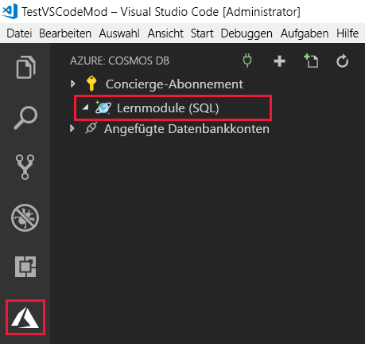

Die Azure Cosmos DB-Erweiterung für Visual Studio Code vereinfacht das Erstellen von Konten, Datenbanken und Sammlungen, indem Ihnen das Erstellen von Ressourcen über das Befehlsfenster ermöglicht wird.The Azure Cosmos DB extension for Visual Studio Code simplifies account, database, and collection creation by enabling you to create resources using the command window.

Im Rahmen dieser Einheit installieren Sie die Azure Cosmos DB-Erweiterung für Visual Studio, und verwenden diese dann zum Erstellen eines Kontos, einer Datenbank und einer Sammlung.In this unit you will install the Azure Cosmos DB extension for Visual Studio, and then use it to create an account, database, and collection.

## Installieren der Azure Cosmos DB-Erweiterung für Visual StudioInstall the Azure Cosmos DB extension for Visual Studio

1. Wechseln Sie zum [Visual Studio Marketplace](https://marketplace.visualstudio.com/items?itemName=ms-azuretools.vscode-cosmosdb), und installieren Sie die Erweiterung **Azure Cosmos DB** für Visual Studio Code.Go to the [Visual Studio Marketplace](https://marketplace.visualstudio.com/items?itemName=ms-azuretools.vscode-cosmosdb) and install the **Azure Cosmos DB** extension for Visual Studio Code.

1. Wenn die Registerkarte der Erweiterung in Visual Studio Code geladen wird, klicken Sie auf **Installieren**.When the extension tab loads in Visual Studio Code, click **Install**.

1. Klicken Sie nach Abschluss der Installation auf **Erneut laden**.After installation is complete, click **Reload**.

    Visual Studio Code zeigt dasVisual Studio Code displays the  Azure-Symbol auf der linken Seite des Bildschirms an, nachdem die Erweiterung installiert und neu geladen wurde.Azure icon on the left side of the screen after the extension is installed and reloaded.

## Erstellen eines Azure Cosmos DB-Kontos in Visual Studio CodeCreate an Azure Cosmos DB account in Visual Studio Code

[!include]

1. Melden Sie sich in Visual Studio Code bei Azure an, indem Sie auf **Ansicht** > **Befehlspalette** klicken und **Azure: Sign In** eingeben.In Visual Studio Code, sign in to Azure by clicking **View** > **Command Palette** and typing **Azure: Sign In**. Damit Sie „Azure: Sign In“ verwenden können, muss die Erweiterung [Azure-Konto](https://marketplace.visualstudio.com/items?itemName=ms-vscode.azure-account) installiert sein.You must have the [Azure Account](https://marketplace.visualstudio.com/items?itemName=ms-vscode.azure-account) extension installed to use Azure: Sign In.

    > [!IMPORTANT]
    > Melden Sie sich bei Azure mit dem Konto an, mit dem die Sandbox erstellt wurde.Login to Azure using the same account used to create the sandbox. Die Sandbox ermöglicht den Zugriff auf ein Concierge-Abonnement.The sandbox provides access to a Concierge Subscription.

    Führen Sie die Anweisungen aus, um den bereitgestellten Code zu kopieren und in den Webbrowser einzufügen, wodurch Ihre Visual Studio Code-Sitzung authentifiziert wird.Follow the prompts to copy and paste the code provided in the web browser, which authenticates your Visual Studio Code session.

1. Klicken Sie im linken Menü auf das **Azure-Symbol** . Klicken Sie anschließend mit der rechten Maustaste auf Ihr **Concierge-Abonnement** und danach auf **Konto erstellen**.Click the  **Azure** icon on the left menu, and then right-click **Concierge Subscription**, and click **Create Account**.

    Sollte das Concierge-Abonnement nicht angezeigt werden, vergewissern Sie sich, dass Sie sich in Visual Studio Code bei Azure mit dem Konto angemeldet haben, mit dem die Sandbox erstellt wurde.If you do not see the Concierge Subscription listed, ensure you logged into Azure in Visual Studio Code using the same account used to create the sandbox. Falls Sie Ihre Azure-Abonnements in der Erweiterung „Azure-Konto“ gefiltert haben, vergewissern Sie sich außerdem, dass das Concierge-Abonnement im Befehl `> Azure: Select Subscriptions` aktiviert ist.Additionally, if you have filtered your Azure subscriptions in the Azure Account extension, verify the Concierge Subscription is checked in the `> Azure: Select Subscriptions` command.

1. Klicken Sie auf die Schaltfläche __+__, um mit der Erstellung eines Cosmos DB-Kontos zu beginnen.Click the __+__ button to start creating a Cosmos DB account. Falls Sie über mehrere Abonnements verfügen, werden Sie aufgefordert, das gewünschte Abonnement auszuwählen.You will be asked to select the subscription if you have more than one.

1. Geben Sie im Textfeld im oberen Bereich des Bildschirms einen eindeutigen Namen für Ihr Azure Cosmos DB-Konto ein, und drücken Sie die EINGABETASTE.In the text box at the top of the screen, enter a unique name for your Azure Cosmos DB account, and then press enter. Der Kontoname darf nur Kleinbuchstaben, Zahlen und das Zeichen „-“ enthalten und muss zwischen 3 bis 31 Zeichen lang sein.The account name can contain only lowercase letters, numbers and the '-' character, and must be between 3 and 31 characters.

1. Klicken Sie als Nächstes auf **SQL (DocumentDB)** > **<rgn>[Sandbox-Ressourcengruppenname]</rgn>**, und wählen Sie einen Standort aus.Next, select **SQL (DocumentDB)** > **<rgn>[Sandbox resource group name]</rgn>**, and then select a location.

    [!include]

    In Visual Studio Code wird auf der Registerkarte „Ausgabe“ der Fortschritt der Kontoerstellung angezeigt. Der Vorgang kann einige Minuten dauern.The output tab in Visual Studio Code displays the progress of the account creation, it takes a few minutes to complete.

1. Nachdem das Konto erstellt wurde, erweitern Sie im Bereich **Azure Cosmos DB** Ihr Azure-Abonnement. Die Erweiterung zeigt nun das neue Azure Cosmos DB-Konto an.After the account is created, expand your Azure subscription in the **Azure: Cosmos DB** pane and the extension displays the new Azure Cosmos DB account. Im folgenden Bild heißt das Konto **learning-modules**.In the following image, the new account is named **learning-modules**.

    

## Erstellen einer Azure Cosmos DB-Datenbank und -Sammlung in Visual Studio CodeCreate an Azure Cosmos DB database and collection in Visual Studio Code

Erstellen Sie nun eine neue Datenbank und Sammlung für Ihre Kunden.Now let's create a new database and collection for your customers.

1. Klicken Sie im Bereich „Azure Cosmos DB“ mit der rechten Maustaste auf Ihr neu erstelltes Konto, und klicken Sie dann auf **Datenbank erstellen**.In the Azure: Cosmos DB pane, right-click your new account, and then click **Create Database**.
1. Geben Sie in der Eingabepalette im oberen Bereich des Bildschirms `Users` als Datenbankname ein, und drücken Sie die EINGABETASTE.In the input palette at the top of the screen, type `Users` for the database name and press Enter.
1. Geben Sie `WebCustomers` als Sammlungsname ein, und drücken Sie die EINGABETASTE.Enter `WebCustomers` for the collection name and press Enter.
1. Geben Sie `userId` als Partitionsschlüssel ein, und drücken Sie die EINGABETASTE.Enter `userId` for the partition key and press Enter.
1. Bestätigen Sie abschließend `1000` als anfängliche Durchsatzkapazität, und drücken Sie die EINGABETASTE.Finally, confirm `1000` for the initial throughput capacity and press Enter.
1. Wenn Sie jetzt das Konto im Bereich **Azure: Cosmos DB** erweitern, werden die neue Datenbank **Users** und die Sammlung **WebCustomers** angezeigt.Expand the account in the **Azure: Cosmos DB** pane, and the new **Users** database and **WebCustomers** collection are displayed.

    

Da Sie nun über ein Azure Cosmos DB-Konto verfügen, können Sie mit der Arbeit in Visual Studio Code beginnen.Now that you have your Azure Cosmos DB account, lets get to work in Visual Studio Code!
