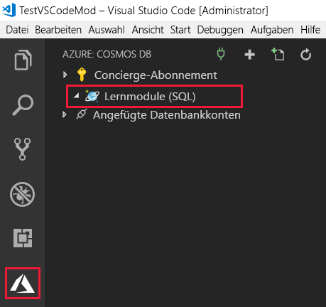

In this module you will create a simple console app using the integrated terminal, install NuGet packages, and use the Azure Cosmos DB extension to see databases and collections created in the previous module. You'll retrieve your Azure Cosmos DB connection string from the extension, and then start configuring the connection to Azure Cosmos DB to create your User database.

## Create a console app

1. Create a folder where you will be working.

1. Open a command prompt and navigate into the folder.

1. Create a new .NET Core console application

```bash
dotnet new console 
```

1. Open Visual Studio Code, and then select **File** > **Open Folder**.

1. Create a new folder where you want your new C# project to be, and then click **Select Folder**.

1. Ensure that file auto save is enabled by clicking on the File menu and checking Auto Save if it is blank.

1. Open the integrated terminal from Visual Studio Code by selecting **View** > **Integrated Terminal** from the main menu.

1. In the terminal window, type **dotnet new console**.

    This command creates a **Program.cs** file in your folder with a simple "Hello World" program already written, along with a C# project file named **learning-module.csproj**.

1. In the terminal window, type the following command to run the "Hello World" program. 

    ```
    dotnet run
    ```

    The terminal window displays "Hello world!" as output.

## Connect the app to Azure Cosmos DB

1. Sign in to Azure by clicking **View** > **Command Palette** and typing **Azure: Sign In**.

    Follow the prompts to copy and paste the code provided in the web browser, which authenticates your Visual Studio Code session.

1. Click the  **Explorer** icon on the left menu, and then expand **Azure Cosmos DB**.

1. Expand your Azure subscription > Azure Cosmos DB account. If you created the **Products** database and **Clothing** collection in the previous modules, the extension displays them.

    

1. Now let's create a new database and collection for your customers.

    In the Explorer window, right-click your account, and then click **Create Database**. 
    
    In the text box at the top of the screen, type **Users** for the database name > **Enter** > **WebCustomers** for the collection name > **Enter** > **userId** for the partition key > **Enter** > **1000** for the initial throughput capacity > **Enter**.

     
    <!--Retake on fresh machine without the other subscriptions showing-->

    The new Users database and WebCustomers collection are displayed in the Explorer window.

1. In the integrated terminal, run each of the following commands at a new prompt to install the required NuGet packages.

    ```
    dotnet add package System.Net.Http
    dotnet add package System.Configuration
    dotnet add package System.Configuration.ConfigurationManager
    dotnet add package Microsoft.Azure.DocumentDB.Core
    dotnet add package Newtonsoft.Json
    dotnet add package System.Threading.Tasks
    dotnet add package System.Linq
    dotnet add package Bogus
    dotnet restore
    ```

1. At the top of the Explorer pane, click **Program.cs** to open the file.

1. Add the following using statements after `using System;`.

    ```csharp
    using System.Configuration;
    using System.Linq;
    using System.Threading.Tasks;
    using System.Net;
    using Microsoft.Azure.Documents;
    using Microsoft.Azure.Documents.Client;
    using Newtonsoft.Json;
    ```

1. Create a new file named App.config in the learning-module folder, and add the following code.
  
    ```xml
    <?xml version="1.0" encoding="utf-8"?>
        <configuration>
          <appSettings>
            <add key="accountEndpoint" value="<replace with your Endpoint URL>" />
            <add key="accountKey" value="<replace with your Primary Key>" />
          </appSettings>
    </configuration>
    ```

1. Copy your connection string from the Azure Cosmos DB extension by right-clicking the learning-module account, and clicking **Copy Connection String**.

     

1. Paste the connection string into a text file, and then copy the **AccountEndpoint** portion from the text file into the **accountEndpoint** in App.config.

    The accountEndpoint should look like the following code:

    ```xml
    <add key="accountEndpoint" value="https://<account-name>.documents.azure.com:443/" />
    ```

1. Now copy the **AccountKey** value from the text value into the **accountKey** value in App.config.

1. In the integrated terminal, type the following command to run the program to ensure it runs.

    ```csharp
    dotnet run
    ```

1. Add a new asynchronous task to create a new client, and check whether the Users database exists by adding the following method after the main method.
    
    ```csharp
    private async Task BasicOperations()
    {
        this.client = new DocumentClient(new Uri(ConfigurationManager.AppSettings["endpointUrl"]), ConfigurationManager.AppSettings["primaryKey"]);

        await this.client.CreateDatabaseIfNotExistsAsync(new Database { Id = "Users" });

        await this.client.CreateDocumentCollectionIfNotExistsAsync(UriFactory.CreateDatabaseUri("Users"), new DocumentCollection { Id = "WebCustomers" });
    }
    ```

1. In the integrated terminal, again, type the following command to run the program to ensure it runs.

    ```csharp
    dotnet run
    ```

1. Copy and paste the following code into the **Main** method, overwriting the current `Console.WriteLine("Hello World!");` line.

    ```csharp
    try
            {
                    Program p = new Program();
                    p.BasicOperations().Wait();
            }
            catch (DocumentClientException de)
            {
                    Exception baseException = de.GetBaseException();
                    Console.WriteLine("{0} error occurred: {1}, Message: {2}", de.StatusCode, de.Message, baseException.Message);
            }
            catch (Exception e)
            {
                    Exception baseException = e.GetBaseException();
                    Console.WriteLine("Error: {0}, Message: {1}", e.Message, baseException.Message);
            }
            finally
            {
                    Console.WriteLine("End of demo, press any key to exit.");
                    Console.ReadKey();
            }
    ```

1. In the integrated terminal, again, type the following command to run the program to ensure it runs.

    ```csharp
    dotnet run
    ```

    The console displays the following output.
    
    ```
    Database and collection validation complete
    End of demo, press any key to exit.
    ```

## Summary

In this unit, you set up the groundwork for your Azure Cosmos DB application. You set up your development environment in Visual Studio Code, created a simple HelloWorld project, connected the project to the Azure Cosmos DB endpoint, and ensured your database and collection exist.