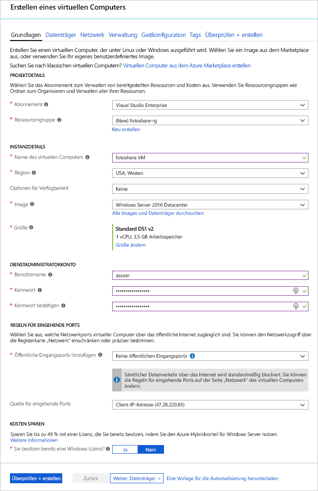

Angenommen, Sie betreiben eine Website zum Teilen von Fotos, bei der Daten auf virtuellen Azure-Maschinen (VMs) mit SQL Server und benutzerdefinierten Anwendungen gespeichert werden.Suppose you run a photo sharing site, with data stored on Azure virtual machines (VMs) running SQL Server and custom applications. Sie möchten die folgenden Anpassungen vornehmen:You want to make the following adjustments:

- Sie müssen die Einstellungen für den Datenträgercache auf einer VM ändern.You need to change the disk cache settings on a VM.
- Sie möchten einen neuen Datenträger für Daten zur VM mit aktivierter Zwischenspeicherung hinzufügen.You want to add a new data disk to the VM with caching enabled.

Sie haben sich dafür entschieden, diese Änderungen über das Azure-Portal vorzunehmen.You've decided to make these changes through the Azure portal.

In dieser Übung wird Schritt für Schritt erklärt, wie Sie die Änderungen an einer VM vornehmen, die oben beschrieben wurde.In this exercise, we'll walk through making the changes to a VM that we described above. Zuerst melden Sie sich am Portal an und erstellen eine VM.First, let's sign in to the portal and create a VM.

[!include]

## Erstellen einer virtuellen MaschineCreate a virtual machine

In diesem Schritt erstellen wir eine VM mit den folgenden Eigenschaften:In this step, we're going to create a VM with the following properties:

| EigenschaftProperty        | WertValue   |
|-----------------|---------|
| ImageImage           | **Windows Server 2016 Datacenter****Windows Server 2016 Datacenter** |
| NameName            | **fotoshareVM****fotoshareVM** |
| RessourcengruppeResource group  |   **<rgn>[Name der Sandbox-Ressourcengruppe]</rgn>****<rgn>[Sandbox resource group name]</rgn>** |
| SpeicherortLocation        | Siehe unten.See below. |

1. Melden Sie sich beim [Azure-Portal](https://portal.azure.com/triplecrownlabs.onmicrosoft.com?azure-portal=true) mit dem gleichen Konto an, über das Sie die Sandbox aktiviert haben.Sign into the [Azure portal](https://portal.azure.com/triplecrownlabs.onmicrosoft.com?azure-portal=true) using the same account you activated the sandbox with.

1. Wählen Sie im Menü in der Randleiste **Ressource erstellen** aus.Select **Create a resource** in the sidebar menu on the left.

1. _Windows Server 2016 VM_ befindet sich in der Liste der **beliebten** Marketplace-Elemente._Windows Server 2016 VM_ should be in the list of **Popular** Marketplace elements. Wenn dies nicht der Fall ist, suchen Sie über das Suchfeld oben nach „Windows Server 2016 DataCenter“.If not, try searching for "Windows Server 2016 DataCenter" using the search box on the top.

1. Wählen Sie die Windows-VM, und klicken Sie auf **Erstellen** um den VM-Erstellungsprozesses zu starten.Select the Windows VM and click **Create** to start the VM creation process.

1. Vergewissern Sie sich im Bereich **Grundlagen**, dass das ausgewählte **Abonnement** _Concierge-Abonnement_ ist.In the **Basics** panel, verify the selected **Subscription** is _Concierge Subscription_.

1. Wählen Sie unter **Ressourcengruppe** die Option **Vorhandene verwenden** aus, und klicken Sie auf _<rgn>[Name der Sandbox-Ressourcengruppe]</rgn>_.Under **Resource Group**, select **Use Existing** and choose _<rgn>[Sandbox resource group name]</rgn>_.

1. Geben Sie in **Name der virtuellen Maschine** _fotoshareVM_ ein.In the **Virtual machine name** box, enter _fotoshareVM_.

1. Wählen Sie in der Dropdownliste **Speicherort** die nächstgelegene Region aus der folgenden Liste.In the **Location** drop-down list, select the closest region to you from the following list.

    [!include]

1. Der Standard unter **Größe** der VM ist **DS1 v2**. Mit erhalten Sie eine Einzel-CPU und 3,5 GB Speicher.For the VM **Size**, the default is **DS1 v2** which gives you a single CPU and 3.5 GB of memory. Das reicht für dieses Beispiel.That's fine for this example.

1. Geben Sie im Abschnitt **ADMINISTRATOR ACCOUNT** einen **Benutzernamen** und **Kennwort** ein, und /**Bestätigen Sie das Kennwort** für ein Administratorkonto auf der neuen VM.In **ADMINISTRATOR ACCOUNT** section, enter a **Username** and **Password**/**Confirm password** for an administrator account on the new VM.

1. Hier ist ein Beispiel für eine ausgefüllte Konfiguration vom Typ **Grundlagen** angegeben. Behalten Sie die Standardwerte für die verbleibenden Registerkarten und Felder bei, und klicken Sie auf **Überprüfen + Erstellen**.The following image is an example of what the **Basics** configuration looks like when filled out. Leave the defaults for the remaining tabs and fields and click **Review + create**.

    

1. Nachdem Sie Ihre neuen VM-Einstellungen überprüft haben, klicken Sie auf **Erstellen**, um die Bereitstellung Ihrer neuen VM zu starten.After reviewing your new VM settings, click **Create** to start the deploying your new VM.

Die VM-Erstellung kann einige Minuten dauern, da alle verschiedenen Ressourcen (Speicher, Netzwerkschnittstelle usw.) zur Unterstützung der virtuellen Maschine erstellt werden.VM creation can take a few minutes as it creates all the various resources (storage, network interface, etc.) to support the virtual machine. Warten Sie, bis die virtuelle Maschine bereitgestellt wurde, bevor Sie mit der Übung fortfahren.Wait until the VM has deployed before continuing with the exercise.

## Anzeigen des Betriebssystemdatenträger-Cachestatus im PortalView OS disk cache status in the portal

Nachdem unsere VM bereitgestellt wurde, können wir den Cachestatus des Betriebssystemdatenträgers mit den folgenden Schritten bestätigen:Once our VM is deployed, we can confirm the caching status of the OS disk using the following steps:

1. Wählen Sie die **fotoshareVM**-Ressource, um die VM-Details im Portal zu öffnen.Select the **fotoshareVM** resource to open the VM details in the portal. Sie können auch in der linken Randleiste auf **Alle Ressourcen** klicken und dann die VM **fotoshareVM** auswählen.Alternatively, you can click **All resources** in the left sidebar, and then select your VM, **fotoshareVM**.

1. Wählen Sie unter **Einstellungen** die Option **Datenträger** aus.Under **Settings**, select **Disks**.

1. Im Bereich **Datenträger** verfügt die virtuelle Maschine über einen Datenträger, nämlich den Betriebssystemdatenträger.On the **Disks** pane, the VM has one disk, the OS disk. Der Cachetyp ist derzeit auf den Standardwert **Lesen/Schreiben** festgelegt.Its cache type is currently set to the default value of **Read/write**.

## Ändern der Cacheeinstellungen des Betriebssystemdatenträgers im PortalChange the cache settings of the OS disk in the portal

1. Wählen Sie im Bereich **Datenträger** oben links die Option **Bearbeiten**.On the **Disks** pane, select **Edit** in the upper left of the screen.

1. Ändern Sie den Wert **HOSTZWISCHENSPEICHERUNG** für den Betriebssystemdatenträger in **Schreibgeschützt**, indem Sie die Dropdownliste verwenden, und wählen Sie dann oben links die Option **Speichern**.Change the **HOST CACHING** value for the OS disk to **Read-only** using the drop-down list, and then select **Save** in the upper left of the screen.

1. Dieses Update kann einige Zeit in Anspruch nehmen.This update can take some time. Der Grund hierfür ist, dass der Zieldatenträger durch das Ändern der Cacheeinstellung eines Azure-Datenträgers getrennt und dann erneut angefügt wird.The reason is that changing the cache setting of an Azure disk detaches and reattaches the target disk. Wenn es sich um den Betriebssystemdatenträger handelt, wird auch die virtuelle Maschine neu gestartet.If it's the operating system disk, the VM is also restarted. Wenn der Vorgang abgeschlossen ist, erhalten Sie eine Benachrichtigung, dass die VM-Datenträger aktualisiert wurden.When the operation completes, you'll get a notification saying the VM disks have been updated.

1. Wenn der Vorgang abgeschlossen ist, ist der Cachetyp des Betriebssystemdatenträgers auf **Schreibgeschützt** festgelegt.Once complete, the OS disk cache type is set to **Read-only**.

Als Nächstes führen wir die Konfiguration des Caches für den für Daten bestimmten Datenträger durch.Let's move on to data disk cache configuration. Wir müssen zunächst einen Datenträger erstellen, um ihn konfigurieren zu können.To configure a disk, we'll need first to create one.

## Hinzufügen eines Datenträgers zur virtuellen Maschine und Festlegen des CachetypsAdd a data disk to the VM and set caching type

1. In der Ansicht **Datenträger** unserer VM im Portal können Sie jetzt die auf die Option **Datenträger hinzufügen** klicken.Back on the **Disks** view of our VM in the portal, go ahead and click **Add data disk**. Im Feld **Name** wird sofort ein Fehler mit dem Hinweis angezeigt, dass das Feld nicht leer sein darf.An error immediately appears in the **Name** field, telling us that the field can't be empty. Da wir noch nicht über einen Datenträger für Daten verfügen, erstellen wir ihn jetzt.We don't have a data disk yet, so let's create one.

1. Klicken Sie in die Liste **Namen** und dann auf **Datenträger erstellen**.Click in the **Name** list, and then click **Create disk**.

1. Geben Sie im Bereich **Verwalteten Datenträger erstellen** im Feld **Name** den Namen **fotoshareVM-data** ein.In the **Create managed disk** pane, in the **Name** box, type **fotosharesVM-data**.

1. Wählen Sie unter **Ressourcengruppe** zuerst **Vorhandene verwenden** und anschließend _<rgn>[Sandbox-Ressourcengruppenname]</rgn>_ aus.Under **Resource Group**, select **Use existing**, and select _<rgn>[Sandbox resource group name]</rgn>_.

1. Notieren Sie die Standardwerte für die verbleibenden Felder:Note the defaults for the remaining fields:
    - SSD PremiumPremium SSD
    - Größe von 1.023 GB1023 GB in size
    - Am gleichen Speicherort wie die VM (kann nicht geändert werden).In the same location as the VM (not changeable).
    - IOPS-Grenzwert – 5.000IOPS limit - 5000
    - Durchsatzbegrenzung (MB/s) – 200Throughput limit (MB/s) - 200

1. Klicken Sie am unteren Rand des Bildschirms auf **Erstellen**.Click **Create** at the bottom of the screen. 

    Warten Sie, bis der Datenträger erstellt wurde, bevor Sie fortfahren.Wait until the disk has been created before continuing.

1. Ändern Sie den Wert **HOSTZWISCHENSPEICHERUNG** für den neuen Datenträger in **Schreibgeschützt**, indem Sie die Dropdownliste verwenden (ist ggf schon festgelegt), und klicken Sie dann oben links auf die Option **Speichern**.Change the **HOST CACHING** value for our new data disk to **Read-only** using the drop-down list (it might be set already), and then click **Save** in the upper left of the screen.

    Warten Sie, bis die VM den neuen Datenträger aktualisiert hat.Wait for the VM to finish updating the new data disk. Nach Abschluss des Vorgangs haben Sie einen neuen Datenträger auf Ihrer virtuellen Maschine.Once complete, you will have a new data disk on your virtual machine.

In dieser Übung haben wir das Azure-Portal verwendet, um die Zwischenspeicherung auf einer neuen virtuellen Maschine zu konfigurieren, die Cacheeinstellungen auf einem vorhandenen Datenträger zu ändern und die Zwischenspeicherung auf einem neuen Datenträger zu konfigurieren.In this exercise, we used the Azure portal to configure caching on a new VM, change cache settings on an existing disk, and configure caching on a new data disk. Im folgenden Screenshot ist die endgültige Konfiguration dargestellt:The following screenshot shows the final configuration:

