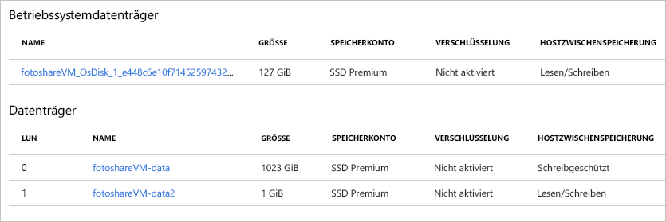

<span data-ttu-id="6950e-101">In der vorherigen Übung haben wir mit dem Azure-Portal die folgenden Aufgaben durchgeführt:</span><span class="sxs-lookup"><span data-stu-id="6950e-101">In the previous exercise, we performed the following tasks using the Azure portal:</span></span>

- <span data-ttu-id="6950e-102">Anzeigen des Cachestatus für den Betriebssystemdatenträger</span><span class="sxs-lookup"><span data-stu-id="6950e-102">View OS disk cache status</span></span>
- <span data-ttu-id="6950e-103">Ändern der Cacheeinstellungen des Betriebssystemdatenträgers</span><span class="sxs-lookup"><span data-stu-id="6950e-103">Change the cache settings of the OS disk</span></span>
- <span data-ttu-id="6950e-104">Hinzufügen eines Datenträgers zum virtuellen Computer</span><span class="sxs-lookup"><span data-stu-id="6950e-104">Add a data disk to the VM</span></span>
- <span data-ttu-id="6950e-105">Ändern des Cachetyps auf einem neuen Datenträger</span><span class="sxs-lookup"><span data-stu-id="6950e-105">Change caching type on a new data disk</span></span>

<span data-ttu-id="6950e-106">Wir üben diese Vorgänge nun mit Azure PowerShell.</span><span class="sxs-lookup"><span data-stu-id="6950e-106">Let's practice these operations using Azure PowerShell.</span></span> 

> [!NOTE]
> <span data-ttu-id="6950e-107">Wir werden Azure PowerShell verwenden, aber Sie können auch die Azure-Befehlszeilenschnittstelle verwenden, deren Funktionalität einem Tool auf Konsolenbasis ähnelt.</span><span class="sxs-lookup"><span data-stu-id="6950e-107">We're going to use Azure PowerShell, but you could also use the Azure CLI which provides similar functionality as a console-based tool.</span></span> <span data-ttu-id="6950e-108">Sie wird unter macOS, Linux und Windows ausgeführt.</span><span class="sxs-lookup"><span data-stu-id="6950e-108">It runs on macOS, Linux, and Windows.</span></span> <span data-ttu-id="6950e-109">Weitere Informationen über die Azure-Befehlszeilenschnittstelle erfahren Sie in dem Modul **Verwalten von virtuellen Computern mit der Azure CLI**.</span><span class="sxs-lookup"><span data-stu-id="6950e-109">If you are interested in learning more about the Azure CLI, check out the **Manage Virtual Machines with the Azure CLI** module.</span></span>

<span data-ttu-id="6950e-110">Wir verwenden den virtuellen Computer, den wir in der vorherigen Übung erstellt haben.</span><span class="sxs-lookup"><span data-stu-id="6950e-110">We're going to use the VM we created in the previous exercise.</span></span> <span data-ttu-id="6950e-111">Für die Vorgänge in dieser Übung wird Folgendes vorausgesetzt:</span><span class="sxs-lookup"><span data-stu-id="6950e-111">The operations in this lab assume:</span></span>

- <span data-ttu-id="6950e-112">Der virtuelle Computer ist vorhanden und hat den Namen **fotoshareVM**.</span><span class="sxs-lookup"><span data-stu-id="6950e-112">Our VM exists and is called **fotoshareVM**</span></span>
- <span data-ttu-id="6950e-113">Der virtuelle Computer ist in einer Ressourcengruppe mit dem Namen „**<rgn>[Sandbox-Ressourcengruppenname]</rgn>**“ enthalten.</span><span class="sxs-lookup"><span data-stu-id="6950e-113">Our VM lives in a resource group called **<rgn>[Sandbox resource group name]</rgn>**</span></span>

<span data-ttu-id="6950e-114">Falls Sie andere Namen verwendet haben, können Sie diese Werte entsprechend ersetzen.</span><span class="sxs-lookup"><span data-stu-id="6950e-114">If you've gone with a different set of names, replace these values with yours.</span></span>

<span data-ttu-id="6950e-115">Hier ist der aktuelle Status unserer VM-Datenträger aus der letzten Übung angegeben:</span><span class="sxs-lookup"><span data-stu-id="6950e-115">Here's the current state of our VM disks from the last exercise:</span></span>


<span data-ttu-id="6950e-117">Wir haben das Portal verwendet, um das Feld **HOSTZWISCHENSPEICHERUNG** für den Betriebssystemdatenträger und den Datenträger für Daten festzulegen.</span><span class="sxs-lookup"><span data-stu-id="6950e-117">We used the portal to set the **HOST CACHING** field for both the OS and data disks.</span></span> <span data-ttu-id="6950e-118">Behalten Sie diesen Ausgangszustand im Hinterkopf, während wir die folgenden Schritte durcharbeiten.</span><span class="sxs-lookup"><span data-stu-id="6950e-118">Keep this initial state in mind as we work through the following steps.</span></span>

### <a name="set-up-some-variables"></a><span data-ttu-id="6950e-119">Einrichten einiger Variablen</span><span class="sxs-lookup"><span data-stu-id="6950e-119">Set up some variables</span></span>

<span data-ttu-id="6950e-120">Zuerst speichern wir einige Ressourcennamen zur späteren Verwendung.</span><span class="sxs-lookup"><span data-stu-id="6950e-120">First, let's store some resource names so we can use them later.</span></span>

1. <span data-ttu-id="6950e-121">Verwenden Sie das Azure Cloud Shell-Terminalfenster auf der rechten Seite, um die folgenden PowerShell-Befehle auszuführen:</span><span class="sxs-lookup"><span data-stu-id="6950e-121">Use the Azure Cloud Shell terminal on the right to run the following PowerShell commands:</span></span>

    > [!NOTE]
    > <span data-ttu-id="6950e-122">Falls noch nicht geschehen, wechseln Sie von der Cloud Shell-Sitzung zu **PowerShell**, bevor Sie diese Befehle ausprobieren.</span><span class="sxs-lookup"><span data-stu-id="6950e-122">Switch your Cloud Shell session to **PowerShell** before trying these commands, if it isn't already.</span></span>
    
    ```powershell
    $myRgName = "<rgn>[Sandbox resource group name]</rgn>"
    $myVMName = "fotoshareVM"
    ```
    
    > [!TIP]
    > <span data-ttu-id="6950e-123">Sie müssen diese Variablen erneut festlegen, wenn der Timeout für Ihre Cloud Shell-Sitzung erreicht ist. Nach Möglichkeit sollten Sie die gesamte Übung also in einer Sitzung durcharbeiten.</span><span class="sxs-lookup"><span data-stu-id="6950e-123">You'll have to set these variables again if your Cloud Shell session times out. So, if possible, work through this entire lab in a single session.</span></span>
    
### <a name="get-info-about-our-vm"></a><span data-ttu-id="6950e-124">Abrufen von Informationen zum virtuellen Computer</span><span class="sxs-lookup"><span data-stu-id="6950e-124">Get info about our VM</span></span>

1. <span data-ttu-id="6950e-125">Führen Sie den folgenden Befehl aus, um die Eigenschaften des virtuellen Computers abzurufen:</span><span class="sxs-lookup"><span data-stu-id="6950e-125">Run the following command to get back the properties of our VM:</span></span>

    ```powershell
    $myVM = Get-AzureRmVM -ResourceGroupName $myRgName -VMName $myVmName
    ```
    
1. <span data-ttu-id="6950e-126">Wir speichern die Antwort in der Variablen `$myVM`.</span><span class="sxs-lookup"><span data-stu-id="6950e-126">We store the response in our `$myVM` variable.</span></span> <span data-ttu-id="6950e-127">Wir können die Ausgabe an das `select-object`-Cmdlet weiterreichen, um die Anzeige nach bestimmten Eigenschaften zu filtern:</span><span class="sxs-lookup"><span data-stu-id="6950e-127">We can pipe the output into the `select-object` cmdlet to filter the display to specific properties:</span></span>

    ```powershell
    $myVM | select-object -property ResourceGroupName, Name, Type, Location
    ```
    
1. <span data-ttu-id="6950e-128">Folgendes sollte angezeigt werden:</span><span class="sxs-lookup"><span data-stu-id="6950e-128">You should get something like the following.</span></span>

    ```output
    ResourceGroupName Name        Type                              Location
    ----------------- ----        ----                              --------
    <rgn>[Sandbox resource group name]</rgn> fotoshareVM Microsoft.Compute/virtualMachines eastus
    ```
    
### <a name="view-os-disk-cache-status"></a><span data-ttu-id="6950e-129">Anzeigen des Cachestatus für den Betriebssystemdatenträger</span><span class="sxs-lookup"><span data-stu-id="6950e-129">View OS disk cache status</span></span>

1. <span data-ttu-id="6950e-130">Wir können die Cacheeinstellung wie folgt über das `StorageProfile`-Objekt überprüfen:</span><span class="sxs-lookup"><span data-stu-id="6950e-130">We can check the caching  setting through  the `StorageProfile` object, as follows:</span></span>

    ```powershell
    $myVM.StorageProfile.OsDisk.Caching
    ```

    ```output
    ReadOnly
    ```
   
1. <span data-ttu-id="6950e-131">Wir ändern ihn wieder in die Standardeinstellung _ReadWrite_ für einen Betriebssystemdatenträger.</span><span class="sxs-lookup"><span data-stu-id="6950e-131">Let's change it back to the default for an OS disk which is _ReadWrite_.</span></span>

### <a name="change-the-cache-settings-of-the-os-disk"></a><span data-ttu-id="6950e-132">Ändern der Cacheeinstellungen des Betriebssystemdatenträgers</span><span class="sxs-lookup"><span data-stu-id="6950e-132">Change the cache settings of the OS disk</span></span>

1. <span data-ttu-id="6950e-133">Wir können den Wert für den Cachetyp wie folgt mithilfe desselben `StorageProfile`-Objekts festlegen:</span><span class="sxs-lookup"><span data-stu-id="6950e-133">We can set the value for the cache type using the same `StorageProfile` object, as follows:</span></span>

    ```powershell
    $myVM.StorageProfile.OsDisk.Caching = "ReadWrite"
    ```
    
    <span data-ttu-id="6950e-134">Dieser Befehl wird schnell ausgeführt. Dies deutet darauf hin, dass der Vorgang lokal erfolgt.</span><span class="sxs-lookup"><span data-stu-id="6950e-134">This command runs fast, which should tell you it's doing something locally.</span></span> <span data-ttu-id="6950e-135">Mit dem Befehl wird nur die Eigenschaft für das `myVM`-Objekt geändert.</span><span class="sxs-lookup"><span data-stu-id="6950e-135">The command only changes the property on the `myVM` object.</span></span> <span data-ttu-id="6950e-136">Wie im folgenden Screenshot zu sehen ist, gilt Folgendes: Wenn Sie die Variable `$myVM` aktualisieren, indem Sie sie mit dem `Get-AzureRmVM`-Cmdlet neu zuweisen, hat sich der Cachewert für den virtuellen Computer nicht geändert.</span><span class="sxs-lookup"><span data-stu-id="6950e-136">As the following screenshot shows, if you refresh the `$myVM` variable by reassigning it using the `Get-AzureRmVM` cmdlet, the caching value won't have changed on the VM.</span></span>

1. <span data-ttu-id="6950e-137">Rufen Sie `Update-AzureRmVM` wie folgt auf, um die Änderung auf dem virtuellen Computer durchzuführen:</span><span class="sxs-lookup"><span data-stu-id="6950e-137">To make the change on the VM itself, call `Update-AzureRmVM`, as follows:</span></span>

    ```powershell
    Update-AzureRmVM -ResourceGroupName $myRGName -VM $myVM
    ```
    
    <span data-ttu-id="6950e-138">Beachten Sie, dass es eine Weile dauert, bis dieser Aufruf abgeschlossen ist.</span><span class="sxs-lookup"><span data-stu-id="6950e-138">Notice that this call takes a while to complete.</span></span> <span data-ttu-id="6950e-139">Dies liegt daran, dass wir den eigentlichen virtuellen Computer aktualisieren und Azure den virtuellen Computer neu startet, um die Änderung vorzunehmen.</span><span class="sxs-lookup"><span data-stu-id="6950e-139">That's because we're updating the actual VM, and Azure restarts the VM  to make the change.</span></span>

    ```output
    RequestId IsSuccessStatusCode StatusCode ReasonPhrase
    --------- ------------------- ---------- ------------
                             True         OK OK
    ```
    
1. <span data-ttu-id="6950e-140">Wenn Sie die Variable `$myVM` erneut aktualisieren, sehen Sie die Änderung für das Objekt.</span><span class="sxs-lookup"><span data-stu-id="6950e-140">If you refresh the `$myVM` variable again, you'll see the change on the object.</span></span> <span data-ttu-id="6950e-141">Wenn Sie sich den Datenträger im Portal ansehen, können Sie die Änderung dort auch erkennen.</span><span class="sxs-lookup"><span data-stu-id="6950e-141">Looking at the disk in the portal, you'd also see the change there.</span></span> 

    ```powershell
    $myVM = Get-AzureRmVM -ResourceGroupName $myRgName -VMName $myVmName
    $myVM.StorageProfile.OsDisk.Caching
    ```
    
    ```output
    ReadWrite
    ```
    
### <a name="list-data-disk-info"></a><span data-ttu-id="6950e-142">Auflisten von Datenträgerinformationen</span><span class="sxs-lookup"><span data-stu-id="6950e-142">List data disk info</span></span>

1. <span data-ttu-id="6950e-143">Führen Sie den folgenden Befehl aus, um anzuzeigen, welche für Daten bestimmte Datenträger auf unserem virtuellen Computer vorhanden sind:</span><span class="sxs-lookup"><span data-stu-id="6950e-143">To see what data disks we have on our VM, run the following command:</span></span>

    ```powershell
    $myVM.StorageProfile.DataDisks
    ```
    
    ```output
    Name            : fotosharesVM-data
    DiskSizeGB      : 1023
    Lun             : 0
    Caching         : ReadOnly
    CreateOption    : Attach
    SourceImage     :
    VirtualHardDisk :
    ```
    
<span data-ttu-id="6950e-144">Derzeit wird nur ein Datenträger für Daten verwendet.</span><span class="sxs-lookup"><span data-stu-id="6950e-144">We have only one data disk at the moment.</span></span> <span data-ttu-id="6950e-145">Das Feld `Lun` ist wichtig.</span><span class="sxs-lookup"><span data-stu-id="6950e-145">The `Lun` field is important.</span></span> <span data-ttu-id="6950e-146">„Lun“ steht für die eindeutige „**L**ogical **U**nit **N**umber“ (Logische Gerätenummer).</span><span class="sxs-lookup"><span data-stu-id="6950e-146">It's the unique **L**ogical **U**nit **N**umber.</span></span> <span data-ttu-id="6950e-147">Wenn wir einen weiteren Datenträger hinzufügen, vergeben wir dafür einen eindeutigen `Lun`-Wert.</span><span class="sxs-lookup"><span data-stu-id="6950e-147">When we add another data disk, we'll give it a unique `Lun` value.</span></span>

### <a name="add-a-new-data-disk-to-our-vm"></a><span data-ttu-id="6950e-148">Hinzufügen eines neuen Datenträgers für Daten zum virtuellen Computer</span><span class="sxs-lookup"><span data-stu-id="6950e-148">Add a new data disk to our VM</span></span>

1. <span data-ttu-id="6950e-149">Der Einfachheit halber speichern wir den Namen des neuen Datenträgers:</span><span class="sxs-lookup"><span data-stu-id="6950e-149">For convenience, we'll store our new disk name:</span></span>

    ```powershell
    $newDiskName = "fotoshareVM-data2"
    ```
    
1. <span data-ttu-id="6950e-150">Führen Sie den folgenden Befehl `Add-AzureRmVMDataDisk` aus, um einen neuen leeren 1-GB-Datenträger zu definieren:</span><span class="sxs-lookup"><span data-stu-id="6950e-150">Run the following `Add-AzureRmVMDataDisk` command to define a new empty 1 GB data disk:</span></span>

    ```powershell
    Add-AzureRmVMDataDisk -VM $myVM -Name $newDiskName  -LUN 1  -DiskSizeinGB 1 -CreateOption Empty
    ```
    <span data-ttu-id="6950e-151">Die Antwort lautet etwa:</span><span class="sxs-lookup"><span data-stu-id="6950e-151">You'll get a response like:</span></span>

    ```output
    ResourceGroupName  : xxxxxxxx-xxxx-xxxx-xxxx-xxxxxxxx
    Id                 : /subscriptions/xxxxxxxx-xxxx-xxxx-xxx-xxxxxxx/resourceGroups/<rgn>[Sandbox resource group name]</rgn>/providers/Microsoft.Compute/virtualMachines/fotoshareVM
    VmId               : xxxxxxxx-xxxx-xxxx-xxxx-xxxxxxxxxxx
    Name               : fotoshareVM
    Type               : Microsoft.Compute/virtualMachines
    Location           : eastus
    Tags               : {}
    DiagnosticsProfile : {BootDiagnostics}
    HardwareProfile    : {VmSize}
    NetworkProfile     : {NetworkInterfaces}
    OSProfile          : {ComputerName, AdminUsername, WindowsConfiguration, Secrets}
    ProvisioningState  : Succeeded
    StorageProfile     : {ImageReference, OsDisk, DataDisks}
        ```
    
1. We've given this disk a `Lun` value of `1` because it's not taken. We defined the disk we want to create, so it's time to run `Update-AzureRmVM` to make the actual change:

    ```powershell
    Update-AzureRmVM -ResourceGroupName $myRGName -VM $myVM
    ```
    
1. <span data-ttu-id="6950e-152">Wir sehen uns nun erneut die Datenträgerinformationen an:</span><span class="sxs-lookup"><span data-stu-id="6950e-152">Let's look at our data disk info again:</span></span>

    ```powershell
    $myVM.StorageProfile.DataDisks
    ```
    
    ```output
    Name            : fotosharesVM-data
    DiskSizeGB      : 1023
    Lun             : 0
    Caching         : ReadOnly
    CreateOption    : Attach
    SourceImage     :
    VirtualHardDisk :
    
    Name            : fotoshareVM-data2
    DiskSizeGB      : 1
    Lun             : 1
    Caching         : None
    CreateOption    : Empty
    SourceImage     :
    VirtualHardDisk :
    ```

<span data-ttu-id="6950e-153">Wir verfügen jetzt über zwei Datenträger.</span><span class="sxs-lookup"><span data-stu-id="6950e-153">We now have two disks.</span></span> <span data-ttu-id="6950e-154">Unser neuer Datenträger hat eine `Lun` von `1`, und der Standardwert für `Caching` ist `None`.</span><span class="sxs-lookup"><span data-stu-id="6950e-154">Our new disk has a `Lun` of `1` and the default value for `Caching` is `None`.</span></span> <span data-ttu-id="6950e-155">Wir ändern diesen Wert.</span><span class="sxs-lookup"><span data-stu-id="6950e-155">Let's change that value.</span></span>

### <a name="change-cache-settings-of-new-data-disk"></a><span data-ttu-id="6950e-156">Ändern der Cacheeinstellungen des neuen Datenträgers</span><span class="sxs-lookup"><span data-stu-id="6950e-156">Change cache settings of new data disk</span></span>

1. <span data-ttu-id="6950e-157">Wir ändern die Eigenschaften eines VM-Datenträgers wie folgt mit dem Cmdlet `Set-AzureRmVMDataDisk`:</span><span class="sxs-lookup"><span data-stu-id="6950e-157">We modify properties of a virtual machine data disk with the `Set-AzureRmVMDataDisk` cmdlet, as follows:</span></span>

    ```powershell
    Set-AzureRmVMDataDisk -VM $myVM -Lun "1" -Caching ReadWrite
    ```
    
1. <span data-ttu-id="6950e-158">Die Änderungen committen wir wie immer mit `Update-AzureRmVM`:</span><span class="sxs-lookup"><span data-stu-id="6950e-158">As always, commit the changes with `Update-AzureRmVM`:</span></span>

    ```powershell
    Update-AzureRmVM -ResourceGroupName $myRGName -VM $myVM
    ```
    
<span data-ttu-id="6950e-159">Hier ist eine Ansicht aus dem Portal angegeben, die verdeutlicht, was wir in dieser Übung erreicht haben.</span><span class="sxs-lookup"><span data-stu-id="6950e-159">Here's a view from the portal of what we've accomplished in this exercise.</span></span> <span data-ttu-id="6950e-160">Der virtuelle Computer verfügt nun über zwei Datenträger für Daten, und wir haben die Einstellungen für **HOSTZWISCHENSPEICHERUNG** angepasst.</span><span class="sxs-lookup"><span data-stu-id="6950e-160">Our VM now has two data disks, and we've adjusted all **HOST CACHING** settings.</span></span> <span data-ttu-id="6950e-161">Hierfür haben wir nur wenige Befehle benötigt.</span><span class="sxs-lookup"><span data-stu-id="6950e-161">We did all of that with just a few commands.</span></span> <span data-ttu-id="6950e-162">Dies liegt an der hohen Leistungsfähigkeit von Azure PowerShell.</span><span class="sxs-lookup"><span data-stu-id="6950e-162">That's the power of Azure PowerShell.</span></span>


