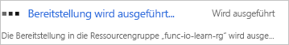
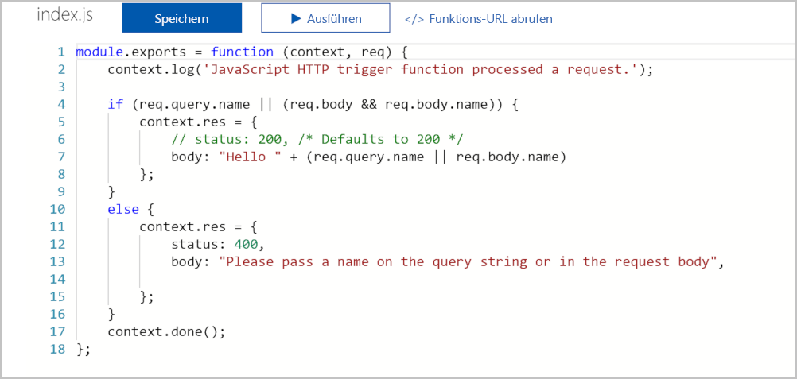
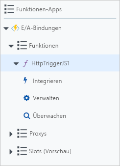
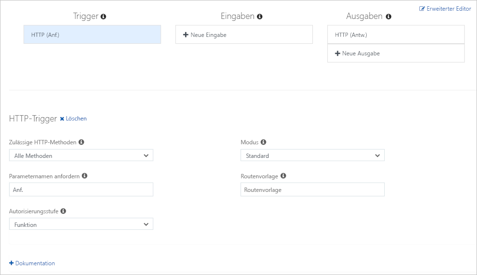
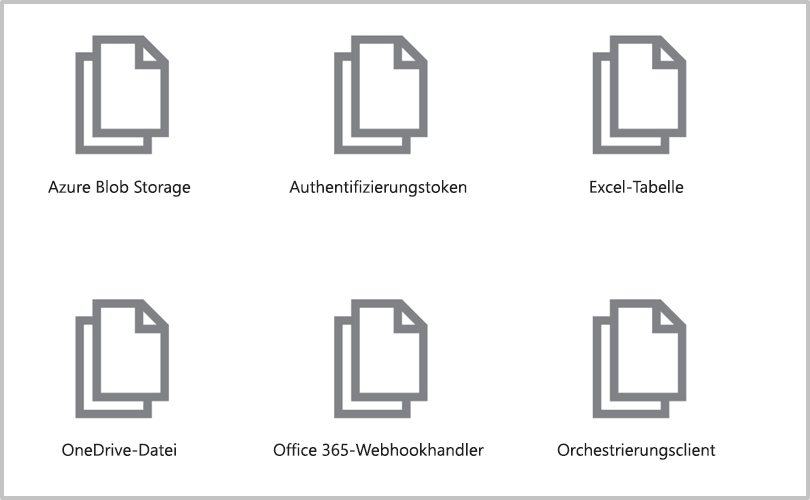
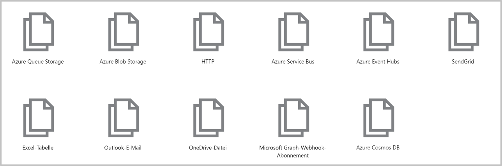

Die folgende Abbildung zeigt eine Übersicht darüber, was Sie in dieser Übung kompilieren werden.


Sie erstellen eine Funktion, die startet, sobald sie eine HTTP-Anforderung empfängt, und auf jede Anforderung mit einer Nachricht antwortet. Bei den Parametern `req` und `res` handelt es sich um die Trigger- bzw. Ausgabebindung.

[!include[](../../../includes/azure-sandbox-activate.md)]

## <a name="create-a-function-app"></a>Erstellen einer Funktions-App

Beginnen Sie mit der Erstellung einer Funktions-App, die Sie im gesamten Modul verwenden werden. Mit einer Funktions-App können Sie Funktionen in logischen Einheiten gruppieren. Dies erleichtert die Verwaltung, Bereitstellung und Freigabe von Ressourcen.

1. Melden Sie sich beim [Azure-Portal](https://portal.azure.com/learn.docs.microsoft.com?azure-portal=true) mit dem Konto an, über das Sie die Sandbox aktiviert haben.

1. Klicken Sie links oben im Azure-Portal auf die Schaltfläche **Ressource erstellen** und dann auf **Compute** > **Funktions-App**.

1. Legen Sie die Funktions-App-Eigenschaften wie folgt fest:

    | Eigenschaft     | Empfohlener Wert  | Beschreibung  |
    |--------------|------------------|--------------|
    | **App-Name** | Global eindeutiger Name | Der Name Ihrer neuen Funktions-App. Gültige Zeichen sind `a-z`, `0-9` und `-`.  |
    | **Abonnement** | Ihr Abonnement | Das Abonnement, unter dem diese neue Funktions-App erstellt wird. |
    | **Ressourcengruppe**|  Klicken Sie auf **Vorhandene verwenden**, und wählen Sie _<rgn>[Name der Sandboxressourcengruppe]</rgn>_ aus. | Name der Ressourcengruppe, in der die Funktions-App erstellt werden soll. |
    | **Betriebssystem** | Windows | Das Betriebssystem, das die Funktions-App hostet.  |
    | **Hosting** |   Verbrauchsplan | Der Hostingplan, der definiert, wie Ihre Ressourcen der Funktionen-App zugewiesen werden Im **Verbrauchstarif „Standard“** werden Ressourcen je nach Bedarf seitens der Funktionen dynamisch hinzugefügt. Beim serverlosen Hostingmodell zahlen Sie nur die Zeit, in der Ihre Funktionen ausgeführt werden.   |
    | **Speicherkonto** |  Global eindeutiger Name |  Der Name des neuen Speicherkontos, das von Ihrer Funktions-App verwendet wird. Speicherkontonamen müssen zwischen 3 und 24 Zeichen lang sein und dürfen nur Zahlen und Kleinbuchstaben enthalten. In diesem Dialogfeld wird das Feld automatisch mit einem eindeutigen Namen gefüllt, der aus dem Namen abgeleitet wird, den Sie der App gegeben haben. Sie können aber auch einen anderen Namen oder sogar ein vorhandenes Konto verwenden. |
    | **Standort** | Treffen Sie in der Liste ein Wahl. | Wählen Sie denjenigen aus, der den nachstehend aufgeführten Standorten am nächsten ist. |

    [!include[](../../../includes/azure-sandbox-regions-first-mention-note-friendly.md)]

1. Klicken Sie auf **Erstellen**, um die Funktions-App bereitzustellen.

1. Wählen Sie oben rechts im Portal das Benachrichtigungssymbol aus. Achten Sie auf eine Meldung vom Typ **Die Bereitstellung wird ausgeführt**, die der folgenden Meldung ähnelt.

    

1. Die Bereitstellung kann einige Zeit in Anspruch nehmen. Bleiben Sie daher im Notification Hub, und warten Sie auf eine Meldung vom Typ **Die Bereitstellung war erfolgreich**, die der folgenden Meldung ähnelt.

    

 1. Sobald die Funktions-App bereitgestellt ist, wechseln Sie im Portal zu **Alle Ressourcen**. Die Funktions-App wird mit dem Typ **App Service** aufgelistet und hat den Namen, den Sie ihr gegeben haben. Wählen Sie die Funktions-App in der Liste aus, um sie zu öffnen.

    >[!TIP]
    >Wenn Sie Ihre Funktions-Apps im Portal nicht finden sollten, können Sie [im Azure-Portal Ihren Favoriten Funktions-Apps hinzufügen](https://docs.microsoft.com/azure/azure-functions/functions-how-to-use-azure-function-app-settings#favorite).

## <a name="create-a-function"></a>Erstellen einer Funktion

Nun, da Sie über eine Funktions-App verfügen, ist es an der Zeit, eine Funktion zu erstellen. Eine Funktion wird durch einen Trigger aktiviert. In diesem Modul verwenden Sie einen HTTP-Trigger.

1. Erweitern Sie die neue Funktions-App, zeigen Sie auf die Funktionssammlung, und klicken Sie dann auf die Schaltfläche „Hinzufügen“ (**+**) neben **Funktionen**. Durch diese Aktion wird der Vorgang der Funktionserstellung gestartet. Die folgende Animation veranschaulicht diese Aktion.

    

1. Wählen Sie auf der Seite **Schneller Einstieg** unter **Selbstständig einsteigen** den Eintrag **Benutzerdefinierte Funktion** aus.

1. Hier sind alle Vorlagen aufgelistet. Wählen Sie die Vorlage **HTTP-Trigger** und JavaScript als Sprache aus.

    

1. Ändern Sie auf dem Blatt **Neue Funktion** nach Wunsch den Namen, belassen Sie für **Autorisierungsebene** die Einstellung _Funktion_, und klicken Sie auf **Erstellen**.

1. Klicken Sie in Ihrer neuen Funktion rechts oben auf **</> Funktions-URL abrufen**. Wählen Sie **Standard (Funktionsschlüssel)** aus, und klicken Sie anschließend auf **Kopieren**.

1. Fügen Sie die kopierte Funktions-URL in die Adressleiste einer neuen Registerkarte Ihres Browsers ein.

1. Fügen Sie den Wert der Abfragezeichenfolge `&name=Azure` am Ende dieser URL hinzu, und drücken Sie die EINGABETASTE, um die Anforderung auszuführen. Sie sollten eine Antwort ähnlich der folgenden Antwort sehen, die von der Funktion zurückgegeben und in Ihrem Browser angezeigt wird.

    ```output
    <string xmlns="http://schemas.microsoft.com/2003/10/Serialization/">Hello Azure</string>
    ```

Wie Sie in dieser bisherigen Übung erkennen, müssen Sie beim Erstellen einer Funktion einen Triggertyp auswählen. Jede Funktion verfügt über genau einen Trigger. In diesem Beispiel verwenden Sie einen HTTP-Trigger, d.h. unsere Funktion startet, wenn sie eine HTTP-Anforderung empfängt. Die Standardimplementierung, die im folgenden Screenshot in JavaScript dargestellt ist, antwortet mit dem Wert des Parameters *name*, den sie in der Abfragezeichenfolge oder dem Textkörper der Anforderung erhalten hat. Wenn keine Zeichenfolge angegeben wurde, antwortet die Funktion mit einer Meldung, die den Aufrufer auffordert, einen Wert für den Namen anzugeben.



Der gesamte Code befindet sich im Ordner dieser Funktion in der Datei **index.js**. Sehen Sie sich kurz die andere Datei der Funktion an, die Konfigurationsdatei **function.json**. Diese Konfigurationsdaten sind in der folgenden JSON-Liste aufgeführt.

```json
{
  "disabled": false,
  "bindings": [
    {
      "authLevel": "function",
      "type": "httpTrigger",
      "direction": "in",
      "name": "req"
    },
    {
      "type": "http",
      "direction": "out",
      "name": "res"
    }
  ]
}
```

Wie Sie sehen können, verfügt diese Funktion über eine Triggerbindung namens **req** vom Typ `httpTrigger` und eine Ausgabebindung namens **res** vom Typ `HTTP`. Im vorangehenden Code für Ihre Funktion haben Sie gesehen, wie der Zugriff über den **req**-Parameter auf die Nutzlast der eingehenden HTTP-Anforderung erfolgte. Auf ähnliche Weise haben Sie eine HTTP-Antwort gesendet, indem Sie einfach den Parameter **res** festgelegt haben. Bindungen erledigen wirklich einen Großteil der harten Arbeit für uns.

>[!TIP]
>Sie können die Dateien **index.js** und **function.json** anzeigen, indem Sie auf der rechten Seite des Bereichs „Funktion“ im Azure-Portal das Menü **Dateien anzeigen** erweitern.

### <a name="explore-binding-types"></a>Erkunden von Bindungstypen

1. Beachten Sie unter dem Funktionseintrag, dass es eine ganze Reihe von Menüelementen gibt, wie im folgenden Screenshot gezeigt.

    

1. Wählen Sie das Menüelement „Integrieren“, um die Registerkarte für die Integration der Funktion zu öffnen. Wenn Sie jeden Schritt in diesem Modul ausgeführt haben, sollte die Registerkarte „Integration“ in etwa wie im folgenden Screenshot aussehen.

    

    > [!NOTE]
    > Sie haben bereits ein Trigger und eine Ausgabebindung definiert, wie in diesem Screenshot gezeigt. Sie können auch sehen, dass Sie nicht mehr als _einen_ Trigger hinzufügen können. Um den Trigger für Ihre Funktion zu ändern, müssten Sie zuerst den Trigger löschen und einen neuen erstellen. Die Abschnitte **Eingaben** und **Ausgaben** dieser Benutzeroberfläche zeigen jedoch ein Pluszeichen (+) an, um mehr Verknüpfungen hinzuzufügen, damit Sie mehr als einen Eingabewert akzeptieren und mehr als einen Ausgabewert ausgeben können.

1. Wählen Sie unter der Spalte **Eingaben** die Option **+ Neue Eingabe** aus. Eine Liste aller möglichen Eingabebindungstypen wird angezeigt, wie im folgenden Screenshot zu sehen ist.

    

   Nehmen Sie sich einen Moment Zeit, um jede dieser Eingabebindungen näher zu betrachten und darüber nachzudenken, wie Sie sie in einer Lösung einsetzen könnten. Es stehen zahlreiche Möglichkeiten zur Auswahl. Diese Liste kann sich zum jetzigen Zeitpunkt bereits geändert haben, da immer mehr Datenquellen unterstützt werden.

1. Im weiteren Verlauf des Moduls werden wir auf das Hinzufügen von Eingabebindungen zurückkommen, aber im Moment klicken Sie auf **Abbrechen**, um diese Liste zu schließen.

1. Klicken Sie unter der Spalte **Ausgaben** auf die Option **(+ Neue Ausgabe)**. Eine Liste aller möglichen Ausgabebindungstypen wird angezeigt, wie im folgenden Screenshot zu sehen ist.

    

   Wie Sie sehen, stehen Ihnen mehrere Arten von Ausgabebindungen zur Verfügung. Im weiteren Verlauf des Moduls werden wir auf das Hinzufügen von Ausgabebindungen zurückkommen, aber im Moment klicken Sie auf **Abbrechen**, um diese Liste zu schließen.

Bisher haben Sie gelernt, eine Funktions-App zu erstellen und ihr eine Funktion hinzuzufügen. Sie haben eine einfache Funktion in Aktion gesehen, die ausgeführt wird, sobald eine HTTP-Anforderung an sie gesendet wird. Darüber hinaus haben Sie sich mit der Benutzeroberfläche des Azure-Portals und den Typen von Eingabe- und Ausgabebindungen beschäftigt, die Ihren Funktionen zur Verfügung stehen. In der nächsten Einheit werden Sie eine Eingabebindung verwenden, um Text aus einer Datenbank zu lesen.