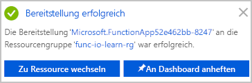

<span data-ttu-id="61427-101">Die folgende Abbildung zeigt eine Übersicht darüber, was Sie in dieser Übung kompilieren werden.</span><span class="sxs-lookup"><span data-stu-id="61427-101">The following is a high-level illustration of what we're going to build in this exercise.</span></span>


<span data-ttu-id="61427-103">Sie erstellen eine Funktion, die startet, sobald sie eine HTTP-Anforderung empfängt, und auf jede Anforderung mit einer Nachricht antwortet.</span><span class="sxs-lookup"><span data-stu-id="61427-103">We'll create a function that will start when it receives an HTTP request and will respond to each request by sending back a message.</span></span> <span data-ttu-id="61427-104">Bei den Parametern `req` und `res` handelt es sich um die Trigger- bzw. Ausgabebindung.</span><span class="sxs-lookup"><span data-stu-id="61427-104">The parameters `req` and `res` are the trigger binding and output binding, respectively.</span></span>

[!include[](../../../includes/azure-sandbox-activate.md)]

## <a name="create-a-function-app"></a><span data-ttu-id="61427-105">Erstellen einer Funktions-App</span><span class="sxs-lookup"><span data-stu-id="61427-105">Create a function app</span></span>

<span data-ttu-id="61427-106">Beginnen Sie mit der Erstellung einer Funktions-App, die Sie im gesamten Modul verwenden werden.</span><span class="sxs-lookup"><span data-stu-id="61427-106">Let's create a function app that we'll use throughout this entire module.</span></span> <span data-ttu-id="61427-107">Mit einer Funktions-App können Sie Funktionen in logischen Einheiten gruppieren. Dies erleichtert die Verwaltung, Bereitstellung und Freigabe von Ressourcen.</span><span class="sxs-lookup"><span data-stu-id="61427-107">A function app lets you group functions as a logical unit for easier management, deployment, and sharing of resources.</span></span>

1. <span data-ttu-id="61427-108">Melden Sie sich beim [Azure-Portal](https://portal.azure.com/learn.docs.microsoft.com?azure-portal=true) mit dem Konto an, über das Sie die Sandbox aktiviert haben.</span><span class="sxs-lookup"><span data-stu-id="61427-108">Sign into the [Azure portal](https://portal.azure.com/learn.docs.microsoft.com?azure-portal=true) using the same account you activated the sandbox with.</span></span>

1. <span data-ttu-id="61427-109">Klicken Sie links oben im Azure-Portal auf die Schaltfläche **Ressource erstellen** und dann auf **Compute** > **Funktions-App**.</span><span class="sxs-lookup"><span data-stu-id="61427-109">Select the **Create a resource** button found on the upper left-hand corner of the Azure portal, then select **Compute** > **Function App**.</span></span>

1. <span data-ttu-id="61427-110">Legen Sie die Funktions-App-Eigenschaften wie folgt fest:</span><span class="sxs-lookup"><span data-stu-id="61427-110">Set the function app properties as follows:</span></span>

    | <span data-ttu-id="61427-111">Eigenschaft</span><span class="sxs-lookup"><span data-stu-id="61427-111">Property</span></span>     | <span data-ttu-id="61427-112">Empfohlener Wert</span><span class="sxs-lookup"><span data-stu-id="61427-112">Suggested value</span></span>  | <span data-ttu-id="61427-113">Beschreibung</span><span class="sxs-lookup"><span data-stu-id="61427-113">Description</span></span>  |
    |--------------|------------------|--------------|
    | <span data-ttu-id="61427-114">**App-Name**</span><span class="sxs-lookup"><span data-stu-id="61427-114">**App name**</span></span> | <span data-ttu-id="61427-115">Global eindeutiger Name</span><span class="sxs-lookup"><span data-stu-id="61427-115">Globally unique name</span></span> | <span data-ttu-id="61427-116">Der Name Ihrer neuen Funktions-App.</span><span class="sxs-lookup"><span data-stu-id="61427-116">Name that identifies your new function app.</span></span> <span data-ttu-id="61427-117">Gültige Zeichen sind `a-z`, `0-9` und `-`.</span><span class="sxs-lookup"><span data-stu-id="61427-117">Valid characters are `a-z`, `0-9`, and `-`.</span></span>  |
    | <span data-ttu-id="61427-118">**Abonnement**</span><span class="sxs-lookup"><span data-stu-id="61427-118">**Subscription**</span></span> | <span data-ttu-id="61427-119">Ihr Abonnement</span><span class="sxs-lookup"><span data-stu-id="61427-119">Your subscription</span></span> | <span data-ttu-id="61427-120">Das Abonnement, unter dem diese neue Funktions-App erstellt wird.</span><span class="sxs-lookup"><span data-stu-id="61427-120">The subscription under which this new function app is created.</span></span> |
    | <span data-ttu-id="61427-121">**Ressourcengruppe**</span><span class="sxs-lookup"><span data-stu-id="61427-121">**Resource Group**</span></span>|  <span data-ttu-id="61427-122">Klicken Sie auf **Vorhandene verwenden**, und wählen Sie _<rgn>[Name der Sandboxressourcengruppe]</rgn>_ aus.</span><span class="sxs-lookup"><span data-stu-id="61427-122">Select **Use existing** and choose _<rgn>[sandbox resource group name]</rgn>_</span></span> | <span data-ttu-id="61427-123">Name der Ressourcengruppe, in der die Funktions-App erstellt werden soll.</span><span class="sxs-lookup"><span data-stu-id="61427-123">Name of the resource group in which to create your function app.</span></span> |
    | <span data-ttu-id="61427-124">**Betriebssystem**</span><span class="sxs-lookup"><span data-stu-id="61427-124">**OS**</span></span> | <span data-ttu-id="61427-125">Windows</span><span class="sxs-lookup"><span data-stu-id="61427-125">Windows</span></span> | <span data-ttu-id="61427-126">Das Betriebssystem, das die Funktions-App hostet.</span><span class="sxs-lookup"><span data-stu-id="61427-126">The operating system that hosts the function app.</span></span>  |
    | <span data-ttu-id="61427-127">**Hostingplan**</span><span class="sxs-lookup"><span data-stu-id="61427-127">**Hosting Plan**</span></span> |   <span data-ttu-id="61427-128">Verbrauchsplan</span><span class="sxs-lookup"><span data-stu-id="61427-128">Consumption plan</span></span> | <span data-ttu-id="61427-129">Der Hostingplan, der definiert, wie Ihre Ressourcen der Funktionen-App zugewiesen werden</span><span class="sxs-lookup"><span data-stu-id="61427-129">Hosting plan that defines how resources are allocated to your function app.</span></span> <span data-ttu-id="61427-130">Im **Verbrauchstarif „Standard“** werden Ressourcen je nach Bedarf seitens der Funktionen dynamisch hinzugefügt.</span><span class="sxs-lookup"><span data-stu-id="61427-130">In the default **Consumption Plan**, resources are added dynamically as required by your functions.</span></span> <span data-ttu-id="61427-131">Bei diesem serverlosen Hostingmodell zahlen Sie nur für die Zeit, in der Ihre Funktionen ausgeführt werden.</span><span class="sxs-lookup"><span data-stu-id="61427-131">In this serverless hosting model, you only pay for the time your functions run.</span></span>   |
    | <span data-ttu-id="61427-132">**Standort**</span><span class="sxs-lookup"><span data-stu-id="61427-132">**Location**</span></span> | <span data-ttu-id="61427-133">Treffen Sie eine Auswahl aus der Liste</span><span class="sxs-lookup"><span data-stu-id="61427-133">Select from the list</span></span> | <span data-ttu-id="61427-134">Wählen Sie den nächstgelegenen Standort aus, der auch zu den aufgelisteten zulässigen *Sandbox-Regionen* gehört.</span><span class="sxs-lookup"><span data-stu-id="61427-134">Choose the nearest one to you that is also one of the allowed *Sandbox regions* listed below.</span></span> |
    | <span data-ttu-id="61427-135">**Laufzeitstapel**</span><span class="sxs-lookup"><span data-stu-id="61427-135">**Runtime Stack**</span></span> | <span data-ttu-id="61427-136">JavaScript</span><span class="sxs-lookup"><span data-stu-id="61427-136">JavaScript</span></span> | <span data-ttu-id="61427-137">Der Beispielcode in diesem Modul ist in JavaScript geschrieben.</span><span class="sxs-lookup"><span data-stu-id="61427-137">The sample code in this module is written in JavaScript.</span></span>  |
    | <span data-ttu-id="61427-138">**Speicher**</span><span class="sxs-lookup"><span data-stu-id="61427-138">**Storage**</span></span> |  <span data-ttu-id="61427-139">Global eindeutiger Name</span><span class="sxs-lookup"><span data-stu-id="61427-139">Globally unique name</span></span> |  <span data-ttu-id="61427-140">Der Name des neuen Speicherkontos, das von Ihrer Funktions-App verwendet wird.</span><span class="sxs-lookup"><span data-stu-id="61427-140">Name of the new storage account used by your function app.</span></span> <span data-ttu-id="61427-141">Speicherkontonamen müssen zwischen 3 und 24 Zeichen lang sein und dürfen nur Zahlen und Kleinbuchstaben enthalten.</span><span class="sxs-lookup"><span data-stu-id="61427-141">Storage account names must be between 3 and 24 characters in length and may contain numbers and lowercase letters only.</span></span> <span data-ttu-id="61427-142">In diesem Dialogfeld wird das Feld automatisch mit einem eindeutigen Namen gefüllt, der aus dem Namen abgeleitet wird, den Sie der App gegeben haben.</span><span class="sxs-lookup"><span data-stu-id="61427-142">This dialog populates the field with a unique name that is derived from the name you gave the app.</span></span> <span data-ttu-id="61427-143">Sie können aber auch einen anderen Namen oder sogar ein vorhandenes Konto verwenden.</span><span class="sxs-lookup"><span data-stu-id="61427-143">However, feel free to use a different name or even an existing account.</span></span> |

    ### <a name="sandbox-regions"></a><span data-ttu-id="61427-144">Sandbox-Regionen</span><span class="sxs-lookup"><span data-stu-id="61427-144">Sandbox regions</span></span>
    [!include[](../../../includes/azure-sandbox-regions-first-mention-note-friendly.md)]

1. <span data-ttu-id="61427-145">Klicken Sie auf **Erstellen**, um die Funktions-App bereitzustellen.</span><span class="sxs-lookup"><span data-stu-id="61427-145">Select **Create** to provision and deploy the function app.</span></span>

1. <span data-ttu-id="61427-146">Wählen Sie oben rechts im Portal das Benachrichtigungssymbol aus. Achten Sie auf eine Meldung vom Typ **Die Bereitstellung wird ausgeführt**, die der folgenden Meldung ähnelt.</span><span class="sxs-lookup"><span data-stu-id="61427-146">Select the Notification icon in the upper-right corner of the portal and watch for a **Deployment in progress** message similar to the following message.</span></span>

    

1. <span data-ttu-id="61427-148">Die Bereitstellung kann einige Zeit in Anspruch nehmen.</span><span class="sxs-lookup"><span data-stu-id="61427-148">Deployment can take some time.</span></span> <span data-ttu-id="61427-149">Bleiben Sie daher im Notification Hub, und warten Sie auf eine Meldung vom Typ **Die Bereitstellung war erfolgreich**, die der folgenden Meldung ähnelt.</span><span class="sxs-lookup"><span data-stu-id="61427-149">So, stay in the notification hub and  watch for a **Deployment succeeded** message similar to the following message.</span></span>

    

 1. <span data-ttu-id="61427-151">Sobald die Funktions-App bereitgestellt ist, wechseln Sie im Portal zu **Alle Ressourcen**.</span><span class="sxs-lookup"><span data-stu-id="61427-151">Once the function app is deployed, go to **All resources** in the portal.</span></span> <span data-ttu-id="61427-152">Die Funktions-App wird mit dem Typ **App Service** aufgelistet und hat den Namen, den Sie ihr gegeben haben.</span><span class="sxs-lookup"><span data-stu-id="61427-152">The function app will be listed with type **App Service** and has the name you gave it.</span></span> <span data-ttu-id="61427-153">Wählen Sie die Funktions-App in der Liste aus, um sie zu öffnen.</span><span class="sxs-lookup"><span data-stu-id="61427-153">Select the function app from the list to open it.</span></span>

    >[!TIP]
    ><span data-ttu-id="61427-154">Wenn Sie Ihre Funktions-Apps im Portal nicht finden sollten, können Sie [im Azure-Portal Ihren Favoriten Funktions-Apps hinzufügen](https://docs.microsoft.com/azure/azure-functions/functions-how-to-use-azure-function-app-settings#favorite).</span><span class="sxs-lookup"><span data-stu-id="61427-154">If you are having trouble finding your function apps in the portal, find out how to [add function apps to your favorites in the portal](https://docs.microsoft.com/azure/azure-functions/functions-how-to-use-azure-function-app-settings#favorite).</span></span>

## <a name="create-a-function"></a><span data-ttu-id="61427-155">Erstellen einer Funktion</span><span class="sxs-lookup"><span data-stu-id="61427-155">Create a function</span></span>

<span data-ttu-id="61427-156">Nun, da Sie über eine Funktions-App verfügen, ist es an der Zeit, eine Funktion zu erstellen.</span><span class="sxs-lookup"><span data-stu-id="61427-156">Now that we have a function app, it's time to create a function.</span></span> <span data-ttu-id="61427-157">Eine Funktion wird durch einen Trigger aktiviert.</span><span class="sxs-lookup"><span data-stu-id="61427-157">A function is activated through a trigger.</span></span> <span data-ttu-id="61427-158">In diesem Modul verwenden Sie einen HTTP-Trigger.</span><span class="sxs-lookup"><span data-stu-id="61427-158">In this module, we'll use an HTTP trigger.</span></span>

<!-- Start temporary fix for issue #2498. -->
> [!IMPORTANT]
> <span data-ttu-id="61427-159">Die Übungen in diesem Modul können derzeit mit Azure Functions V1 ausgeführt werden.</span><span class="sxs-lookup"><span data-stu-id="61427-159">The exercises in this module currently work with Azure Functions V1.</span></span> <span data-ttu-id="61427-160">Befolgen Sie diese Schritte sorgfältig, um sicherzustellen, dass Ihre Funktions-App die V1-Runtimeversion verwendet.</span><span class="sxs-lookup"><span data-stu-id="61427-160">Please follow these steps carefully to make sure your function app uses the V1 runtime version.</span></span> 

1. <span data-ttu-id="61427-161">Wählen Sie aus der Liste **Funktions-Apps** Ihre Funktions-App aus.</span><span class="sxs-lookup"><span data-stu-id="61427-161">Select your function app in the **Function Apps** list.</span></span>
1. <span data-ttu-id="61427-162">Wählen Sie **Plattformfeatures** aus.</span><span class="sxs-lookup"><span data-stu-id="61427-162">Select **Platform features**.</span></span>
1. <span data-ttu-id="61427-163">Wählen Sie in der Anzeige **Plattformfeatures** unter **Allgemeine Einstellungen** die **Einstellungen für Funktions-Apps** aus.</span><span class="sxs-lookup"><span data-stu-id="61427-163">In the **Platform features** screen, select **Function app settings** under **General Settings**.</span></span>
1. <span data-ttu-id="61427-164">Wählen Sie in der **Runtimeversion** den Eintrag *~1* aus.</span><span class="sxs-lookup"><span data-stu-id="61427-164">Select *~1* in the **Runtime version** .</span></span>
1. <span data-ttu-id="61427-165">Schließen Sie die **Einstellungen für Funktions-Apps**.</span><span class="sxs-lookup"><span data-stu-id="61427-165">Close **Function app settings**.</span></span>

<span data-ttu-id="61427-166">Die Funktions-App ist nun für die Verwendung der Azure Functions V1-Runtime konfiguriert.</span><span class="sxs-lookup"><span data-stu-id="61427-166">Our function app is now configured to use the Azure Functions V1 runtime.</span></span> <span data-ttu-id="61427-167">Wir können nun mit der Erstellung unserer ersten Funktion fortfahren.</span><span class="sxs-lookup"><span data-stu-id="61427-167">We can now continue to create our first function.</span></span>
<!-- End temporary fix for issue #2498. --> 
1. <span data-ttu-id="61427-168">Klicken Sie neben **Funktionen** auf die Schaltfläche „Hinzufügen“ (**+**).</span><span class="sxs-lookup"><span data-stu-id="61427-168">Select the Add (**+**) button next to **Functions**.</span></span> <span data-ttu-id="61427-169">Durch diese Aktion wird der Vorgang der Funktionserstellung gestartet.</span><span class="sxs-lookup"><span data-stu-id="61427-169">This action starts the function creation process.</span></span> 

1. <span data-ttu-id="61427-170">Wählen Sie auf der Seite **Schneller Einstieg** unter **Selbstständig einsteigen** den Eintrag **Benutzerdefinierte Funktion** aus.</span><span class="sxs-lookup"><span data-stu-id="61427-170">On the **Get started quickly** page, select **Custom function** under the **Get started on your own** section.</span></span>

1. <span data-ttu-id="61427-171">Dadurch werden alle Vorlagen aufgelistet. Wählen Sie aus der Liste die Vorlage **HTTP-Trigger** aus.</span><span class="sxs-lookup"><span data-stu-id="61427-171">This will list all the templates Select **HTTP Trigger** template from the list.</span></span>

1. <span data-ttu-id="61427-172">Ändern Sie auf dem Blatt **Neue Funktion** bei Bedarf den Namen, belassen Sie für **Autorisierungsebene** die Einstellung _Funktion_, und klicken Sie auf **Erstellen**.</span><span class="sxs-lookup"><span data-stu-id="61427-172">On the **New Function** blade, change the name if you want, leave the **Authorization level** as _Function_, and click **Create**.</span></span>

1. <span data-ttu-id="61427-173">Klicken Sie in Ihrer neuen Funktion rechts oben auf **</> Funktions-URL abrufen**. Wählen Sie **Standard (Funktionsschlüssel)** aus, und klicken Sie anschließend auf **Kopieren**.</span><span class="sxs-lookup"><span data-stu-id="61427-173">In your new function, click the **</> Get function URL** link at the top right, select **default (Function key)**, and then select **Copy**.</span></span>

1. <span data-ttu-id="61427-174">Fügen Sie die kopierte Funktions-URL in die Adressleiste einer neuen Registerkarte Ihres Browsers ein.</span><span class="sxs-lookup"><span data-stu-id="61427-174">Paste the function URL you copied into the address bar of a new tab in your browser.</span></span>

1. <span data-ttu-id="61427-175">Fügen Sie den Wert der Abfragezeichenfolge `&name=Azure` am Ende dieser URL hinzu, und drücken Sie die EINGABETASTE, um die Anforderung auszuführen.</span><span class="sxs-lookup"><span data-stu-id="61427-175">Add the query string value `&name=Azure` to the end of this URL, and then press Enter on your keyboard to execute the request.</span></span> <span data-ttu-id="61427-176">Sie sollten eine Antwort ähnlich der folgenden Antwort sehen, die von der Funktion zurückgegeben und in Ihrem Browser angezeigt wird.</span><span class="sxs-lookup"><span data-stu-id="61427-176">You should see a response similar to the following response returned by the function displayed in your browser.</span></span>

    ```output
    <string xmlns="http://schemas.microsoft.com/2003/10/Serialization/">Hello Azure</string>
    ```

<span data-ttu-id="61427-177">Wie Sie in dieser bisherigen Übung erkennen, müssen Sie beim Erstellen einer Funktion einen Triggertyp auswählen.</span><span class="sxs-lookup"><span data-stu-id="61427-177">As you can see from this exercise so far, you have to select a trigger type when you create a function.</span></span> <span data-ttu-id="61427-178">Jede Funktion verfügt über genau einen Trigger.</span><span class="sxs-lookup"><span data-stu-id="61427-178">Every function has one and only one trigger.</span></span> <span data-ttu-id="61427-179">In diesem Beispiel verwenden Sie einen HTTP-Trigger, d.h. unsere Funktion startet, wenn sie eine HTTP-Anforderung empfängt.</span><span class="sxs-lookup"><span data-stu-id="61427-179">In this example, we're using an HTTP trigger, which means that our function starts when it receives an HTTP request.</span></span> <span data-ttu-id="61427-180">Die Standardimplementierung, die im folgenden Screenshot in JavaScript dargestellt ist, antwortet mit dem Wert des Parameters *name*, den sie in der Abfragezeichenfolge oder dem Textkörper der Anforderung erhalten hat.</span><span class="sxs-lookup"><span data-stu-id="61427-180">The default implementation, shown in the following screenshot in JavaScript, responds with the value of the parameter *name* it received in the query string or body of the request.</span></span> <span data-ttu-id="61427-181">Wenn keine Zeichenfolge angegeben wurde, antwortet die Funktion mit einer Meldung, die den Aufrufer auffordert, einen Wert für den Namen anzugeben.</span><span class="sxs-lookup"><span data-stu-id="61427-181">If no string was provided, the function responds with a message that asks whomever is calling to supply a name value.</span></span>


<span data-ttu-id="61427-183">Der gesamte Code befindet sich im Ordner dieser Funktion in der Datei **index.js**.</span><span class="sxs-lookup"><span data-stu-id="61427-183">All of this code is in the **index.js** file in this function's folder.</span></span> <span data-ttu-id="61427-184">Sehen Sie sich kurz die andere Datei der Funktion an, die Konfigurationsdatei **function.json**.</span><span class="sxs-lookup"><span data-stu-id="61427-184">Let's look briefly at the function's other file, the **function.json** config file.</span></span> <span data-ttu-id="61427-185">Diese Konfigurationsdaten sind in der folgenden JSON-Liste aufgeführt.</span><span class="sxs-lookup"><span data-stu-id="61427-185">This configuration data is shown in the following JSON listing.</span></span>

```json
{
  "disabled": false,
  "bindings": [
    {
      "authLevel": "function",
      "type": "httpTrigger",
      "direction": "in",
      "name": "req"
    },
    {
      "type": "http",
      "direction": "out",
      "name": "res"
    }
  ]
}
```

<span data-ttu-id="61427-186">Wie Sie sehen können, verfügt diese Funktion über eine Triggerbindung namens **req** vom Typ `httpTrigger` und eine Ausgabebindung namens **res** vom Typ `HTTP`.</span><span class="sxs-lookup"><span data-stu-id="61427-186">As you can see, this function has a trigger binding named **req** of type `httpTrigger` and an output binding named **res**  of type `HTTP`.</span></span> <span data-ttu-id="61427-187">Im vorangehenden Code für Ihre Funktion haben Sie gesehen, wie der Zugriff über den **req**-Parameter auf die Nutzlast der eingehenden HTTP-Anforderung erfolgte.</span><span class="sxs-lookup"><span data-stu-id="61427-187">In the preceding code for our function, we saw how we accessed the payload of the incoming HTTP request through our **req** parameter.</span></span> <span data-ttu-id="61427-188">Auf ähnliche Weise haben Sie eine HTTP-Antwort gesendet, indem Sie einfach den Parameter **res** festgelegt haben.</span><span class="sxs-lookup"><span data-stu-id="61427-188">Similarly, we sent an HTTP response simply by setting our **res** parameter.</span></span> <span data-ttu-id="61427-189">Bindungen erledigen wirklich einen Großteil der harten Arbeit für uns.</span><span class="sxs-lookup"><span data-stu-id="61427-189">Bindings really do take care of some of the heavy lifting for us.</span></span>

>[!TIP]
><span data-ttu-id="61427-190">Sie können die Dateien **index.js** und **function.json** anzeigen, indem Sie auf der rechten Seite des Bereichs „Funktion“ im Azure-Portal das Menü **Dateien anzeigen** erweitern.</span><span class="sxs-lookup"><span data-stu-id="61427-190">You can see the **index.js** and **function.json** files by expanding the **View Files** menu at the right of the function panel in the Azure portal.</span></span>

### <a name="explore-binding-types"></a><span data-ttu-id="61427-191">Erkunden von Bindungstypen</span><span class="sxs-lookup"><span data-stu-id="61427-191">Explore binding types</span></span>

1. <span data-ttu-id="61427-192">Beachten Sie unter dem Funktionseintrag, dass es eine ganze Reihe von Menüelementen gibt, wie im folgenden Screenshot gezeigt.</span><span class="sxs-lookup"><span data-stu-id="61427-192">Notice under the function entry there is a set of menu items as shown in the following screenshot.</span></span>

    

1. <span data-ttu-id="61427-194">Wählen Sie das Menüelement „Integrieren“, um die Registerkarte für die Integration der Funktion zu öffnen.</span><span class="sxs-lookup"><span data-stu-id="61427-194">Select the Integrate menu item to open the integration tab for our function.</span></span> <span data-ttu-id="61427-195">Wenn Sie jeden Schritt in diesem Modul ausgeführt haben, sollte die Registerkarte „Integration“ in etwa wie im folgenden Screenshot aussehen.</span><span class="sxs-lookup"><span data-stu-id="61427-195">If you have been following along with this unit, the integrate tab should look very similar to the following screenshot.</span></span>

    

    > [!NOTE]
    > <span data-ttu-id="61427-197">Sie haben bereits ein Trigger und eine Ausgabebindung definiert, wie in diesem Screenshot gezeigt.</span><span class="sxs-lookup"><span data-stu-id="61427-197">We have already defined a trigger and an output binding, as shown in the screenshot.</span></span> <span data-ttu-id="61427-198">Sie können auch sehen, dass Sie nicht mehr als _einen_ Trigger hinzufügen können.</span><span class="sxs-lookup"><span data-stu-id="61427-198">You can see that we can't add more than _one_ trigger.</span></span> <span data-ttu-id="61427-199">Um den Trigger für Ihre Funktion zu ändern, müssten Sie zuerst den Trigger löschen und einen neuen erstellen.</span><span class="sxs-lookup"><span data-stu-id="61427-199">In fact, to change the trigger for our function we would have to first delete the trigger and create a new one.</span></span> <span data-ttu-id="61427-200">Die Abschnitte **Eingaben** und **Ausgaben** dieser Benutzeroberfläche zeigen jedoch ein Pluszeichen (+) an, um mehr Verknüpfungen hinzuzufügen, damit Sie mehr als einen Eingabewert akzeptieren und mehr als einen Ausgabewert ausgeben können.</span><span class="sxs-lookup"><span data-stu-id="61427-200">However, the **Inputs** and **Outputs** sections of this UI display a plus sign (+) to add more bindings so we can accept more than one input value and emit more than one output value.</span></span>

1. <span data-ttu-id="61427-201">Wählen Sie unter der Spalte **Eingaben** die Option **+ Neue Eingabe** aus.</span><span class="sxs-lookup"><span data-stu-id="61427-201">Select **+ New Input** under the **Inputs** column.</span></span> <span data-ttu-id="61427-202">Eine Liste aller möglichen Eingabebindungstypen wird angezeigt, wie im folgenden Screenshot zu sehen ist.</span><span class="sxs-lookup"><span data-stu-id="61427-202">A list of all possible input binding types is displayed as shown in the following screenshot.</span></span>

    

   <span data-ttu-id="61427-204">Nehmen Sie sich einen Moment Zeit, um jede dieser Eingabebindungen näher zu betrachten und darüber nachzudenken, wie Sie sie in einer Lösung einsetzen könnten.</span><span class="sxs-lookup"><span data-stu-id="61427-204">Take a moment to consider each of these input bindings and how you might use them in a solution.</span></span> <span data-ttu-id="61427-205">Es stehen zahlreiche Möglichkeiten zur Auswahl.</span><span class="sxs-lookup"><span data-stu-id="61427-205">There are a lot to choose from.</span></span> <span data-ttu-id="61427-206">Diese Liste kann sich zum jetzigen Zeitpunkt bereits geändert haben, da immer mehr Datenquellen unterstützt werden.</span><span class="sxs-lookup"><span data-stu-id="61427-206">This list might even have changed by the time you read this module, as we continue to support more data sources.</span></span>

1. <span data-ttu-id="61427-207">Im weiteren Verlauf des Moduls werden wir auf das Hinzufügen von Eingabebindungen zurückkommen, aber im Moment klicken Sie auf **Abbrechen**, um diese Liste zu schließen.</span><span class="sxs-lookup"><span data-stu-id="61427-207">We'll get back to adding input bindings later in the module but, for now, select **Cancel** to dismiss this list.</span></span>

1. <span data-ttu-id="61427-208">Klicken Sie unter der Spalte **Ausgaben** auf die Option **(+ Neue Ausgabe)**.</span><span class="sxs-lookup"><span data-stu-id="61427-208">Select **+ New Output** under the **Outputs** column.</span></span> <span data-ttu-id="61427-209">Eine Liste aller möglichen Ausgabebindungstypen wird angezeigt, wie im folgenden Screenshot zu sehen ist.</span><span class="sxs-lookup"><span data-stu-id="61427-209">A list of all possible output binding types is displayed as shown in the following screenshot.\\</span></span>

    

   <span data-ttu-id="61427-211">Wie Sie sehen, stehen Ihnen mehrere Arten von Ausgabebindungen zur Verfügung.</span><span class="sxs-lookup"><span data-stu-id="61427-211">As you can see, there are several output binding types at your disposal.</span></span> <span data-ttu-id="61427-212">Im weiteren Verlauf des Moduls werden wir auf das Hinzufügen von Ausgabebindungen zurückkommen, aber im Moment klicken Sie auf **Abbrechen**, um diese Liste zu schließen.</span><span class="sxs-lookup"><span data-stu-id="61427-212">We'll get back to adding output bindings later in the module but, for now, select **Cancel** to dismiss this list.</span></span>

<span data-ttu-id="61427-213">Bisher haben Sie gelernt, eine Funktions-App zu erstellen und ihr eine Funktion hinzuzufügen.</span><span class="sxs-lookup"><span data-stu-id="61427-213">So far, we've learned how to create a function app and add a function to it.</span></span> <span data-ttu-id="61427-214">Sie haben eine einfache Funktion in Aktion gesehen, die ausgeführt wird, sobald eine HTTP-Anforderung an sie gesendet wird.</span><span class="sxs-lookup"><span data-stu-id="61427-214">We've seen a simple function in action, one that runs when an HTTP request is made to it.</span></span> <span data-ttu-id="61427-215">Darüber hinaus haben Sie sich mit der Benutzeroberfläche des Azure-Portals und den Typen von Eingabe- und Ausgabebindungen beschäftigt, die Ihren Funktionen zur Verfügung stehen.</span><span class="sxs-lookup"><span data-stu-id="61427-215">We've also explored the Azure portal UI and types of input and output binding that are available to our functions.</span></span> <span data-ttu-id="61427-216">In der nächsten Einheit werden Sie eine Eingabebindung verwenden, um Text aus einer Datenbank zu lesen.</span><span class="sxs-lookup"><span data-stu-id="61427-216">In the next unit, we'll use an input binding to read text from a database.</span></span>