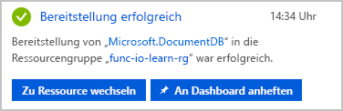
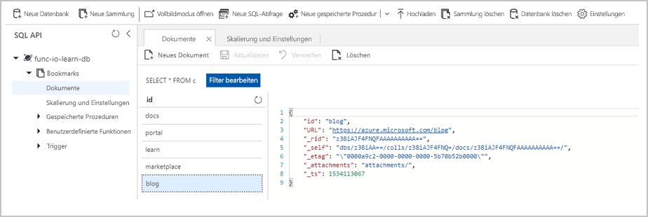

Angenommen, Sie möchten einen einfachen Bookmark Lookup-Dienst erstellen. Ihr Dienst ist anfänglich schreibgeschützt. Wenn Benutzer nach einem Eintrag suchen möchten, senden diese eine Anforderung mit der ID des Eintrags, und Sie geben die URL zurück. Das folgende Flussdiagramm verdeutlicht den Datenfluss:


Wenn Benutzer Ihnen eine Anforderung mit entsprechendem Text senden, versuchen Sie, einen Eintrag in Ihrer Back-End-Datenbank zu finden, der diesen Text als Schlüssel oder ID enthält. Sie geben ein Ergebnis zurück, das angibt, ob Sie den Eintrag gefunden haben.

Irgendwo müssen Sie die Daten speichern. In diesem Flussdiagramm wird als Datenspeicher die Azure Cosmos DB-Instanz verwendet. Aber wie stellen Sie über eine Funktion eine Verbindung mit einer Datenbank her und lesen Daten? In der Welt der Funktionen konfigurieren Sie eine *Eingabebindung* für diesen Auftrag.  Es ist einfach, eine Bindung über das Azure-Portal zu konfigurieren. Wie Sie in Kürze sehen werden, müssen Sie keinen Code für Aufgaben wie das Öffnen einer Speicherverbindung schreiben. Die Azure Functions-Runtime und -Bindungen nehmen Ihnen diese Aufgaben ab.

## <a name="create-an-azure-cosmos-db-account"></a>Erstellen eines Azure Cosmos DB-Kontos

> [!NOTE]
> Diese Einheit ist nicht als Tutorial zu Azure Cosmos DB gedacht. Falls Sie nach Abschluss dieses Moduls mehr erfahren möchten, finden Sie in einem vollständigen Lernpfad zu Cosmos DB weitere Informationen.

### <a name="create-a-database-account"></a>Erstellen eines Datenbankkontos

Ein Datenbankkonto ist ein Container für die Verwaltung mindestens einer Datenbank. Bevor wir eine Datenbank erstellen können, müssen wir ein Datenbankkonto erstellen.

1. Stellen Sie sicher, dass Sie beim [Azure-Portal](https://portal.azure.com/learn.docs.microsoft.com?azure-portal=true) mit dem gleichen Konto angemeldet sind, über das Sie die Sandbox aktiviert haben.

1. Klicken Sie in der oberen linken Ecke des Azure-Portals auf die Schaltfläche **Ressource erstellen** und anschließend auf **Datenbanken** > **Azure Cosmos DB**.

1. Geben Sie auf der Seite **Neues Konto** die Einstellungen für das neue Azure Cosmos DB-Konto ein.

    | Einstellung | Wert | Beschreibung |
    |---------|-------|-------------|
    | ID |*Ein eindeutiger Name*|Geben Sie einen eindeutigen Namen zum Identifizieren des Azure Cosmos DB-Kontos ein. Da `documents.azure.com` an die ID angefügt wird, die Sie zum Erstellen Ihres URI bereitstellen, sollten Sie eine eindeutige, aber identifizierbare ID verwenden.<br><br>Die ID darf nur Kleinbuchstaben, Zahlen und einen Bindestrich (-) enthalten, und sie muss zwischen 3 und 50 Zeichen lang sein. |
    | API |SQL|Die API bestimmt den Typ des zu erstellenden Kontos. Azure Cosmos DB stellt fünf APIs bereit, die Sie für Ihre Anwendung auswählen können: SQL (Dokumentdatenbank), Gremlin (Diagrammdatenbank), MongoDB (Dokumentdatenbank), Azure Table und Cassandra. Für jede API ist zurzeit ein separates Konto erforderlich. <br><br>Wählen Sie **SQL** aus. Zurzeit funktionieren der Azure Cosmos DB-Trigger, Eingabebindungen und Ausgabebindungen ausschließlich mit SQL- und Graph-API-Konten. |
    | Abonnement | Concierge-Abonnement | Wählen Sie das Azure-Abonnement aus, das Sie für dieses Azure Cosmos DB-Konto verwenden möchten. |
    Ressourcengruppe|Vorhandene verwenden<br><br>Wählen Sie anschließend **<rgn>[Name der Sandboxressourcengruppe]</rgn>** aus. | Wir wählen **Vorhandene verwenden** aus, weil wir alle für dieses Modul erstellten Ressourcen unter der kostenlosen Ressourcengruppe zusammenfassen möchten. |
    | Standort | Wird automatisch ausgefüllt, sobald **Vorhandene verwenden** festgelegt wurde. | Wählen Sie den geografischen Standort aus, an dem Ihr Azure Cosmos DB-Konto gehostet werden soll. Verwenden Sie einen Standort, der Ihren Benutzern am nächsten liegt, um ihnen einen schnellen Zugriff auf die Daten zu gewähren. In diesem Lab wird der Standort für uns als der für die vorhandene Ressourcengruppe festgelegte Standort vorgegeben.|

    Belassen Sie für alle anderen Felder auf dem Blatt **Neues Konto** die Standardwerte, da wir sie in diesem Modul verwenden.  Dazu gehören **Georedundanz aktivieren**, **Multimaster aktivieren** und **Virtuelle Netzwerke**.

1. Wählen Sie **Erstellen** aus, um das Datenbankkonto bereitzustellen.

1. Die Bereitstellung kann einige Zeit in Anspruch nehmen. Warten Sie also auf die Nachricht **Die Bereitstellung war erfolgreich.** im Notification Hub, bevor Sie fortfahren.

    

1. Wählen Sie **Zu Ressource wechseln** aus, um im Portal zum Datenbankkonto zu navigieren. Wir werden als nächstes der Datenbank eine Sammlung hinzufügen.

### <a name="add-a-collection"></a>Hinzufügen einer Sammlung

In Cosmos DB enthält ein *Container* beliebige vom Benutzer generierte Entitäten. Bei SQL- und MongoDB-API-Konten ist ein Container einer *Sammlung* zugeordnet. In einer Sammlung speichern wir Dokumente.

Wir verwenden den Daten-Explorer im Azure-Portal, um eine Datenbank und eine Sammlung zu erstellen.

1. Klicken Sie auf **Daten-Explorer** > **Neue Sammlung**.

2. Geben Sie unter **Sammlung hinzufügen** die Einstellungen für die neue Sammlung ein.

    >[!TIP]
    >Der Bereich **Sammlung hinzufügen** wird ganz rechts angezeigt. Sie müssen möglicherweise nach rechts scrollen, um ihn zu sehen.

    |Einstellung|Empfohlener Wert|Beschreibung
    |---|---|---|
    |Datenbank-ID|[!INCLUDE [cosmos-db-name](./cosmos-db-name.md)]| Datenbanknamen müssen zwischen 1 und 255 Zeichen lang sein und dürfen weder /, \\, #, ? noch nachgestellte Leerzeichen enthalten.<br><br>Sie können hier einen beliebigen Namen eingeben, aber wir schlagen [!INCLUDE [cosmos-db-name](./cosmos-db-name.md)] als Namen für die neue Datenbank vor, und auf diesen Namen beziehen wir uns in dieser Einheit. |
    |Sammlungs-ID|[!INCLUDE [cosmos-coll-name](./cosmos-coll-name.md)]|Geben Sie [!INCLUDE [cosmos-coll-name](./cosmos-coll-name.md)] als Namen für die neue Sammlung ein. Für Sammlungs-IDs gelten dieselben Zeichenanforderungen wie für Datenbanknamen.|
    |Speicherkapazität| Fest (10 GB)|Verwenden Sie den Standardwert **Fest (10 GB)**. Dieser Wert gibt die Speicherkapazität der Datenbank an.|
    |Durchsatz|1000 RU|Ändern Sie den Durchsatz in 1000 Anforderungseinheiten pro Sekunde (RU/s). Die Speicherkapazität muss auf **Fest (10 GB)** festgelegt werden, damit der Durchsatz auf 400 RU/s festgelegt werden kann. Sie können die Leistung später zentral hochskalieren, wenn Sie Wartezeiten verringern möchten.|

3. Klicken Sie auf **OK**. Im Daten-Explorer werden die neue Datenbank und die neue Sammlung angezeigt. Nun verfügen wir also über eine Datenbank. In der Datenbank haben wir eine Sammlung definiert. Im nächsten Schritt fügen wir einige Daten hinzu, die auch als Dokumente bezeichnet werden.

### <a name="add-test-data"></a>Hinzufügen von Testdaten

Wir haben in unserer Datenbank eine Sammlung mit dem Namen [!INCLUDE [cosmos-coll-name](./cosmos-coll-name.md)] definiert. Wir möchten in jedem Dokument eine URL und eine ID speichern, z.B. eine Liste von Webseitenlesezeichen.

Sie fügen nun mithilfe des Daten-Explorers Daten zu Ihrer neuen Sammlung hinzu.

1. Im Daten-Explorer wird die neue Datenbank im Bereich „Sammlungen“ angezeigt. Erweitern Sie die Datenbank [!INCLUDE [cosmos-db-name](./cosmos-db-name.md)] und die Sammlung [!INCLUDE [cosmos-coll-name](./cosmos-coll-name.md)], und wählen Sie **Dokumente** und anschließend **Neues Dokument** aus.

2. Ersetzen Sie den Standardinhalt des neuen Dokuments durch den folgenden JSON-Code.

     ```json
     {
         "id": "docs",
         "URL": "https://docs.microsoft.com/azure"
     }
     ```

3. Klicken Sie auf **Speichern**, nachdem Sie den JSON-Code zur Registerkarte **Dokumente** hinzugefügt haben.

    Beachten Sie, dass mehr Eigenschaften vorhanden sind als die, die wir hinzugefügt haben. Sie beginnen alle mit einem Unterstrich (_rid, _self, _etag, _attachments, _ts). Hierbei handelt es sich um Eigenschaften, die vom System zur Verwaltung des Dokuments generiert werden.

    |Eigenschaft  |Beschreibung  |
    |---------|---------|
    | `_rid`     |     Die Ressourcen-ID ist ein eindeutiger Bezeichner, der auch gemäß dem Ressourcenstapel für das Ressourcenmodell hierarchisch ist. Sie wird intern für die Platzierung und Navigation der Dokumentressource verwendet.    |
    | `_self`     |   Der eindeutig adressierbare URI für die Ressource.      |
    | `_etag`     |   Für die Steuerung der optimistischen Nebenläufigkeit erforderlich.     |
    | `_attachments`     |  Der adressierbare Pfad für die Anlagenressource.       |
    | `_ts`     |    Der Zeitstempel der letzten Aktualisierung dieser Ressource.    |

4. Fügen Sie weitere Dokumente zur Sammlung hinzu. Erstellen Sie vier weitere Dokumente mit dem folgenden Inhalt. Vergessen Sie nicht, Ihre Arbeit zu speichern.

    ```json
    {
        "id": "portal",
        "URL": "https://portal.azure.com"
    }
    ```

    ```json
    {
        "id": "learn",
        "URL": "https://docs.microsoft.com/learn"
    }
    ```

    ```json
    {
        "id": "marketplace",
        "URL": "https://azuremarketplace.microsoft.com/marketplace/apps"
    }
    ```

    ```json
    {
        "id": "blog",
        "URL": "https://azure.microsoft.com/blog"
    }
    ```

1. Wenn Sie fertig sind, sollte Ihre Sammlung wie folgt aussehen:

    

Sie verfügen nun über einige Einträge in Ihrer Lesezeichensammlung. Das Szenario funktioniert wie folgt. Wenn z.B. eine Anforderung mit „id=docs“ eingeht, suchen Sie in Ihrer Lesezeichensammlung nach dieser ID, und geben Sie die URL `https://docs.microsoft.com/azure` zurück. Erstellen Sie nun eine Azure-Funktion, die nach Werten in dieser Sammlung sucht.

## <a name="create-your-function"></a>Erstellen Ihrer Funktion

1. Navigieren Sie zu der Funktions-App, die Sie in der vorherigen Einheit erstellt haben.

1. Klicken Sie neben **Funktionen** auf die Schaltfläche **Hinzufügen** (**+**), um den Funktionserstellungsprozess zu starten. 
   Auf der Seite werden alle unterstützten Trigger angezeigt.

1. Wählen Sie **HTTP-Trigger** aus.

1. Füllen Sie das auf der rechten Seite angezeigte Dialogfeld **Neue Funktion** mit den folgenden Werten aus.

    | Feld | Wert |
    |----------|--------|
    | Name     | [!INCLUDE [func-name-find](./func-name-find.md)] |
    | Autorisierungsstufe | **Funktion** |

1. Wählen Sie **Erstellen** aus, um Ihre Funktion zu erstellen.
    Durch diese Aktion wird die Datei *index.js* im Code-Editor geöffnet und eine Standardimplementierung der durch HTTP ausgelösten Funktion angezeigt.

### <a name="verify-the-function"></a>Überprüfen der Funktion

Sie können überprüfen, was wir bisher erreicht haben, indem Sie unsere neue Funktion wie folgt testen:

1. Klicken Sie in Ihrer neuen Funktion rechts oben auf **Abrufen der Funktions-URL**, wählen Sie **default (Function key)** (Standard (Funktionsschlüssel)) aus, und klicken Sie anschließend auf **Kopieren**.

1. Fügen Sie die kopierte Funktions-URL in die Adressleiste Ihres Browsers ein. Fügen Sie den Wert der Abfragezeichenfolge `&name=<yourname>` am Ende der URL hinzu, und drücken Sie die **Eingabetaste**, um die Anforderung auszuführen. Ihnen müsste direkt im Browser eine Antwort von der Azure-Funktion angezeigt werden.

Nachdem unsere Basisfunktion nun funktioniert, sollten wir unsere Aufmerksamkeit auf das Lesen von Daten aus unserer Azure Cosmos DB oder (in unserem Szenario) unserer Sammlung [!INCLUDE [cosmos-coll-name](./cosmos-coll-name.md)] richten.

## <a name="add-an-azure-cosmos-db-input-binding"></a>Hinzufügen einer Azure Cosmos DB-Eingabebindung

Zum Lesen von Daten aus der Datenbank müssen Sie eine Eingabebindung definieren. Wie Sie sehen werden, können Sie in wenigen Schritten eine Bindung konfigurieren, die mit Ihrer Datenbank kommunizieren kann.

1. Klicken Sie im linken Bereich auf **Integrieren**, um die Registerkarte „Integration“ zu öffnen. Die von Ihnen verwendete Vorlage hat einen HTTP-Trigger und eine HTTP-Ausgabebindung für uns erstellt. Fügen Sie die neue Azure Cosmos DB-Eingabebindung nun hinzu.

2. Wählen Sie in der Spalte **Eingaben** die Option **Neue Eingabe** aus.
   Eine Liste aller möglichen Eingabebindungstypen wird angezeigt.

3. Wählen Sie in der Liste **Azure Cosmos DB** und anschließend **Auswählen** aus.
   Durch diese Aktion wird die Azure Cosmos DB-Eingabekonfigurationsseite geöffnet. Im nächsten Schritt müssen Sie eine Verbindung mit Ihrer Datenbank einrichten.

4. Klicken Sie neben dem Feld **Azure Cosmos DB-Kontoverbindung** auf **Neu**.
   Durch diese Aktion wird das Fenster **Verbindung** geöffnet, in dem bereits das **Azure Cosmos DB-Konto** und Ihr Azure-Abonnement ausgewählt sind. Sie müssen nur noch eine Datenbankkonto-ID auswählen.

5. Im Abschnitt „Datenbankkonto erstellen“ mussten Sie einen ID-Wert angeben. Suchen Sie in der Dropdownliste **Datenbankkonto** nach diesem Wert, und klicken Sie anschließend auf **Auswählen**.

6. Eine neue Verbindung mit der Datenbank wird konfiguriert und im Feld **Azure Cosmos DB-Kontoverbindung** angezeigt. Wenn Sie neugierig sind, was sich tatsächlich hinter diesem abstrakten Name verbirgt, klicken Sie auf *Wert anzeigen*, um die Verbindungszeichenfolge anzuzeigen.

Sie möchten nach einem Lesezeichen mit einer bestimmten ID suchen. Verknüpfen Sie die erhaltene ID also mit der Bindung.

7. Geben Sie im Feld **Dokument-ID (optional)** die Angabe `{id}` ein. Diese Syntax wird als *Bindungsausdruck* bezeichnet. Die Funktion wird durch eine HTTP-Anforderung ausgelöst, die eine Abfragezeichenfolge verwendet, um die zu suchende ID anzugeben. Da IDs in der Sammlung eindeutig sind, gibt die Bindung 0 (nicht gefunden) oder 1 (gefunden) Dokument(e) zurück.

8. Füllen Sie die verbleibenden Felder auf dieser Seite sorgfältig mit den Werten in der folgenden Tabelle aus. Sie können jederzeit auf das Informationssymbol rechts neben dem jeweiligen Feldnamen klicken, um weitere Informationen zum Zweck der einzelnen Felder zu erhalten.

    |Einstellung  |Wert  |Beschreibung  |
    |---------|---------|---------|
    |Dokumentparametername     |  **bookmark**       |  Der Name, der zum Identifizieren dieser Bindung in Ihrem Code verwendet wird.      |
    |Datenbankname     |  [!INCLUDE [cosmos-db-name](./cosmos-db-name.md)]       | Die Datenbank, mit der gearbeitet werden soll. Dieser Wert stellt den Datenbanknamen dar, den wir zuvor in dieser Lektion festgelegt haben.        |
    |Sammlungsname     |  [!INCLUDE [cosmos-db-name](./cosmos-coll-name.md)]        | Die Sammlung, aus der Daten gelesen werden. Diese Einstellung wurde zuvor in dieser Lektion definiert. |
    |SQL-Abfrage (optional)    |   Leer lassen       |   Wir rufen jeweils nur ein Dokument basierend auf der ID ab. Daher ist die Filterung anhand des Dokument-ID-Felds in diesem Fall besser als die Verwendung einer SQL-Abfrage. Wir könnten eine SQL-Abfrage für die Rückgabe eines Eintrags (`SELECT * from b where b.ID = {id}`) erstellen. Diese Abfrage würde tatsächlich ein Dokument zurückgeben, aber es würde in einer Dokumentsammlung zurückgegeben. Unser Code müsste eine Sammlung unnötigerweise bearbeiten. Verwenden Sie den SQL-Abfrageansatz, wenn mehrere Dokumente abgerufen werden sollen.   |
    |Partitionsschlüssel (optional)     |   Leer lassen      |  Wir können die Standardwerte übernehmen.       |

9. Klicken Sie auf **Speichern**, um alle Änderungen an dieser Bindungskonfiguration zu speichern.

Da Sie jetzt Ihre Bindung definiert haben, ist es an der Zeit, sie in Ihrer Funktion zu verwenden.

## <a name="update-function-implementation"></a>Aktualisieren der Funktionsimplementierung

1. Wählen Sie Ihre Funktion [!INCLUDE [func-name-find](./func-name-find.md)] aus, um *index.js* im Code-Editor zu öffnen. Sie haben eine Eingabebindung hinzugefügt, um aus Ihrer Datenbank zu lesen. Lassen Sie uns also die Logik so aktualisieren, dass diese Bindung verwendet wird.

2. Ersetzen Sie den gesamten Code in *index.js* durch den Code im folgenden Abschnitt, und klicken Sie auf **Speichern**.

   [!code-javascript[](../code/find-bookmark-single.js)]

Eine eingehende HTTP-Anforderung löst die Funktion aus, und ein `id`-Abfrageparameter wird an die Cosmos DB-Eingabebindung übergeben. Wenn in der Datenbank ein Dokument gefunden wird, das dieser ID entspricht, wird der Parameter `bookmark` auf das gefundene Dokument festgelegt. In diesem Fall erstellen wir eine Antwort mit dem URL-Wert, der im Lesezeichendokument gefunden wurde. Wenn kein Dokument gefunden wurde, das mit diesem Schlüssel übereinstimmt, reagieren wir mit einer Nutzlast und einem Statuscode, der dem Benutzer die schlechte Nachricht mitteilt.

## <a name="try-it-out"></a>Ausprobieren

1. Klicken Sie oben rechts auf **Funktions-URL abrufen**, wählen Sie **default (Function key)** (Standard (Funktionsschlüssel)) aus, und klicken Sie anschließend auf **Kopieren**, um die URL der Funktion zu kopieren.

2. Fügen Sie die kopierte Funktions-URL in die Adressleiste Ihres Browsers ein. Fügen Sie den Wert der Abfragezeichenfolge `&id=docs` am Ende dieser URL hinzu, und drücken Sie die Taste `Enter` auf Ihrer Tastatur, um die Anforderung auszuführen. Ihnen sollte eine Antwort angezeigt werden, die eine URL zu dieser Ressource enthält.

3. Ersetzen Sie `&id=docs` durch `&id=missing`, und beobachten Sie die Antwort.

4. Ersetzen Sie die vorherige Abfragezeichenfolge durch `&id=`, und beobachten Sie die Antwort.

    >[!TIP]
    >Sie können die Funktion auch über die Registerkarte **Test** in der Benutzeroberfläche des Funktionsportals testen. Sie können einen Abfrageparameter hinzufügen oder Anforderungstext angeben, um die gleichen Ergebnisse zu erhalten, die in den vorangegangenen Schritten beschrieben wurden.

In dieser Einheit haben wir unsere erste Eingabebindung manuell erstellt, um aus einer Azure Cosmos DB-Datenbank zu lesen. Die Menge an Code, die wir geschrieben haben, um unsere Datenbank zu durchsuchen und Daten zu lesen, war dank Bindungen nur minimal. Der größte Teil unserer Arbeit bestand im deklarativen Konfigurieren der Bindung, und die Plattform hat sich um den Rest gekümmert.

In der nächsten Einheit fügen wir zu unserer Lesezeichensammlung durch eine Azure Cosmos DB-Ausgabebindung weitere Daten hinzu.