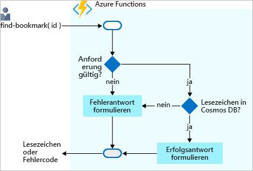

<span data-ttu-id="9939a-101">Angenommen, Sie möchten einen einfachen Bookmark Lookup-Dienst erstellen.</span><span class="sxs-lookup"><span data-stu-id="9939a-101">Imagine that you want to create a simple bookmark lookup service.</span></span> <span data-ttu-id="9939a-102">Ihr Dienst ist anfänglich schreibgeschützt.</span><span class="sxs-lookup"><span data-stu-id="9939a-102">Your service is read-only initially.</span></span> <span data-ttu-id="9939a-103">Wenn Benutzer nach einem Eintrag suchen möchten, senden diese eine Anforderung mit der ID des Eintrags, und Sie geben die URL zurück.</span><span class="sxs-lookup"><span data-stu-id="9939a-103">If users want to find an entry, they send a request with the ID of the entry and you return the URL.</span></span> <span data-ttu-id="9939a-104">Das folgende Flussdiagramm verdeutlicht den Datenfluss:</span><span class="sxs-lookup"><span data-stu-id="9939a-104">The following flowchart explains the flow:</span></span>



<span data-ttu-id="9939a-109">Wenn Benutzer Ihnen eine Anforderung mit entsprechendem Text senden, versuchen Sie, einen Eintrag in Ihrer Back-End-Datenbank zu finden, der diesen Text als Schlüssel oder ID enthält.</span><span class="sxs-lookup"><span data-stu-id="9939a-109">When users send you a request with some text, you try to find an entry in your back-end database that contains this text as a key or ID.</span></span> <span data-ttu-id="9939a-110">Sie geben ein Ergebnis zurück, das angibt, ob Sie den Eintrag gefunden haben.</span><span class="sxs-lookup"><span data-stu-id="9939a-110">You return a result that indicates whether you found the entry.</span></span>

<span data-ttu-id="9939a-111">Irgendwo müssen Sie die Daten speichern.</span><span class="sxs-lookup"><span data-stu-id="9939a-111">You need to store the data somewhere.</span></span> <span data-ttu-id="9939a-112">In diesem Flussdiagramm wird als Datenspeicher die Azure Cosmos DB-Instanz verwendet.</span><span class="sxs-lookup"><span data-stu-id="9939a-112">In this flowchart, the data store is an Azure Cosmos DB instance.</span></span> <span data-ttu-id="9939a-113">Aber wie stellen Sie über eine Funktion eine Verbindung mit einer Datenbank her und lesen Daten?</span><span class="sxs-lookup"><span data-stu-id="9939a-113">But how do you connect to a database from a function and read data?</span></span> <span data-ttu-id="9939a-114">In der Welt der Funktionen konfigurieren Sie eine *Eingabebindung* für diesen Auftrag.</span><span class="sxs-lookup"><span data-stu-id="9939a-114">In the world of functions, you configure an *input binding* for that job.</span></span>  <span data-ttu-id="9939a-115">Es ist einfach, eine Bindung über das Azure-Portal zu konfigurieren.</span><span class="sxs-lookup"><span data-stu-id="9939a-115">Configuring a binding through the Azure portal is straightforward.</span></span> <span data-ttu-id="9939a-116">Wie Sie in Kürze sehen werden, müssen Sie keinen Code für Aufgaben wie das Öffnen einer Speicherverbindung schreiben.</span><span class="sxs-lookup"><span data-stu-id="9939a-116">As you'll see shortly, you don't have to write code for such tasks as opening a storage connection.</span></span> <span data-ttu-id="9939a-117">Die Azure Functions-Runtime und -Bindungen nehmen Ihnen diese Aufgaben ab.</span><span class="sxs-lookup"><span data-stu-id="9939a-117">The Azure Functions runtime and bindings take care of those tasks for you.</span></span>

## <a name="create-an-azure-cosmos-db-account"></a><span data-ttu-id="9939a-118">Erstellen eines Azure Cosmos DB-Kontos</span><span class="sxs-lookup"><span data-stu-id="9939a-118">Create an Azure Cosmos DB account</span></span> 

> [!NOTE]
> <span data-ttu-id="9939a-119">Diese Einheit ist nicht als Tutorial zu Azure Cosmos DB gedacht.</span><span class="sxs-lookup"><span data-stu-id="9939a-119">This unit is not intended to be a tutorial on Azure Cosmos DB.</span></span> <span data-ttu-id="9939a-120">Falls Sie nach Abschluss dieses Moduls mehr erfahren möchten, finden Sie in einem vollständigen Lernpfad zu Cosmos DB weitere Informationen.</span><span class="sxs-lookup"><span data-stu-id="9939a-120">There is a complete learning path on Cosmos DB if you are interested in learning more after finishing this module.</span></span>

### <a name="create-a-database-account"></a><span data-ttu-id="9939a-121">Erstellen eines Datenbankkontos</span><span class="sxs-lookup"><span data-stu-id="9939a-121">Create a database account</span></span>

<span data-ttu-id="9939a-122">Ein Datenbankkonto ist ein Container für die Verwaltung mindestens einer Datenbank.</span><span class="sxs-lookup"><span data-stu-id="9939a-122">A database account is a container for managing one or more databases.</span></span> <span data-ttu-id="9939a-123">Bevor wir eine Datenbank erstellen können, müssen wir ein Datenbankkonto erstellen.</span><span class="sxs-lookup"><span data-stu-id="9939a-123">Before we can create a database, we need to create a database account.</span></span>

1. <span data-ttu-id="9939a-124">Stellen Sie sicher, dass Sie beim [Azure-Portal](https://portal.azure.com/triplecrownlabs.onmicrosoft.com?azure-portal=true) mit dem gleichen Konto angemeldet sind, über das Sie die Sandbox aktiviert haben.</span><span class="sxs-lookup"><span data-stu-id="9939a-124">Make sure you are signed into the [Azure portal](https://portal.azure.com/triplecrownlabs.onmicrosoft.com?azure-portal=true) using the same account you activated the sandbox with.</span></span>

1. <span data-ttu-id="9939a-125">Klicken Sie in der oberen linken Ecke des Azure-Portals auf die Schaltfläche **Ressource erstellen** und anschließend auf **Datenbanken** > **Azure Cosmos DB**.</span><span class="sxs-lookup"><span data-stu-id="9939a-125">Select the **Create a resource** button found on the upper left-hand corner of the Azure portal, then select **Databases** > **Azure Cosmos DB**.</span></span>

1. <span data-ttu-id="9939a-126">Geben Sie auf der Seite **Neues Konto** die Einstellungen für das neue Azure Cosmos DB-Konto ein.</span><span class="sxs-lookup"><span data-stu-id="9939a-126">In the **New account** page, enter the settings for the new Azure Cosmos DB account.</span></span>

    | <span data-ttu-id="9939a-127">Einstellung</span><span class="sxs-lookup"><span data-stu-id="9939a-127">Setting</span></span> | <span data-ttu-id="9939a-128">Wert</span><span class="sxs-lookup"><span data-stu-id="9939a-128">Value</span></span> | <span data-ttu-id="9939a-129">Beschreibung</span><span class="sxs-lookup"><span data-stu-id="9939a-129">Description</span></span> |
    |---------|-------|-------------|
    | <span data-ttu-id="9939a-130">ID</span><span class="sxs-lookup"><span data-stu-id="9939a-130">ID</span></span> |<span data-ttu-id="9939a-131">*Ein eindeutiger Name*</span><span class="sxs-lookup"><span data-stu-id="9939a-131">*Enter a unique name*</span></span>|<span data-ttu-id="9939a-132">Geben Sie einen eindeutigen Namen zum Identifizieren des Azure Cosmos DB-Kontos ein.</span><span class="sxs-lookup"><span data-stu-id="9939a-132">Enter a unique name to identify this Azure Cosmos DB account.</span></span> <span data-ttu-id="9939a-133">Da `documents.azure.com` an die ID angefügt wird, die Sie zum Erstellen Ihres URI bereitstellen, sollten Sie eine eindeutige, aber identifizierbare ID verwenden.</span><span class="sxs-lookup"><span data-stu-id="9939a-133">Because `documents.azure.com` is appended to the ID that you provide to create your URI, use a unique but identifiable ID.</span></span><br><br><span data-ttu-id="9939a-134">Die ID darf nur Kleinbuchstaben, Zahlen und einen Bindestrich (-) enthalten, und sie muss zwischen 3 und 50 Zeichen lang sein.</span><span class="sxs-lookup"><span data-stu-id="9939a-134">The ID can contain only lowercase letters, numbers, and the hyphen (-) character, and it must contain 3 to 50 characters.</span></span> |
    | <span data-ttu-id="9939a-135">API</span><span class="sxs-lookup"><span data-stu-id="9939a-135">API</span></span> |<span data-ttu-id="9939a-136">SQL</span><span class="sxs-lookup"><span data-stu-id="9939a-136">SQL</span></span>|<span data-ttu-id="9939a-137">Die API bestimmt den Typ des zu erstellenden Kontos.</span><span class="sxs-lookup"><span data-stu-id="9939a-137">The API determines the type of account to create.</span></span> <span data-ttu-id="9939a-138">Azure Cosmos DB stellt fünf APIs bereit, die Sie für Ihre Anwendung auswählen können: SQL (Dokumentdatenbank), Gremlin (Diagrammdatenbank), MongoDB (Dokumentdatenbank), Azure Table und Cassandra. Für jede API ist zurzeit ein separates Konto erforderlich.</span><span class="sxs-lookup"><span data-stu-id="9939a-138">Azure Cosmos DB provides five APIs to suit the needs of your application: SQL (document database), Gremlin (graph database), MongoDB (document database), Azure Table, and Cassandra, each of which currently require a separate account.</span></span> <br><br><span data-ttu-id="9939a-139">Wählen Sie **SQL** aus.</span><span class="sxs-lookup"><span data-stu-id="9939a-139">Select **SQL**.</span></span> <span data-ttu-id="9939a-140">Zurzeit funktionieren der Azure Cosmos DB-Trigger, Eingabebindungen und Ausgabebindungen ausschließlich mit SQL- und Graph-API-Konten.</span><span class="sxs-lookup"><span data-stu-id="9939a-140">At this time, the Azure Cosmos DB trigger, input bindings, and output bindings only work with SQL API and Graph API accounts.</span></span> |
    | <span data-ttu-id="9939a-141">Abonnement</span><span class="sxs-lookup"><span data-stu-id="9939a-141">Subscription</span></span> | <span data-ttu-id="9939a-142">Concierge-Abonnement</span><span class="sxs-lookup"><span data-stu-id="9939a-142">Concierge subscription</span></span> | <span data-ttu-id="9939a-143">Wählen Sie das Azure-Abonnement aus, das Sie für dieses Azure Cosmos DB-Konto verwenden möchten.</span><span class="sxs-lookup"><span data-stu-id="9939a-143">Select Azure subscription that you want to use for this Azure Cosmos DB account.</span></span> |
    <span data-ttu-id="9939a-144">Ressourcengruppe</span><span class="sxs-lookup"><span data-stu-id="9939a-144">Resource Group</span></span>|<span data-ttu-id="9939a-145">Vorhandene verwenden</span><span class="sxs-lookup"><span data-stu-id="9939a-145">Use existing</span></span><br><br><span data-ttu-id="9939a-146">Wählen Sie anschließend **<rgn>[Sandbox-Ressourcengruppenname]</rgn>** aus.</span><span class="sxs-lookup"><span data-stu-id="9939a-146">Then select **<rgn>[Sandbox resource group name]</rgn>**.</span></span> | <span data-ttu-id="9939a-147">Wir wählen **Vorhandene verwenden** aus, weil wir alle für dieses Modul erstellten Ressourcen unter der kostenlosen Ressourcengruppe zusammenfassen möchten.</span><span class="sxs-lookup"><span data-stu-id="9939a-147">We're selecting **Use existing**, because we want to group all resources created for this module under the free Sandbox resource group.</span></span> |
    | <span data-ttu-id="9939a-148">Standort</span><span class="sxs-lookup"><span data-stu-id="9939a-148">Location</span></span> | <span data-ttu-id="9939a-149">Wird automatisch ausgefüllt, sobald **Vorhandene verwenden** festgelegt wurde.</span><span class="sxs-lookup"><span data-stu-id="9939a-149">Auto-filled once **Use existing** is set.</span></span> | <span data-ttu-id="9939a-150">Wählen Sie den geografischen Standort aus, an dem Ihr Azure Cosmos DB-Konto gehostet werden soll.</span><span class="sxs-lookup"><span data-stu-id="9939a-150">Select the geographic location in which to host your Azure Cosmos DB account.</span></span> <span data-ttu-id="9939a-151">Verwenden Sie einen Standort, der Ihren Benutzern am nächsten liegt, um ihnen einen schnellen Zugriff auf die Daten zu gewähren.</span><span class="sxs-lookup"><span data-stu-id="9939a-151">Use the location that's closest to your users to give them the fastest access to the data.</span></span> <span data-ttu-id="9939a-152">In diesem Lab wird der Standort für uns als der für die vorhandene Ressourcengruppe festgelegte Standort vorgegeben.</span><span class="sxs-lookup"><span data-stu-id="9939a-152">In this lab, the location is pre-determined for us as the location set for the existing resource group.</span></span>|
    
    <span data-ttu-id="9939a-153">Belassen Sie für alle anderen Felder auf dem Blatt **Neues Konto** die Standardwerte, da wir sie in diesem Modul verwenden.</span><span class="sxs-lookup"><span data-stu-id="9939a-153">Leave all other fields in the **New account** blade at their default values because we're using them in this module.</span></span>  <span data-ttu-id="9939a-154">Dazu gehören **Georedundanz aktivieren**, **Multimaster aktivieren** und **Virtuelle Netzwerke**.</span><span class="sxs-lookup"><span data-stu-id="9939a-154">That includes **Enable geo-redundancy**, **Enable Multi Master**, **Virtual networks**.</span></span>

1. <span data-ttu-id="9939a-155">Wählen Sie **Erstellen** aus, um das Datenbankkonto bereitzustellen.</span><span class="sxs-lookup"><span data-stu-id="9939a-155">Select **Create** to provision and deploy the database account.</span></span>

1. <span data-ttu-id="9939a-156">Die Bereitstellung kann einige Zeit in Anspruch nehmen.</span><span class="sxs-lookup"><span data-stu-id="9939a-156">Deployment can take some time.</span></span> <span data-ttu-id="9939a-157">Warten Sie also auf die Nachricht **Die Bereitstellung war erfolgreich.** im Notification Hub, bevor Sie fortfahren.</span><span class="sxs-lookup"><span data-stu-id="9939a-157">So, wait for a **Deployment succeeded** message in the Notification Hub before proceeding.</span></span>

    

1. <span data-ttu-id="9939a-159">Wählen Sie **Zu Ressource wechseln** aus, um im Portal zum Datenbankkonto zu navigieren.</span><span class="sxs-lookup"><span data-stu-id="9939a-159">Select **Go to resource** to navigate to the database account in the portal.</span></span> <span data-ttu-id="9939a-160">Wir werden als nächstes der Datenbank eine Sammlung hinzufügen.</span><span class="sxs-lookup"><span data-stu-id="9939a-160">We'll add a collection to the database next.</span></span>

### <a name="add-a-collection"></a><span data-ttu-id="9939a-161">Hinzufügen einer Sammlung</span><span class="sxs-lookup"><span data-stu-id="9939a-161">Add a collection</span></span>

<span data-ttu-id="9939a-162">In Cosmos DB enthält ein *Container* beliebige vom Benutzer generierte Entitäten.</span><span class="sxs-lookup"><span data-stu-id="9939a-162">In Cosmos DB, a *container* holds arbitrary user-generated entities.</span></span> <span data-ttu-id="9939a-163">Bei SQL- und MongoDB-API-Konten ist ein Container einer *Sammlung* zugeordnet.</span><span class="sxs-lookup"><span data-stu-id="9939a-163">For SQL and MongoDB API accounts, a container maps to a *collection*.</span></span> <span data-ttu-id="9939a-164">In einer Sammlung speichern wir Dokumente.</span><span class="sxs-lookup"><span data-stu-id="9939a-164">Inside a collection, we store documents.</span></span>

<span data-ttu-id="9939a-165">Wir verwenden den Daten-Explorer im Azure-Portal, um eine Datenbank und eine Sammlung zu erstellen.</span><span class="sxs-lookup"><span data-stu-id="9939a-165">Let's use the Data Explorer tool in the Azure portal to create a database and collection.</span></span>

1. <span data-ttu-id="9939a-166">Klicken Sie auf **Daten-Explorer** > **Neue Sammlung**.</span><span class="sxs-lookup"><span data-stu-id="9939a-166">Select **Data Explorer** > **New Collection**.</span></span>

2. <span data-ttu-id="9939a-167">Geben Sie unter **Sammlung hinzufügen** die Einstellungen für die neue Sammlung ein.</span><span class="sxs-lookup"><span data-stu-id="9939a-167">Under **Add collection**, enter the settings for the new collection.</span></span>

    >[!TIP]
    ><span data-ttu-id="9939a-168">Der Bereich **Sammlung hinzufügen** wird ganz rechts angezeigt.</span><span class="sxs-lookup"><span data-stu-id="9939a-168">The **Add Collection** area is displayed on the far right.</span></span> <span data-ttu-id="9939a-169">Sie müssen möglicherweise nach rechts scrollen, um ihn zu sehen.</span><span class="sxs-lookup"><span data-stu-id="9939a-169">You may need to scroll right to see it.</span></span>

    |<span data-ttu-id="9939a-170">Einstellung</span><span class="sxs-lookup"><span data-stu-id="9939a-170">Setting</span></span>|<span data-ttu-id="9939a-171">Empfohlener Wert</span><span class="sxs-lookup"><span data-stu-id="9939a-171">Suggested value</span></span>|<span data-ttu-id="9939a-172">Beschreibung</span><span class="sxs-lookup"><span data-stu-id="9939a-172">Description</span></span>
    |---|---|---|
    |<span data-ttu-id="9939a-173">Datenbank-ID</span><span class="sxs-lookup"><span data-stu-id="9939a-173">Database ID</span></span>|[!INCLUDE [cosmos-db-name](./cosmos-db-name.md)]| <span data-ttu-id="9939a-174">Datenbanknamen müssen zwischen 1 und 255 Zeichen lang sein und dürfen weder /, \\, #, ? noch nachgestellte Leerzeichen enthalten.</span><span class="sxs-lookup"><span data-stu-id="9939a-174">Database names must contain from 1 through 255 characters, and they cannot contain /, \\, #, ?, or a trailing space.</span></span><br><br><span data-ttu-id="9939a-175">Sie können hier einen beliebigen Namen eingeben, aber wir schlagen [!INCLUDE [cosmos-db-name](./cosmos-db-name.md)] als Namen für die neue Datenbank vor, und auf diesen Namen beziehen wir uns in dieser Einheit.</span><span class="sxs-lookup"><span data-stu-id="9939a-175">You are free to enter whatever you want here, but we suggest [!INCLUDE [cosmos-db-name](./cosmos-db-name.md)] as the name for the new database, and that's what we'll refer to in this unit.</span></span> |
    |<span data-ttu-id="9939a-176">Sammlungs-ID</span><span class="sxs-lookup"><span data-stu-id="9939a-176">Collection ID</span></span>|[!INCLUDE [cosmos-coll-name](./cosmos-coll-name.md)]|<span data-ttu-id="9939a-177">Geben Sie [!INCLUDE [cosmos-coll-name](./cosmos-coll-name.md)] als Namen für die neue Sammlung ein.</span><span class="sxs-lookup"><span data-stu-id="9939a-177">Enter [!INCLUDE [cosmos-coll-name](./cosmos-coll-name.md)] as the name for our new collection.</span></span> <span data-ttu-id="9939a-178">Für Sammlungs-IDs gelten dieselben Zeichenanforderungen wie für Datenbanknamen.</span><span class="sxs-lookup"><span data-stu-id="9939a-178">Collection IDs have the same character requirements as database names.</span></span>|
    |<span data-ttu-id="9939a-179">Speicherkapazität</span><span class="sxs-lookup"><span data-stu-id="9939a-179">Storage capacity</span></span>| <span data-ttu-id="9939a-180">Fest (10 GB)</span><span class="sxs-lookup"><span data-stu-id="9939a-180">Fixed (10 GB)</span></span>|<span data-ttu-id="9939a-181">Verwenden Sie den Standardwert **Fest (10 GB)**.</span><span class="sxs-lookup"><span data-stu-id="9939a-181">Use the default value of **Fixed (10 GB)**.</span></span> <span data-ttu-id="9939a-182">Dieser Wert gibt die Speicherkapazität der Datenbank an.</span><span class="sxs-lookup"><span data-stu-id="9939a-182">This value is the storage capacity of the database.</span></span>|
    |<span data-ttu-id="9939a-183">Durchsatz</span><span class="sxs-lookup"><span data-stu-id="9939a-183">Throughput</span></span>|<span data-ttu-id="9939a-184">1000 RU</span><span class="sxs-lookup"><span data-stu-id="9939a-184">1000 RU</span></span>|<span data-ttu-id="9939a-185">Ändern Sie den Durchsatz in 1000 Anforderungseinheiten pro Sekunde (RU/s).</span><span class="sxs-lookup"><span data-stu-id="9939a-185">Change the throughput to 1000 request units per second (RU/s).</span></span> <span data-ttu-id="9939a-186">Die Speicherkapazität muss auf **Fest (10 GB)** festgelegt werden, damit der Durchsatz auf 400 RU/s festgelegt werden kann.</span><span class="sxs-lookup"><span data-stu-id="9939a-186">Storage capacity must be set to **Fixed (10 GB)** to set throughput to 400 RU/s.</span></span> <span data-ttu-id="9939a-187">Sie können die Leistung später zentral hochskalieren, wenn Sie Wartezeiten verringern möchten.</span><span class="sxs-lookup"><span data-stu-id="9939a-187">If you want to reduce latency, you can scale up the performance later.</span></span>|
        
3. <span data-ttu-id="9939a-188">Klicken Sie auf **OK**.</span><span class="sxs-lookup"><span data-stu-id="9939a-188">Click **OK**.</span></span> <span data-ttu-id="9939a-189">Im Daten-Explorer werden die neue Datenbank und die neue Sammlung angezeigt.</span><span class="sxs-lookup"><span data-stu-id="9939a-189">The Data Explorer displays the new database and collection.</span></span> <span data-ttu-id="9939a-190">Nun verfügen wir also über eine Datenbank.</span><span class="sxs-lookup"><span data-stu-id="9939a-190">So, now we have a database.</span></span> <span data-ttu-id="9939a-191">In der Datenbank haben wir eine Sammlung definiert.</span><span class="sxs-lookup"><span data-stu-id="9939a-191">Inside the database, we've defined a collection.</span></span> <span data-ttu-id="9939a-192">Im nächsten Schritt fügen wir einige Daten hinzu, die auch als Dokumente bezeichnet werden.</span><span class="sxs-lookup"><span data-stu-id="9939a-192">Next, we'll add some data, also known as documents.</span></span>

### <a name="add-test-data"></a><span data-ttu-id="9939a-193">Hinzufügen von Testdaten</span><span class="sxs-lookup"><span data-stu-id="9939a-193">Add test data</span></span>

<span data-ttu-id="9939a-194">Wir haben in unserer Datenbank eine Sammlung mit dem Namen [!INCLUDE [cosmos-coll-name](./cosmos-coll-name.md)] definiert.</span><span class="sxs-lookup"><span data-stu-id="9939a-194">We've defined a collection in our database called [!INCLUDE [cosmos-coll-name](./cosmos-coll-name.md)].</span></span> <span data-ttu-id="9939a-195">Wir möchten in jedem Dokument eine URL und eine ID speichern, z.B. eine Liste von Webseitenlesezeichen.</span><span class="sxs-lookup"><span data-stu-id="9939a-195">We want to store a URL and ID in each document, like a list of web page bookmarks.</span></span> 

<span data-ttu-id="9939a-196">Sie fügen nun mithilfe des Daten-Explorers Daten zu Ihrer neuen Sammlung hinzu.</span><span class="sxs-lookup"><span data-stu-id="9939a-196">You'll add data to your new collection using Data Explorer.</span></span>

1. <span data-ttu-id="9939a-197">Im Daten-Explorer wird die neue Datenbank im Bereich „Sammlungen“ angezeigt.</span><span class="sxs-lookup"><span data-stu-id="9939a-197">In Data Explorer, the new database appears in the Collections pane.</span></span> <span data-ttu-id="9939a-198">Erweitern Sie die Datenbank [!INCLUDE [cosmos-db-name](./cosmos-db-name.md)] und die Sammlung [!INCLUDE [cosmos-coll-name](./cosmos-coll-name.md)], und wählen Sie **Dokumente** und anschließend **Neues Dokument** aus.</span><span class="sxs-lookup"><span data-stu-id="9939a-198">Expand the [!INCLUDE [cosmos-db-name](./cosmos-db-name.md)] database, expand the [!INCLUDE [cosmos-coll-name](./cosmos-coll-name.md)] collection, select **Documents**, and then select **New Document**.</span></span>
  
2. <span data-ttu-id="9939a-199">Ersetzen Sie den Standardinhalt des neuen Dokuments durch den folgenden JSON-Code.</span><span class="sxs-lookup"><span data-stu-id="9939a-199">Replace the default content of the new document with the following JSON.</span></span>

     ```json
     {
         "id": "docs",
         "URL": "https://docs.microsoft.com/azure"
     }
     ```

3. <span data-ttu-id="9939a-200">Klicken Sie auf **Speichern**, nachdem Sie den JSON-Code zur Registerkarte **Dokumente** hinzugefügt haben.</span><span class="sxs-lookup"><span data-stu-id="9939a-200">After you've added the JSON to the **Documents** tab, select **Save**.</span></span>

    <span data-ttu-id="9939a-201">Beachten Sie, dass mehr Eigenschaften vorhanden sind als die, die wir hinzugefügt haben.</span><span class="sxs-lookup"><span data-stu-id="9939a-201">Notice that there are more properties than the ones we added.</span></span> <span data-ttu-id="9939a-202">Sie beginnen alle mit einem Unterstrich (_rid, _self, _etag, _attachments, _ts).</span><span class="sxs-lookup"><span data-stu-id="9939a-202">They all begin with an underline (_rid, _self, _etag, _attachments, _ts).</span></span> <span data-ttu-id="9939a-203">Hierbei handelt es sich um Eigenschaften, die vom System zur Verwaltung des Dokuments generiert werden.</span><span class="sxs-lookup"><span data-stu-id="9939a-203">These are properties generated by the system to help manage the document.</span></span>

    |<span data-ttu-id="9939a-204">Eigenschaft</span><span class="sxs-lookup"><span data-stu-id="9939a-204">Property</span></span>  |<span data-ttu-id="9939a-205">Beschreibung</span><span class="sxs-lookup"><span data-stu-id="9939a-205">Description</span></span>  |
    |---------|---------|
    | `_rid`     |     <span data-ttu-id="9939a-206">Die Ressourcen-ID ist ein eindeutiger Bezeichner, der auch gemäß dem Ressourcenstapel für das Ressourcenmodell hierarchisch ist.</span><span class="sxs-lookup"><span data-stu-id="9939a-206">The resource ID is a unique identifier that is also hierarchical per the resource stack on the resource model.</span></span> <span data-ttu-id="9939a-207">Sie wird intern für die Platzierung und Navigation der Dokumentressource verwendet.</span><span class="sxs-lookup"><span data-stu-id="9939a-207">It is used internally for placement and navigation of the document resource.</span></span>    |
    | `_self`     |   <span data-ttu-id="9939a-208">Der eindeutig adressierbare URI für die Ressource.</span><span class="sxs-lookup"><span data-stu-id="9939a-208">The unique addressable URI for the resource.</span></span>      |
    | `_etag`     |   <span data-ttu-id="9939a-209">Für die Steuerung der optimistischen Nebenläufigkeit erforderlich.</span><span class="sxs-lookup"><span data-stu-id="9939a-209">Required for optimistic concurrency control.</span></span>     |
    | `_attachments`     |  <span data-ttu-id="9939a-210">Der adressierbare Pfad für die Anlagenressource.</span><span class="sxs-lookup"><span data-stu-id="9939a-210">The addressable path for the attachments resource.</span></span>       |
    | `_ts`     |    <span data-ttu-id="9939a-211">Der Zeitstempel der letzten Aktualisierung dieser Ressource.</span><span class="sxs-lookup"><span data-stu-id="9939a-211">The time stamp of the last update of this resource.</span></span>    |
     
4. <span data-ttu-id="9939a-212">Fügen Sie weitere Dokumente zur Sammlung hinzu.</span><span class="sxs-lookup"><span data-stu-id="9939a-212">Let's add a few more documents into the collection.</span></span> <span data-ttu-id="9939a-213">Erstellen Sie vier weitere Dokumente mit dem folgenden Inhalt.</span><span class="sxs-lookup"><span data-stu-id="9939a-213">Create four more documents with the following content.</span></span> <span data-ttu-id="9939a-214">Vergessen Sie nicht, Ihre Arbeit zu speichern.</span><span class="sxs-lookup"><span data-stu-id="9939a-214">Remember to save your work.</span></span>

    ```json
    {
        "id": "portal",
        "URL": "https://portal.azure.com"
    }
    ```
    
    ```json
    {
        "id": "learn",
        "URL": "https://docs.microsoft.com/learn"
    }
    ```
    
    ```json
    {
        "id": "marketplace",
        "URL": "https://azuremarketplace.microsoft.com/marketplace/apps"
    }
    ```
    
    ```json
    {
        "id": "blog",
        "URL": "https://azure.microsoft.com/blog"
    }
    ```
    
1. <span data-ttu-id="9939a-215">Wenn Sie fertig sind, sollte Ihre Sammlung wie folgt aussehen:</span><span class="sxs-lookup"><span data-stu-id="9939a-215">When you've finished, your collection should look like the following:</span></span>

    
    
<span data-ttu-id="9939a-217">Sie verfügen nun über einige Einträge in Ihrer Lesezeichensammlung.</span><span class="sxs-lookup"><span data-stu-id="9939a-217">You now have a few entries in your bookmark collection.</span></span> <span data-ttu-id="9939a-218">Das Szenario funktioniert wie folgt.</span><span class="sxs-lookup"><span data-stu-id="9939a-218">Our scenario will work as follows.</span></span> <span data-ttu-id="9939a-219">Wenn z.B. eine Anforderung mit „id=docs“ eingeht, suchen Sie in Ihrer Lesezeichensammlung nach dieser ID, und geben Sie die URL `https://docs.microsoft.com/azure` zurück.</span><span class="sxs-lookup"><span data-stu-id="9939a-219">If a request arrives with, for example, "id=docs", you'll look up that ID in your bookmarks collection and return the URL `https://docs.microsoft.com/azure`.</span></span> <span data-ttu-id="9939a-220">Erstellen Sie nun eine Azure-Funktion, die nach Werten in dieser Sammlung sucht.</span><span class="sxs-lookup"><span data-stu-id="9939a-220">Let's make an Azure function that looks up values in this collection.</span></span>

## <a name="create-your-function"></a><span data-ttu-id="9939a-221">Erstellen Ihrer Funktion</span><span class="sxs-lookup"><span data-stu-id="9939a-221">Create your function</span></span>

1. <span data-ttu-id="9939a-222">Navigieren Sie zu der Funktions-App, die Sie in der vorherigen Einheit erstellt haben.</span><span class="sxs-lookup"><span data-stu-id="9939a-222">Navigate to the function app that you created in the preceding unit.</span></span>

1. <span data-ttu-id="9939a-223">Erweitern Sie Ihre Funktions-App, bewegen Sie den Cursor über die Funktionssammlung, und klicken Sie anschließend auf die Schaltfläche **Hinzufügen** (**+**) neben **Funktionen**.</span><span class="sxs-lookup"><span data-stu-id="9939a-223">Expand your function app, hover over the functions collection, and then select the **Add** (**+**) button next to **Functions**.</span></span>  
   <span data-ttu-id="9939a-224">Durch diese Aktion wird der Vorgang der Funktionserstellung gestartet.</span><span class="sxs-lookup"><span data-stu-id="9939a-224">This action starts the function creation process.</span></span> <span data-ttu-id="9939a-225">Die folgende Animation veranschaulicht die Aktion:</span><span class="sxs-lookup"><span data-stu-id="9939a-225">The following animation illustrates the action:</span></span>

   

   <span data-ttu-id="9939a-227">Auf der Seite wird der vollständige Satz der unterstützten Trigger angezeigt.</span><span class="sxs-lookup"><span data-stu-id="9939a-227">The page displays the complete set of supported triggers.</span></span> 
   
1. <span data-ttu-id="9939a-228">Wählen Sie **HTTP-Trigger** aus. Dies ist der erste Eintrag im folgenden Screenshot:</span><span class="sxs-lookup"><span data-stu-id="9939a-228">Select **HTTP trigger**, which is the first entry in the following screenshot:</span></span>

    

1. <span data-ttu-id="9939a-230">Füllen Sie das auf der rechten Seite angezeigte Dialogfeld **Neue Funktion** mit den folgenden Werten aus.</span><span class="sxs-lookup"><span data-stu-id="9939a-230">Fill out the **New Function** dialog that appears to the right using the following values.</span></span>

    | <span data-ttu-id="9939a-231">Feld</span><span class="sxs-lookup"><span data-stu-id="9939a-231">Field</span></span> | <span data-ttu-id="9939a-232">Wert</span><span class="sxs-lookup"><span data-stu-id="9939a-232">Value</span></span> |
    |----------|--------|
    | <span data-ttu-id="9939a-233">Sprache</span><span class="sxs-lookup"><span data-stu-id="9939a-233">Language</span></span> | <span data-ttu-id="9939a-234">**JavaScript**</span><span class="sxs-lookup"><span data-stu-id="9939a-234">**JavaScript**</span></span> |
    | <span data-ttu-id="9939a-235">Name</span><span class="sxs-lookup"><span data-stu-id="9939a-235">Name</span></span>     | [!INCLUDE [func-name-find](./func-name-find.md)] |
    | <span data-ttu-id="9939a-236">Autorisierungsstufe</span><span class="sxs-lookup"><span data-stu-id="9939a-236">Authorization level</span></span> | <span data-ttu-id="9939a-237">**Funktion**</span><span class="sxs-lookup"><span data-stu-id="9939a-237">**Function**</span></span> |
    
1. <span data-ttu-id="9939a-238">Wählen Sie **Erstellen** aus, um Ihre Funktion zu erstellen.</span><span class="sxs-lookup"><span data-stu-id="9939a-238">Select **Create** to create your function.</span></span>  
    <span data-ttu-id="9939a-239">Durch diese Aktion wird die Datei *index.js* im Code-Editor geöffnet und eine Standardimplementierung der durch HTTP ausgelösten Funktion angezeigt.</span><span class="sxs-lookup"><span data-stu-id="9939a-239">This action opens the *index.js* file in the code editor and displays a default implementation of the HTTP-triggered function.</span></span>

### <a name="verify-the-function"></a><span data-ttu-id="9939a-240">Überprüfen der Funktion</span><span class="sxs-lookup"><span data-stu-id="9939a-240">Verify the function</span></span>

<span data-ttu-id="9939a-241">Sie können überprüfen, was wir bisher erreicht haben, indem Sie unsere neue Funktion wie folgt testen:</span><span class="sxs-lookup"><span data-stu-id="9939a-241">You can verify what we have done so far by testing our new function as follows:</span></span>

1. <span data-ttu-id="9939a-242">Klicken Sie in Ihrer neuen Funktion rechts oben auf **Abrufen der Funktions-URL**, wählen Sie **default (Function key)** (Standard (Funktionsschlüssel)) aus, und klicken Sie anschließend auf **Kopieren**.</span><span class="sxs-lookup"><span data-stu-id="9939a-242">In your new function, click **Get function URL** at the top right, select **default (Function key)**, and then click **Copy**.</span></span>

1. <span data-ttu-id="9939a-243">Fügen Sie die kopierte Funktions-URL in die Adressleiste Ihres Browsers ein.</span><span class="sxs-lookup"><span data-stu-id="9939a-243">Paste the function URL you copied into your browser's address bar.</span></span> <span data-ttu-id="9939a-244">Fügen Sie den Wert der Abfragezeichenfolge `&name=<yourname>` am Ende der URL hinzu, und drücken Sie die **Eingabetaste**, um die Anforderung auszuführen.</span><span class="sxs-lookup"><span data-stu-id="9939a-244">Add the query string value `&name=<yourname>` to the end of the URL and press **Enter** to execute the request.</span></span> <span data-ttu-id="9939a-245">Ihnen müsste direkt im Browser eine Antwort von der Azure-Funktion angezeigt werden.</span><span class="sxs-lookup"><span data-stu-id="9939a-245">You should get a response from the Azure Function right in the browser.</span></span>  

<span data-ttu-id="9939a-246">Nachdem unsere Basisfunktion nun funktioniert, sollten wir unsere Aufmerksamkeit auf das Lesen von Daten aus unserer Azure Cosmos DB oder (in unserem Szenario) unserer Sammlung [!INCLUDE [cosmos-coll-name](./cosmos-coll-name.md)] richten.</span><span class="sxs-lookup"><span data-stu-id="9939a-246">Now that we have our bare-bones function working, let's turn our attention to reading data from our Azure Cosmos DB, or in our scenario, our [!INCLUDE [cosmos-coll-name](./cosmos-coll-name.md)] collection.</span></span>

## <a name="add-an-azure-cosmos-db-input-binding"></a><span data-ttu-id="9939a-247">Hinzufügen einer Azure Cosmos DB-Eingabebindung</span><span class="sxs-lookup"><span data-stu-id="9939a-247">Add an Azure Cosmos DB input binding</span></span>

<span data-ttu-id="9939a-248">Zum Lesen von Daten aus der Datenbank müssen Sie eine Eingabebindung definieren.</span><span class="sxs-lookup"><span data-stu-id="9939a-248">To read data from the database, you need to define an input binding.</span></span> <span data-ttu-id="9939a-249">Wie Sie sehen werden, können Sie in wenigen Schritten eine Bindung konfigurieren, die mit Ihrer Datenbank kommunizieren kann.</span><span class="sxs-lookup"><span data-stu-id="9939a-249">As you'll see, you can configure a binding that can talk to your database in just a few steps.</span></span>

1. <span data-ttu-id="9939a-250">Klicken Sie im linken Bereich auf **Integrieren**, um die Registerkarte „Integration“ zu öffnen.</span><span class="sxs-lookup"><span data-stu-id="9939a-250">Select **Integrate** in the left pane to open the integration tab.</span></span>  
   <span data-ttu-id="9939a-251">Die von Ihnen verwendete Vorlage hat einen HTTP-Trigger und eine HTTP-Ausgabebindung für uns erstellt.</span><span class="sxs-lookup"><span data-stu-id="9939a-251">The template you used created an HTTP trigger and an HTTP output binding.</span></span> <span data-ttu-id="9939a-252">Fügen Sie die neue Azure Cosmos DB-Eingabebindung nun hinzu.</span><span class="sxs-lookup"><span data-stu-id="9939a-252">Now add your new Azure Cosmos DB input binding.</span></span> 

2. <span data-ttu-id="9939a-253">Wählen Sie in der Spalte **Eingaben** die Option **Neue Eingabe** aus.</span><span class="sxs-lookup"><span data-stu-id="9939a-253">Select **New Input** in the **Inputs** column.</span></span>  
   <span data-ttu-id="9939a-254">Eine Liste aller möglichen Eingabebindungstypen wird angezeigt.</span><span class="sxs-lookup"><span data-stu-id="9939a-254">A list of all possible input binding types is displayed.</span></span>

3. <span data-ttu-id="9939a-255">Wählen Sie in der Liste **Azure Cosmos DB** und anschließend **Auswählen** aus.</span><span class="sxs-lookup"><span data-stu-id="9939a-255">In the list, select **Azure Cosmos DB**, and then select **Select**.</span></span>  
   <span data-ttu-id="9939a-256">Durch diese Aktion wird die Azure Cosmos DB-Eingabekonfigurationsseite geöffnet.</span><span class="sxs-lookup"><span data-stu-id="9939a-256">This action opens the Azure Cosmos DB input configuration page.</span></span> <span data-ttu-id="9939a-257">Im nächsten Schritt müssen Sie eine Verbindung mit Ihrer Datenbank einrichten.</span><span class="sxs-lookup"><span data-stu-id="9939a-257">Next, you'll set up a connection to your database.</span></span>

4. <span data-ttu-id="9939a-258">Klicken Sie neben dem Feld **Azure Cosmos DB-Kontoverbindung** auf **Neu**.</span><span class="sxs-lookup"><span data-stu-id="9939a-258">Next to the **Azure Cosmos DB account connection** box, select **new**.</span></span>  
   <span data-ttu-id="9939a-259">Durch diese Aktion wird das Fenster **Verbindung** geöffnet, in dem bereits das **Azure Cosmos DB-Konto** und Ihr Azure-Abonnement ausgewählt sind.</span><span class="sxs-lookup"><span data-stu-id="9939a-259">This action opens the **Connection** window, which already has **Azure Cosmos DB account** and your Azure subscription selected.</span></span> <span data-ttu-id="9939a-260">Sie müssen nur noch eine Datenbankkonto-ID auswählen.</span><span class="sxs-lookup"><span data-stu-id="9939a-260">The only thing left to do is to select a database account ID.</span></span>

5. <span data-ttu-id="9939a-261">Im Abschnitt „Datenbankkonto erstellen“ mussten Sie einen ID-Wert angeben.</span><span class="sxs-lookup"><span data-stu-id="9939a-261">In the "Create a database account" section, you had to supply an ID value.</span></span> <span data-ttu-id="9939a-262">Suchen Sie in der Dropdownliste **Datenbankkonto** nach diesem Wert, und klicken Sie anschließend auf **Auswählen**.</span><span class="sxs-lookup"><span data-stu-id="9939a-262">Find that value in the **Database Account** drop-down list, and then click **Select**.</span></span>

6. <span data-ttu-id="9939a-263">Eine neue Verbindung mit der Datenbank wird konfiguriert und im Feld **Azure Cosmos DB-Kontoverbindung** angezeigt.</span><span class="sxs-lookup"><span data-stu-id="9939a-263">A new connection to the database is configured and is shown in the **Azure Cosmos DB account connection** field.</span></span> <span data-ttu-id="9939a-264">Wenn Sie neugierig sind, was sich tatsächlich hinter diesem abstrakten Name verbirgt, klicken Sie auf *Wert anzeigen*, um die Verbindungszeichenfolge anzuzeigen.</span><span class="sxs-lookup"><span data-stu-id="9939a-264">If you're curious about what is actually behind this abstract name, click *show value* to reveal the connection string.</span></span>

<span data-ttu-id="9939a-265">Sie möchten nach einem Lesezeichen mit einer bestimmten ID suchen. Verknüpfen Sie die erhaltene ID also mit der Bindung.</span><span class="sxs-lookup"><span data-stu-id="9939a-265">You want to look up a bookmark with a specific ID, so let's tie the ID we receive to the binding.</span></span>

7. <span data-ttu-id="9939a-266">Geben Sie im Feld **Dokument-ID (optional)** die Angabe `{id}` ein.</span><span class="sxs-lookup"><span data-stu-id="9939a-266">In the **Document ID (optional)** field, enter `{id}`.</span></span> <span data-ttu-id="9939a-267">Diese Syntax wird als *Bindungsausdruck* bezeichnet.</span><span class="sxs-lookup"><span data-stu-id="9939a-267">This syntax is known as a *binding expression*.</span></span> <span data-ttu-id="9939a-268">Die Funktion wird durch eine HTTP-Anforderung ausgelöst, die eine Abfragezeichenfolge verwendet, um die zu suchende ID anzugeben.</span><span class="sxs-lookup"><span data-stu-id="9939a-268">The function is triggered by an HTTP request that uses a query string to specify the ID to look up.</span></span> <span data-ttu-id="9939a-269">Da IDs in der Sammlung eindeutig sind, gibt die Bindung 0 (nicht gefunden) oder 1 (gefunden) Dokument(e) zurück.</span><span class="sxs-lookup"><span data-stu-id="9939a-269">Since IDs are unique in our collection, the binding will return either 0 (not found) or 1 (found) documents.</span></span>

8. <span data-ttu-id="9939a-270">Füllen Sie die verbleibenden Felder auf dieser Seite sorgfältig mit den Werten in der folgenden Tabelle aus.</span><span class="sxs-lookup"><span data-stu-id="9939a-270">Carefully fill out the remaining fields on this page using the values in the following table.</span></span> <span data-ttu-id="9939a-271">Sie können jederzeit auf das Informationssymbol rechts neben dem jeweiligen Feldnamen klicken, um weitere Informationen zum Zweck der einzelnen Felder zu erhalten.</span><span class="sxs-lookup"><span data-stu-id="9939a-271">At any time, you can click on the information icon to the right of each field name to learn more about the purpose of each field.</span></span>

    |<span data-ttu-id="9939a-272">Einstellung</span><span class="sxs-lookup"><span data-stu-id="9939a-272">Setting</span></span>  |<span data-ttu-id="9939a-273">Wert</span><span class="sxs-lookup"><span data-stu-id="9939a-273">Value</span></span>  |<span data-ttu-id="9939a-274">Beschreibung</span><span class="sxs-lookup"><span data-stu-id="9939a-274">Description</span></span>  |
    |---------|---------|---------|
    |<span data-ttu-id="9939a-275">Dokumentparametername</span><span class="sxs-lookup"><span data-stu-id="9939a-275">Document parameter name</span></span>     |  <span data-ttu-id="9939a-276">**bookmark**</span><span class="sxs-lookup"><span data-stu-id="9939a-276">**bookmark**</span></span>       |  <span data-ttu-id="9939a-277">Der Name, der zum Identifizieren dieser Bindung in Ihrem Code verwendet wird.</span><span class="sxs-lookup"><span data-stu-id="9939a-277">The name used to identify this binding in your code.</span></span>      |
    |<span data-ttu-id="9939a-278">Datenbankname</span><span class="sxs-lookup"><span data-stu-id="9939a-278">Database name</span></span>     |  [!INCLUDE [cosmos-db-name](./cosmos-db-name.md)]       | <span data-ttu-id="9939a-279">Die Datenbank, mit der gearbeitet werden soll.</span><span class="sxs-lookup"><span data-stu-id="9939a-279">The database to work with.</span></span> <span data-ttu-id="9939a-280">Dieser Wert stellt den Datenbanknamen dar, den wir zuvor in dieser Lektion festgelegt haben.</span><span class="sxs-lookup"><span data-stu-id="9939a-280">This value is the database name we set earlier in this lesson.</span></span>        |
    |<span data-ttu-id="9939a-281">Sammlungsname</span><span class="sxs-lookup"><span data-stu-id="9939a-281">Collection Name</span></span>     |  [!INCLUDE [cosmos-db-name](./cosmos-coll-name.md)]        | <span data-ttu-id="9939a-282">Die Sammlung, aus der Daten gelesen werden.</span><span class="sxs-lookup"><span data-stu-id="9939a-282">The collection from which we'll read data.</span></span> <span data-ttu-id="9939a-283">Diese Einstellung wurde zuvor in dieser Lektion definiert.</span><span class="sxs-lookup"><span data-stu-id="9939a-283">This setting was defined earlier in the lesson.</span></span> |
    |<span data-ttu-id="9939a-284">SQL-Abfrage (optional)</span><span class="sxs-lookup"><span data-stu-id="9939a-284">SQL Query (optional)</span></span>    |   <span data-ttu-id="9939a-285">Leer lassen</span><span class="sxs-lookup"><span data-stu-id="9939a-285">leave blank</span></span>       |   <span data-ttu-id="9939a-286">Wir rufen jeweils nur ein Dokument basierend auf der ID ab.</span><span class="sxs-lookup"><span data-stu-id="9939a-286">We are only retrieving one document at a time based on the ID.</span></span> <span data-ttu-id="9939a-287">Daher ist die Filterung anhand des Dokument-ID-Felds in diesem Fall besser als die Verwendung einer SQL-Abfrage.</span><span class="sxs-lookup"><span data-stu-id="9939a-287">So, filtering with the Document ID field is a better than using a SQL Query in this instance.</span></span> <span data-ttu-id="9939a-288">Wir könnten eine SQL-Abfrage für die Rückgabe eines Eintrags (`SELECT * from b where b.ID = {id}`) erstellen.</span><span class="sxs-lookup"><span data-stu-id="9939a-288">We could craft a SQL Query to return one entry (`SELECT * from b where b.ID = {id}`).</span></span> <span data-ttu-id="9939a-289">Diese Abfrage würde tatsächlich ein Dokument zurückgeben, aber es würde in einer Dokumentsammlung zurückgegeben.</span><span class="sxs-lookup"><span data-stu-id="9939a-289">That query would indeed return a document, but it would return it in a document collection.</span></span> <span data-ttu-id="9939a-290">Unser Code müsste eine Sammlung unnötigerweise bearbeiten.</span><span class="sxs-lookup"><span data-stu-id="9939a-290">Our code would have to manipulate a collection unnecessarily.</span></span> <span data-ttu-id="9939a-291">Verwenden Sie den SQL-Abfrageansatz, wenn mehrere Dokumente abgerufen werden sollen.</span><span class="sxs-lookup"><span data-stu-id="9939a-291">Use the SQL Query approach when you want to get multiple documents.</span></span>   |
    |<span data-ttu-id="9939a-292">Partitionsschlüssel (optional)</span><span class="sxs-lookup"><span data-stu-id="9939a-292">Partition key (optional)</span></span>     |   <span data-ttu-id="9939a-293">Leer lassen</span><span class="sxs-lookup"><span data-stu-id="9939a-293">leave blank</span></span>      |  <span data-ttu-id="9939a-294">Wir können die Standardwerte übernehmen.</span><span class="sxs-lookup"><span data-stu-id="9939a-294">We can accept the default here.</span></span>       |
    
9. <span data-ttu-id="9939a-295">Klicken Sie auf **Speichern**, um alle Änderungen an dieser Bindungskonfiguration zu speichern.</span><span class="sxs-lookup"><span data-stu-id="9939a-295">Select **Save** to save all changes to this binding configuration.</span></span> 

<span data-ttu-id="9939a-296">Da Sie jetzt Ihre Bindung definiert haben, ist es an der Zeit, sie in Ihrer Funktion zu verwenden.</span><span class="sxs-lookup"><span data-stu-id="9939a-296">Now that you have your binding defined, it's time to use it in your function.</span></span>

## <a name="update-function-implementation"></a><span data-ttu-id="9939a-297">Aktualisieren der Funktionsimplementierung</span><span class="sxs-lookup"><span data-stu-id="9939a-297">Update function implementation</span></span>

1. <span data-ttu-id="9939a-298">Wählen Sie Ihre Funktion [!INCLUDE [func-name-find](./func-name-find.md)] aus, um *index.js* im Code-Editor zu öffnen.</span><span class="sxs-lookup"><span data-stu-id="9939a-298">Select your function, [!INCLUDE [func-name-find](./func-name-find.md)], to open *index.js* in the code editor.</span></span> <span data-ttu-id="9939a-299">Sie haben eine Eingabebindung hinzugefügt, um aus Ihrer Datenbank zu lesen. Lassen Sie uns also die Logik so aktualisieren, dass diese Bindung verwendet wird.</span><span class="sxs-lookup"><span data-stu-id="9939a-299">You've added an input binding to read from your database, so update the logic to use this binding.</span></span>

2. <span data-ttu-id="9939a-300">Ersetzen Sie den gesamten Code in *index.js* durch den Code im folgenden Abschnitt, und klicken Sie auf **Speichern**.</span><span class="sxs-lookup"><span data-stu-id="9939a-300">Replace all code in *index.js* with the code from the following snippet and hit **Save**.</span></span>

   [!code-javascript[](../code/find-bookmark-single.js)]

<span data-ttu-id="9939a-301">Eine eingehende HTTP-Anforderung löst die Funktion aus, und ein `id`-Abfrageparameter wird an die Cosmos DB-Eingabebindung übergeben.</span><span class="sxs-lookup"><span data-stu-id="9939a-301">An incoming HTTP request triggers the function, and an `id` query parameter is passed to the Cosmos DB input binding.</span></span> <span data-ttu-id="9939a-302">Wenn in der Datenbank ein Dokument gefunden wird, das dieser ID entspricht, wird der Parameter `bookmark` auf das gefundene Dokument festgelegt.</span><span class="sxs-lookup"><span data-stu-id="9939a-302">If the database finds a document that matches this ID, then the `bookmark` parameter will be set to the located document.</span></span> <span data-ttu-id="9939a-303">In diesem Fall erstellen wir eine Antwort mit dem URL-Wert, der im Lesezeichendokument gefunden wurde.</span><span class="sxs-lookup"><span data-stu-id="9939a-303">In that case, we construct a response that contains the URL value found in the bookmarked document.</span></span> <span data-ttu-id="9939a-304">Wenn kein Dokument gefunden wurde, das mit diesem Schlüssel übereinstimmt, reagieren wir mit einer Nutzlast und einem Statuscode, der dem Benutzer die schlechte Nachricht mitteilt.</span><span class="sxs-lookup"><span data-stu-id="9939a-304">If no document is found matching this key, we would respond with a payload and status code that tells the user the bad news.</span></span>

## <a name="try-it-out"></a><span data-ttu-id="9939a-305">Ausprobieren</span><span class="sxs-lookup"><span data-stu-id="9939a-305">Try it out</span></span>

1. <span data-ttu-id="9939a-306">Klicken Sie oben rechts auf **Funktions-URL abrufen**, wählen Sie **default (Function key)** (Standard (Funktionsschlüssel)) aus, und klicken Sie anschließend auf **Kopieren**, um die URL der Funktion zu kopieren.</span><span class="sxs-lookup"><span data-stu-id="9939a-306">Select **Get function URL** at the top right, select **default (Function key)**, and then select **Copy** to copy the function's URL.</span></span>

2. <span data-ttu-id="9939a-307">Fügen Sie die kopierte Funktions-URL in die Adressleiste Ihres Browsers ein.</span><span class="sxs-lookup"><span data-stu-id="9939a-307">Paste the function URL you copied into your browser's address bar.</span></span> <span data-ttu-id="9939a-308">Fügen Sie den Wert der Abfragezeichenfolge `&id=docs` am Ende dieser URL hinzu, und drücken Sie die Taste `Enter` auf Ihrer Tastatur, um die Anforderung auszuführen.</span><span class="sxs-lookup"><span data-stu-id="9939a-308">Add the query string value `&id=docs` to the end of this URL and press the `Enter` key on your keyboard to execute the request.</span></span> <span data-ttu-id="9939a-309">Ihnen sollte eine Antwort angezeigt werden, die eine URL zu dieser Ressource enthält.</span><span class="sxs-lookup"><span data-stu-id="9939a-309">You should see a response that includes a URL to that resource.</span></span>

3. <span data-ttu-id="9939a-310">Ersetzen Sie `&id=docs` durch `&id=missing`, und beobachten Sie die Antwort.</span><span class="sxs-lookup"><span data-stu-id="9939a-310">Replace `&id=docs` with `&id=missing`, and observe the response.</span></span>

4. <span data-ttu-id="9939a-311">Ersetzen Sie die vorherige Abfragezeichenfolge durch `&id=`, und beobachten Sie die Antwort.</span><span class="sxs-lookup"><span data-stu-id="9939a-311">Replace the previous query string with `&id=`, and observe the response.</span></span>

    >[!TIP]
    ><span data-ttu-id="9939a-312">Sie können die Funktion auch über die Registerkarte **Test** in der Benutzeroberfläche des Funktionsportals testen.</span><span class="sxs-lookup"><span data-stu-id="9939a-312">You can also test the function using the **Test** tab in the function portal UI.</span></span> <span data-ttu-id="9939a-313">Sie können einen Abfrageparameter hinzufügen oder Anforderungstext angeben, um die gleichen Ergebnisse zu erhalten, die in den vorangegangenen Schritten beschrieben wurden.</span><span class="sxs-lookup"><span data-stu-id="9939a-313">You can add a query parameter or supply a request body to get the same results as described in the preceding steps.</span></span>
    
<span data-ttu-id="9939a-314">In dieser Einheit haben wir unsere erste Eingabebindung manuell erstellt, um aus einer Azure Cosmos DB-Datenbank zu lesen.</span><span class="sxs-lookup"><span data-stu-id="9939a-314">In this unit, we created our first input binding manually to read from an Azure Cosmos DB database.</span></span> <span data-ttu-id="9939a-315">Die Menge an Code, die wir geschrieben haben, um unsere Datenbank zu durchsuchen und Daten zu lesen, war dank Bindungen nur minimal.</span><span class="sxs-lookup"><span data-stu-id="9939a-315">The amount of code we wrote to search our database and read data was minimal, thanks to bindings.</span></span> <span data-ttu-id="9939a-316">Der größte Teil unserer Arbeit bestand im deklarativen Konfigurieren der Bindung, und die Plattform hat sich um den Rest gekümmert.</span><span class="sxs-lookup"><span data-stu-id="9939a-316">We did most of our work configuring the binding declaratively, and the platform took care of the rest.</span></span>  

<span data-ttu-id="9939a-317">In der nächsten Einheit fügen wir zu unserer Lesezeichensammlung durch eine Azure Cosmos DB-Ausgabebindung weitere Daten hinzu.</span><span class="sxs-lookup"><span data-stu-id="9939a-317">In the next unit, we'll add more data to our bookmark collection through an Azure Cosmos DB output binding.</span></span>