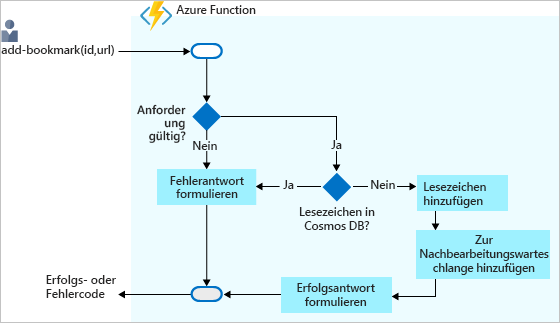

<span data-ttu-id="9ada0-101">In der letzten Übung haben Sie ein Szenario implementiert, in dem es darum ging, Lesezeichen in einer Azure Cosmos DB-Datenbank nachzuschlagen.</span><span class="sxs-lookup"><span data-stu-id="9ada0-101">In our last exercise, we implemented a scenario to look up bookmarks in an Azure Cosmos DB database.</span></span> <span data-ttu-id="9ada0-102">Dabei haben Sie eine Eingabebindung konfiguriert, um Daten aus der Lesezeichensammlung zu lesen.</span><span class="sxs-lookup"><span data-stu-id="9ada0-102">We configured an input binding to read data from our bookmarks collection.</span></span> <span data-ttu-id="9ada0-103">Wir können aber noch mehr tun.</span><span class="sxs-lookup"><span data-stu-id="9ada0-103">But, we can do more.</span></span> <span data-ttu-id="9ada0-104">Erweitern wir das Szenario um Schreiben.</span><span class="sxs-lookup"><span data-stu-id="9ada0-104">Let's expand the scenario to include writing.</span></span> <span data-ttu-id="9ada0-105">Betrachten Sie das folgende Flussdiagramm:</span><span class="sxs-lookup"><span data-stu-id="9ada0-105">Consider the following flowchart:</span></span>



<span data-ttu-id="9ada0-110">In diesem Szenario empfangen Sie Anforderungen, um Ihrer Sammlung Lesezeichen hinzuzufügen.</span><span class="sxs-lookup"><span data-stu-id="9ada0-110">In this scenario, we'll receive requests to add bookmarks to our collection.</span></span> <span data-ttu-id="9ada0-111">Die Anforderungen enthalten den gewünschten Schlüssel oder die gewünschte ID und die Lesezeichen-URL.</span><span class="sxs-lookup"><span data-stu-id="9ada0-111">The requests pass in the desired key, or ID, along with the bookmark URL.</span></span> <span data-ttu-id="9ada0-112">Wie Sie auf dem Flussdiagramm sehen können, wird ein Fehler ausgegeben, wenn der Schlüssel bereits im Back-End vorhanden ist.</span><span class="sxs-lookup"><span data-stu-id="9ada0-112">As you can see in the flowchart, we'll respond with an error if the key already exists in our back end.</span></span>

<span data-ttu-id="9ada0-113">Wenn der übergebene Schlüssel *nicht* gefunden wird, wird das neue Lesezeichen der Datenbank hinzugefügt.</span><span class="sxs-lookup"><span data-stu-id="9ada0-113">If the key that was passed to us is *not* found, we'll add the new bookmark to our database.</span></span> <span data-ttu-id="9ada0-114">Dabei könnten es Sie es an dieser Stelle theoretisch belassen, doch im Folgenden führen Sie noch einige zusätzliche Schritte aus.</span><span class="sxs-lookup"><span data-stu-id="9ada0-114">We could stop there, but let's do a little more.</span></span>

<span data-ttu-id="9ada0-115">Vielleicht ist Ihnen ein weiterer Prozess im Flussdiagramm aufgefallen.</span><span class="sxs-lookup"><span data-stu-id="9ada0-115">Notice another step in the flowchart?</span></span> <span data-ttu-id="9ada0-116">Bisher haben Sie Daten zwar empfangen, aber noch nicht verarbeitet.</span><span class="sxs-lookup"><span data-stu-id="9ada0-116">So far we haven't done much with the data that we receive in terms of processing.</span></span> <span data-ttu-id="9ada0-117">Die empfangenen Daten werden einfach in die Datenbank geschrieben.</span><span class="sxs-lookup"><span data-stu-id="9ada0-117">We move what we receive into a database.</span></span> <span data-ttu-id="9ada0-118">In einer echten Lösung würden Sie die Daten jedoch vermutlich verarbeiten.</span><span class="sxs-lookup"><span data-stu-id="9ada0-118">However, in a real solution, it is possible that we'd probably process the data in some fashion.</span></span> <span data-ttu-id="9ada0-119">Diesen Vorgang könnten Sie in ein und derselben Funktion ausführen. In dieser Aufgabe wird jedoch ein Muster vorgestellt, mit dem der weitere Verarbeitungsprozess in eine andere Komponente bzw. Geschäftslogikeinheit ausgelagert wird.</span><span class="sxs-lookup"><span data-stu-id="9ada0-119">We can decide to do all processing in the same function, but in this lab we'll show a pattern that offloads further processing to another component or piece of business logic.</span></span>

<span data-ttu-id="9ada0-120">Vermutlich fragen Sie sich, an welcher Stelle in Ihrem Lesezeichenszenario eine solche Auslagerung Sinn ergibt.</span><span class="sxs-lookup"><span data-stu-id="9ada0-120">What might be a good example of this offloading of work in our bookmarks scenario?</span></span> <span data-ttu-id="9ada0-121">Ein gutes Beispiel hierfür ist das Senden eines Lesezeichens an einen Erstellungsdienst für einen QR-Code.</span><span class="sxs-lookup"><span data-stu-id="9ada0-121">Well, what if we send the new bookmark to a QR code generation service?</span></span> <span data-ttu-id="9ada0-122">Dieser Dienst erstellt dann einen QR-Code für die URL, speichert das Bild im Blobspeicher und fügt die Adresse des QR-Bilds in den Eintrag Ihrer Lesezeichensammlung ein.</span><span class="sxs-lookup"><span data-stu-id="9ada0-122">That service would, in turn, generate a QR code for the URL, store the image in blob storage, and add the address of the QR image back into the entry in our bookmarks collection.</span></span> <span data-ttu-id="9ada0-123">Der Aufruf eines Diensts zum Erstellen eines QR-Bilds ist zeitaufwendig. Anstatt also auf das Ergebnis zu warten, lagern Sie diesen Aufruf an eine Funktion aus, die diesen Vorgang asynchron verarbeitet.</span><span class="sxs-lookup"><span data-stu-id="9ada0-123">Calling a service to generate a QR image is time consuming so, rather than wait for the result, we hand it off to a function and let it take care of this asynchronously.</span></span>

<span data-ttu-id="9ada0-124">Azure Functions unterstützt nicht nur Eingabebindungen für verschiedene Integrationsquellen, sondern verfügt auch über mehrere Vorlagen für Ausgabebindungen, mit denen Sie Daten problemlos in Datenquellen schreiben können.</span><span class="sxs-lookup"><span data-stu-id="9ada0-124">Just as Azure Functions supports input bindings for various integration sources, it also has a set of output bindings templates to make it easy for you to write data to data sources.</span></span> <span data-ttu-id="9ada0-125">Ausgabebindungen können auch in der Datei *function.json* konfiguriert werden.</span><span class="sxs-lookup"><span data-stu-id="9ada0-125">Output bindings are also configured in the *function.json* file.</span></span>  <span data-ttu-id="9ada0-126">Wie in dieser Übung noch deutlich wird, können Sie eine Funktion so konfigurieren, dass diese mit mehreren Datenquellen und Diensten zusammenarbeitet.</span><span class="sxs-lookup"><span data-stu-id="9ada0-126">As you'll see in this exercise, we can configure our function to work with multiple data sources and services.</span></span>

> [!IMPORTANT]
> <span data-ttu-id="9ada0-127">Diese Übung baut auf der vorherigen auf.</span><span class="sxs-lookup"><span data-stu-id="9ada0-127">This exercise builds on the previous one.</span></span> <span data-ttu-id="9ada0-128">Sie verwendet die gleiche Azure Cosmos DB-Datenbank und Eingabebindung.</span><span class="sxs-lookup"><span data-stu-id="9ada0-128">It uses the same Azure Cosmos DB database and input binding.</span></span> <span data-ttu-id="9ada0-129">Wenn Sie die letzte Einheit nicht durchgearbeitet haben, wird empfohlen, dass Sie diese nachholen, bevor Sie mit dieser fortfahren.</span><span class="sxs-lookup"><span data-stu-id="9ada0-129">If you haven't worked through that unit, we recommend doing so before you proceed with this one.</span></span>

## <a name="create-an-http-triggered-function"></a><span data-ttu-id="9ada0-130">Erstellen einer durch HTTP ausgelösten Funktion</span><span class="sxs-lookup"><span data-stu-id="9ada0-130">Create an HTTP-triggered function</span></span>

1. <span data-ttu-id="9ada0-131">Stellen Sie sicher, dass Sie beim [Azure-Portal](https://portal.azure.com/learn.docs.microsoft.com?azure-portal=true) mit dem gleichen Konto angemeldet sind, über das Sie die Sandbox aktiviert haben.</span><span class="sxs-lookup"><span data-stu-id="9ada0-131">Make sure you are signed into the [Azure portal](https://portal.azure.com/learn.docs.microsoft.com?azure-portal=true) using the same account you activated the sandbox with.</span></span>

2. <span data-ttu-id="9ada0-132">Navigieren Sie im Portal zu der Funktions-App, die Sie in diesem Modul erstellt haben.</span><span class="sxs-lookup"><span data-stu-id="9ada0-132">In the portal, navigate to the function app that you created in this module.</span></span>

3. <span data-ttu-id="9ada0-133">Klicken Sie neben **Funktionen** auf die Schaltfläche „Hinzufügen“ (**+**).</span><span class="sxs-lookup"><span data-stu-id="9ada0-133">Select the Add (**+**) button next to **Functions**.</span></span> <span data-ttu-id="9ada0-134">Durch diese Aktion wird der Vorgang der Funktionserstellung gestartet.</span><span class="sxs-lookup"><span data-stu-id="9ada0-134">This action starts the function creation process.</span></span> 
4. <span data-ttu-id="9ada0-135">Auf der Seite werden alle aktuell unterstützten Trigger angezeigt.</span><span class="sxs-lookup"><span data-stu-id="9ada0-135">The page shows us the current set of supported triggers.</span></span> <span data-ttu-id="9ada0-136">Wählen Sie **HTTP-Trigger** aus.</span><span class="sxs-lookup"><span data-stu-id="9ada0-136">Select **HTTP trigger**.</span></span>

5. <span data-ttu-id="9ada0-137">Füllen Sie den Bereich **Neue Funktion**, der auf der rechten Seite angezeigt wird, mit den folgenden Werten aus:</span><span class="sxs-lookup"><span data-stu-id="9ada0-137">Fill out the **New Function** pane that's displayed at the right by using the following values:</span></span>

    |<span data-ttu-id="9ada0-138">Feld</span><span class="sxs-lookup"><span data-stu-id="9ada0-138">Field</span></span>  |<span data-ttu-id="9ada0-139">Wert</span><span class="sxs-lookup"><span data-stu-id="9ada0-139">Value</span></span>  |
    |---------|---------|
    |<span data-ttu-id="9ada0-140">Name</span><span class="sxs-lookup"><span data-stu-id="9ada0-140">Name</span></span>     |   [!INCLUDE [func-name-add](./func-name-add.md)]     |
    | <span data-ttu-id="9ada0-141">Autorisierungsstufe</span><span class="sxs-lookup"><span data-stu-id="9ada0-141">Authorization level</span></span> | <span data-ttu-id="9ada0-142">**Funktion**</span><span class="sxs-lookup"><span data-stu-id="9ada0-142">**Function**</span></span> |

6. <span data-ttu-id="9ada0-143">Wählen Sie **Erstellen** aus, um Ihre Funktion zu erstellen.</span><span class="sxs-lookup"><span data-stu-id="9ada0-143">Select **Create** to create your function.</span></span> <span data-ttu-id="9ada0-144">Durch diese Aktion wird die Datei **index.js** im Code-Editor geöffnet und eine Standardimplementierung der durch HTTP ausgelösten Funktion angezeigt.</span><span class="sxs-lookup"><span data-stu-id="9ada0-144">This action opens the **index.js** file in the code editor and displays a default implementation of the HTTP-triggered function.</span></span>

    > [!NOTE]
    > <span data-ttu-id="9ada0-145">In dieser Übung nutzen Sie aus Zeitgründen den *Code* und die *Konfiguration* aus der letzten Einheit als Ausgangspunkt.</span><span class="sxs-lookup"><span data-stu-id="9ada0-145">In this exercise, we'll speed up things by using the *code* and *configuration* from the previous unit as a starting point.</span></span>

7. <span data-ttu-id="9ada0-146">Ersetzen Sie den gesamten Code in der Datei **index.js** durch den Code im folgenden Codeausschnitt. Wählen Sie anschließend **Speichern** aus, um die Änderung zu speichern:</span><span class="sxs-lookup"><span data-stu-id="9ada0-146">Replace all code in the **index.js** file with the code from the following snippet, and then select **Save** to save the change:</span></span>

   [!code-javascript[](../code/find-bookmark-single.js)]

   <span data-ttu-id="9ada0-147">Dieser Code kommt Ihnen vermutlich vertraut vor, was daran liegt, dass es sich um die Implementierung der [!INCLUDE [func-name-find](./func-name-find.md)]-Funktion handelt.</span><span class="sxs-lookup"><span data-stu-id="9ada0-147">If this code looks familiar, that's because it's the implementation of our [!INCLUDE [func-name-find](./func-name-find.md)] function.</span></span> <span data-ttu-id="9ada0-148">Wie zu erwarten, funktioniert die Funktion noch nicht, da die gleichen Bindungen erst noch definiert werden müssen.</span><span class="sxs-lookup"><span data-stu-id="9ada0-148">As you would expect, the function won't work until we define the same bindings.</span></span>

1. <span data-ttu-id="9ada0-149">Öffnen Sie die Datei **function.json** über die [!INCLUDE [func-name-add](./func-name-add.md)]-Funktion.</span><span class="sxs-lookup"><span data-stu-id="9ada0-149">Open the **function.json** file from the [!INCLUDE [func-name-add](./func-name-add.md)] function.</span></span>

11. <span data-ttu-id="9ada0-150">Ersetzen Sie den Inhalt dieser Datei durch den folgenden JSON-Code:</span><span class="sxs-lookup"><span data-stu-id="9ada0-150">Replace the contents of this file with the following JSON:</span></span>

    ```json
    {
      "bindings": [
        {
          "authLevel": "function",
          "type": "httpTrigger",
          "direction": "in",
          "name": "req"
        },
        {
          "type": "http",
          "direction": "out",
          "name": "res"
        },
        {
          "type": "documentDB",
          "name": "bookmark",
          "databaseName": "func-io-learn-db",
          "collectionName": "Bookmarks",
          "connection": "unit3test_DOCUMENTDB",
          "direction": "in",
          "id": "{id}"
        }
      ],
      "disabled": false
    }
    ```

12. <span data-ttu-id="9ada0-151">Achten Sie darauf, alle Änderungen mithilfe von **Speichern** zu speichern.</span><span class="sxs-lookup"><span data-stu-id="9ada0-151">Make sure to **Save** all changes.</span></span>

<span data-ttu-id="9ada0-152">In den vorherigen Schritten haben Sie Bindungen für die neue Funktion konfiguriert, indem Sie Bindungsdefinitionen aus einer anderen Funktion kopiert haben.</span><span class="sxs-lookup"><span data-stu-id="9ada0-152">In the preceding steps, you configured bindings for your new function by copying binding definitions from another function.</span></span> <span data-ttu-id="9ada0-153">Sie könnten eine neue Bindung natürlich auch über die Benutzeroberfläche erstellen. Es ist jedoch sinnvoll, sich bewusst zu werden, dass eine Alternative zur Verfügung steht.</span><span class="sxs-lookup"><span data-stu-id="9ada0-153">Of course, you could have created a new binding through the UI, but it is good to understand that this alternative is available to you.</span></span>

## <a name="try-it-out"></a><span data-ttu-id="9ada0-154">Ausprobieren</span><span class="sxs-lookup"><span data-stu-id="9ada0-154">Try it out</span></span>

1. <span data-ttu-id="9ada0-155">Klicken Sie oben rechts auf **Funktions-URL abrufen**, wählen Sie **default (Function key)** (Standard (Funktionsschlüssel)) aus, und klicken Sie anschließend auf **Kopieren**, um die URL der Funktion zu kopieren.</span><span class="sxs-lookup"><span data-stu-id="9ada0-155">Select **Get function URL** at the top right, select **default (Function key)**, and then select **Copy** to copy the function's URL.</span></span>

2. <span data-ttu-id="9ada0-156">Fügen Sie die kopierte URL in die Adressleiste Ihres Browsers ein.</span><span class="sxs-lookup"><span data-stu-id="9ada0-156">Paste the copied URL into your browser's address bar.</span></span> <span data-ttu-id="9ada0-157">Fügen Sie den Wert der Abfragezeichenfolge `&id=docs` am Ende der URL hinzu, und drücken Sie dann die EINGABETASTE, um die Anforderung auszuführen.</span><span class="sxs-lookup"><span data-stu-id="9ada0-157">Add the query string value `&id=docs` to the end of the URL, and then press Enter to execute the request.</span></span> <span data-ttu-id="9ada0-158">Wenn keine Fehler auftreten, sollte eine Antwort angezeigt werden, die eine URL zu dieser Ressource enthält.</span><span class="sxs-lookup"><span data-stu-id="9ada0-158">If all goes well, you should see a response that includes a URL to that resource.</span></span>

<span data-ttu-id="9ada0-159">An dieser Stelle ist es Zeit für einen kurzen Rückblick.</span><span class="sxs-lookup"><span data-stu-id="9ada0-159">So, where are we at?</span></span> <span data-ttu-id="9ada0-160">Bisher haben Sie im Wesentlichen die Schritte der letzten Übung wiederholt.</span><span class="sxs-lookup"><span data-stu-id="9ada0-160">Well, so far we've really just replicated what we did in the previous lab.</span></span> <span data-ttu-id="9ada0-161">Aber das ist in Ordnung.</span><span class="sxs-lookup"><span data-stu-id="9ada0-161">But that's okay.</span></span> <span data-ttu-id="9ada0-162">Wir kopieren die Arbeit aus der letzten Übung, um die Voraussetzungen für diese zu schaffen.</span><span class="sxs-lookup"><span data-stu-id="9ada0-162">We're copying what we did in the last lab to serve as a starting point for this one.</span></span> <span data-ttu-id="9ada0-163">Als nächstes arbeiten wir an den neuen Teilen.</span><span class="sxs-lookup"><span data-stu-id="9ada0-163">We'll work on the new stuff next.</span></span> <span data-ttu-id="9ada0-164">Das heißt, wir schreiben in unsere Datenbank.</span><span class="sxs-lookup"><span data-stu-id="9ada0-164">That is, we'll write to our database.</span></span> <span data-ttu-id="9ada0-165">Hierzu benötigen Sie eine *Ausgabebindung*.</span><span class="sxs-lookup"><span data-stu-id="9ada0-165">For that, we'll need an *output binding*.</span></span>

## <a name="define-azure-cosmos-db-output-binding"></a><span data-ttu-id="9ada0-166">Definieren einer Azure Cosmos DB-Ausgabebindung</span><span class="sxs-lookup"><span data-stu-id="9ada0-166">Define Azure Cosmos DB output binding</span></span>

<span data-ttu-id="9ada0-167">Als Nächstes definieren Sie eine neue Ausgabebindung nicht über die Benutzeroberfläche, sondern durch das manuelle Aktualisieren der Konfigurationsdatei *function.json*.</span><span class="sxs-lookup"><span data-stu-id="9ada0-167">Rather than define a new output binding by going through the user interface, you'll create this binding by updating the configuration file, *function.json*, by hand.</span></span>

1. <span data-ttu-id="9ada0-168">Achten Sie darauf, dass die Datei *function.json* für [!INCLUDE [func-name-add](./func-name-add.md)] im Editor geöffnet ist.</span><span class="sxs-lookup"><span data-stu-id="9ada0-168">Make sure the *function.json* file for [!INCLUDE [func-name-add](./func-name-add.md)] is open in the editor.</span></span>

1. <span data-ttu-id="9ada0-169">Kopieren Sie die Bindung mit dem Namen `bookmark` in diese Datei.</span><span class="sxs-lookup"><span data-stu-id="9ada0-169">Copy the binding that's named `bookmark` in that file.</span></span>

1. <span data-ttu-id="9ada0-170">Platzieren Sie den Cursor direkt nach der schließenden geschweiften Klammer (}) und unmittelbar vor der schließenden eckigen Klammer (]).</span><span class="sxs-lookup"><span data-stu-id="9ada0-170">Place your cursor directly after the closing curly bracket (}), and right before the closing square bracket (]).</span></span> <span data-ttu-id="9ada0-171">Fügen Sie ein Komma (,) hinzu, und fügen Sie dann die Kopie der Bindung hier ein.</span><span class="sxs-lookup"><span data-stu-id="9ada0-171">Add a comma (,), and then paste the copy of the binding here.</span></span> <span data-ttu-id="9ada0-172">Die Konfigurationsdatei *function.json* sollte nun wie folgt aussehen:</span><span class="sxs-lookup"><span data-stu-id="9ada0-172">Your *function.json* config file should now look like the following:</span></span>

   [!code-json[](../code/config-new-entry.json?highlight=22-31)]

1. <span data-ttu-id="9ada0-173">Bearbeiten Sie die eingefügte Bindung, indem Sie die folgenden Änderungen vornehmen:</span><span class="sxs-lookup"><span data-stu-id="9ada0-173">Edit the binding you pasted, with the following changes:</span></span>

    |<span data-ttu-id="9ada0-174">Eigenschaft</span><span class="sxs-lookup"><span data-stu-id="9ada0-174">Property</span></span>   |<span data-ttu-id="9ada0-175">Alter Wert</span><span class="sxs-lookup"><span data-stu-id="9ada0-175">Old value</span></span>  |<span data-ttu-id="9ada0-176">Neuer Wert</span><span class="sxs-lookup"><span data-stu-id="9ada0-176">New value</span></span>  |
    |---------|---------|---------|
    |<span data-ttu-id="9ada0-177">Name</span><span class="sxs-lookup"><span data-stu-id="9ada0-177">name</span></span>     |   <span data-ttu-id="9ada0-178">Lesezeichen</span><span class="sxs-lookup"><span data-stu-id="9ada0-178">bookmark</span></span>      |  <span data-ttu-id="9ada0-179">**newbookmark**</span><span class="sxs-lookup"><span data-stu-id="9ada0-179">**newbookmark**</span></span>       |
    |<span data-ttu-id="9ada0-180">direction</span><span class="sxs-lookup"><span data-stu-id="9ada0-180">direction</span></span>     |   <span data-ttu-id="9ada0-181">in</span><span class="sxs-lookup"><span data-stu-id="9ada0-181">in</span></span>      |   <span data-ttu-id="9ada0-182">**out**</span><span class="sxs-lookup"><span data-stu-id="9ada0-182">**out**</span></span>      |
    |<span data-ttu-id="9ada0-183">id</span><span class="sxs-lookup"><span data-stu-id="9ada0-183">id</span></span>     |      <span data-ttu-id="9ada0-184">{id}</span><span class="sxs-lookup"><span data-stu-id="9ada0-184">{id}</span></span>   |   <span data-ttu-id="9ada0-185">**Löschen Sie diese Eigenschaft. Sie ist für die Ausgabebindung nicht vorhanden.**</span><span class="sxs-lookup"><span data-stu-id="9ada0-185">**delete this property. It does not exist for the output binding.**</span></span>      |

1. <span data-ttu-id="9ada0-186">Nachdem Sie diese Änderungen vorgenommen haben, sieht Ihre Datei aus wie der folgende JSON-Code:</span><span class="sxs-lookup"><span data-stu-id="9ada0-186">After you've made these changes, your file looks like the following JSON:</span></span>

    [!code-json[](../code/config-q-complete.json?highlight=22-30)]

<span data-ttu-id="9ada0-187">Anhand dieses kurzen Beispiels haben Sie gesehen, wie Bindungen auch direkt in der Konfigurationsdatei erstellt werden können.</span><span class="sxs-lookup"><span data-stu-id="9ada0-187">That was just a demo of how you can also create bindings directly in the configuration file.</span></span> <span data-ttu-id="9ada0-188">In diesem Beispiel ist das sinnvoll, da Sie die Eigenschaften einer anderen Bindung wiederverwenden.</span><span class="sxs-lookup"><span data-stu-id="9ada0-188">In this example, it makes sense because you are reusing the properties from another binding.</span></span> <span data-ttu-id="9ada0-189">Das heißt, Sie verwenden die Werte von `databaseName`, `collectionName` und `connection` wieder, die Sie bereits für Ihre Azure Cosmos DB-Eingabebindung konfiguriert haben.</span><span class="sxs-lookup"><span data-stu-id="9ada0-189">That is, you're reusing the `databaseName`, `collectionName`, and `connection` that you already configured for your Azure Cosmos DB input binding.</span></span>

> [!NOTE]
> <span data-ttu-id="9ada0-190">Der tatsächliche Wert von `connection` in der obigen JSON-Datei entspricht dem Namen, der der Verbindung bei deren Erstellung zugewiesen wurde.</span><span class="sxs-lookup"><span data-stu-id="9ada0-190">The actual value of `connection` in the preceding JSON file is whatever name your connection was given when it was created.</span></span>

<span data-ttu-id="9ada0-191">Bevor Sie ihren Code aktualisieren, fügen Sie eine weitere Bindung hinzu, mit der Sie Nachrichten an die Warteschlange senden können.</span><span class="sxs-lookup"><span data-stu-id="9ada0-191">Before we update our code, let's add one more binding that will enable us to post messages to a queue.</span></span>

## <a name="define-azure-queue-storage-output-binding"></a><span data-ttu-id="9ada0-192">Definieren einer Azure Queue Storage-Ausgabebindung</span><span class="sxs-lookup"><span data-stu-id="9ada0-192">Define Azure Queue Storage output binding</span></span>

<span data-ttu-id="9ada0-193">Azure Queue Storage ist ein Dienst zur Speicherung von Nachrichten, auf die von jedem Ort der Welt aus zugegriffen werden kann.</span><span class="sxs-lookup"><span data-stu-id="9ada0-193">Azure Queue storage is a service for storing messages that can be accessed from anywhere in the world.</span></span> <span data-ttu-id="9ada0-194">Eine einzelne Nachricht kann bis zu 64 KB groß sein, und eine Warteschlange kann Millionen von Nachrichten enthalten. Die maximale Anzahl ist nur durch die Kapazität des Speicherkontos begrenzt.</span><span class="sxs-lookup"><span data-stu-id="9ada0-194">The size of a single message can be as much as 64 KB, and a queue can contain millions of messages&mdash;up to the total capacity of the storage account in which it is defined.</span></span> <span data-ttu-id="9ada0-195">Die folgende Abbildung zeigt einen allgemeinen Überblick über die Verwendung der Warteschlange in Ihrem Szenario:</span><span class="sxs-lookup"><span data-stu-id="9ada0-195">The following diagram shows at a high level how a queue is used in our scenario:</span></span>


<span data-ttu-id="9ada0-197">Deutlich wird hier, dass die neue Funktion [!INCLUDE [func-name-add](./func-name-add.md)] der Warteschlange Nachrichten hinzufügt.</span><span class="sxs-lookup"><span data-stu-id="9ada0-197">Here you can see that the new function, [!INCLUDE [func-name-add](./func-name-add.md)], adds messages to a queue.</span></span> <span data-ttu-id="9ada0-198">Eine weitere Funktion (beispielsweise eine fiktive Funktion mit dem Namen *gen-qr-code*) entfernt Nachrichten per Pop aus derselben Warteschlange und verarbeitet die Anforderung.</span><span class="sxs-lookup"><span data-stu-id="9ada0-198">Another function&mdash;for example, a fictitious function called *gen-qr-code*&mdash;will pop messages from the same queue and process the request.</span></span>  <span data-ttu-id="9ada0-199">Da Nachrichten über [!INCLUDE [func-name-add](./func-name-add.md)] in die Warteschlange geschrieben (mithilfe von *Push* übertragen) werden, fügen Sie Ihrer Lösung eine neue Ausgabebindung hinzu.</span><span class="sxs-lookup"><span data-stu-id="9ada0-199">Since we write, or *push*, messages to the queue from [!INCLUDE [func-name-add](./func-name-add.md)], we'll add a new output binding to your solution.</span></span> <span data-ttu-id="9ada0-200">Dieses Mal erstellen Sie die Bindung über die Benutzeroberfläche des Portals.</span><span class="sxs-lookup"><span data-stu-id="9ada0-200">Let's create the binding through the portal UI this time.</span></span>

1. <span data-ttu-id="9ada0-201">Wählen Sie im Funktionsmenü auf der linken Seite **Integrieren** aus, um die Registerkarte „Integration“ zu öffnen.</span><span class="sxs-lookup"><span data-stu-id="9ada0-201">Select **Integrate** in the left function menu to open the integration tab.</span></span>

2. <span data-ttu-id="9ada0-202">Klicken Sie in der Spalte **Ausgaben** auf die Option **+ New Output** (+ Neue Ausgabe).</span><span class="sxs-lookup"><span data-stu-id="9ada0-202">Select **New Output** in the **Outputs** column.</span></span>
    <span data-ttu-id="9ada0-203">Eine Liste aller möglichen Ausgabebindungstypen wird angezeigt.</span><span class="sxs-lookup"><span data-stu-id="9ada0-203">A list of all possible output binding types is displayed.</span></span>

3. <span data-ttu-id="9ada0-204">Wählen Sie in der Liste **Azure Queue Storage** und anschließend **Auswählen** aus.</span><span class="sxs-lookup"><span data-stu-id="9ada0-204">In the list, select **Azure Queue Storage**, then select **Select**.</span></span>
    <span data-ttu-id="9ada0-205">Hierdurch wird die Ausgabekonfigurationsseite für Azure Queue Storage geöffnet.</span><span class="sxs-lookup"><span data-stu-id="9ada0-205">This action opens the Azure Queue Storage output configuration page.</span></span>

   <span data-ttu-id="9ada0-206">Als Nächstes richten Sie eine Verbindung mit dem Speicherkonto ein.</span><span class="sxs-lookup"><span data-stu-id="9ada0-206">Next, we'll set up a storage account connection.</span></span> <span data-ttu-id="9ada0-207">Dort wird Ihre Warteschlange gehostet.</span><span class="sxs-lookup"><span data-stu-id="9ada0-207">This is where our queue will be hosted.</span></span>

4. <span data-ttu-id="9ada0-208">Wählen Sie rechts vom Feld **Speicherkontoverbindung** **Neu** aus.</span><span class="sxs-lookup"><span data-stu-id="9ada0-208">To the right of the **Storage account connection** field, select **new**.</span></span>
   <span data-ttu-id="9ada0-209">Der Auswahlbereich **Speicherkonto** wird geöffnet.</span><span class="sxs-lookup"><span data-stu-id="9ada0-209">The **Storage Account** selection pane opens.</span></span>

5. <span data-ttu-id="9ada0-210">Zu Beginn dieses Moduls haben Sie zusammen mit der Funktions-App ein Speicherkonto erstellt.</span><span class="sxs-lookup"><span data-stu-id="9ada0-210">When we started this module and you created your function app, a storage account was also created at that time.</span></span> <span data-ttu-id="9ada0-211">Es wird in diesem Bereich aufgelistet – wählen Sie es aus.</span><span class="sxs-lookup"><span data-stu-id="9ada0-211">It's listed in this pane, so select it.</span></span> <span data-ttu-id="9ada0-212">Das Feld **Speicherkontoverbindung** wird mit dem Namen einer Verbindung aufgefüllt.</span><span class="sxs-lookup"><span data-stu-id="9ada0-212">The **Storage account connection** field is populated with the name of a connection.</span></span> <span data-ttu-id="9ada0-213">Wenn Sie sich den Wert der Verbindungszeichenfolge ansehen möchten, wählen Sie **Wert anzeigen** aus.</span><span class="sxs-lookup"><span data-stu-id="9ada0-213">If you want to see the connection string value, select **show value**.</span></span>

6. <span data-ttu-id="9ada0-214">Sie könnten zwar für alle anderen Felder die jeweiligen Standardwerte übernehmen, jedoch ergeben sich sinnvollere Eigenschaften, wenn Sie die folgenden Felder ändern:</span><span class="sxs-lookup"><span data-stu-id="9ada0-214">Although we could keep the default values in all the other fields, let's change the following to lend more meaning to the properties:</span></span>

    |<span data-ttu-id="9ada0-215">Eigenschaft</span><span class="sxs-lookup"><span data-stu-id="9ada0-215">Property</span></span>  |<span data-ttu-id="9ada0-216">Alter Wert</span><span class="sxs-lookup"><span data-stu-id="9ada0-216">Old value</span></span>  |<span data-ttu-id="9ada0-217">Neuer Wert</span><span class="sxs-lookup"><span data-stu-id="9ada0-217">New value</span></span>  | <span data-ttu-id="9ada0-218">Beschreibung</span><span class="sxs-lookup"><span data-stu-id="9ada0-218">Description</span></span> |
    |---------|---------|---------|---------|
    |<span data-ttu-id="9ada0-219">Warteschlangenname</span><span class="sxs-lookup"><span data-stu-id="9ada0-219">Queue name</span></span>     |    <span data-ttu-id="9ada0-220">outqueue</span><span class="sxs-lookup"><span data-stu-id="9ada0-220">outqueue</span></span>     |  <span data-ttu-id="9ada0-221">**bookmarks-post-process**</span><span class="sxs-lookup"><span data-stu-id="9ada0-221">**bookmarks-post-process**</span></span>      | <span data-ttu-id="9ada0-222">Hierbei handelt es sich um den Namen der Warteschlange, der Lesezeichen hinzugefügt werden. Diese können dann von einer anderen Funktion weiterverarbeitet werden.</span><span class="sxs-lookup"><span data-stu-id="9ada0-222">The name of the queue where we're placing bookmarks so that they can be processed further by another function.</span></span> |
    | <span data-ttu-id="9ada0-223">Name des Nachrichtenparameters</span><span class="sxs-lookup"><span data-stu-id="9ada0-223">Message parameter name</span></span>    |  <span data-ttu-id="9ada0-224">outputQueueItem</span><span class="sxs-lookup"><span data-stu-id="9ada0-224">outputQueueItem</span></span>       |   <span data-ttu-id="9ada0-225">**newmessage**</span><span class="sxs-lookup"><span data-stu-id="9ada0-225">**newmessage**</span></span>      | <span data-ttu-id="9ada0-226">Die Bindungseigenschaft, die Sie im Code verwenden.</span><span class="sxs-lookup"><span data-stu-id="9ada0-226">The binding property we'll use in code.</span></span> |

7. <span data-ttu-id="9ada0-227">Achten Sie darauf, Ihre Änderungen durch Auswählen von **Speichern** zu speichern.</span><span class="sxs-lookup"><span data-stu-id="9ada0-227">Remember to select **Save** to save your changes.</span></span>

## <a name="update-function-implementation"></a><span data-ttu-id="9ada0-228">Aktualisieren der Funktionsimplementierung</span><span class="sxs-lookup"><span data-stu-id="9ada0-228">Update function implementation</span></span>

<span data-ttu-id="9ada0-229">Sie haben nun alle Bindungen für die [!INCLUDE [func-name-add](./func-name-add.md)]-Funktion eingerichtet.</span><span class="sxs-lookup"><span data-stu-id="9ada0-229">We now have all our bindings set up for the [!INCLUDE [func-name-add](./func-name-add.md)] function.</span></span> <span data-ttu-id="9ada0-230">Als Nächstes verwenden Sie diese in Ihrer Funktion.</span><span class="sxs-lookup"><span data-stu-id="9ada0-230">It's time to use them in our function.</span></span>

1.  <span data-ttu-id="9ada0-231">Wählen Sie Ihre Funktion [!INCLUDE [func-name-add](./func-name-add.md)] aus, um die Datei **index.js** im Code-Editor zu öffnen.</span><span class="sxs-lookup"><span data-stu-id="9ada0-231">Select your function, [!INCLUDE [func-name-add](./func-name-add.md)], to open the **index.js** file in the code editor.</span></span>

2. <span data-ttu-id="9ada0-232">Ersetzen Sie den gesamten Code in der Datei *index.js* durch den Code im folgenden Codeausschnitt:</span><span class="sxs-lookup"><span data-stu-id="9ada0-232">Replace all the code in the *index.js* file with the code from the following snippet:</span></span>

   [!code-javascript[](../code/add-bookmark.js)]

<span data-ttu-id="9ada0-233">Beschreiben wir einmal, welchen Zweck der Code erfüllt:</span><span class="sxs-lookup"><span data-stu-id="9ada0-233">Let's break down what this code does:</span></span>

* <span data-ttu-id="9ada0-234">Da die Funktion Ihre Daten ändert, ist zu erwarten, dass es sich um eine HTTP-POST-Anforderung handelt und die Lesezeichendaten Teil des Anforderungstexts sind.</span><span class="sxs-lookup"><span data-stu-id="9ada0-234">Because this function changes our data, we expect the HTTP request to be a POST and the bookmark data to be part of the request body.</span></span>
* <span data-ttu-id="9ada0-235">Über die Azure Cosmos DB-Eingabebindung wird versucht, ein Dokument oder Lesezeichen mithilfe der empfangenen `id` abzurufen.</span><span class="sxs-lookup"><span data-stu-id="9ada0-235">Our Azure Cosmos DB input binding attempts to retrieve a document, or bookmark, by using the `id` that we receive.</span></span> <span data-ttu-id="9ada0-236">Wird ein Eintrag gefunden, wird das `bookmark`-Objekt festgelegt.</span><span class="sxs-lookup"><span data-stu-id="9ada0-236">If it finds an entry, the `bookmark` object will be set.</span></span> <span data-ttu-id="9ada0-237">Mit der Bedingung `if(bookmark)` wird überprüft, ob ein Eintrag gefunden wurde.</span><span class="sxs-lookup"><span data-stu-id="9ada0-237">The `if(bookmark)` condition checks to see whether an entry was found.</span></span>
* <span data-ttu-id="9ada0-238">Sie können der Datenbank ganz einfach ein Lesezeichen hinzufügen. Hierzu legen Sie nur den `context.bindings.newbookmark`-Bindungsparameter auf den neuen Lesezeicheneintrag fest, den Sie als JSON-Zeichenfolge erstellt haben.</span><span class="sxs-lookup"><span data-stu-id="9ada0-238">Adding to the database is as simple as setting the `context.bindings.newbookmark` binding parameter to the new bookmark entry, which we have created as a JSON string.</span></span>
* <span data-ttu-id="9ada0-239">Wenn Sie den Parameter `context.bindings.newmessage parameter` festlegen, können Sie außerdem problemlos Nachrichten an Ihre Warteschlange übermitteln.</span><span class="sxs-lookup"><span data-stu-id="9ada0-239">Posting a message to our queue is as simple as setting the  `context.bindings.newmessage parameter`.</span></span>

> [!NOTE]
> <span data-ttu-id="9ada0-240">Diese Ergebnisse konnten Sie einfach durch das Erstellen einer Warteschlangenbindung erzielen.</span><span class="sxs-lookup"><span data-stu-id="9ada0-240">The only task you performed was to create a queue binding.</span></span> <span data-ttu-id="9ada0-241">Die Warteschlange musste nicht explizit erstellt werden.</span><span class="sxs-lookup"><span data-stu-id="9ada0-241">You never created the queue explicitly.</span></span> <span data-ttu-id="9ada0-242">Hieran wird erkennbar, wie leistungsfähig Bindungen sind.</span><span class="sxs-lookup"><span data-stu-id="9ada0-242">You are witnessing the power of bindings!</span></span> <span data-ttu-id="9ada0-243">Anhand des folgenden Popups wird deutlich, dass die Warteschlange automatisch erstellt wird, fall sie noch nicht vorhanden ist.</span><span class="sxs-lookup"><span data-stu-id="9ada0-243">As the following callout says, the queue is automatically created for you if it doesn't exist.</span></span>


<span data-ttu-id="9ada0-245">Fertig!</span><span class="sxs-lookup"><span data-stu-id="9ada0-245">So, that's it.</span></span> <span data-ttu-id="9ada0-246">Im nächsten Abschnitt sehen Sie, wie das bisher Umgesetzte beim Testen aussieht.</span><span class="sxs-lookup"><span data-stu-id="9ada0-246">Let's see our work in action in the next section.</span></span>

## <a name="try-it-out"></a><span data-ttu-id="9ada0-247">Ausprobieren</span><span class="sxs-lookup"><span data-stu-id="9ada0-247">Try it out</span></span>

<span data-ttu-id="9ada0-248">Da nun mehrere Ausgabebindungen vorhanden sind, werden die Tests etwas komplizierter.</span><span class="sxs-lookup"><span data-stu-id="9ada0-248">Now that we have multiple output bindings, testing becomes a little trickier.</span></span> <span data-ttu-id="9ada0-249">In den vorherigen Aufgaben waren das Senden einer HTTP-Anforderung und einer Abfragezeichenfolge zum Testen ausreichend, aber diesmal möchten wir eine HTTP-POST-Anforderung ausführen.</span><span class="sxs-lookup"><span data-stu-id="9ada0-249">In previous labs we were content to test by sending an HTTP request and a query string, but we'll want to perform an HTTP post this time.</span></span> <span data-ttu-id="9ada0-250">Außerdem müssen Sie überprüfen, ob der Warteschlange tatsächlich Nachrichten hinzugefügt werden.</span><span class="sxs-lookup"><span data-stu-id="9ada0-250">We also need to check to see whether messages are making it into a queue.</span></span>

1. <span data-ttu-id="9ada0-251">Wählen Sie bei ausgewählter Funktion [!INCLUDE [func-name-add](./func-name-add.md)] im Funktionen-App-Portal das ganz links angezeigte Menüelement für Tests aus, um es zu erweitern.</span><span class="sxs-lookup"><span data-stu-id="9ada0-251">With our function, [!INCLUDE [func-name-add](./func-name-add.md)], selected in the Function Apps portal, select the Test menu item at the far left to expand it.</span></span>

2. <span data-ttu-id="9ada0-252">Wählen Sie das Menüelement **Test** aus, und überprüfen Sie, ob der Testbereich geöffnet ist.</span><span class="sxs-lookup"><span data-stu-id="9ada0-252">Select the **Test** menu item, and verify that you have the test pane open.</span></span> <span data-ttu-id="9ada0-253">Der folgende Screenshot zeigt, wie der Bildschirm aussehen sollte:</span><span class="sxs-lookup"><span data-stu-id="9ada0-253">The following screenshot shows what it should look like:</span></span>

    

    > [!IMPORTANT]
    > <span data-ttu-id="9ada0-255">Stellen Sie sicher, dass in der Dropdownliste für die HTTP-Methode **POST** ausgewählt ist.</span><span class="sxs-lookup"><span data-stu-id="9ada0-255">Make sure that **POST** is selected in the HTTP method drop-down list.</span></span>

3. <span data-ttu-id="9ada0-256">Ersetzen Sie den Inhalt des Anforderungstexts durch die folgende JSON-Nutzlast:</span><span class="sxs-lookup"><span data-stu-id="9ada0-256">Replace the content of the request body with the following JSON payload:</span></span>

    ```json
    {
        "id": "docs",
        "url": "https://docs.microsoft.com/azure"
    }
    ```

4. <span data-ttu-id="9ada0-257">Wählen Sie unten im Testbereich **Ausführen** aus.</span><span class="sxs-lookup"><span data-stu-id="9ada0-257">Select **Run** at the bottom of the test pane.</span></span>

5. <span data-ttu-id="9ada0-258">Überprüfen Sie, ob im Fenster **Ausgabe** die Nachricht „Bookmark already exists“ (Ein Lesezeichen ist bereits vorhanden.) angezeigt wird, wie im folgenden Diagramm dargestellt:</span><span class="sxs-lookup"><span data-stu-id="9ada0-258">Verify that the **Output** window displays the "Bookmark already exists" message, as shown in the following diagram:</span></span>

    

6. <span data-ttu-id="9ada0-260">Ersetzen Sie den Inhalt des Anforderungstexts durch die folgende JSON-Nutzlast:</span><span class="sxs-lookup"><span data-stu-id="9ada0-260">Replace the request body with the following payload:</span></span>

    ```json
    {
        "id": "github",
        "url": "https://www.github.com"
    }
    ```
7. <span data-ttu-id="9ada0-261">Wählen Sie unten im Testbereich **Ausführen** aus.</span><span class="sxs-lookup"><span data-stu-id="9ada0-261">Select **Run** at the bottom of the test pane.</span></span>

8. <span data-ttu-id="9ada0-262">Überprüfen Sie, ob im Fenster *Ausgabe* die Nachricht „bookmark added“ (Ein Lesezeichen wurde hinzugefügt.)angezeigt wird, wie im folgenden Diagramm dargestellt.</span><span class="sxs-lookup"><span data-stu-id="9ada0-262">Verify the that *Output* box displays the "bookmark added" message as shown in the following diagram.</span></span>

    

<span data-ttu-id="9ada0-264">Herzlichen Glückwunsch!</span><span class="sxs-lookup"><span data-stu-id="9ada0-264">Congratulations!</span></span> <span data-ttu-id="9ada0-265">[!INCLUDE [func-name-add](./func-name-add.md)] funktioniert wie vorgesehen. Wie sieht es aber mit dem Warteschlangenvorgang aus, der im Code festgelegt wurde?</span><span class="sxs-lookup"><span data-stu-id="9ada0-265">The [!INCLUDE [func-name-add](./func-name-add.md)] works as designed, but what about that queue operation we had in the code?</span></span> <span data-ttu-id="9ada0-266">Überprüfen Sie also, ob der Warteschlange Nachrichten hinzugefügt wurden.</span><span class="sxs-lookup"><span data-stu-id="9ada0-266">Well, let's go see whether something was written to a queue.</span></span>

### <a name="verify-that-a-message-is-written-to-the-queue"></a><span data-ttu-id="9ada0-267">Überprüfen, ob der Warteschlange eine Nachricht hinzugefügt wird</span><span class="sxs-lookup"><span data-stu-id="9ada0-267">Verify that a message is written to the queue</span></span>

<span data-ttu-id="9ada0-268">Azure Queue Storage-Warteschlangen werden in einem Speicherkonto gehostet.</span><span class="sxs-lookup"><span data-stu-id="9ada0-268">Azure Queue Storage queues are hosted in a storage account.</span></span> <span data-ttu-id="9ada0-269">Sie haben es in dieser Übung bereits beim Erstellen der Ausgabebindung ausgewählt.</span><span class="sxs-lookup"><span data-stu-id="9ada0-269">You already selected the storage account in this exercise when you created the output binding.</span></span>

1. <span data-ttu-id="9ada0-270">Geben Sie im Hauptsuchfeld im Azure-Portal **Speicherkonten** ein. Wählen Sie anschließend in den Suchergebnissen unter **Dienste** den Eintrag **Speicherkonten** aus.</span><span class="sxs-lookup"><span data-stu-id="9ada0-270">In the main search box in the Azure portal, type **storage accounts**, and in the results list, under **Services**, select **Storage accounts**.</span></span>

      

2. <span data-ttu-id="9ada0-272">Wählen Sie in der Liste der angezeigten Speicherkonten das Speicherkonto aus, das Sie zum Erstellen der Ausgabebindung **newmessage** verwendet haben.</span><span class="sxs-lookup"><span data-stu-id="9ada0-272">In the list of storage accounts that are returned, select the storage account that you used to create the **newmessage** output binding.</span></span>
   <span data-ttu-id="9ada0-273">Die Einstellungen des Speicherkontos werden im Hauptfenster des Portals angezeigt.</span><span class="sxs-lookup"><span data-stu-id="9ada0-273">The storage account settings are displayed in the main window of the portal.</span></span>

3. <span data-ttu-id="9ada0-274">Wählen Sie in der Liste **Dienste** das Element **Warteschlangen** aus.</span><span class="sxs-lookup"><span data-stu-id="9ada0-274">In the **Services** list, select the **Queues** item.</span></span>
   <span data-ttu-id="9ada0-275">Es wird eine Liste der Warteschlangen angezeigt, die von diesem Speicherkonto gehostet werden.</span><span class="sxs-lookup"><span data-stu-id="9ada0-275">A list of queues hosted by this storage account is displayed.</span></span> <span data-ttu-id="9ada0-276">Überprüfen Sie, ob die Warteschlange **bookmarks-post-process** vorhanden ist, wie auf dem folgenden Screenshot dargestellt:</span><span class="sxs-lookup"><span data-stu-id="9ada0-276">Verify that the **bookmarks-post-process** queue exists, as shown in the following screenshot:</span></span>

      

4. <span data-ttu-id="9ada0-278">Wählen Sie **bookmarks-post-process** aus, um die Warteschlange zu öffnen.</span><span class="sxs-lookup"><span data-stu-id="9ada0-278">Select **bookmarks-post-process** to open the queue.</span></span>
   <span data-ttu-id="9ada0-279">Die Nachrichten, die sich in der Warteschlange befinden, werden in einer Liste angezeigt.</span><span class="sxs-lookup"><span data-stu-id="9ada0-279">The messages that are in the queue are displayed in a list.</span></span> <span data-ttu-id="9ada0-280">Wenn alles planmäßig verlaufen ist, enthält die Warteschlange die Nachricht, die Sie beim Hinzufügen eines Lesezeichens zur Datenbank veröffentlicht haben.</span><span class="sxs-lookup"><span data-stu-id="9ada0-280">If all went according to plan, the queue includes the message that you posted when you added a bookmark to the database.</span></span> <span data-ttu-id="9ada0-281">Die Anzeige sollte folgendermaßen aussehen:</span><span class="sxs-lookup"><span data-stu-id="9ada0-281">It should look like the following:</span></span>

    

   <span data-ttu-id="9ada0-283">In diesem Beispiel wurde der Nachricht eine eindeutige ID zugewiesen, und das Feld **NACHRICHTENTEXT** enthält das Lesezeichen im JSON-Zeichenfolgenformat.</span><span class="sxs-lookup"><span data-stu-id="9ada0-283">In this example, you can see that the message was given a unique ID, and the **MESSAGE TEXT** field displays your bookmark in JSON string format.</span></span>

5. <span data-ttu-id="9ada0-284">Sie können die Funktion noch weiter testen, indem Sie im Testbereich innerhalb des Anforderungstexts neue IDs und URLs festlegen und die Funktion ausführen.</span><span class="sxs-lookup"><span data-stu-id="9ada0-284">You can test the function further by changing the request body in the test pane with new id/url sets and running the function.</span></span> <span data-ttu-id="9ada0-285">Beobachten Sie die Warteschlange eine Zeit lang, um zu sehen, wie neue Nachrichten eintreffen.</span><span class="sxs-lookup"><span data-stu-id="9ada0-285">Watch this queue to see more messages arrive.</span></span> <span data-ttu-id="9ada0-286">Sie können außerdem einen Blick auf die Datenbank werfen, um zu überprüfen, ob neue Einträge hinzugefügt wurden.</span><span class="sxs-lookup"><span data-stu-id="9ada0-286">You can also look at the database to verify that new entries have been added.</span></span>

<span data-ttu-id="9ada0-287">In dieser Aufgabe haben Sie mehr über Bindungen und Ausgabebindungen erfahren und Daten in Ihre Azure Cosmos DB-Datenbank geschrieben.</span><span class="sxs-lookup"><span data-stu-id="9ada0-287">In this lab, we expanded your knowledge of bindings to output bindings, writing data to your Azure Cosmos DB.</span></span> <span data-ttu-id="9ada0-288">Zusätzlich haben Sie eine weitere Ausgabebindung hinzugefügt und Nachrichten an eine Azure-Warteschlange übermittelt.</span><span class="sxs-lookup"><span data-stu-id="9ada0-288">We went further and added another output binding to post messages to an Azure queue.</span></span> <span data-ttu-id="9ada0-289">Dadurch wurde deutlich, wie Sie mit Bindungen Daten von Eingangsquellen an unterschiedliche Ziele weiterleiten.</span><span class="sxs-lookup"><span data-stu-id="9ada0-289">This demonstrates the true power of bindings to help you shape and move data from incoming sources to a variety of destinations.</span></span> <span data-ttu-id="9ada0-290">Sie mussten weder Datenbankcode schreiben noch Verbindungszeichenfolgen selbst verwalten.</span><span class="sxs-lookup"><span data-stu-id="9ada0-290">We haven't written any database code or had to manage connection strings ourselves.</span></span> <span data-ttu-id="9ada0-291">Stattdessen haben Sie Bindungen deklarativ konfiguriert, wodurch die Absicherung der Verbindungen und die Skalierung der Funktion sowie der Verbindungen von der Plattform durchgeführt wurden.</span><span class="sxs-lookup"><span data-stu-id="9ada0-291">Instead, we configured bindings declaratively and let the platform take care of securing connections, scaling our function, and scaling our connections.</span></span>