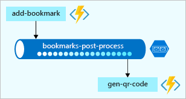
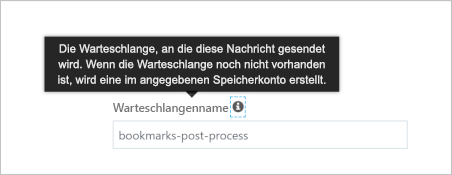
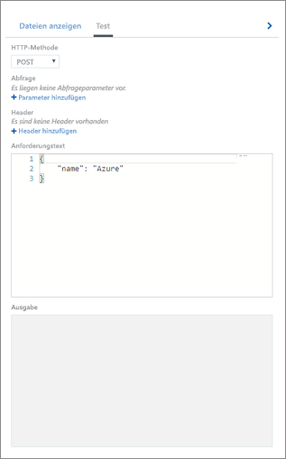
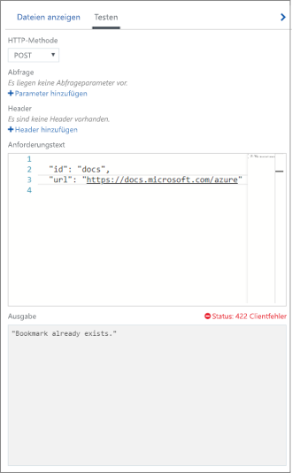
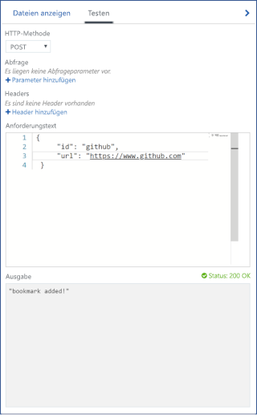
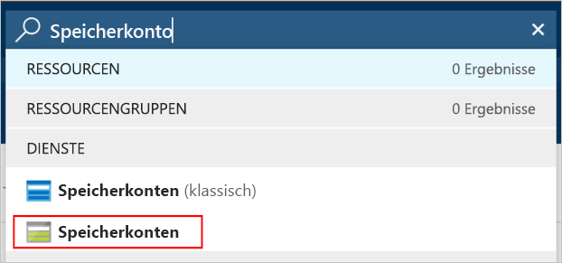
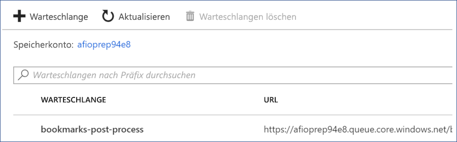
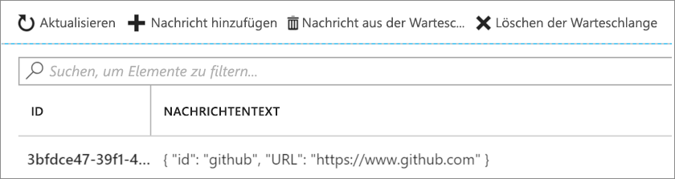

In der letzten Übung haben Sie ein Szenario implementiert, in dem es darum ging, Lesezeichen in einer Azure Cosmos DB-Datenbank nachzuschlagen. Dabei haben Sie eine Eingabebindung konfiguriert, um Daten aus der Lesezeichensammlung zu lesen. Wir können aber noch mehr tun. Erweitern wir das Szenario um Schreiben. Betrachten Sie das folgende Flussdiagramm:


In diesem Szenario empfangen Sie Anforderungen, um Ihrer Sammlung Lesezeichen hinzuzufügen. Die Anforderungen enthalten den gewünschten Schlüssel oder die gewünschte ID und die Lesezeichen-URL. Wie Sie auf dem Flussdiagramm sehen können, wird ein Fehler ausgegeben, wenn der Schlüssel bereits im Back-End vorhanden ist.

Wenn der übergebene Schlüssel *nicht* gefunden wird, wird das neue Lesezeichen der Datenbank hinzugefügt. Dabei könnten es Sie es an dieser Stelle theoretisch belassen, doch im Folgenden führen Sie noch einige zusätzliche Schritte aus.

Vielleicht ist Ihnen ein weiterer Prozess im Flussdiagramm aufgefallen. Bisher haben Sie Daten zwar empfangen, aber noch nicht verarbeitet. Die empfangenen Daten werden einfach in die Datenbank geschrieben. In einer echten Lösung würden Sie die Daten jedoch vermutlich verarbeiten. Diesen Vorgang könnten Sie in ein und derselben Funktion ausführen. In dieser Aufgabe wird jedoch ein Muster vorgestellt, mit dem der weitere Verarbeitungsprozess in eine andere Komponente bzw. Geschäftslogikeinheit ausgelagert wird.

Vermutlich fragen Sie sich, an welcher Stelle in Ihrem Lesezeichenszenario eine solche Auslagerung Sinn ergibt. Ein gutes Beispiel hierfür ist das Senden eines Lesezeichens an einen Erstellungsdienst für einen QR-Code. Dieser Dienst erstellt dann einen QR-Code für die URL, speichert das Bild im Blobspeicher und fügt die Adresse des QR-Bilds in den Eintrag Ihrer Lesezeichensammlung ein. Der Aufruf eines Diensts zum Erstellen eines QR-Bilds ist zeitaufwendig. Anstatt also auf das Ergebnis zu warten, lagern Sie diesen Aufruf an eine Funktion aus, die diesen Vorgang asynchron verarbeitet.

Azure Functions unterstützt nicht nur Eingabebindungen für verschiedene Integrationsquellen, sondern verfügt auch über mehrere Vorlagen für Ausgabebindungen, mit denen Sie Daten problemlos in Datenquellen schreiben können. Ausgabebindungen können auch in der Datei *function.json* konfiguriert werden.  Wie in dieser Übung noch deutlich wird, können Sie eine Funktion so konfigurieren, dass diese mit mehreren Datenquellen und Diensten zusammenarbeitet.

> [!IMPORTANT]
> Diese Übung baut auf der vorherigen auf. Sie verwendet die gleiche Azure Cosmos DB-Datenbank und Eingabebindung. Wenn Sie die letzte Einheit nicht durchgearbeitet haben, wird empfohlen, dass Sie diese nachholen, bevor Sie mit dieser fortfahren.

## <a name="create-an-http-triggered-function"></a>Erstellen einer durch HTTP ausgelösten Funktion

1. Stellen Sie sicher, dass Sie beim [Azure-Portal](https://portal.azure.com/learn.docs.microsoft.com?azure-portal=true) mit dem gleichen Konto angemeldet sind, über das Sie die Sandbox aktiviert haben.

2. Navigieren Sie im Portal zu der Funktions-App, die Sie in diesem Modul erstellt haben.

3. Klicken Sie neben **Funktionen** auf die Schaltfläche „Hinzufügen“ (**+**). Durch diese Aktion wird der Vorgang der Funktionserstellung gestartet. 
4. Auf der Seite werden alle aktuell unterstützten Trigger angezeigt. Wählen Sie **HTTP-Trigger** aus.

5. Füllen Sie den Bereich **Neue Funktion**, der auf der rechten Seite angezeigt wird, mit den folgenden Werten aus:

    |Feld  |Wert  |
    |---------|---------|
    |Name     |   [!INCLUDE [func-name-add](./func-name-add.md)]     |
    | Autorisierungsstufe | **Funktion** |

6. Wählen Sie **Erstellen** aus, um Ihre Funktion zu erstellen. Durch diese Aktion wird die Datei **index.js** im Code-Editor geöffnet und eine Standardimplementierung der durch HTTP ausgelösten Funktion angezeigt.

    > [!NOTE]
    > In dieser Übung nutzen Sie aus Zeitgründen den *Code* und die *Konfiguration* aus der letzten Einheit als Ausgangspunkt.

7. Ersetzen Sie den gesamten Code in der Datei **index.js** durch den Code im folgenden Codeausschnitt. Wählen Sie anschließend **Speichern** aus, um die Änderung zu speichern:

   [!code-javascript[](../code/find-bookmark-single.js)]

   Dieser Code kommt Ihnen vermutlich vertraut vor, was daran liegt, dass es sich um die Implementierung der [!INCLUDE [func-name-find](./func-name-find.md)]-Funktion handelt. Wie zu erwarten, funktioniert die Funktion noch nicht, da die gleichen Bindungen erst noch definiert werden müssen.

1. Öffnen Sie die Datei **function.json** über die [!INCLUDE [func-name-add](./func-name-add.md)]-Funktion.

11. Ersetzen Sie den Inhalt dieser Datei durch den folgenden JSON-Code:

    ```json
    {
      "bindings": [
        {
          "authLevel": "function",
          "type": "httpTrigger",
          "direction": "in",
          "name": "req"
        },
        {
          "type": "http",
          "direction": "out",
          "name": "res"
        },
        {
          "type": "documentDB",
          "name": "bookmark",
          "databaseName": "func-io-learn-db",
          "collectionName": "Bookmarks",
          "connection": "unit3test_DOCUMENTDB",
          "direction": "in",
          "id": "{id}"
        }
      ],
      "disabled": false
    }
    ```

12. Achten Sie darauf, alle Änderungen mithilfe von **Speichern** zu speichern.

In den vorherigen Schritten haben Sie Bindungen für die neue Funktion konfiguriert, indem Sie Bindungsdefinitionen aus einer anderen Funktion kopiert haben. Sie könnten eine neue Bindung natürlich auch über die Benutzeroberfläche erstellen. Es ist jedoch sinnvoll, sich bewusst zu werden, dass eine Alternative zur Verfügung steht.

## <a name="try-it-out"></a>Ausprobieren

1. Klicken Sie oben rechts auf **Funktions-URL abrufen**, wählen Sie **default (Function key)** (Standard (Funktionsschlüssel)) aus, und klicken Sie anschließend auf **Kopieren**, um die URL der Funktion zu kopieren.

2. Fügen Sie die kopierte URL in die Adressleiste Ihres Browsers ein. Fügen Sie den Wert der Abfragezeichenfolge `&id=docs` am Ende der URL hinzu, und drücken Sie dann die EINGABETASTE, um die Anforderung auszuführen. Wenn keine Fehler auftreten, sollte eine Antwort angezeigt werden, die eine URL zu dieser Ressource enthält.

An dieser Stelle ist es Zeit für einen kurzen Rückblick. Bisher haben Sie im Wesentlichen die Schritte der letzten Übung wiederholt. Aber das ist in Ordnung. Wir kopieren die Arbeit aus der letzten Übung, um die Voraussetzungen für diese zu schaffen. Als nächstes arbeiten wir an den neuen Teilen. Das heißt, wir schreiben in unsere Datenbank. Hierzu benötigen Sie eine *Ausgabebindung*.

## <a name="define-azure-cosmos-db-output-binding"></a>Definieren einer Azure Cosmos DB-Ausgabebindung

Als Nächstes definieren Sie eine neue Ausgabebindung nicht über die Benutzeroberfläche, sondern durch das manuelle Aktualisieren der Konfigurationsdatei *function.json*.

1. Achten Sie darauf, dass die Datei *function.json* für [!INCLUDE [func-name-add](./func-name-add.md)] im Editor geöffnet ist.

1. Kopieren Sie die Bindung mit dem Namen `bookmark` in diese Datei.

1. Platzieren Sie den Cursor direkt nach der schließenden geschweiften Klammer (}) und unmittelbar vor der schließenden eckigen Klammer (]). Fügen Sie ein Komma (,) hinzu, und fügen Sie dann die Kopie der Bindung hier ein. Die Konfigurationsdatei *function.json* sollte nun wie folgt aussehen:

   [!code-json[](../code/config-new-entry.json?highlight=22-31)]

1. Bearbeiten Sie die eingefügte Bindung, indem Sie die folgenden Änderungen vornehmen:

    |Eigenschaft   |Alter Wert  |Neuer Wert  |
    |---------|---------|---------|
    |Name     |   Lesezeichen      |  **newbookmark**       |
    |direction     |   in      |   **out**      |
    |id     |      {id}   |   **Löschen Sie diese Eigenschaft. Sie ist für die Ausgabebindung nicht vorhanden.**      |

1. Nachdem Sie diese Änderungen vorgenommen haben, sieht Ihre Datei aus wie der folgende JSON-Code:

    [!code-json[](../code/config-q-complete.json?highlight=22-30)]

Anhand dieses kurzen Beispiels haben Sie gesehen, wie Bindungen auch direkt in der Konfigurationsdatei erstellt werden können. In diesem Beispiel ist das sinnvoll, da Sie die Eigenschaften einer anderen Bindung wiederverwenden. Das heißt, Sie verwenden die Werte von `databaseName`, `collectionName` und `connection` wieder, die Sie bereits für Ihre Azure Cosmos DB-Eingabebindung konfiguriert haben.

> [!NOTE]
> Der tatsächliche Wert von `connection` in der obigen JSON-Datei entspricht dem Namen, der der Verbindung bei deren Erstellung zugewiesen wurde.

Bevor Sie ihren Code aktualisieren, fügen Sie eine weitere Bindung hinzu, mit der Sie Nachrichten an die Warteschlange senden können.

## <a name="define-azure-queue-storage-output-binding"></a>Definieren einer Azure Queue Storage-Ausgabebindung

Azure Queue Storage ist ein Dienst zur Speicherung von Nachrichten, auf die von jedem Ort der Welt aus zugegriffen werden kann. Eine einzelne Nachricht kann bis zu 64 KB groß sein, und eine Warteschlange kann Millionen von Nachrichten enthalten. Die maximale Anzahl ist nur durch die Kapazität des Speicherkontos begrenzt. Die folgende Abbildung zeigt einen allgemeinen Überblick über die Verwendung der Warteschlange in Ihrem Szenario:



Deutlich wird hier, dass die neue Funktion [!INCLUDE [func-name-add](./func-name-add.md)] der Warteschlange Nachrichten hinzufügt. Eine weitere Funktion (beispielsweise eine fiktive Funktion mit dem Namen *gen-qr-code*) entfernt Nachrichten per Pop aus derselben Warteschlange und verarbeitet die Anforderung.  Da Nachrichten über [!INCLUDE [func-name-add](./func-name-add.md)] in die Warteschlange geschrieben (mithilfe von *Push* übertragen) werden, fügen Sie Ihrer Lösung eine neue Ausgabebindung hinzu. Dieses Mal erstellen Sie die Bindung über die Benutzeroberfläche des Portals.

1. Wählen Sie im Funktionsmenü auf der linken Seite **Integrieren** aus, um die Registerkarte „Integration“ zu öffnen.

2. Klicken Sie in der Spalte **Ausgaben** auf die Option **+ New Output** (+ Neue Ausgabe).
    Eine Liste aller möglichen Ausgabebindungstypen wird angezeigt.

3. Wählen Sie in der Liste **Azure Queue Storage** und anschließend **Auswählen** aus.
    Hierdurch wird die Ausgabekonfigurationsseite für Azure Queue Storage geöffnet.

   Als Nächstes richten Sie eine Verbindung mit dem Speicherkonto ein. Dort wird Ihre Warteschlange gehostet.

4. Wählen Sie rechts vom Feld **Speicherkontoverbindung** **Neu** aus.
   Der Auswahlbereich **Speicherkonto** wird geöffnet.

5. Zu Beginn dieses Moduls haben Sie zusammen mit der Funktions-App ein Speicherkonto erstellt. Es wird in diesem Bereich aufgelistet – wählen Sie es aus. Das Feld **Speicherkontoverbindung** wird mit dem Namen einer Verbindung aufgefüllt. Wenn Sie sich den Wert der Verbindungszeichenfolge ansehen möchten, wählen Sie **Wert anzeigen** aus.

6. Sie könnten zwar für alle anderen Felder die jeweiligen Standardwerte übernehmen, jedoch ergeben sich sinnvollere Eigenschaften, wenn Sie die folgenden Felder ändern:

    |Eigenschaft  |Alter Wert  |Neuer Wert  | Beschreibung |
    |---------|---------|---------|---------|
    |Warteschlangenname     |    outqueue     |  **bookmarks-post-process**      | Hierbei handelt es sich um den Namen der Warteschlange, der Lesezeichen hinzugefügt werden. Diese können dann von einer anderen Funktion weiterverarbeitet werden. |
    | Name des Nachrichtenparameters    |  outputQueueItem       |   **newmessage**      | Die Bindungseigenschaft, die Sie im Code verwenden. |

7. Achten Sie darauf, Ihre Änderungen durch Auswählen von **Speichern** zu speichern.

## <a name="update-function-implementation"></a>Aktualisieren der Funktionsimplementierung

Sie haben nun alle Bindungen für die [!INCLUDE [func-name-add](./func-name-add.md)]-Funktion eingerichtet. Als Nächstes verwenden Sie diese in Ihrer Funktion.

1.  Wählen Sie Ihre Funktion [!INCLUDE [func-name-add](./func-name-add.md)] aus, um die Datei **index.js** im Code-Editor zu öffnen.

2. Ersetzen Sie den gesamten Code in der Datei *index.js* durch den Code im folgenden Codeausschnitt:

   [!code-javascript[](../code/add-bookmark.js)]

Beschreiben wir einmal, welchen Zweck der Code erfüllt:

* Da die Funktion Ihre Daten ändert, ist zu erwarten, dass es sich um eine HTTP-POST-Anforderung handelt und die Lesezeichendaten Teil des Anforderungstexts sind.
* Über die Azure Cosmos DB-Eingabebindung wird versucht, ein Dokument oder Lesezeichen mithilfe der empfangenen `id` abzurufen. Wird ein Eintrag gefunden, wird das `bookmark`-Objekt festgelegt. Mit der Bedingung `if(bookmark)` wird überprüft, ob ein Eintrag gefunden wurde.
* Sie können der Datenbank ganz einfach ein Lesezeichen hinzufügen. Hierzu legen Sie nur den `context.bindings.newbookmark`-Bindungsparameter auf den neuen Lesezeicheneintrag fest, den Sie als JSON-Zeichenfolge erstellt haben.
* Wenn Sie den Parameter `context.bindings.newmessage parameter` festlegen, können Sie außerdem problemlos Nachrichten an Ihre Warteschlange übermitteln.

> [!NOTE]
> Diese Ergebnisse konnten Sie einfach durch das Erstellen einer Warteschlangenbindung erzielen. Die Warteschlange musste nicht explizit erstellt werden. Hieran wird erkennbar, wie leistungsfähig Bindungen sind. Anhand des folgenden Popups wird deutlich, dass die Warteschlange automatisch erstellt wird, fall sie noch nicht vorhanden ist.



Fertig! Im nächsten Abschnitt sehen Sie, wie das bisher Umgesetzte beim Testen aussieht.

## <a name="try-it-out"></a>Ausprobieren

Da nun mehrere Ausgabebindungen vorhanden sind, werden die Tests etwas komplizierter. In den vorherigen Aufgaben waren das Senden einer HTTP-Anforderung und einer Abfragezeichenfolge zum Testen ausreichend, aber diesmal möchten wir eine HTTP-POST-Anforderung ausführen. Außerdem müssen Sie überprüfen, ob der Warteschlange tatsächlich Nachrichten hinzugefügt werden.

1. Wählen Sie bei ausgewählter Funktion [!INCLUDE [func-name-add](./func-name-add.md)] im Funktionen-App-Portal das ganz links angezeigte Menüelement für Tests aus, um es zu erweitern.

2. Wählen Sie das Menüelement **Test** aus, und überprüfen Sie, ob der Testbereich geöffnet ist. Der folgende Screenshot zeigt, wie der Bildschirm aussehen sollte:

    

    > [!IMPORTANT]
    > Stellen Sie sicher, dass in der Dropdownliste für die HTTP-Methode **POST** ausgewählt ist.

3. Ersetzen Sie den Inhalt des Anforderungstexts durch die folgende JSON-Nutzlast:

    ```json
    {
        "id": "docs",
        "url": "https://docs.microsoft.com/azure"
    }
    ```

4. Wählen Sie unten im Testbereich **Ausführen** aus.

5. Überprüfen Sie, ob im Fenster **Ausgabe** die Nachricht „Bookmark already exists“ (Ein Lesezeichen ist bereits vorhanden.) angezeigt wird, wie im folgenden Diagramm dargestellt:

    

6. Ersetzen Sie den Inhalt des Anforderungstexts durch die folgende JSON-Nutzlast:

    ```json
    {
        "id": "github",
        "url": "https://www.github.com"
    }
    ```
7. Wählen Sie unten im Testbereich **Ausführen** aus.

8. Überprüfen Sie, ob im Fenster *Ausgabe* die Nachricht „bookmark added“ (Ein Lesezeichen wurde hinzugefügt.)angezeigt wird, wie im folgenden Diagramm dargestellt.

    

Herzlichen Glückwunsch! [!INCLUDE [func-name-add](./func-name-add.md)] funktioniert wie vorgesehen. Wie sieht es aber mit dem Warteschlangenvorgang aus, der im Code festgelegt wurde? Überprüfen Sie also, ob der Warteschlange Nachrichten hinzugefügt wurden.

### <a name="verify-that-a-message-is-written-to-the-queue"></a>Überprüfen, ob der Warteschlange eine Nachricht hinzugefügt wird

Azure Queue Storage-Warteschlangen werden in einem Speicherkonto gehostet. Sie haben es in dieser Übung bereits beim Erstellen der Ausgabebindung ausgewählt.

1. Geben Sie im Hauptsuchfeld im Azure-Portal **Speicherkonten** ein. Wählen Sie anschließend in den Suchergebnissen unter **Dienste** den Eintrag **Speicherkonten** aus.

      

2. Wählen Sie in der Liste der angezeigten Speicherkonten das Speicherkonto aus, das Sie zum Erstellen der Ausgabebindung **newmessage** verwendet haben.
   Die Einstellungen des Speicherkontos werden im Hauptfenster des Portals angezeigt.

3. Wählen Sie in der Liste **Dienste** das Element **Warteschlangen** aus.
   Es wird eine Liste der Warteschlangen angezeigt, die von diesem Speicherkonto gehostet werden. Überprüfen Sie, ob die Warteschlange **bookmarks-post-process** vorhanden ist, wie auf dem folgenden Screenshot dargestellt:

      

4. Wählen Sie **bookmarks-post-process** aus, um die Warteschlange zu öffnen.
   Die Nachrichten, die sich in der Warteschlange befinden, werden in einer Liste angezeigt. Wenn alles planmäßig verlaufen ist, enthält die Warteschlange die Nachricht, die Sie beim Hinzufügen eines Lesezeichens zur Datenbank veröffentlicht haben. Die Anzeige sollte folgendermaßen aussehen:

    

   In diesem Beispiel wurde der Nachricht eine eindeutige ID zugewiesen, und das Feld **NACHRICHTENTEXT** enthält das Lesezeichen im JSON-Zeichenfolgenformat.

5. Sie können die Funktion noch weiter testen, indem Sie im Testbereich innerhalb des Anforderungstexts neue IDs und URLs festlegen und die Funktion ausführen. Beobachten Sie die Warteschlange eine Zeit lang, um zu sehen, wie neue Nachrichten eintreffen. Sie können außerdem einen Blick auf die Datenbank werfen, um zu überprüfen, ob neue Einträge hinzugefügt wurden.

In dieser Aufgabe haben Sie mehr über Bindungen und Ausgabebindungen erfahren und Daten in Ihre Azure Cosmos DB-Datenbank geschrieben. Zusätzlich haben Sie eine weitere Ausgabebindung hinzugefügt und Nachrichten an eine Azure-Warteschlange übermittelt. Dadurch wurde deutlich, wie Sie mit Bindungen Daten von Eingangsquellen an unterschiedliche Ziele weiterleiten. Sie mussten weder Datenbankcode schreiben noch Verbindungszeichenfolgen selbst verwalten. Stattdessen haben Sie Bindungen deklarativ konfiguriert, wodurch die Absicherung der Verbindungen und die Skalierung der Funktion sowie der Verbindungen von der Plattform durchgeführt wurden.