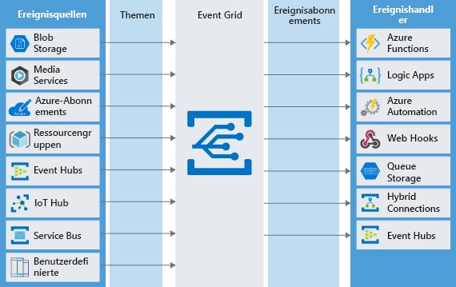

<span data-ttu-id="d7ed4-101">Viele Anwendungen verwenden das Veröffentlichen-/Abonnieren-Modell, um verteilte Komponenten zu informieren, dass ein Problem aufgetreten ist oder ein Objekt geändert wurde.</span><span class="sxs-lookup"><span data-stu-id="d7ed4-101">Many applications use a publish-subscribe model to notify distributed components that something happened, or that some object changed.</span></span> <span data-ttu-id="d7ed4-102">Angenommen, Sie verfügen über eine Anwendung für den Austausch von Musik mit einer Web-API, die in Azure ausgeführt wird.</span><span class="sxs-lookup"><span data-stu-id="d7ed4-102">Suppose you have a music-sharing application with a Web API that runs in Azure.</span></span> <span data-ttu-id="d7ed4-103">Wenn ein Benutzer einen neuen Song hochlädt, müssen Sie weltweit alle auf Endgeräten installierten mobilen Apps benachrichtigen, die Benutzern gehören, die an dem Genre interessiert sind, dem der Song angehört.</span><span class="sxs-lookup"><span data-stu-id="d7ed4-103">When a user uploads a new song, you need to notify all the mobile apps installed on user devices around the world who are interested in that genre.</span></span>

<span data-ttu-id="d7ed4-104">In dieser Architektur benötigt der Herausgeber der Audiodatei keine Informationen über die Abonnenten, die an der geteilten Musik interessiert sind.</span><span class="sxs-lookup"><span data-stu-id="d7ed4-104">In this architecture, the publisher of the sound file doesn't need to know about any of the subscribers interested in the shared music.</span></span> <span data-ttu-id="d7ed4-105">Darüber hinaus soll es eine 1:n-Beziehung mit mehreren Abonnenten geben, die entscheiden können, ob sie an diesem neuen Song interessiert sind.</span><span class="sxs-lookup"><span data-stu-id="d7ed4-105">Also, we want to have a one-to-many relationship where we can have multiple subscribers who can optionally decide whether they are interested in this new song.</span></span> <span data-ttu-id="d7ed4-106">Azure Event Grid eignet sich hervorragend für derartige Architekturen.</span><span class="sxs-lookup"><span data-stu-id="d7ed4-106">Azure Event Grid is a perfect solution for this sort of architecture.</span></span>

## <a name="what-is-azure-event-grid"></a><span data-ttu-id="d7ed4-107">Was ist Azure Event Grid?</span><span class="sxs-lookup"><span data-stu-id="d7ed4-107">What is Azure Event Grid?</span></span>
<span data-ttu-id="d7ed4-108">Azure Event Grid ist ein vollständig verwalteter Ereignisroutingdienst, der auf Azure Service Fabric basiert.</span><span class="sxs-lookup"><span data-stu-id="d7ed4-108">Azure Event Grid is a fully-managed event routing service running on top of Azure Service Fabric.</span></span> <span data-ttu-id="d7ed4-109">Der Dienst verteilt _Ereignisse_ aus verschiedenen Quellen wie Azure Blob Storage-Konten oder Azure Media Services an verschiedene Abonnenten wie Azure Functions oder Webhooks.</span><span class="sxs-lookup"><span data-stu-id="d7ed4-109">Event Grid distributes _events_ from different sources, such as Azure Blob storage accounts or Azure Media Services, to different handlers, such as Azure Functions or Webhooks.</span></span> <span data-ttu-id="d7ed4-110">Event Grid wurde erstellt, um das Erstellen von ereignisbasierten und serverlosen Anwendungen in Azure zu vereinfachen.</span><span class="sxs-lookup"><span data-stu-id="d7ed4-110">Event Grid was created to make it easier to build event-based and serverless applications on Azure.</span></span>

<span data-ttu-id="d7ed4-111">Event Grid unterstützt die meisten Azure-Dienste und sogar Drittanbieterdienste als Herausgeber oder Abonnent.</span><span class="sxs-lookup"><span data-stu-id="d7ed4-111">Event Grid supports most Azure services as a publisher or subscriber and can be used with third-party services.</span></span> <span data-ttu-id="d7ed4-112">Event Grid umfasst ein dynamisch skalierbares, kostengünstiges Nachrichtensystem, mit dem Herausgeber Abonnenten über Statusänderungen benachrichtigen können.</span><span class="sxs-lookup"><span data-stu-id="d7ed4-112">It provides a dynamically scalable, low-cost, messaging system that allows publishers to notify subscribers about a status change.</span></span> <span data-ttu-id="d7ed4-113">Die folgende Abbildung zeigt, wie Azure Event Grid Nachrichten von verschiedenen Quellen empfängt und basierend auf dem Abonnement an Ereignishandler verteilt.</span><span class="sxs-lookup"><span data-stu-id="d7ed4-113">The following illustration shows Azure Event Grid receiving messages from multiple sources and distributing them to event handlers based on subscription.</span></span>

<span data-ttu-id="d7ed4-114">Es gibt verschiedene Konzepte in Azure Event Grid, über die eine Verbindung zwischen einer Quelle und einem Abonnenten hergestellt werden kann:</span><span class="sxs-lookup"><span data-stu-id="d7ed4-114">There are several concepts in Azure Event Grid that connect a source to a subscriber:</span></span>

1. <span data-ttu-id="d7ed4-115">**Ereignisse:** Was ist passiert?</span><span class="sxs-lookup"><span data-stu-id="d7ed4-115">**Events:** What happened.</span></span>
1. <span data-ttu-id="d7ed4-116">**Ereignisquellen:** Wo hat das Ereignis stattgefunden?</span><span class="sxs-lookup"><span data-stu-id="d7ed4-116">**Event sources:** Where the event took place.</span></span>
1. <span data-ttu-id="d7ed4-117">**Themen:** der Endpunkt, an den Herausgeber Ereignisse senden.</span><span class="sxs-lookup"><span data-stu-id="d7ed4-117">**Topics:** The endpoint where publishers send events.</span></span>
1. <span data-ttu-id="d7ed4-118">**Ereignisabonnements**: der Endpunkt oder integrierte Mechanismus zum Weiterleiten von Ereignissen (teilweise an mehrere Handler).</span><span class="sxs-lookup"><span data-stu-id="d7ed4-118">**Event subscriptions:** The endpoint or built-in mechanism to route events, sometimes to multiple handlers.</span></span> <span data-ttu-id="d7ed4-119">Abonnements werden auch von Handlern verwendet, um eingehende Ereignisse intelligent zu filtern.</span><span class="sxs-lookup"><span data-stu-id="d7ed4-119">Subscriptions are also used by handlers to filter incoming events intelligently.</span></span>
1. <span data-ttu-id="d7ed4-120">**Ereignishandler:** die App oder der Dienst, der auf das Ereignis reagiert.</span><span class="sxs-lookup"><span data-stu-id="d7ed4-120">**Event handlers:** The app or service reacting to the event.</span></span>



### <a name="what-is-an-event"></a><span data-ttu-id="d7ed4-125">Was ist ein Ereignis?</span><span class="sxs-lookup"><span data-stu-id="d7ed4-125">What is an event?</span></span>
<span data-ttu-id="d7ed4-126">**Ereignisse** sind Datennachrichten, die über Event Grid übertragen werden und Informationen über Vorkommnisse enthalten.</span><span class="sxs-lookup"><span data-stu-id="d7ed4-126">**Events** are the data messages passing through Event Grid that describe what has taken place.</span></span> <span data-ttu-id="d7ed4-127">Jedes Ereignis ist eigenständig, kann bis zu 64 KB umfassen und enthält mehrere Informationen, die auf einem von Event Grid definierten Schema basieren:</span><span class="sxs-lookup"><span data-stu-id="d7ed4-127">Each event is self-contained, can be up to 64 KB, and contains several pieces of information based on a schema defined by Event Grid:</span></span>

```json
[
  {
    "topic": string,
    "subject": string,
    "id": string,
    "eventType": string,
    "eventTime": string,
    "data":{
      object-unique-to-each-publisher
    },
    "dataVersion": string,
    "metadataVersion": string
  }
]
```

| <span data-ttu-id="d7ed4-128">Feld</span><span class="sxs-lookup"><span data-stu-id="d7ed4-128">Field</span></span> | <span data-ttu-id="d7ed4-129">Beschreibung</span><span class="sxs-lookup"><span data-stu-id="d7ed4-129">Description</span></span> |
|-------|-------------|
| <span data-ttu-id="d7ed4-130">**topic**</span><span class="sxs-lookup"><span data-stu-id="d7ed4-130">**topic**</span></span> | <span data-ttu-id="d7ed4-131">Der vollständige Ressourcenpfad zu der Ereignisquelle.</span><span class="sxs-lookup"><span data-stu-id="d7ed4-131">The full resource path to the event source.</span></span> <span data-ttu-id="d7ed4-132">Dieser Wert wird von Event Grid bereitgestellt.</span><span class="sxs-lookup"><span data-stu-id="d7ed4-132">Event Grid provides this value.</span></span> |
| <span data-ttu-id="d7ed4-133">**subject**</span><span class="sxs-lookup"><span data-stu-id="d7ed4-133">**subject**</span></span> | <span data-ttu-id="d7ed4-134">Vom Herausgeber definierter Pfad zum Ereignisbetreff.</span><span class="sxs-lookup"><span data-stu-id="d7ed4-134">Publisher-defined path to the event subject.</span></span> |
| <span data-ttu-id="d7ed4-135">**id**</span><span class="sxs-lookup"><span data-stu-id="d7ed4-135">**id**</span></span> | <span data-ttu-id="d7ed4-136">Der eindeutige Bezeichner eines Ereignisses.</span><span class="sxs-lookup"><span data-stu-id="d7ed4-136">The unique identifier for event.</span></span> |
| <span data-ttu-id="d7ed4-137">**eventType**</span><span class="sxs-lookup"><span data-stu-id="d7ed4-137">**eventType**</span></span> | <span data-ttu-id="d7ed4-138">Einer der für diese Ereignisquelle registrierten Ereignistypen.</span><span class="sxs-lookup"><span data-stu-id="d7ed4-138">One of the registered event types for this event source.</span></span> <span data-ttu-id="d7ed4-139">Für diesen Wert können Sie Filter erstellen, z.B. `CustomerCreated`, `BlobDeleted` oder `HttpRequestReceived`.</span><span class="sxs-lookup"><span data-stu-id="d7ed4-139">This is a value you can create filters against, e.g. `CustomerCreated`, `BlobDeleted`, `HttpRequestReceived`, etc.</span></span> |
| <span data-ttu-id="d7ed4-140">**eventTime**</span><span class="sxs-lookup"><span data-stu-id="d7ed4-140">**eventTime**</span></span> | <span data-ttu-id="d7ed4-141">Die Zeit, in der das Ereignis generiert wird, basierend auf der UTC-Zeit des Anbieters.</span><span class="sxs-lookup"><span data-stu-id="d7ed4-141">The time the event was generated based on the provider's UTC time.</span></span> |
| <span data-ttu-id="d7ed4-142">**data**</span><span class="sxs-lookup"><span data-stu-id="d7ed4-142">**data**</span></span> | <span data-ttu-id="d7ed4-143">Informationen, die sich auf den Ereignistypen beziehen.</span><span class="sxs-lookup"><span data-stu-id="d7ed4-143">Specific information that is relevant to the type of event.</span></span> <span data-ttu-id="d7ed4-144">Beispielsweise enthält ein Ereignis zu einer neuen Datei, die in Azure Storage erstellt wird, Details über die Datei, z.B. den Wert `lastTimeModified`.</span><span class="sxs-lookup"><span data-stu-id="d7ed4-144">For example, an event about a new file being created in Azure Storage has details about the file, such as the `lastTimeModified` value.</span></span> <span data-ttu-id="d7ed4-145">Alternativ dazu enthält ein Event Hubs-Ereignis die URL der Erfassungsdatei.</span><span class="sxs-lookup"><span data-stu-id="d7ed4-145">Or, an Event Hubs event has the URL of the Capture file.</span></span> <span data-ttu-id="d7ed4-146">Dieses Feld ist optional.</span><span class="sxs-lookup"><span data-stu-id="d7ed4-146">This field is optional.</span></span> |
| <span data-ttu-id="d7ed4-147">**dataVersion**</span><span class="sxs-lookup"><span data-stu-id="d7ed4-147">**dataVersion**</span></span> | <span data-ttu-id="d7ed4-148">Die Schemaversion des Datenobjekts.</span><span class="sxs-lookup"><span data-stu-id="d7ed4-148">The schema version of the data object.</span></span> <span data-ttu-id="d7ed4-149">Der Herausgeber definiert die Schemaversion.</span><span class="sxs-lookup"><span data-stu-id="d7ed4-149">The publisher defines the schema version.</span></span> |
| <span data-ttu-id="d7ed4-150">**metadataVersion**</span><span class="sxs-lookup"><span data-stu-id="d7ed4-150">**metadataVersion**</span></span> | <span data-ttu-id="d7ed4-151">Die Schemaversion der Ereignismetadaten.</span><span class="sxs-lookup"><span data-stu-id="d7ed4-151">The schema version of the event metadata.</span></span> <span data-ttu-id="d7ed4-152">Event Grid definiert das Schema der Eigenschaften der obersten Ebene.</span><span class="sxs-lookup"><span data-stu-id="d7ed4-152">Event Grid defines the schema of the top-level properties.</span></span> <span data-ttu-id="d7ed4-153">Dieser Wert wird von Event Grid bereitgestellt.</span><span class="sxs-lookup"><span data-stu-id="d7ed4-153">Event Grid provides this value.</span></span> |

> [!TIP]
> <span data-ttu-id="d7ed4-154">Event Grid sendet ein Ereignis, wenn etwas passiert oder Änderungen vorgenommen wurden.</span><span class="sxs-lookup"><span data-stu-id="d7ed4-154">Event Grid sends an event to indicate something has happened or changed.</span></span> <span data-ttu-id="d7ed4-155">Das _eigentliche Objekt_, an dem eine Änderung vorgenommen wurde, ist dabei allerdings nicht Bestandteil der Ereignisdaten.</span><span class="sxs-lookup"><span data-stu-id="d7ed4-155">However, the _actual object_ that was changed is not part of the event data.</span></span> <span data-ttu-id="d7ed4-156">Stattdessen wird häufig eine URL oder ein Bezeichner übergeben, um auf das geänderte Objekt zu verweisen.</span><span class="sxs-lookup"><span data-stu-id="d7ed4-156">Instead, a URL or identifier is often passed to reference the changed object.</span></span>

### <a name="what-is-an-event-source"></a><span data-ttu-id="d7ed4-157">Was ist eine Ereignisquelle?</span><span class="sxs-lookup"><span data-stu-id="d7ed4-157">What is an event source?</span></span>
<span data-ttu-id="d7ed4-158">Ereignisquellen sind dafür zuständig, Ereignisse an Event Grid zu senden.</span><span class="sxs-lookup"><span data-stu-id="d7ed4-158">Event sources are responsible for sending events to Event Grid.</span></span> <span data-ttu-id="d7ed4-159">Jede Ereignisquelle ist mit mindestens einem Ereignistyp verknüpft.</span><span class="sxs-lookup"><span data-stu-id="d7ed4-159">Each event source is related to one or more event types.</span></span> <span data-ttu-id="d7ed4-160">Azure Storage ist z.B. die Ereignisquelle für von Blobs erstellten Ereignissen.</span><span class="sxs-lookup"><span data-stu-id="d7ed4-160">For example, Azure Storage is the event source for blob created events.</span></span> <span data-ttu-id="d7ed4-161">IoT Hub ist die Ereignisquelle für Ereignisse, die von Geräten erstellt wurden.</span><span class="sxs-lookup"><span data-stu-id="d7ed4-161">IoT Hub is the event source for device created events.</span></span> <span data-ttu-id="d7ed4-162">Ihre Anwendung ist die Ereignisquelle für benutzerdefinierte Ereignisse, die Sie definieren.</span><span class="sxs-lookup"><span data-stu-id="d7ed4-162">Your application is the event source for custom events that you define.</span></span> <span data-ttu-id="d7ed4-163">Später erhalten Sie noch einen detaillierteren Überblick über Ereignisquellen.</span><span class="sxs-lookup"><span data-stu-id="d7ed4-163">We'll look at event sources in more detail in a moment.</span></span>

> [!NOTE]
> <span data-ttu-id="d7ed4-164">Außerdem definiert Azure Event Hub das Konzept eines Ereignisherausgebers.</span><span class="sxs-lookup"><span data-stu-id="d7ed4-164">Azure Event Hub also defines the concept of an Event Publisher.</span></span> <span data-ttu-id="d7ed4-165">Ein Herausgeber für Event Hub ist der Benutzer oder die Organisation, die Ereignisse an Event Grid sendet.</span><span class="sxs-lookup"><span data-stu-id="d7ed4-165">A publisher to Event Hub is the user or organization that decides to send events to Event Grid.</span></span> <span data-ttu-id="d7ed4-166">Microsoft veröffentlicht beispielsweise Ereignisse für mehrere Azure-Dienste.</span><span class="sxs-lookup"><span data-stu-id="d7ed4-166">For example, Microsoft publishes events for several Azure services.</span></span> <span data-ttu-id="d7ed4-167">Sie haben die Möglichkeit, Ereignisse über Ihre eigene Anwendung zu veröffentlichen.</span><span class="sxs-lookup"><span data-stu-id="d7ed4-167">You can publish events from your own application.</span></span> <span data-ttu-id="d7ed4-168">Organisationen, die Dienste außerhalb von Azure hosten, können Ereignisse über Event Grid veröffentlichen.</span><span class="sxs-lookup"><span data-stu-id="d7ed4-168">Organizations that host services outside of Azure can publish events through Event Grid.</span></span> <span data-ttu-id="d7ed4-169">Dies wird häufig mit der Ereignisquelle verwechselt.</span><span class="sxs-lookup"><span data-stu-id="d7ed4-169">This often gets mixed with the event source.</span></span> <span data-ttu-id="d7ed4-170">Die vollständig definierte Ereignisquelle ist der Herausgeber und der Dienst, der das Ereignis für diesen Herausgeber erstellt.</span><span class="sxs-lookup"><span data-stu-id="d7ed4-170">The event source fully defined is the publisher and the specific service generating the event for that publisher.</span></span> <span data-ttu-id="d7ed4-171">In diesem Dokument stehen die Begriffe „Herausgeber“ und „Ereignisquelle“ beide für die Entität, die die Nachricht an Event Hub senden.</span><span class="sxs-lookup"><span data-stu-id="d7ed4-171">Here, we will use "publisher" and "event source" interchangeably to represent the entity sending the message to Event Hub.</span></span>

### <a name="what-is-an-event-topic"></a><span data-ttu-id="d7ed4-172">Was ist eine Ereignisthema?</span><span class="sxs-lookup"><span data-stu-id="d7ed4-172">What is an event topic?</span></span>
<span data-ttu-id="d7ed4-173">Ereignisthemen kategorisieren Ereignisse in Gruppen.</span><span class="sxs-lookup"><span data-stu-id="d7ed4-173">Event topics categorize events into groups.</span></span> <span data-ttu-id="d7ed4-174">Themen werden von einem öffentlichen Endpunkt dargestellt und sind das _Ziel_ von Ereignissen, die von der Ereignisquelle gesendet werden.</span><span class="sxs-lookup"><span data-stu-id="d7ed4-174">Topics are represented by a public endpoint and are where the event source sends events _to_.</span></span> <span data-ttu-id="d7ed4-175">Sie können beim Entwerfen Ihrer Anwendung entscheiden, wie viele Themen erstellt werden sollen.</span><span class="sxs-lookup"><span data-stu-id="d7ed4-175">When designing your application, you can decide how many topics to create.</span></span> <span data-ttu-id="d7ed4-176">Größere Lösungen erstellen für jede Kategorie von verknüpften Ereignissen ein benutzerdefiniertes Thema, während kleinere Lösungen ggf. sämtliche Ereignisse an nur ein Thema senden.</span><span class="sxs-lookup"><span data-stu-id="d7ed4-176">Larger solutions will create a custom topic for each category of related events, while smaller solutions might send all events to a single topic.</span></span> <span data-ttu-id="d7ed4-177">Denken Sie beispielsweise an eine Anwendung, die Ereignisse im Zusammenhang mit der Änderung von Benutzerkonten und der Verarbeitung von Bestellungen sendet.</span><span class="sxs-lookup"><span data-stu-id="d7ed4-177">For example, consider an application that sends events related to modifying user accounts and processing orders.</span></span> <span data-ttu-id="d7ed4-178">Es ist unwahrscheinlich, dass ein Ereignishandler beide Ereigniskategorien benötigt.</span><span class="sxs-lookup"><span data-stu-id="d7ed4-178">It's unlikely any event handler wants both categories of events.</span></span> <span data-ttu-id="d7ed4-179">Erstellen Sie zwei benutzerdefinierte Themen, und lassen Sie die Ereignishandler das jeweils für sie relevante Thema abonnieren.</span><span class="sxs-lookup"><span data-stu-id="d7ed4-179">Create two custom topics and let event handlers subscribe to the one that interests them.</span></span> <span data-ttu-id="d7ed4-180">Ereignisabonnenten können nach den gewünschten Ereignistypen eines bestimmten Themas filtern.</span><span class="sxs-lookup"><span data-stu-id="d7ed4-180">Event subscribers can filter for the event types they want from a specific topic.</span></span>

<span data-ttu-id="d7ed4-181">Themen werden in **Systemthemen** und **benutzerdefinierte** Themen gegliedert.</span><span class="sxs-lookup"><span data-stu-id="d7ed4-181">Topics are divided into **system** topics, and **custom** topics.</span></span>

#### <a name="system-topics"></a><span data-ttu-id="d7ed4-182">Systemthemen</span><span class="sxs-lookup"><span data-stu-id="d7ed4-182">System topics</span></span>
<span data-ttu-id="d7ed4-183">Systemthemen sind integrierte Themen, die von Azure-Diensten bereitgestellt werden.</span><span class="sxs-lookup"><span data-stu-id="d7ed4-183">System topics are built-in topics provided by Azure services.</span></span> <span data-ttu-id="d7ed4-184">Es werden keine Systemthemen in Ihrem Azure-Abonnement angezeigt, weil diese dem Herausgeber gehören. Allerdings haben Sie die Möglichkeit, sie zu abonnieren.</span><span class="sxs-lookup"><span data-stu-id="d7ed4-184">You don't see system topics in your Azure subscription because the publisher owns the topics, but you can subscribe to them.</span></span> <span data-ttu-id="d7ed4-185">Stellen Sie dafür Informationen zu der Ressource bereit, deren Ereignisse Sie empfangen möchten.</span><span class="sxs-lookup"><span data-stu-id="d7ed4-185">To subscribe, you provide information about the resource you want to receive events from.</span></span> <span data-ttu-id="d7ed4-186">Solange Sie Zugriff auf eine Ressource haben, können Sie auch ihre Ereignisse abonnieren.</span><span class="sxs-lookup"><span data-stu-id="d7ed4-186">As long as you have access to the resource, you can subscribe to its events.</span></span>

#### <a name="custom-topics"></a><span data-ttu-id="d7ed4-187">Benutzerdefinierte Themen</span><span class="sxs-lookup"><span data-stu-id="d7ed4-187">Custom topics</span></span>
<span data-ttu-id="d7ed4-188">Benutzerdefinierte Themen sind Anwendungs- und Drittanbieterthemen.</span><span class="sxs-lookup"><span data-stu-id="d7ed4-188">Custom topics are application and third-party topics.</span></span> <span data-ttu-id="d7ed4-189">Wenn Sie ein benutzerdefiniertes Thema erstellen oder Zugriff darauf erhalten, wird dieses in Ihrem Abonnement angezeigt.</span><span class="sxs-lookup"><span data-stu-id="d7ed4-189">When you create or are assigned access to a custom topic, you see that custom topic in your subscription.</span></span>

### <a name="what-is-an-event-subscription"></a><span data-ttu-id="d7ed4-190">Was ist ein Ereignisabonnement?</span><span class="sxs-lookup"><span data-stu-id="d7ed4-190">What is an event subscription?</span></span>
<span data-ttu-id="d7ed4-191">Ereignisabonnements definieren, welche Ereignisse zu einem Thema der Ereignishandler empfangen soll.</span><span class="sxs-lookup"><span data-stu-id="d7ed4-191">Event Subscriptions define which events on a topic an event handler wants to receive.</span></span> <span data-ttu-id="d7ed4-192">Ein Abonnement kann Ereignisse auch anhand ihres Typs oder Betreffs filtern, sodass Sie sicherstellen können, dass ein Ereignishandler nur relevante Ereignisse empfängt.</span><span class="sxs-lookup"><span data-stu-id="d7ed4-192">A subscription can also filter events by their type or subject, so you can ensure an event handler only receives relevant events.</span></span>

### <a name="what-is-an-event-handler"></a><span data-ttu-id="d7ed4-193">Was ist eine Ereignishandler?</span><span class="sxs-lookup"><span data-stu-id="d7ed4-193">What is an event handler?</span></span>
<span data-ttu-id="d7ed4-194">Ein Ereignishandler (teilweise auch als „Ereignisabonnent“ bezeichnet) ist eine beliebige Komponente (eine Anwendung oder eine Ressource), die Ereignisse von Event Grid empfangen kann.</span><span class="sxs-lookup"><span data-stu-id="d7ed4-194">An event handler (sometimes referred to as an event "subscriber") is any component (application or resource) that can receive events from Event Grid.</span></span> <span data-ttu-id="d7ed4-195">Azure Functions kann z.B. Code ausführen, wenn dem Blob Storage-Konto ein neuer Song hinzugefügt wird.</span><span class="sxs-lookup"><span data-stu-id="d7ed4-195">For example, Azure Functions can execute code in response to the new song being added to the Blob storage account.</span></span> <span data-ttu-id="d7ed4-196">Abonnenten können sich entscheiden, welche Ereignisse sie verarbeiten möchten, und Event Grid benachrichtigt jeden interessierten Abonnenten, wenn ein neues Ereignis verfügbar ist, ohne dass ein Abruf notwendig ist.</span><span class="sxs-lookup"><span data-stu-id="d7ed4-196">Subscribers can decide which events they want to handle and Event Grid will efficiently notify each interested subscriber when a new event is available - no polling required.</span></span>

## <a name="types-of-event-sources"></a><span data-ttu-id="d7ed4-197">Arten von Ereignisquellen</span><span class="sxs-lookup"><span data-stu-id="d7ed4-197">Types of event sources</span></span>
<span data-ttu-id="d7ed4-198">Ereignisse können von den folgenden Azure-Ressourcentypen generiert werden:</span><span class="sxs-lookup"><span data-stu-id="d7ed4-198">Events can be generated by the following Azure resource types:</span></span>

- <span data-ttu-id="d7ed4-199">**Azure-Abonnements und -Ressourcengruppen:** Abonnements und Ressourcengruppen generieren Ereignisse, die im Zusammenhang mit Verwaltungsvorgängen in Azure stehen.</span><span class="sxs-lookup"><span data-stu-id="d7ed4-199">**Azure Subscriptions and Resource Groups:** Subscriptions and resource groups generate events related to management operations in Azure.</span></span> <span data-ttu-id="d7ed4-200">Wenn z.B. ein Benutzer einen virtuellen Computer erstellt, generiert diese Quelle ein Ereignis.</span><span class="sxs-lookup"><span data-stu-id="d7ed4-200">For example, when a user creates a virtual machine, this source generates an event.</span></span>
- <span data-ttu-id="d7ed4-201">**Containerregistrierung:** Azure Container Registry ist ein Dienst, der Ereignisse generiert, wenn Images der Registrierung hinzugefügt, aus ihr entfernt oder geändert werden.</span><span class="sxs-lookup"><span data-stu-id="d7ed4-201">**Container registry:** The Azure Container Registry service generates events when images in the registry are added, removed, or changed.</span></span>
- <span data-ttu-id="d7ed4-202">**Event Hub:** Event Hub kann verwendet werden, um Ereignisse aus verschiedenen Datenquellen zu verarbeiten und zu speichern. Diese Datenquellen stehen in der Regel im Zusammenhang mit der Protokollierung oder Telemetrie.</span><span class="sxs-lookup"><span data-stu-id="d7ed4-202">**Event Hub:** Event Hub can be used to process and store events from a variety of data sources - typically logging or telemetry related.</span></span> <span data-ttu-id="d7ed4-203">Event Hub kann Ereignisse für Event Grid erstellen, wenn Dateien erfasst werden.</span><span class="sxs-lookup"><span data-stu-id="d7ed4-203">Event Hub can generate events to Event Grid when files are captured.</span></span>
- <span data-ttu-id="d7ed4-204">**Service Bus:** Service Bus kann Ereignisse für Event Grid erzeugen, wenn aktive Nachrichten ohne aktive Listener vorhanden sind.</span><span class="sxs-lookup"><span data-stu-id="d7ed4-204">**Service Bus:** Service bus can generate events to Event Grid when there are active messages with no active listeners.</span></span>
- <span data-ttu-id="d7ed4-205">**Speicherkonten:** Speicherkonten können Ereignisse erzeugen, wenn Benutzer Blobs, Dateien, Tabelleneinträge oder Warteschlangennachrichten hinzufügen.</span><span class="sxs-lookup"><span data-stu-id="d7ed4-205">**Storage accounts:** Storage accounts can generate events when users add blobs, files, table entries, or queue messages.</span></span> <span data-ttu-id="d7ed4-206">Sie können sowohl Blobkonten als auch universelle V2-Konten als Ereignisquellen verwenden.</span><span class="sxs-lookup"><span data-stu-id="d7ed4-206">You can use both blob accounts and General-purpose V2 accounts as event sources.</span></span>
- <span data-ttu-id="d7ed4-207">**Media Services:** Media Services dient dem Hosten von Video- und Audiomedien und bietet erweiterte Verwaltungsfeatures für Mediendateien.</span><span class="sxs-lookup"><span data-stu-id="d7ed4-207">**Media Services:** Media Services hosts video and audio media and provides advanced management features for media files.</span></span> <span data-ttu-id="d7ed4-208">Diese Plattform kann Ereignisse generieren, wenn ein Codierungsauftrag für eine Videodatei gestartet oder abgeschlossen wird.</span><span class="sxs-lookup"><span data-stu-id="d7ed4-208">Media Services can generate events when an encoding job is started or completed on a video file.</span></span>
- <span data-ttu-id="d7ed4-209">**Azure IoT Hub:** IoT Hub kommuniziert mit IoT-Geräten und ruft Telemetriedaten von diesen ab.</span><span class="sxs-lookup"><span data-stu-id="d7ed4-209">**Azure IoT Hub:** IoT Hub communicates with and gathers telemetry from IoT devices.</span></span> <span data-ttu-id="d7ed4-210">Der Dienst generiert Ereignisse, wenn diese Nachrichten eingehen.</span><span class="sxs-lookup"><span data-stu-id="d7ed4-210">It can generate events whenever such communications arrive.</span></span>
- <span data-ttu-id="d7ed4-211">**Benutzerdefinierte Ereignisse:** Diese können mit der REST-API oder dem Azure SDK für Java, GO, .NET, Node, Python und Ruby generiert werden.</span><span class="sxs-lookup"><span data-stu-id="d7ed4-211">**Custom events:** Custom events can be generated using the REST API, or with the Azure SDK on Java, GO, .NET, Node, Python, and Ruby.</span></span> <span data-ttu-id="d7ed4-212">Sie können z.B. ein benutzerdefiniertes Ereignis im Web-Apps-Feature von Azure App Service erstellen.</span><span class="sxs-lookup"><span data-stu-id="d7ed4-212">For example, you could create a custom event in the Web Apps feature of Azure App Service.</span></span> <span data-ttu-id="d7ed4-213">Das kann in der Workerrolle passieren, wenn sie eine Nachricht aus einer Speicherwarteschlange abfängt.</span><span class="sxs-lookup"><span data-stu-id="d7ed4-213">This can happen in the worker role when it picks up a message from a storage queue.</span></span>

<span data-ttu-id="d7ed4-214">Diese umfassende Integration in verschiedene Ereignisquellen innerhalb von Azure stellt sicher, dass Event Grid Ereignisse verteilen kann, die sich auf nahezu alle Azure-Ressourcen beziehen.</span><span class="sxs-lookup"><span data-stu-id="d7ed4-214">This deep integration with diverse event sources within Azure ensures that Event Grid can distribute events that relate to almost any Azure resource.</span></span>

## <a name="event-handlers"></a><span data-ttu-id="d7ed4-215">Ereignishandler</span><span class="sxs-lookup"><span data-stu-id="d7ed4-215">Event handlers</span></span>
<span data-ttu-id="d7ed4-216">Die folgenden Objekttypen in Azure können Ereignisse von Event Grid empfangen und verarbeiten:</span><span class="sxs-lookup"><span data-stu-id="d7ed4-216">The following object types in Azure can receive and handle events from Event Grid:</span></span>

- <span data-ttu-id="d7ed4-217">**Azure Functions:** Eine Azure-Funktion besteht aus benutzerdefiniertem Code, der in Azure ohne virtuellen Hostserver oder Container ausgeführt wird.</span><span class="sxs-lookup"><span data-stu-id="d7ed4-217">**Azure Functions:** An Azure function consists of custom code that runs in Azure, with no host virtual server or container.</span></span> <span data-ttu-id="d7ed4-218">Verwenden Sie eine Azure-Funktion als Ereignishandler, wenn Sie eine benutzerdefinierte Antwort auf das Ereignis programmieren möchten.</span><span class="sxs-lookup"><span data-stu-id="d7ed4-218">Use an Azure function as an event handler when you want to code a custom response to the event.</span></span>
- <span data-ttu-id="d7ed4-219">**Webhooks:** Ein Webhook ist eine Web-API, die eine Pusharchitektur implementiert.</span><span class="sxs-lookup"><span data-stu-id="d7ed4-219">**Webhooks:** A webhook is a web API that implements a push architecture.</span></span>
- <span data-ttu-id="d7ed4-220">**Azure Logic Apps:** Eine Azure-Logik-App hostet einen Geschäftsprozess als Workflow.</span><span class="sxs-lookup"><span data-stu-id="d7ed4-220">**Azure Logic Apps:** An Azure logic app hosts a business process as a workflow.</span></span>
- <span data-ttu-id="d7ed4-221">**Microsoft Flow:** Flow hostet auch Workflows, kann jedoch von Laien einfacher verwendet werden.</span><span class="sxs-lookup"><span data-stu-id="d7ed4-221">**Microsoft Flow:** Flow also hosts workflows, but it is easier for non-technical staff to use.</span></span>

## <a name="should-you-use-event-grid"></a><span data-ttu-id="d7ed4-222">Gründe für das Verwenden von Event Grid</span><span class="sxs-lookup"><span data-stu-id="d7ed4-222">Should you use Event Grid?</span></span>
<span data-ttu-id="d7ed4-223">Verwenden Sie Event Grid, wenn Sie folgende Features benötigen:</span><span class="sxs-lookup"><span data-stu-id="d7ed4-223">Use Event Grid when you need these features:</span></span>

- <span data-ttu-id="d7ed4-224">**Einfachheit:** In Event Grid ist es sehr einfach, Quellen mit Abonnenten zu verbinden.</span><span class="sxs-lookup"><span data-stu-id="d7ed4-224">**Simplicity:** It is straightforward to connect sources to subscribers in Event Grid.</span></span>
- <span data-ttu-id="d7ed4-225">**Erweitertes Filtern:** Abonnements bieten eine genaue Steuerung der Ereignisse, die sie von einem Thema empfangen.</span><span class="sxs-lookup"><span data-stu-id="d7ed4-225">**Advanced filtering:** Subscriptions have close control over the events they receive from a topic.</span></span>
- <span data-ttu-id="d7ed4-226">**Auffächern:** Sie können für die gleichen Ereignisse und Themen eine unbegrenzte Anzahl von Endpunkten abonnieren.</span><span class="sxs-lookup"><span data-stu-id="d7ed4-226">**Fan-out:** You can subscribe to an unlimited number of endpoints to the same events and topics.</span></span>
- <span data-ttu-id="d7ed4-227">**Zuverlässigkeit:** Event Grid wiederholt die Ereignisübermittlung für jedes Abonnement bis zu 24 Stunden.</span><span class="sxs-lookup"><span data-stu-id="d7ed4-227">**Reliability:** Event Grid retries event delivery for up to 24 hours for each subscription.</span></span>
- <span data-ttu-id="d7ed4-228">**Zahlung pro Ereignis:** Sie zahlen nur für die Anzahl der Ereignisse, die Sie übertragen.</span><span class="sxs-lookup"><span data-stu-id="d7ed4-228">**Pay-per-event:** Pay only for the number of events that you transmit.</span></span>

<span data-ttu-id="d7ed4-229">Event Grid ist ein einfaches, aber vielseitiges Ereignisverteilungssystem.</span><span class="sxs-lookup"><span data-stu-id="d7ed4-229">Event Grid is a simple but versatile event distribution system.</span></span> <span data-ttu-id="d7ed4-230">Verwenden Sie es, um diskrete Ereignisse für Abonnenten zu versenden, die diese Ereignisse zuverlässig und schnell empfangen.</span><span class="sxs-lookup"><span data-stu-id="d7ed4-230">Use it to deliver discrete events to subscribers, which will receive those events reliably and quickly.</span></span> <span data-ttu-id="d7ed4-231">Es gibt noch ein weiteres Nachrichtenmodell, das wir uns hier ansehen: Was müssen wir tun, wenn wir einen großen _Ereignisstream_ versenden möchten?</span><span class="sxs-lookup"><span data-stu-id="d7ed4-231">We have one more messaging model to examine - what if we want to deliver a large _stream_ of events?</span></span> <span data-ttu-id="d7ed4-232">In diesem Szenario eignet sich Event Grid nicht besonders gut, weil es nur ein Ereignis gleichzeitig versenden kann.</span><span class="sxs-lookup"><span data-stu-id="d7ed4-232">In this scenario, Event Grid isn't a great solution because it's designed for one-event-at-a-time delivery.</span></span> <span data-ttu-id="d7ed4-233">Aber hier eignet sich ein anderer Azure-Dienst: Event Hubs.</span><span class="sxs-lookup"><span data-stu-id="d7ed4-233">Instead, we need to turn to another Azure service: Event Hubs.</span></span>