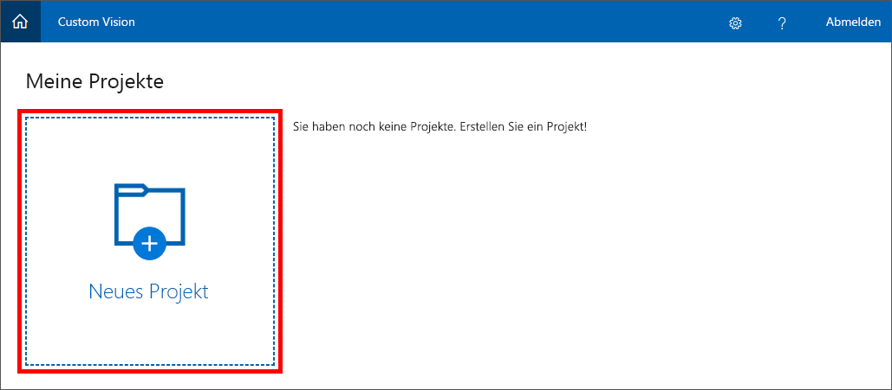
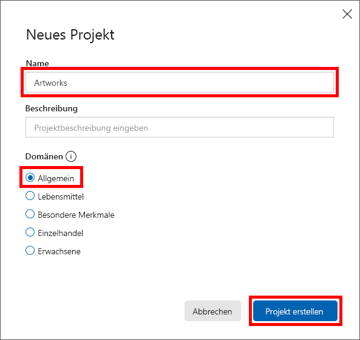

Wenn Sie mithilfe von Custom Vision Service ein Modell zur Bildklassifizierung erstellen möchten, müssen Sie in einem ersten Schritt ein Projekt erstellen.The first step in building an image-classification model with the Custom Vision Service is to create a project. In dieser Einheit erfahren Sie, wie Sie das Custom Vision Service-Portal verwenden, um ein Custom Vision Service-Projekt zu erstellen.In this unit, you will use the Custom Vision Service portal to create a Custom Vision Service project.

1. Öffnen Sie das [Custom Vision Service-Portal](https://www.customvision.ai/) in Ihrem Browser.Open the [Custom Vision Service portal](https://www.customvision.ai/) in your browser. Klicken Sie anschließend auf **Anmelden**.Then click **Sign In**.

    

1. Wenn Sie aufgefordert werden, sich anzumelden, geben Sie die Anmeldeinformationen für Ihr Microsoft-Konto ein.If you are asked to sign in, do so using the credentials for your Microsoft account. Wenn Sie zustimmen sollen, dass diese App auf Ihre Daten zugreifen kann, klicken Sie auf **Ja**, und stimmen Sie den Vertragsbedingungen zu, wenn Sie dazu aufgefordert werden.If you are asked to let this app access your info, click **Yes**, and if prompted, agree to the terms of service.

1. Klicken Sie auf **Neues Projekt**, um ein neues Projekt zu erstellen.Click **New Project** to create a new project.

    

1. Geben Sie dem Projekt im Dialogfeld „Neues Projekt“ den Namen „Kunstwerke“, prüfen Sie, ob **Allgemein** als Domäne ausgewählt ist, und klicken Sie auf **Projekt erstellen**.In the "New project" dialog, name the project "Artworks," ensure that **General** is selected as the domain, and click **Create project**.

    > Domänen optimieren Modelle für bestimmte Bildtypen.A domain optimizes a model for specific types of images. Wenn Sie z.B. Bilder von Essen nach dargestellter Essensart oder nach Landesküche klassifizieren möchten, sollten Sie die Domäne „Essen“ auswählen.For example, if your goal is to classify food images by the types of food they contain or the ethnicity of the dishes, then it might be helpful to select the Food domain. In Szenarios, die nicht im Zusammenhang mit einer der angebotenen Domänen stehen, oder wenn Sie unsicher sind, welche Domäne die Richtige ist, wählen Sie die Domäne „Allgemein“ aus.For scenarios that don't match any of the offered domains, or if you are unsure of which domain to choose, select the General domain.

   

Laden Sie in einem nächsten Schritt Bilder in das Projekt, und weisen Sie diesen zur Klassifizierung Tags zu.The next step is to upload images to the project and assign tags to those images to classify them.