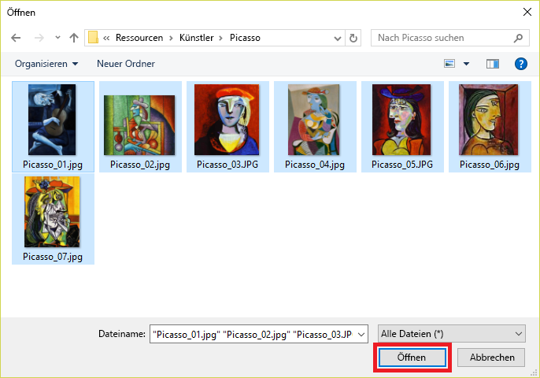

In this unit, you will add images of famous paintings by Picasso, Pollock, and Rembrandt to the Artworks project, and tag the images so the Custom Vision Service can learn to differentiate one artist from another.

1. Click **Add images** to add images to the project.

    

1. Click **Browse local files**.

    

    _Browsing for local images_

1. Browse to the "Artists\Picasso" folder in the [resources that accompany this module](https://a4r.blob.core.windows.net/public/cvs-resources.zip), select all of the files in the folder, and click **Open**.

    

1. Type "painting" (without quotation marks) into the **Add some tags...** box. Then click **+** to assign the tag to the images.

    

1. Repeat Step 4 to add a "Picasso" tag to the images.

1. Click **Upload 7 files** to upload the images. Once the upload has finished, click **Done**.

    

1. Confirm that the images you uploaded appear in the portal, along with the tags assigned to them.

    

1. With seven Picasso images, the Custom Vision Service can do a decent job of identifying paintings by Picasso. But if you trained the model right now, it would only understand what a Picasso looks like, and it would not be able to identify paintings by other artists.

	The next step is to upload some paintings by another artist. Click **Add images** and select all of the images in the "Artists\Rembrandt" folder in the module resources. Tag them with the labels "painting" and "Rembrandt" (not "Picasso"), and upload them to the project.

    > When you add the tag "painting," you don't have to type it in again. You can select it from the drop-down list attached to the **Add some tags...** box, as shown below. You **will** have to type "Rembrandt" and click **+** to add a "Rembrandt" tag.

    

1. Confirm that the Rembrandt images appear alongside the Picasso images in the project, and that "Rembrandt" appears in the list of tags.

    

1. Now add paintings by the enigmatic artist Jackson Pollock to enable the Custom Vision Service to recognize Pollock paintings, too. Select all of the images in the "Artists\Pollock" folder in the module resources, tag them with the terms "painting" and "Pollock", and upload them to the project.

With the tagged images uploaded, the next step is to train the model with these images so it can distinguish between paintings by Picasso, Rembrandt, and Pollock, as well as determine whether a painting is a work by one of these famous artists.