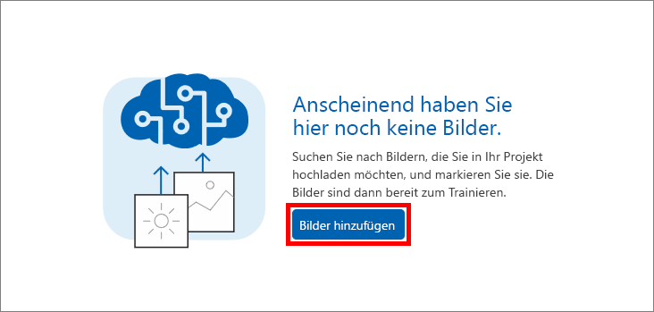
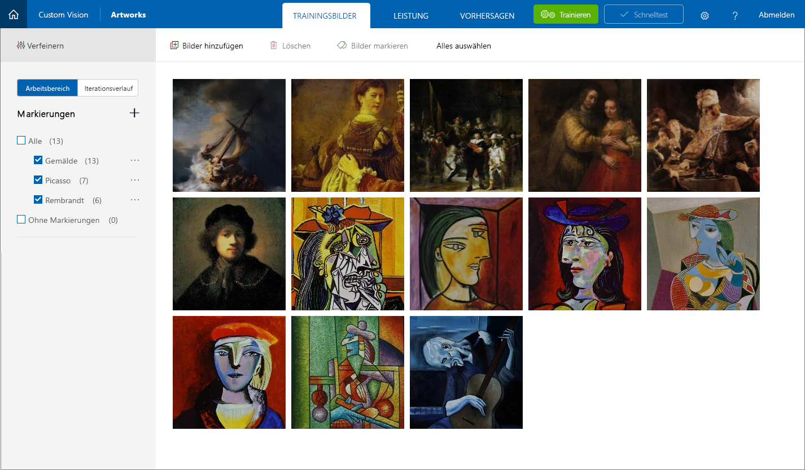

In dieser Lektion fügen Sie dem Artworks-Projekt Bilder von berühmten Gemälden von Picasso, Pollock und Rembrandt hinzu. Anschließend taggen Sie die Bilder, damit der Custom Vision Service lernt, die Künstler voneinander zu unterscheiden.

1. Klicken Sie im **Artworks**-Projekt, das Sie erstellt haben, in der Seitenleiste rechts neben **Tags** auf das Pluszeichen (**+**).

     

1. Ein Dialogfeld namens **Name the tag** (Tag benennen) wird angezeigt. Geben Sie *painting* (Gemälde) in das Namensfeld des Tags ein, und klicken Sie auf **Save** (Speichern). Bei diesem Vorgang wird das Tag *painting* in der Tagliste erstellt. Fügen Sie nun weitere Tags hinzu. 

1. Wiederholen Sie Schritt 2, und fügen Sie Tags mit den Werten *Picasso*, *Pollock* und *Rembrandt* hinzu. Anschließend sollte die Tagliste etwa wie die folgende aussehen.

    

    Wie Sie sehen können, beträgt die Anzahl der Bilder in Ihrem Projekt, die mit jedem dieser Tags gekennzeichnet sind, 0 (null). Fügen Sie nun weitere Bilder zu Ihrem Projekt hinzu, und weisen Sie ihnen Tags zu.

1. Laden Sie die Datei [cvs-resources.zip](https://github.com/MicrosoftDocs/mslearn-classify-images-with-the-custom-vision-service/raw/master/cvs-resources.zip) herunter, die Bildressourcen für dieses Modul enthält, und entpacken Sie sie auf Ihrem lokalen Computer. 

1. Klicken Sie auf **Add images** (Bilder hinzufügen), um dem Projekt Bilder hinzuzufügen.

    

1. Navigieren Sie im Ordner **cvs-resources**, den Sie in Schritt 4 lokal heruntergeladen haben, zum Ordner „Artists\Picasso“.

1. Wählen Sie alle Dateien in „Artists\Picasso“ aus, und klicken Sie dann auf **Open** (Öffnen).

    

1. Das Dialogfeld **Image upload** (Bildupload) wird angezeigt und zeigt Miniaturansichten aller Bilder an, die Sie hochladen. Klicken Sie auf das Feld **My Tags** (Meine Tags), woraufhin eine Dropdownliste der Tags geöffnet wird, die Sie diesen Bildern zuweisen können. 

    

1. Wählen Sie die Tags *painting* und *Picasso* aus, und klicken Sie dann auf **Upload 7 files** (7 Dateien hochladen), um den Upload abzuschließen. 

1. Vergewissern Sie sich, dass die hochgeladenen Bilder sich jetzt im Projekt „Artworks“ befinden und dass die Tagliste aktualisiert wurde und anzeigt, dass sieben Bilder mit *Picasso* und *painting* gekennzeichnet wurden.

    

1. Mit sieben Bildern von Picasso kann der Custom Vision Service Originalwerke von Picasso einigermaßen zuverlässig identifizieren. Wenn Sie das Modell aber gerade erst trainiert haben, würde es nur Gemälde von Picasso erkennen und nicht die anderer Künstler. Im nächsten Schritt werden einige Originalwerke eines anderen Künstlers hochgeladen. 

1. Klicken Sie auf **Add images** (Bilder hinzufügen), und wählen Sie alle Bilder im Ordner „Artists\Rembrandt“ in den Modulressourcen aus. Taggen Sie sie mit den Bezeichnungen „painting“ und „Rembrandt“ (nicht „Picasso“), und klicken Sie auf **Upload 6 files** (6 Dateien hochladen), um sie in das Projekt hochzuladen.

    

1. Vergewissern Sie sich, dass die Bilder Rembrandts zusammen mit den Bildern Picassos im Projekt angezeigt werden, und dass „Rembrandt“ in der Liste der Tags angezeigt wird.

    

1. Fügen Sie nun Originalwerke des geheimnisvollen Künstlers Jackson Pollock hinzu, damit der Custom Vision Service Originalwerke Pollocks ebenfalls erkennen kann. Wählen Sie alle Bilder im Ordner „Artists\Pollock“ in den Modulressourcen aus, markieren Sie sie mit den Begriffen „painting“ und „Pollock“, und laden Sie sie in das Projekt hoch.

Wenn die markierten Bilder hochgeladen sind, trainieren Sie im nächsten Schritt das Modell mit diesen Bildern, damit es sowohl zwischen Originalwerken von Picasso, Rembrandt und Pollock unterscheiden als auch bestimmen kann, ob ein Gemälde eine Arbeit eines dieser berühmten Künstler ist.