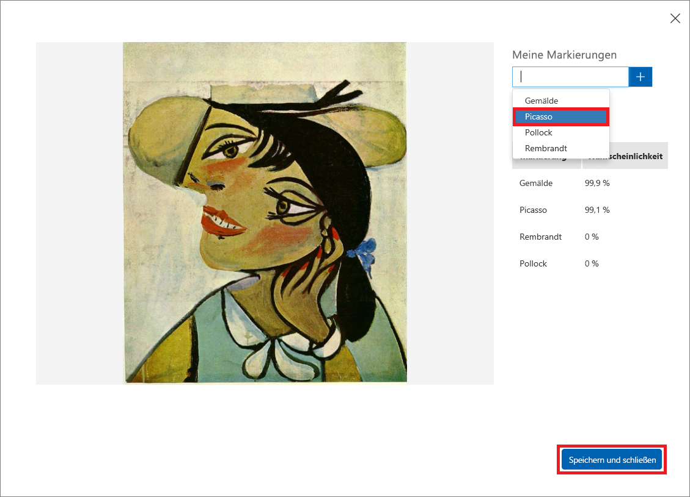

Nachdem Sie das Modell trainiert haben, ist es an der Zeit, es zu testen. Sie stellen dem Modell neue Bilder zur Verfügung und sehen, wie gut es diese klassifiziert.

1. Klicken Sie oben auf der Seite auf **Quick Test** (Schnelltest).

    

1. Klicken Sie auf **Lokale Dateien durchsuchen**, und navigieren Sie dann in den Modulressourcen zum Ordner „Quick Tests“, den Sie zuvor heruntergeladen haben. Wählen Sie **PicassoTest_01.jpg** aus, und klicken Sie auf **Öffnen**.

    

1. Überprüfen Sie die Ergebnisse des Tests im Dialogfeld „Quick Test“. Mit welcher Wahrscheinlichkeit ist das Gemälde von Picasso? Mit welcher Wahrscheinlichkeit ist es von Rembrandt oder Pollock?

    

1. Schließen Sie das Dialogfeld „Quick Test“. Klicken Sie dann am oberen Rand der Seite auf **Vorhersagen**.

    

1. Klicken Sie auf das Testbild, das Sie hochgeladen haben, um eine Detailansicht anzuzeigen. Markieren Sie das Bild dann als ein „Picasso“, indem Sie in der Dropdownliste **Picasso** auswählen und auf **Speichern und schließen** klicken.

    > Indem Sie die Testbilder auf diese Weise markieren, können Sie das Modell optimieren, ohne zusätzliche Trainingsbilder hochzuladen.

    

1. Führen Sie einen weiteren Schnelltest durch, und verwenden Sie dieses Mal im Ordner „Quick Test“ die Datei **FlowersTest.jpg**. Vergewissern Sie sich, dass diesem Bild eine niedrige Wahrscheinlichkeit zugeordnet ist, von Picasso, Rembrandt oder Pollock zu stammen.

Das Modell wurde trainiert und ist einsatzbereit, es scheint erfahren im Identifizieren von Gemälden gewisser Künstler zu sein. Rufen Sie den Vorhersageendpunkt über HTTP auf, und sehen Sie, was passiert.