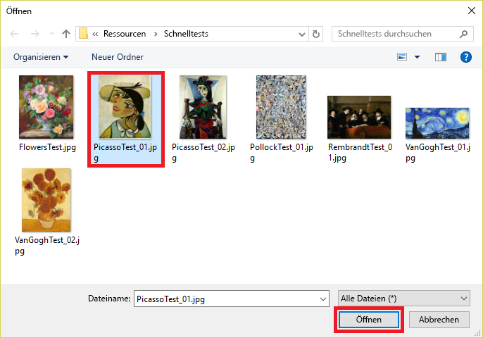

Später erstellen Sie in diesem Modul eine Node.js-App, die das Modell verwendet, um den Künstler von Bildern zu identifizieren, die ihr vorgeführt werden.Later in this module, you will create a Node.js app that uses the model to identify the artist of paintings presented to it. Sie müssen jedoch keine App schreiben, um das Modell zu testen. Sie können Ihre Tests im Portal ausführen und das Modell mithilfe der Bilder, die Sie zum Testen verwenden, weiter optimieren.But you don't have to write an app to test the model; you can do your testing in the portal, and you can further refine the model using the images that you test with. In dieser Einheit testen Sie mithilfe für Sie bereitgestellter Bilder die Fähigkeit des Modells, den Künstler eines Gemäldes zu identifizieren.In this unit, you will test the model's ability to identify the artist of a painting using test images provided for you.

1. Klicken Sie ganz oben auf der Seite auf **Quick Test** (Schnelltest).Click **Quick Test** at the top of the page.

    

1. Klicken Sie auf **Lokale Dateien durchsuchen**, und navigieren Sie dann in den Modulressourcen zum Ordner „Quick Tests“.Click **Browse local files**, and then browse to the "Quick Tests" folder in the module resources. Wählen Sie **PicassoTest_01.jpg** aus, und klicken Sie auf **Öffnen**.Select **PicassoTest_01.jpg**, and click **Open**.

    

1. Überprüfen Sie die Ergebnisse des Tests im Dialogfeld „Quick Test“.Examine the results of the test in the "Quick Test" dialog. Mit welcher Wahrscheinlichkeit ist das Gemälde von Picasso?What is the probability that the painting is a Picasso? Mit welcher Wahrscheinlichkeit ist es von Rembrandt oder Pollock?What is the probability that it is a Rembrandt or Pollock?

1. Schließen Sie das Dialogfeld „Quick Test“.Close the "Quick Test" dialog. Klicken Sie dann am oberen Rand der Seite auf **Vorhersagen**.Then click **Predictions** at the top of the page.

    

1. Klicken Sie auf das Testbild, das Sie hochgeladen haben, um eine Detailansicht anzuzeigen.Click the test image that you uploaded to show a detail of it. Markieren Sie das Bild dann als ein „Picasso“, indem Sie in der Dropdownliste **Picasso** auswählen und auf **Speichern und schließen** klicken.Then tag the image as a "Picasso" by selecting **Picasso** from the drop-down list and clicking **Save and close**.

    > Indem Sie die Testbilder auf diese Weise markieren, können Sie das Modell optimieren, ohne zusätzliche Trainingsbilder hochzuladen.By tagging test images this way, you can refine the model without uploading additional training images.

    

1. Führen Sie einen weiteren Schnelltest mit der Datei **FlowersTest.jpg** im Ordner „Quick Test“ durch.Perform another quick test using the file named **FlowersTest.jpg** in the "Quick Test" folder. Vergewissern Sie sich, dass diesem Bild eine niedrige Wahrscheinlichkeit zugeordnet ist, von Picasso, Rembrandt oder Pollock zu stammen.Confirm that this image is assigned a low probability of being a Picasso, a Rembrandt, or a Pollock.

Das Modell wurde trainiert und ist einsatzbereit, es scheint erfahren im Identifizieren von Gemälden gewisser Künstler zu sein.The model is trained and ready to go and appears to be adept at identifying paintings by certain artists. Gehen Sie nun einen Schritt weiter, und integrieren Sie die Intelligenz des Modells in eine App.Now let's go a step further and incorporate the model's intelligence into an app.