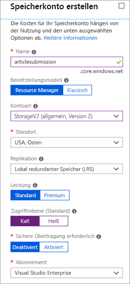

Direkte Kommunikation zwischen den Komponenten einer verteilten Anwendung kann problematisch sein, da sie unterbrochen werden könnte, wenn die Netzwerkbandbreite niedrig oder die Nachfrage hoch ist.

Wir haben in unserem System Folgendes festgestellt: Das Webportal ruft einen Webdienst auf, der einwandfrei funktioniert, wenn der Dienst rechtzeitig reagiert. Hoher Datenverkehr führt zu Problemen, und der Plan ist also, eine Warteschlange zu verwenden, um die direkte Verknüpfung zwischen den Front-End-Apps und Ihrem Webdienst der mittleren Ebene aufzuheben.

## <a name="what-is-azure-queue-storage"></a>Was ist Azure Queue Storage?

Azure Queue Storage ist ein Azure-Dienst, der cloudbasierte Warteschlangen implementiert. Jede Warteschlange verwaltet eine Liste von Nachrichten. Anwendungskomponenten greifen mithilfe einer REST-API oder einer von Azure bereitgestellten Clientbibliothek auf eine Warteschlange zu. In der Regel verfügen Sie über mindestens eine _Senderkomponente_ und mindestens eine _Empfängerkomponente_. Senderkomponenten fügen der Warteschlange Nachrichten hinzu. Empfängerkomponenten rufen Nachrichten am Anfang der Warteschlange zur Verarbeitung ab. Die folgende Abbildung zeigt mehrere Senderanwendungen beim Hinzufügen von Nachrichten zur Azure-Warteschlange und eine Empfängeranwendung beim Abrufen der Nachrichten.


Die Preise basieren auf Größe der Warteschlange und Anzahl der Vorgänge. Größere Nachrichtenwarteschlangen sind teurer als kleinere Warteschlangen. Auch für jeden Vorgang wie Hinzufügen oder Löschen einer Nachricht fallen Gebühren an. Ausführliche Informationen zu Preisen finden Sie unter [Azure Queue Storage – Preise](https://azure.microsoft.com/pricing/details/storage/queues/).

## <a name="why-use-queues"></a>Warum sollte ich Warteschlangen verwenden?

Eine Warteschlange erhöht die Resilienz durch vorübergehendes Speichern wartender Nachrichten. Bei geringer oder normaler Nachfrage bleibt die Warteschlange klein, weil die Zielkomponente Nachrichten schneller aus der Warteschlange entfernt, als sie hinzugefügt werden. Bei hoher Nachfrage wird die Warteschlange möglicherweise größer, aber es gehen keine Nachrichten verloren. Die Zielkomponente kann aufholen und die Warteschlange leeren, wenn die Nachfrage zur Normalität zurückkehrt.

Da eine einzelne Warteschlange bis zu **500TB** groß sein kann, könnte sie potenziell _Millionen_ von Nachrichten speichern. Der Zieldurchsatz einer einzelnen Warteschlange beträgt 2.000 Nachrichten pro Sekunde, d.h. sie kann Szenarios mit hohem Volumen behandeln.

Warteschlangen ermöglichen Ihrer Anwendung eine automatische und sofortige Skalierung, wenn sich die Nachfrage ändert. Darum sind sie so hilfreich bei wichtigen Geschäftsdaten, deren Verlust ein Schaden wäre. Azure bietet viele andere Dienste, die automatisch skalieren. Das Feature **Autoskalierung** ist z.B. für Azure-VM-Skalierungsgruppen, Clouddienste, Azure App Service-Pläne und App Service-Umgebungen verfügbar. Damit können Sie Regeln definieren, die Azure verwendet, um Phasen mit hoher Nachfrage zu identifizieren und automatisch ohne Einbeziehung eines Administrators Kapazität hinzuzufügen. Autoskalierung reagiert schnell, aber nicht sofort auf die Nachfrage. Im Gegensatz dazu reagiert Azure Queue Storage sofort auf starke Nachfrage, indem Nachrichten gespeichert werden, bis Verarbeitungsressourcen verfügbar sind.

## <a name="what-is-a-message"></a>Was ist eine Nachricht?

Eine Nachricht in einer Warteschlange ist ein Bytearray von bis zu 64KB. Nachrichteninhalte werden von Azure-Komponenten prinzipiell nicht interpretiert.

Wenn Sie eine strukturierte Nachricht erstellen möchten, können Sie den Nachrichteninhalt mit XML oder JSON formatieren. Der Code ist für das Generieren und Interpretieren Ihres benutzerdefinierten Formats verantwortlich. Sie könnten z.B. eine benutzerdefinierte JSON-Nachricht erstellen, die wie folgt aussieht:

```json
{
    "Message": {
        "To": "news@contoso.com",
        "From": "writer@contoso.com",
        "Subject": "Support request",
        "Body": "Send me a photographer!"
    }
}
```

## <a name="creating-a-storage-account"></a>Erstellen eines Speicherkontos

Eine Warteschlange muss zu einem Speicherkonto gehören. Sie können ein Speicherkonto über die Azure-Befehlszeilenschnittstelle (oder PowerShell) oder das Azure-Portal erstellen. Das Portal ist aufgrund der Benutzerführung am einfachsten, und jede Information wird von Ihnen abgefragt. 

Der folgende Screenshot zeigt den Speicherort der Storage-Kontenkategorie.


Wenn Sie das Konto erstellen, können Sie mehrere Optionen angeben, bei denen Sie meist die Standardauswahl verwenden können. Wir haben diese Optionen in einem vorherigen Modul behandelt, aber Sie können den Mauszeiger auf den `(i)`-Tipp setzen, der jeder Option zugeordnet ist, um eine Erinnerung an die Funktion zu erhalten. Hier ist ein Beispiel für das Ausfüllen des Portalblatts.

Der folgende Screenshot zeigt das Blatt „Speicherkonto erstellen“ und die zum Erstellen eines Speicherkontos erforderlichen Informationen.



### <a name="settings-for-queues"></a>Einstellungen für Warteschlangen
Wenn Sie ein Speicherkonto erstellen, das Warteschlangen enthalten soll, sollten Sie die folgenden Einstellungen berücksichtigen:

- Warteschlangen sind nur als Teil von Azure-Speicherkonten für allgemeine Zwecke (v1 oder v2) verfügbar. Sie können sie nicht Blobspeicherkonten hinzufügen.
- Die für StorageV2-Konten angezeigte Einstellung **Zugriffsebene** gilt nur für Blobspeicher und wirkt sich nicht auf Warteschlangen aus.
- Sie sollten einen Speicherort auswählen, der sich entweder in der Nähe der Quell- oder der Zielkomponenten bzw. (vorzugsweise) beider befindet.
- Daten werden zum Schutz vor Datenträgerfehlern und anderen Hardwareproblemen immer auf mehreren Servern repliziert. Sie können zwischen verschiedenen Replikationsstrategien wählen: **Lokal redundanter Speicher (Locally Redundant Storage, LRS)** ist kostengünstig, aber anfällig für Notfälle, die ein gesamtes Rechenzentrum betreffen, während **georedundanter Speicher (Geo-Redundant Storage, GRS)** Daten in anderen Azure-Rechenzentren repliziert. Wählen Sie die Replikationsstrategie, die Ihre Redundanzanforderungen erfüllt.
- Die Leistungsstufe bestimmt, wie die Nachrichten gespeichert werden: **Standard** verwendet magnetische Laufwerke, **Premium** Festkörperlaufwerke. Wählen Sie „Standard“, wenn Sie kurze Nachfragespitzen erwarten. Wählen Sie „Premium“, wenn die Warteschlange manchmal lang wird, und Sie die Zeit für den Zugriff auf Nachrichten minimieren müssen.
- Fordern Sie eine sichere Übertragung, wenn vertrauliche Informationen über die Warteschlange geleitet werden könnten. Diese Einstellung stellt sicher, dass alle Verbindungen mit der Warteschlange mithilfe von Secure Sockets Layer (SSL) verschlüsselt werden.