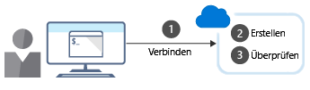

<span data-ttu-id="f0bdd-101">Mit der Azure CLI können Sie Befehle eingeben und diese sofort über die Befehlszeile ausführen.</span><span class="sxs-lookup"><span data-stu-id="f0bdd-101">The Azure CLI lets you type commands and execute them immediately from the command line.</span></span> <span data-ttu-id="f0bdd-102">Beachten Sie, dass das Ziel bei der Softwareentwicklung darin besteht, neue Builds einer Web-App zum Testen bereitzustellen.</span><span class="sxs-lookup"><span data-stu-id="f0bdd-102">Recall that the overall goal in the software development example is to deploy new builds of a web app for testing.</span></span> <span data-ttu-id="f0bdd-103">Zunächst befassen Sie sich mit den Aufgaben, die mithilfe der Azure CLI erledigt werden können.</span><span class="sxs-lookup"><span data-stu-id="f0bdd-103">Let's talk about the sorts of tasks you can do with the Azure CLI.</span></span>

## <a name="what-azure-resources-can-be-managed-using-the-azure-cli"></a><span data-ttu-id="f0bdd-104">Welche Azure-Ressourcen können unter Verwendung der Azure CLI verwaltet werden?</span><span class="sxs-lookup"><span data-stu-id="f0bdd-104">What Azure resources can be managed using the Azure CLI?</span></span>

<span data-ttu-id="f0bdd-105">Mithilfe der Azure CLI können Sie nahezu alle Aspekte jeder Azure-Ressource steuern.</span><span class="sxs-lookup"><span data-stu-id="f0bdd-105">The Azure CLI lets you control nearly every aspect of every Azure resource.</span></span> <span data-ttu-id="f0bdd-106">Sie können mit Ressourcengruppen, Speicher, virtuellen Computern, Azure Active Directory (Azure AD), Containern, maschinellem Lernen usw. arbeiten.</span><span class="sxs-lookup"><span data-stu-id="f0bdd-106">You can work with resource groups, storage, virtual machines, Azure Active Directory (Azure AD), containers, machine learning, and so on.</span></span>

<span data-ttu-id="f0bdd-107">Befehle in der CLI sind in _Gruppen_ und _Untergruppen_ strukturiert.</span><span class="sxs-lookup"><span data-stu-id="f0bdd-107">Commands in the CLI are structured in _groups_ and _subgroups_.</span></span> <span data-ttu-id="f0bdd-108">Jede Gruppe stellt einen von Azure bereitgestellten Dienst dar, und die Untergruppen unterteilen Befehle für diese Dienste in logische Gruppierungen.</span><span class="sxs-lookup"><span data-stu-id="f0bdd-108">Each group represents a service provided by Azure, and the subgroups divide commands for these services into logical groupings.</span></span> <span data-ttu-id="f0bdd-109">Beispielsweise enthält die Gruppe `storage` Untergruppen wie **account**, **blob**, **storage** und **queue**.</span><span class="sxs-lookup"><span data-stu-id="f0bdd-109">For example, the `storage` group contains subgroups including **account**, **blob**, **storage**, and **queue**.</span></span>

<span data-ttu-id="f0bdd-110">Wie können die benötigten Befehle ermittelt werden?</span><span class="sxs-lookup"><span data-stu-id="f0bdd-110">So, how do you find the particular commands you need?</span></span> <span data-ttu-id="f0bdd-111">Eine Möglichkeit ist die Verwendung von `az find`.</span><span class="sxs-lookup"><span data-stu-id="f0bdd-111">One way is to use `az find`.</span></span> <span data-ttu-id="f0bdd-112">Wenn Sie etwa nach Befehlen im Zusammenhang mit der Verwaltung eines Speicherblobs suchen möchten, können Sie hierzu den folgenden Befehl verwenden:</span><span class="sxs-lookup"><span data-stu-id="f0bdd-112">For example, if you want to find commands that might help you manage a storage blob, you can use the following find command:</span></span>

```azurecli
az find -q blob
```

<span data-ttu-id="f0bdd-113">Wenn Sie bereits den Namen des Befehls kennen, erhalten Sie mit dem `--help`-Argument ausführliche Informationen zu diesem Befehl. Im Fall einer Befehlsgruppe wird eine Liste der verfügbaren Unterbefehle angezeigt.</span><span class="sxs-lookup"><span data-stu-id="f0bdd-113">If you already know the name of the command you want, the `--help` argument for that command will get you more detailed information on the command, and for a command group, a list of the available subcommands.</span></span> <span data-ttu-id="f0bdd-114">Im Speicherbeispiel können Sie folgendermaßen eine Liste der Untergruppen und Befehle zum Verwalten des Blobspeichers abrufen:</span><span class="sxs-lookup"><span data-stu-id="f0bdd-114">So, with our storage example, here's how you can get a list of the subgroups and commands for managing blob storage:</span></span>

```azurecli
az storage blob --help
```

## <a name="how-to-create-an-azure-resource"></a><span data-ttu-id="f0bdd-115">Erstellen einer Azure-Ressource</span><span class="sxs-lookup"><span data-stu-id="f0bdd-115">How to create an Azure resource</span></span>

<span data-ttu-id="f0bdd-116">Beim Erstellen einer neuen Azure-Ressource werden typischerweise drei Schritte durchlaufen: Verbindungsherstellung mit Ihrem Azure-Abonnement, Erstellung der Ressource und Überprüfung der erfolgreichen Erstellung.</span><span class="sxs-lookup"><span data-stu-id="f0bdd-116">When creating a new Azure resource, there are typically three steps: connect to your Azure subscription, create the resource, and verify that creation was successful.</span></span> <span data-ttu-id="f0bdd-117">Die folgende Abbildung zeigt eine allgemeine Prozessübersicht.</span><span class="sxs-lookup"><span data-stu-id="f0bdd-117">The following illustration shows a high-level overview of the process.</span></span>



<span data-ttu-id="f0bdd-119">Jeder Schritt entspricht einem anderen Azure CLI-Befehl.</span><span class="sxs-lookup"><span data-stu-id="f0bdd-119">Each step corresponds to a different Azure CLI command.</span></span>

### <a name="connect"></a><span data-ttu-id="f0bdd-120">Verbinden</span><span class="sxs-lookup"><span data-stu-id="f0bdd-120">Connect</span></span>

<span data-ttu-id="f0bdd-121">Da Sie mit einer lokalen Installation der Azure CLI arbeiten, müssen Sie sich zunächst mithilfe des Azure CLI-Befehls **login** authentifizieren, um Azure-Befehle ausführen zu können.</span><span class="sxs-lookup"><span data-stu-id="f0bdd-121">Since you're working with a local install of the Azure CLI, you'll need to authenticate before you can execute Azure commands, by using the Azure CLI **login** command.</span></span>

```azurecli
az login
```

<span data-ttu-id="f0bdd-122">Die Azure CLI verwendet typischerweise Ihren Standardbrowser, um die Seite für die Azure-Anmeldung zu öffnen.</span><span class="sxs-lookup"><span data-stu-id="f0bdd-122">The Azure CLI will typically launch your default browser to open the Azure sign-in page.</span></span> <span data-ttu-id="f0bdd-123">Falls dies nicht funktioniert, folgen Sie den Befehlszeilenanweisungen, und geben Sie unter [https://aka.ms/devicelogin](https://aka.ms/devicelogin) einen Autorisierungscode ein.</span><span class="sxs-lookup"><span data-stu-id="f0bdd-123">If this doesn't work, follow the command-line instructions and enter an authorization code at [https://aka.ms/devicelogin](https://aka.ms/devicelogin).</span></span>

<span data-ttu-id="f0bdd-124">Nach der erfolgreichen Anmeldung wird eine Verbindung mit Ihrem Azure-Abonnement hergestellt.</span><span class="sxs-lookup"><span data-stu-id="f0bdd-124">After a successful sign in, you'll be connected to your Azure subscription.</span></span>

### <a name="create"></a><span data-ttu-id="f0bdd-125">Erstellen</span><span class="sxs-lookup"><span data-stu-id="f0bdd-125">Create</span></span>

<span data-ttu-id="f0bdd-126">Häufig müssen Sie eine neue Ressourcengruppe erstellen, bevor Sie einen neuen Azure-Dienst erstellen. Deshalb verwenden wir Ressourcengruppen als Beispiel dafür, wie Azure-Ressourcen über die CLI erstellt werden.</span><span class="sxs-lookup"><span data-stu-id="f0bdd-126">You'll often need to create a new resource group before you create a new Azure service, so we'll use resource groups as an example to show how to create Azure resources from the CLI.</span></span>

<span data-ttu-id="f0bdd-127">Mit dem Azure CLI-Befehl **group create** wird eine Ressourcengruppe erstellt.</span><span class="sxs-lookup"><span data-stu-id="f0bdd-127">The Azure CLI **group create** command creates a resource group.</span></span> <span data-ttu-id="f0bdd-128">Sie müssen einen Namen und einen Standort angeben.</span><span class="sxs-lookup"><span data-stu-id="f0bdd-128">You must specify a name and location.</span></span> <span data-ttu-id="f0bdd-129">Der Name muss innerhalb Ihres Abonnements eindeutig sein.</span><span class="sxs-lookup"><span data-stu-id="f0bdd-129">The name must be unique within your subscription.</span></span> <span data-ttu-id="f0bdd-130">Der Standort bestimmt, wo die Metadaten für Ihre Ressourcengruppe gespeichert werden.</span><span class="sxs-lookup"><span data-stu-id="f0bdd-130">The location determines where the metadata for your resource group will be stored.</span></span> <span data-ttu-id="f0bdd-131">Sie verwenden Zeichenfolgen wie „West US“, „North Europe“ oder „West India“, um den Standort anzugeben. Alternativ können Sie aus einem Wort bestehende Äquivalente eingeben, z.B. „westus“, „northeurope“ oder „westindia“.</span><span class="sxs-lookup"><span data-stu-id="f0bdd-131">You use strings like "West US", "North Europe", or "West India" to specify the location; alternatively, you can use single word equivalents, such as westus, northeurope, or westindia.</span></span> <span data-ttu-id="f0bdd-132">Die grundlegende Syntax lautet wie folgt:</span><span class="sxs-lookup"><span data-stu-id="f0bdd-132">The core syntax is:</span></span>

```azurecli
az group create --name <name> --location <location>
```

### <a name="verify"></a><span data-ttu-id="f0bdd-133">Überprüfen</span><span class="sxs-lookup"><span data-stu-id="f0bdd-133">Verify</span></span>

<span data-ttu-id="f0bdd-134">Für viele Azure-Ressourcen stellt die Azure CLI einen Unterbefehl **list** bereit, mit dem Ressourcendetails angezeigt werden können.</span><span class="sxs-lookup"><span data-stu-id="f0bdd-134">For many Azure resources, the Azure CLI provides a **list** subcommand to view resource details.</span></span> <span data-ttu-id="f0bdd-135">Beispielsweise können Sie mit dem Azure CLI-Befehl **group list** Ihre Azure-Ressourcengruppen auflisten.</span><span class="sxs-lookup"><span data-stu-id="f0bdd-135">For example, the Azure CLI **group list** command lists your Azure resource groups.</span></span> <span data-ttu-id="f0bdd-136">So können wir hier überprüfen, ob die Ressourcengruppe erfolgreich erstellt wurde:</span><span class="sxs-lookup"><span data-stu-id="f0bdd-136">This is useful here to verify whether creation of the resource group was successful:</span></span>

```azurecli
az group list
```

<span data-ttu-id="f0bdd-137">Um eine kompaktere Ansicht zu erhalten, können Sie die Ausgabe als einfache Tabelle formatieren:</span><span class="sxs-lookup"><span data-stu-id="f0bdd-137">To get a more concise view, you can format the output as a simple table:</span></span>

```azurecli
az group list --output table
```
