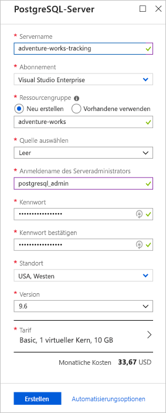
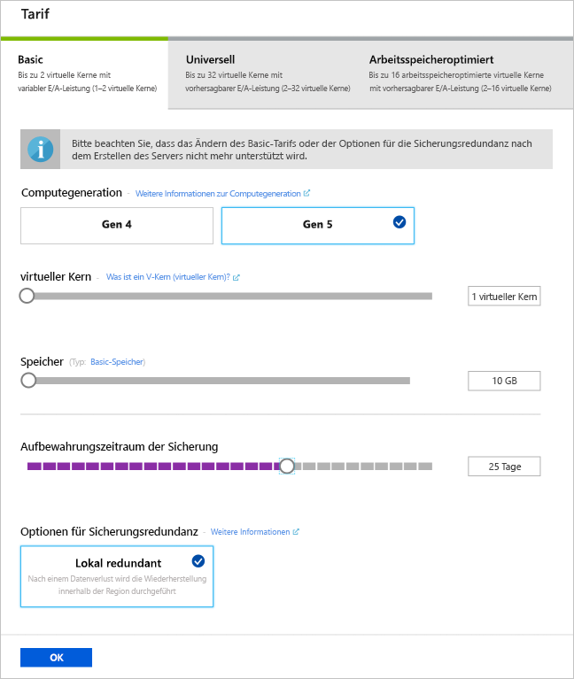

Nehmen wir an, dass Sie zurzeit eine lokale relationale PostgreSQL-Datenbank mit flexiblen Datentypen und Unterstützung von Geodaten nutzen. Ihr Unternehmen möchte expandieren, sodass die Datenbank skaliert werden muss. Als Alternative zur Investition in zusätzliche Hardware werden Sie beauftragt, ein optimales cloudgehostetes Datenbankangebot zu suchen. Sie haben sich entschieden, einen Azure Database for PostgreSQL-Server zu verwenden.

## Was ist ein Azure Database for PostgreSQL-Server?

Die PostgreSQL-Server ist ein zentraler Verwaltungspunkt für eine oder mehrere Datenbanken. Der PostgreSQL-Dienst in Azure ist eine verwaltete Ressource, die Leistungsgarantien und Zugriff sowie Funktionen auf Serverebene bietet.

Ein **Azure Database for PostgreSQL**-Server ist die übergeordnete _Ressource_ für eine Datenbank. Eine _Ressource_ ist ein verwaltbares Element, das über Azure verfügbar ist. Wenn Sie diese Ressource erstellen, können Sie die Serverinstanz konfigurieren.

### Was ist eine Azure Database for PostgreSQL-Serverressource?

Eine Azure Database for PostgreSQL-Serverressource ist ein Container, der eng mit der Lebensdauer Ihrer Server und Datenbanken verbunden ist. Wenn die Serverressource gelöscht wird, werden alle Datenbanken ebenfalls gelöscht. Bedenken Sie, dass alle Ressourcen, die zum übergeordneten Element gehören, in der gleichen Region gehostet werden.

Der Serverressourcenname wird verwendet, um den Serverendpunktnamen zu definieren. Wenn der Ressourcenname z.B. **mypgsqlserver** ist, dann lautet der Name des Servers **mypgsqlserver.postgres.database.azure.com**.

Die Serverressource stellt außerdem den __Verbindungsbereich__ für Verwaltungsrichtlinien bereit, die auf ihre Datenbank angewendet werden. Beispiele: Anmeldung, Firewall, Benutzer, Rollen und Konfiguration.

Genau wie die Open-Source-Version von PostgreSQL ist der Server in mehreren Versionen verfügbar und lässt die Installation von Erweiterungen zu. Sie wählen die zu installierende Serverversion aus.

> [!NOTE]
> Durch Erweiterungen können mehrere SQL-Objekte zu einem einzigen Paket gebündelt und über einen einzigen Befehl geladen oder entfernt werden. Ein Beispiel für eine Erweiterung ist `chkpass`, wodurch ein Datentyp für automatisch verschlüsselte Kennwörter bereitgestellt wird.

## Tarife

Azure Database for PostgreSQL bietet Ihnen die Option, basierend auf Parametern wie Computeleistung und Speicher aus drei Tarifen auszuwählen.

### Basic-Tarif

Der **Basic**-Tarif ist ideal für Workloads, die wenig Compute- und E/A-Leistung erfordern. In diesem Tarif haben Sie Zugriff auf folgende Hardware:

- Compute Gen 4 CPUs auf Basis von Intel E5-2673 v3 (Haswell) 2,4-GHz-Prozessoren, entweder als 1- oder 2-V-Kern-Konfiguration verfügbar
- Compute Gen 5 CPUs auf Basis von Intel E5-2673 v4 (Broadwell) 2,3-GHz-Prozessoren, entweder als 1- oder 2-V-Kern-Konfiguration verfügbar
- Speicher bis zu 1TB
- Lokal redundante Sicherung

Wenn Sie später einen Beispielserver erstellen, werden Sie eine bestimmte Tarifeinstellung verwenden, um die Unterstützung eines bestimmten Szenarios zu veranschaulichen. Bedenken Sie, dass für Produktionsserver ein Tarif ausgewählt werden sollte, der Ihrer Umgebung entspricht.

### Universell

Der Tarif **Universell** ist für die meisten Unternehmensworkloads mit gängigen Compute- und Arbeitsspeicheranforderungen und skalierbarem E/A-Durchsatz ideal. In diesem Tarif haben Sie Zugriff auf folgende Hardware:

- Compute Gen 4 CPUs auf Basis von Intel E5-2673 v3 (Haswell) 2,4-GHz-Prozessoren, verfügbar in 2-, 4-, 8-, 18-, 32-V-Kern-Konfiguration
- Compute Gen 5 CPUs auf Basis von Intel E5-2673 v4 (Broadwell) 2,3-GHz-Prozessoren, verfügbar in 2-, 4-, 8-, 18-, 32-V-Kern-Konfiguration
- Speicher bis zu 4TB
- Lokal redundante Sicherung
- Geografisch redundante Sicherung

### Arbeitsspeicheroptimiert

Der Tarif **Arbeitsspeicheroptimiert** ist für Hochleistungs-Datenbankworkloads ideal, für die In-Memory-Leistung erforderlich ist, um eine schnellere Transaktionsverarbeitung und höhere Parallelität zu erzielen. In diesem Tarif haben Sie Zugriff auf folgende Hardware:

- Compute Gen 5 CPUs auf Basis von Intel E5-2673 v4 (Broadwell) 2,3-GHz-Prozessoren, verfügbar in 2-, 4-, 8-, 16-V-Kern-Konfiguration
- Speicher bis zu 4TB
- Lokal redundante Sicherung
- Geografisch redundante Sicherung

## Schritte zum Erstellen eines Azure Database for PostgreSQL-Servers

In der Regel erstellen Sie einen Azure Database for PostgreSQL-Server über das Azure-Portal. Wir sehen uns diese Schritte nun an.

Zuerst melden Sie sich am Azure-Portal an und klicken auf **Ressource erstellen**.

Wählen Sie **Datenbanken** und **Azure Database for PostgreSQL** aus. Sie können auch die **Suchfunktion** verwenden, um diese Kategorie zu finden.

Das Portal zeigt einen PostgreSQL-Server-Konfigurationsbildschirm an, auch Blatt genannt, und Sie nehmen die Auswahl vor.

Da Sie für alle Elemente auf dem Blatt einen Wert eingeben müssen, werden wir sie im einzelnen betrachten.

### Servername

Weiter oben wurde erwähnt, dass Sie eine Serverressource erstellen werden. Der Servername ist das Element, das diese Ressource angibt. Daher müssen Sie einen eindeutigen Namen für den Server auswählen. Der Servername darf nur Kleinbuchstaben und kann Zahlen und Bindestrichen enthalten.

Angenommen, Sie möchten den Server _Adventure Works Tracking_ nennen. Sie würden dann den Namen als `adventure-works-tracking` festlegen. Wenn Sie versuchen, einen Server mit einem bereits vorhandenen Namen zu erstellen, erhalten Sie eine Fehlermeldung.

### Abonnement

Das Abonnementfeld wird zur Abrechnung verwendet. Sie müssen ein bestimmtes Abonnement auswählen, falls Sie über mehrere Abonnements verfügen.

### Ressourcengruppe

Sie verwenden eine Ressourcengruppe, um alle Ressourcen im Zusammenhang mit dem Server zu verwalten. Sie können eine neue Ressourcengruppe erstellen oder eine vorhandene Ressourcengruppe wiederverwenden.

### Quelle

Sie können entweder die Standardoption _Leer_ auswählen, um von Grund auf einen Server zu erstellen, oder einen Server aus einer vorhandenen Sicherung erstellen. Die Option **Sicherung** bietet die Gelegenheit zum Wiederherstellen einer Geosicherung eines vorhandenen Azure Database for PostgreSQL-Servers.

### Anmeldename des Serveradministrators

Sie erstellen den Serveradministratorbenutzer. Wählen Sie einen Anmeldenamen aus, der als Administratoranmeldung für den neuen Server verwendet wird. Der Administratoranmeldename darf nicht „azure_superuser“, „azure_pg_admin“, „admin“, „administrator“, „root“, „guest“ oder „public“ lauten. Er darf auch nicht mit „pg_“ beginnen. Prägen Sie sich den Namen für die spätere Verwendung ein, bzw. notieren Sie ihn.

### Kennwort

Wählen Sie ein Kennwort für den oben genannten Anmeldenamen für Administratoren aus. Das Kennwort muss Zeichen aus drei der folgenden Kategorien enthalten:
- Englische Großbuchstaben
- Englische Kleinbuchstaben
- Ziffern (0 bis 9)
- Nicht alphanumerische Zeichen (!, $, #, % usw.)

Prägen Sie sich das Kennwort für die spätere Verwendung ein, bzw. notieren Sie es.

### Kennwort bestätigen

Geben Sie das Kennwort zur Bestätigung erneut ein.

### Standort

Mit der Option für den Ort (location) können Sie angeben, wo der Server physisch erstellt wird. Wählen Sie den für Sie nächstgelegenen geografischen Standort aus. In einem realen Szenario sollte der Standort der Standort sein, der für die Mehrzahl der Benutzer am nächsten liegt.

### Version

Sie können die zu verwendende PostgreSQL-Version angeben. Microsoft unterstützt in der Regel die aktuelle Version von PostgreSQL und zwei Vorgängerversionen. Wählen Sie eine Version aus, die Ihrer Produktionsumgebung entspricht.

> [!NOTE]
> Weitere Informationen finden Sie im folgenden Abschnitt:
> - [Unterstützte PostgreSQL-Datenbankversionen](https://docs.microsoft.com/azure/postgresql/concepts-supported-versions)
> - [Versionsverwaltungsrichtlinie](https://www.postgresql.org/support/versioning/)

### Tarif

Wählen Sie einen Tarif aus, der die Workload Ihres Servers unterstützt. Denken Sie daran: Sie haben drei Tarife zur Auswahl. Wie wir gesehen haben, können Sie mit jedem dieser Tarife die Compute- und Speicheroptionen konfigurieren. Im folgenden Beispiel ist der Basic-Tarif mit Gen 5-Compute und einer Beibehaltungsdauer der Sicherung von 25 Tagen ausgewählt.

Jetzt müssen Sie nur noch die Werte überprüfen, die Sie eingegeben haben, notieren, was Sie möglicherweis später verwenden müssen, und auf **Erstellen** klicken, um den Server zu erstellen.

Die Bereitstellung des Servers nimmt einige Minuten in Anspruch. Sie erhalten eine Benachrichtigung, wenn die Bereitstellung abgeschlossen ist. Aus der Benachrichtigung können Sie zum neu erstellten Server navigieren.

Sie haben nun die Schritte kennengelernt, mit denen Sie einen Azure Database for PostgreSQL-Server erstellen. In der nächsten Einheit können Sie Ihren eigenen Azure Database for PostgreSQL-Server erstellen.
