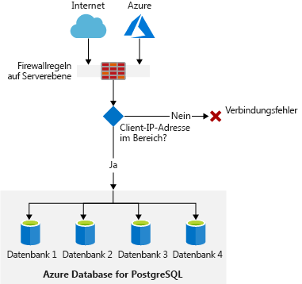

<span data-ttu-id="a70ac-101">Angenommen, Sie arbeiten mit einer lokalen PostgreSQL-Datenbank.</span><span class="sxs-lookup"><span data-stu-id="a70ac-101">Let's assume you're using an on-premises PostgreSQL database.</span></span> <span data-ttu-id="a70ac-102">Sie verwalten sämtliche Sicherheitsaspekte und haben alle Zugriffe auf Ihre Server mit den Standardfirewallregeln auf PostgreSQL-Serverebene gesperrt.</span><span class="sxs-lookup"><span data-stu-id="a70ac-102">You're managing all security aspects and you've locked down all access to your servers using the standard PostgreSQL server-level firewall rules.</span></span> <span data-ttu-id="a70ac-103">Sie möchten nun sicherstellen, dass Sie die gleichen Firewallregeln auf Serverebene in Azure konfigurieren können.</span><span class="sxs-lookup"><span data-stu-id="a70ac-103">Now you want to make sure that you can configure the same server-level firewall rules in Azure.</span></span>

## <a name="server-security-considerations-and-connection-methods"></a><span data-ttu-id="a70ac-104">Überlegungen zur Sicherheit von Servern und Verbindungsmethoden</span><span class="sxs-lookup"><span data-stu-id="a70ac-104">Server security considerations and connection methods</span></span>

<span data-ttu-id="a70ac-105">Sie haben verschiedene Möglichkeiten, den Zugriff auf Ihren Azure Database for PostgreSQL-Server und Ihre Datenbanken einzuschränken.</span><span class="sxs-lookup"><span data-stu-id="a70ac-105">You have a number of options to restrict access to your Azure Database for PostgreSQL server and databases.</span></span> <span data-ttu-id="a70ac-106">Der Netzwerkzugriff kann auf Netzwerk-, Server- oder Datenbankebene eingeschränkt werden.</span><span class="sxs-lookup"><span data-stu-id="a70ac-106">Network access can be restricted at a network, server, or database level.</span></span> <span data-ttu-id="a70ac-107">Sie können auch eine der folgenden Optionen verwenden:</span><span class="sxs-lookup"><span data-stu-id="a70ac-107">You can use any of the following options:</span></span>

- <span data-ttu-id="a70ac-108">Benutzerkonten zum Einschränken des Datenbankzugriffs</span><span class="sxs-lookup"><span data-stu-id="a70ac-108">User accounts to restrict database access</span></span>
- <span data-ttu-id="a70ac-109">Virtuelle Netzwerke zum Einschränken des Netzwerkzugriffs</span><span class="sxs-lookup"><span data-stu-id="a70ac-109">Virtual networks to restrict network access</span></span>
- <span data-ttu-id="a70ac-110">Firewallregeln zum Einschränken des Serverzugriffs</span><span class="sxs-lookup"><span data-stu-id="a70ac-110">Firewall rules to restrict server access</span></span>

### <a name="authentication-and-authorization"></a><span data-ttu-id="a70ac-111">Authentifizierung und Autorisierung</span><span class="sxs-lookup"><span data-stu-id="a70ac-111">Authentication and authorization</span></span>

<span data-ttu-id="a70ac-112">Der Azure Database for PostgreSQL-Server unterstützt die native PostgreSQL-Authentifizierung.</span><span class="sxs-lookup"><span data-stu-id="a70ac-112">The Azure Database for PostgreSQL server supports native PostgreSQL authentication.</span></span> <span data-ttu-id="a70ac-113">Mit den Anmeldeinformationen des Serveradministrators können Sie eine Verbindung mit dem Server herstellen und diesen authentifizieren.</span><span class="sxs-lookup"><span data-stu-id="a70ac-113">You can connect and authenticate to the server with the server's admin login.</span></span> <span data-ttu-id="a70ac-114">Sie erstellen auch Benutzerkonten zum Herstellen einer Verbindung mit bestimmten Datenbanken, um den Zugriff einzuschränken.</span><span class="sxs-lookup"><span data-stu-id="a70ac-114">You'll also create users to connect to specific databases to limit access.</span></span>

### <a name="what-is-a-virtual-network"></a><span data-ttu-id="a70ac-115">Was ist ein virtuelles Netzwerk?</span><span class="sxs-lookup"><span data-stu-id="a70ac-115">What is a virtual network?</span></span>

<span data-ttu-id="a70ac-116">Ein virtuelles Netzwerk ist ein logisch isoliertes Netzwerk in Azure, das im Azure-Netzwerk erstellt wird.</span><span class="sxs-lookup"><span data-stu-id="a70ac-116">A virtual network is a logically isolated network that's created within the Azure network.</span></span> <span data-ttu-id="a70ac-117">Sie können mithilfe eines virtuellen Netzwerks steuern, welche Azure-Ressourcen eine Verbindung mit anderen Ressourcen herstellen können.</span><span class="sxs-lookup"><span data-stu-id="a70ac-117">You can use a virtual network to control what Azure resources can connect to other resources.</span></span>

<span data-ttu-id="a70ac-118">Stellen Sie sich vor, Sie betreiben eine Webanwendung, die eine Verbindung mit einer Datenbank herstellt.</span><span class="sxs-lookup"><span data-stu-id="a70ac-118">Imagine you're running a web application that connects to a database.</span></span> <span data-ttu-id="a70ac-119">Sie verwenden Subnetze, um verschiedene Teile des Netzwerks zu isolieren.</span><span class="sxs-lookup"><span data-stu-id="a70ac-119">You'll use subnets to isolate different parts of the network.</span></span> <span data-ttu-id="a70ac-120">Ein Subnetz ist ein Teil eines Netzwerks, der auf einem IP-Adressbereich basiert.</span><span class="sxs-lookup"><span data-stu-id="a70ac-120">A subnet is a part of a network that's based on a range of IP addresses.</span></span>

<span data-ttu-id="a70ac-121">Um diese Subnetze zu konfigurieren, erstellen Sie ein virtuelles Netzwerk, das Sie anschließend in Subnetze unterteilen.</span><span class="sxs-lookup"><span data-stu-id="a70ac-121">To configure these subnets, you'll create a virtual network and then subdivide the network into subnets.</span></span> <span data-ttu-id="a70ac-122">Die Webanwendung wird in einem Subnetz, die Datenbank in einem anderen betrieben.</span><span class="sxs-lookup"><span data-stu-id="a70ac-122">The web application will operate on one subnet and the database on another subnet.</span></span> <span data-ttu-id="a70ac-123">Jedes Subnetz verfügt über eigene Regeln für die Kommunikation mit dem jeweils anderen Netzwerk.</span><span class="sxs-lookup"><span data-stu-id="a70ac-123">Each subnet will have its own rules for communicating to and from the other network.</span></span> <span data-ttu-id="a70ac-124">Diese Regeln bieten Ihnen die Möglichkeit, den Zugriff der Datenbank auf die Webanwendung zu beschränken.</span><span class="sxs-lookup"><span data-stu-id="a70ac-124">These rules give you the ability to restrict access from the database to the web application.</span></span>

### <a name="what-is-a-firewall"></a><span data-ttu-id="a70ac-125">Was ist eine Firewall?</span><span class="sxs-lookup"><span data-stu-id="a70ac-125">What is a firewall?</span></span>

<span data-ttu-id="a70ac-126">Die Firewall ist ein Dienst, der den Zugriff auf einen Server basierend auf der Ursprungs-IP-Adresse der jeweiligen Anforderung gewährt.</span><span class="sxs-lookup"><span data-stu-id="a70ac-126">A firewall is a service that grants server access based on the originating IP address of each request.</span></span> <span data-ttu-id="a70ac-127">Sie erstellen Firewallregeln, die IP-Adressbereiche festlegen.</span><span class="sxs-lookup"><span data-stu-id="a70ac-127">You create firewall rules that specify ranges of IP addresses.</span></span> <span data-ttu-id="a70ac-128">Nur Clients mit diesen zugewiesenen IP-Adressen dürfen auf den Server zugreifen.</span><span class="sxs-lookup"><span data-stu-id="a70ac-128">Only clients from these granted IP addresses will be allowed to access the server.</span></span> <span data-ttu-id="a70ac-129">Firewallregeln weisen im Allgemeinen auch spezifische Informationen zu Netzwerkprotokollen und Ports auf.</span><span class="sxs-lookup"><span data-stu-id="a70ac-129">Firewall rules, generally speaking, also include specific network protocol and port information.</span></span> <span data-ttu-id="a70ac-130">Beispielsweise lauscht ein PostgreSQL-Server standardmäßig an Port 5432 auf TCP-Anforderungen.</span><span class="sxs-lookup"><span data-stu-id="a70ac-130">For example, a PostgreSQL server by default listens to TCP requests on port 5432.</span></span>

### <a name="azure-database-for-postgresql-server-firewall"></a><span data-ttu-id="a70ac-131">Azure Database for PostgreSQL-Serverfirewall</span><span class="sxs-lookup"><span data-stu-id="a70ac-131">Azure Database for PostgreSQL server firewall</span></span>

<span data-ttu-id="a70ac-132">Die Azure Database for PostgreSQL-Serverfirewall verhindert jeglichen Zugriff auf Ihren Datenbankserver, bis Sie angeben, welche Computer zugriffsberechtigt sind.</span><span class="sxs-lookup"><span data-stu-id="a70ac-132">The Azure Database for PostgreSQL server firewall prevents all access to your database server until you specify which computers have permission.</span></span> <span data-ttu-id="a70ac-133">Die Firewallkonfiguration ermöglicht die Angabe eines Bereichs von IP-Adressen, die eine Verbindung mit dem Server herstellen dürfen.</span><span class="sxs-lookup"><span data-stu-id="a70ac-133">The firewall configuration allows you to specify a range of IP addresses that are allowed to connect to the server.</span></span> <span data-ttu-id="a70ac-134">Der Server verwendet stets die standardmäßigen PostgreSQL-Verbindungsinformationen.</span><span class="sxs-lookup"><span data-stu-id="a70ac-134">The server always uses the default PostgreSQL connection information.</span></span>



### <a name="azure-database-for-postgresql-server-ssl-connections"></a><span data-ttu-id="a70ac-137">SSL-Verbindungen für Azure Database for PostgreSQL-Server</span><span class="sxs-lookup"><span data-stu-id="a70ac-137">Azure Database for PostgreSQL server SSL connections</span></span>

<span data-ttu-id="a70ac-138">Azure Database for PostgreSQL stellt Verbindungen zwischen Clientanwendungen und dem PostgreSQL-Dienst vorzugsweise über Secure Sockets Layer (SSL) her.</span><span class="sxs-lookup"><span data-stu-id="a70ac-138">Azure Database for PostgreSQL prefers that your client applications connect to the PostgreSQL service using the Secure Sockets Layer (SSL).</span></span> <span data-ttu-id="a70ac-139">Das Erzwingen von SSL-Verbindungen zwischen dem Datenbankserver und Ihren Clientanwendungen trägt zum Schutz vor Man-in-the-Middle- und ähnlichen Angriffen bei, indem die Daten zwischen Server und Client verschlüsselt wird.</span><span class="sxs-lookup"><span data-stu-id="a70ac-139">Enforcing SSL connections between your database server and your client applications helps protect against "man in the middle" and similar attacks by encrypting the data between the server and client.</span></span> <span data-ttu-id="a70ac-140">Die Aktivierung von SSL erfordert den Austausch von Schlüsseln und eine strenge Authentifizierung zwischen Client und Server, damit die Verbindung funktioniert.</span><span class="sxs-lookup"><span data-stu-id="a70ac-140">Enabling SSL requires the exchange of keys and strict authentication between client and server for the connection to work.</span></span> <span data-ttu-id="a70ac-141">Details zur Verwendung von SSL werden in diesem Lernmodul nicht behandelt.</span><span class="sxs-lookup"><span data-stu-id="a70ac-141">Details about using SSL are beyond the scope of this learning module.</span></span>

## <a name="configure-connection-security"></a><span data-ttu-id="a70ac-142">Konfigurieren der Verbindungssicherheit</span><span class="sxs-lookup"><span data-stu-id="a70ac-142">Configure connection security</span></span>

<span data-ttu-id="a70ac-143">Werfen wir einen Blick auf die Entscheidungen und Schritte bei der Konfiguration einer Firewall für den Azure Database for PostgreSQL-Server.</span><span class="sxs-lookup"><span data-stu-id="a70ac-143">Let's look at the decisions and steps you make to configure an Azure Database for PostgreSQL server firewall.</span></span> <span data-ttu-id="a70ac-144">Sie erfahren auch, wie Sie eine Verbindung mit dem Server herstellen, den Sie zuvor erstellt haben.</span><span class="sxs-lookup"><span data-stu-id="a70ac-144">You'll also see how to connect to the server that you created earlier.</span></span>

<span data-ttu-id="a70ac-145">Melden Sie sich am [Azure-Portal](https://portal.azure.com/learn.docs.microsoft.com?azure-portal=true) mit demselben Konto an, über das Sie die Sandbox aktiviert haben.</span><span class="sxs-lookup"><span data-stu-id="a70ac-145">Sign into the [Azure portal](https://portal.azure.com/learn.docs.microsoft.com?azure-portal=true) using the same account you activated the sandbox with.</span></span> <span data-ttu-id="a70ac-146">Navigieren Sie zu der Serverressource, für die Sie eine Firewallregel erstellen möchten.</span><span class="sxs-lookup"><span data-stu-id="a70ac-146">Navigate to the server resource for which you'd like to create a firewall rule.</span></span>

<span data-ttu-id="a70ac-147">Wählen Sie anschließend die Option **Verbindungssicherheit** aus, um rechts das Blatt „Verbindungssicherheit“ zu öffnen.</span><span class="sxs-lookup"><span data-stu-id="a70ac-147">Then, you'll select the **Connection Security** option to open the connection security blade to the right.</span></span>


<span data-ttu-id="a70ac-149">Auf diesem Bildschirm haben Sie mehrere Möglichkeiten.</span><span class="sxs-lookup"><span data-stu-id="a70ac-149">On this screen, you have several options.</span></span> <span data-ttu-id="a70ac-150">Sie können:</span><span class="sxs-lookup"><span data-stu-id="a70ac-150">You can:</span></span>

- <span data-ttu-id="a70ac-151">Die IP-Adresse, die Sie für den Zugriff auf das Portal verwenden, als Firewalleintrag hinzufügen, indem Sie auf die Schaltfläche **Client-IP-Adresse hinzufügen** klicken.</span><span class="sxs-lookup"><span data-stu-id="a70ac-151">Add the IP address that you use to access the portal as a firewall entry by clicking on the **Add client IP** button.</span></span>
- <span data-ttu-id="a70ac-152">Zugriff auf Azure-Dienste erlauben.</span><span class="sxs-lookup"><span data-stu-id="a70ac-152">Allow access to Azure services.</span></span> <span data-ttu-id="a70ac-153">Standardmäßig haben Azure-Dienste **keinen** Zugriff auf den PostgreSQL-Server.</span><span class="sxs-lookup"><span data-stu-id="a70ac-153">By default, all Azure services **don't** have access to the PostgreSQL server.</span></span>
- <span data-ttu-id="a70ac-154">Firewallregeln hinzufügen, indem Sie IP-Adressbereiche eingeben.</span><span class="sxs-lookup"><span data-stu-id="a70ac-154">Add firewall rules by entering ranges of IP addresses.</span></span>
- <span data-ttu-id="a70ac-155">SSL-Verbindungen erzwingen.</span><span class="sxs-lookup"><span data-stu-id="a70ac-155">Enforce SSL connections.</span></span> <span data-ttu-id="a70ac-156">Diese Option zwingt den Client, eine Verbindung mit dem Server mit einem SSL-Zertifikat herzustellen.</span><span class="sxs-lookup"><span data-stu-id="a70ac-156">This option forces your client to connect to the server using an SSL certificate.</span></span>

<span data-ttu-id="a70ac-157">Denken Sie immer daran, auf das Symbol **Speichern** über den Eingabefeldern zu klicken, um die aktualisierte Konfiguration zu speichern, nachdem Sie Änderungen vorgenommen haben.</span><span class="sxs-lookup"><span data-stu-id="a70ac-157">Always remember to click on the **Save** icon above the entry fields to save the updated configuration after you've made changes.</span></span>

### <a name="allow-access-to-azure-services"></a><span data-ttu-id="a70ac-158">Zugriff auf Azure-Dienste erlauben</span><span class="sxs-lookup"><span data-stu-id="a70ac-158">Allow access to Azure services</span></span>

<span data-ttu-id="a70ac-159">Um Azure Cloud Shell für den Zugriff oder die Konfiguration Ihres Servers zu verwenden, aktivieren Sie **Zugriff auf Azure-Dienste erlauben**.</span><span class="sxs-lookup"><span data-stu-id="a70ac-159">To use Azure Cloud Shell to access or configure your server, make sure to enable **Allow Access to Azure Services**.</span></span> <span data-ttu-id="a70ac-160">Mithilfe dieses Schritts wird der Serverkonfiguration eine Firewallregel hinzugefügt, um den Zugriff aus Cloud Shell zu ermöglichen.</span><span class="sxs-lookup"><span data-stu-id="a70ac-160">This step is going to add a firewall rule to the server configuration to allow access from Cloud Shell.</span></span> <span data-ttu-id="a70ac-161">Diese Regel wird nicht als eine der benutzerdefinierten Regeln angezeigt, die Sie hinzufügen.</span><span class="sxs-lookup"><span data-stu-id="a70ac-161">This rule won't show as one of the custom rules that you add.</span></span>

<span data-ttu-id="a70ac-162">Sie müssen auch **SSL-Verbindung erzwingen** deaktivieren.</span><span class="sxs-lookup"><span data-stu-id="a70ac-162">You also need to disable **Enforce SSL connection**.</span></span> <span data-ttu-id="a70ac-163">PowerShell kann keine Verbindung mit dem Server herstellen, wenn SSL für Clientverbindungen erforderlich ist.</span><span class="sxs-lookup"><span data-stu-id="a70ac-163">PowerShell can't connect to the server if SSL is required for client connections.</span></span>

<span data-ttu-id="a70ac-164">Beide Optionen führen zu einer Fehlermeldung in der Befehlszeile, wenn sie nicht ordnungsgemäß konfiguriert sind.</span><span class="sxs-lookup"><span data-stu-id="a70ac-164">Both of these options will result in an error message that's displayed on the command line if not configured correctly.</span></span>

<span data-ttu-id="a70ac-165">Wenn beispielsweise der Zugriff auf Azure-Dienste nicht erlaubt und die Erzwingung von SSL-Verbindungen aktiviert ist, werden Sie eine ähnliche Meldung wie diese sehen, wenn die Firewall den Zugriff blockiert:</span><span class="sxs-lookup"><span data-stu-id="a70ac-165">For example, if access is not allowed to Azure services and enforce SSL connections is enabled, then you'll see something similar to this error when the firewall is blocking access:</span></span>

```output
psql: FATAL: no pg_hba.conf entry for host "123.45.67.89", user "adminuser", database "postgres", SSL on FATAL:  SSL connection is required. Please specify SSL options and retry.
```

### <a name="create-a-firewall-rule-using-the-portal"></a><span data-ttu-id="a70ac-166">Erstellen einer Firewallregel im Portal</span><span class="sxs-lookup"><span data-stu-id="a70ac-166">Create a firewall rule using the portal</span></span>

<span data-ttu-id="a70ac-167">Angenommen, Sie möchten eine Firewallregel erstellen, die den Zugriff von jeder IP-Adresse aus ermöglicht.</span><span class="sxs-lookup"><span data-stu-id="a70ac-167">Let's say you want to create a firewall rule that provides access from any IP address.</span></span>

> [!WARNING]
> <span data-ttu-id="a70ac-168">Wenn Sie diese Firewallregel erstellen, kann über jede IP-Adresse im Internet versucht werden, eine Verbindung mit Ihrem Server herzustellen.</span><span class="sxs-lookup"><span data-stu-id="a70ac-168">Creating this firewall rule will allow any IP address on the Internet to attempt to connect to your server.</span></span> <span data-ttu-id="a70ac-169">Ohne Benutzername und Kennwort können Clients zwar nicht auf den Server zugreifen. Sie sollten diese Regel aber dennoch nur mit Bedacht aktivieren und sich der Auswirkungen auf die Sicherheit bewusst sein.</span><span class="sxs-lookup"><span data-stu-id="a70ac-169">Even though clients won't be able access the server without the username and password, enable this rule with caution and make sure you understand the security implications.</span></span>

<span data-ttu-id="a70ac-170">Sie erstellen eine neue Firewallregel, indem Sie die folgenden Daten in die markierten Felder eingeben:</span><span class="sxs-lookup"><span data-stu-id="a70ac-170">You create a new firewall rule by entering the following data in the labeled fields:</span></span>

- <span data-ttu-id="a70ac-171">Regelname: `AllowAll`</span><span class="sxs-lookup"><span data-stu-id="a70ac-171">Rule Name: `AllowAll`</span></span>
- <span data-ttu-id="a70ac-172">Start-IP: `0.0.0.0`</span><span class="sxs-lookup"><span data-stu-id="a70ac-172">Start IP: `0.0.0.0`</span></span>
- <span data-ttu-id="a70ac-173">End-IP: `255.255.255.255`</span><span class="sxs-lookup"><span data-stu-id="a70ac-173">End IP: `255.255.255.255`</span></span>

<span data-ttu-id="a70ac-174">Um eine Firewallregel zu entfernen, müssen Sie auf die Auslassungspunkte (...) am Ende der Regel klicken, die Sie löschen möchten.</span><span class="sxs-lookup"><span data-stu-id="a70ac-174">To remove a firewall rule, you'll click the ellipsis (...) at the end of the rule that you want to delete.</span></span> <span data-ttu-id="a70ac-175">Klicken Sie auf die Schaltfläche **Löschen**, um die Regel zu löschen.</span><span class="sxs-lookup"><span data-stu-id="a70ac-175">Click the **Delete** button to delete the rule.</span></span>

<span data-ttu-id="a70ac-176">Klicken Sie über den Eingabefeldern auf das Symbol **Speichern**, um das Löschen der Regel zu bestätigen.</span><span class="sxs-lookup"><span data-stu-id="a70ac-176">Click on the **Save** icon above the entry fields to commit the deletion of the rule.</span></span>

### <a name="create-a-firewall-rule-using-the-azure-cli"></a><span data-ttu-id="a70ac-177">Erstellen einer Firewallregel über die Azure CLI</span><span class="sxs-lookup"><span data-stu-id="a70ac-177">Create a firewall rule using the Azure CLI</span></span>

<span data-ttu-id="a70ac-178">Sie können die Azure CLI verwenden, um Ihrem Server mithilfe des Befehls `az postgres server firewall-rule create` Firewallregeln hinzuzufügen.</span><span class="sxs-lookup"><span data-stu-id="a70ac-178">You can use the Azure CLI to add firewall rules to your server with the `az postgres server firewall-rule create` command.</span></span> <span data-ttu-id="a70ac-179">Hier ist ein Beispiel, das die oben beschriebene Regel erstellt.</span><span class="sxs-lookup"><span data-stu-id="a70ac-179">Here's an example that creates the rule from above.</span></span>

```azurecli
az postgres server firewall-rule create \
  --resource-group <rgn>[sandbox resource group name]</rgn> \
  --server <server-name> \
  --name AllowAll \
  --start-ip-address 0.0.0.0 \
  --end-ip-address 255.255.255.255
```

<span data-ttu-id="a70ac-180">Mit dem Befehl `az postgres server firewall-rule delete` heben Sie Firewallregeln für Ihren Server auf.</span><span class="sxs-lookup"><span data-stu-id="a70ac-180">You remove firewall rules from your server with the command `az postgres server firewall-rule delete`.</span></span> <span data-ttu-id="a70ac-181">Ein Beispiel:</span><span class="sxs-lookup"><span data-stu-id="a70ac-181">Here's an example:</span></span>

```azurecli
az postgres server firewall-rule delete \
  --name AllowAll \
  --resource-group <rgn>[sandbox resource group name]</rgn> \
  --server-name <server-name>
```

## <a name="connecting-to-your-server"></a><span data-ttu-id="a70ac-182">Herstellen einer Verbindung mit Ihrem Server</span><span class="sxs-lookup"><span data-stu-id="a70ac-182">Connecting to your server</span></span>

<span data-ttu-id="a70ac-183">Wie jede moderne Datenbank erfordert auch PostgreSQL eine regelmäßige Serververwaltung, um die bestmögliche Leistung zu erzielen.</span><span class="sxs-lookup"><span data-stu-id="a70ac-183">Like any modern database, PostgreSQL requires regular server administration to achieve best performance.</span></span> <span data-ttu-id="a70ac-184">Sie haben eine Reihe von Optionen, mit Ihrem Azure Database for PostgreSQL-Server eine Verbindung herzustellen und ihn zu verwalten.</span><span class="sxs-lookup"><span data-stu-id="a70ac-184">You have a number of options to connect and manage your Azure Database for PostgreSQL server.</span></span> <span data-ttu-id="a70ac-185">Zum Herstellen einer Verbindung mit dem Server verwenden Sie `psql`.</span><span class="sxs-lookup"><span data-stu-id="a70ac-185">We'll use `psql` to connect to the server.</span></span>

### <a name="what-is-psql"></a><span data-ttu-id="a70ac-186">Was ist psql?</span><span class="sxs-lookup"><span data-stu-id="a70ac-186">What is psql?</span></span>

<span data-ttu-id="a70ac-187">Das Befehlszeilentool `psql` ist das von PostgreSQL bereitgestellte interaktive Terminal für das Arbeiten mit PostgreSQL-Servern und -Datenbanken.</span><span class="sxs-lookup"><span data-stu-id="a70ac-187">The command-line tool called `psql` is the PostgreSQL distributed interactive terminal for working with PostgreSQL servers and databases.</span></span> <span data-ttu-id="a70ac-188">`psql` funktioniert mit Azure Database for PostgreSQL wie mit jeder anderen PostgreSQL-Implementierung und ist in Azure Cloud Shell enthalten.</span><span class="sxs-lookup"><span data-stu-id="a70ac-188">`psql` works with Azure Database for PostgreSQL the same as with any other PostgreSQL implementation and is included with Azure Cloud Shell.</span></span> <span data-ttu-id="a70ac-189">Das Tool `psql` dient zum Verwalten von Datenbanken sowie zum Anwenden von Strukturabfragen auf diese Datenbanken.</span><span class="sxs-lookup"><span data-stu-id="a70ac-189">The `psql` tool allows you to manage databases as well as execute structure queries against these databases.</span></span>

<span data-ttu-id="a70ac-190">`psql` erfordert eine aktive Verbindung mit einem PostgreSQL-Server.</span><span class="sxs-lookup"><span data-stu-id="a70ac-190">Using `psql` requires a successful connection to a PostgreSQL server.</span></span> <span data-ttu-id="a70ac-191">Es stehen zahlreiche Befehlszeilenparameter für die Verwendung von `psql` zur Verfügung.</span><span class="sxs-lookup"><span data-stu-id="a70ac-191">There are a number of command-line parameters available for use when working with `psql`.</span></span>

- <span data-ttu-id="a70ac-192">`--host`: Der Host, mit dem Sie eine Verbindung herstellen möchten.</span><span class="sxs-lookup"><span data-stu-id="a70ac-192">`--host` - The host to which you'd like to connect.</span></span>
- <span data-ttu-id="a70ac-193">`--username`: Der Benutzername/die ID, mit dem bzw. der eine Verbindung hergestellt werden soll.</span><span class="sxs-lookup"><span data-stu-id="a70ac-193">`--username` - The user name/ID with which to connect.</span></span>
- <span data-ttu-id="a70ac-194">`--dbname`: Der Name der Datenbank, mit der eine Verbindung hergestellt werden soll.</span><span class="sxs-lookup"><span data-stu-id="a70ac-194">`--dbname` - The name of the database to connect to.</span></span>

> [!TIP]
> <span data-ttu-id="a70ac-195">Sie stellen normalerweise mit der `postgres`-Verwaltungsdatenbank eine Verbindung her, wenn Sie den Serverzugriff und Datenbankkonfigurationen verwalten.</span><span class="sxs-lookup"><span data-stu-id="a70ac-195">You'll typically connect to the `postgres` management database when managing your server access and database configurations.</span></span>

<span data-ttu-id="a70ac-196">Hier sehen Sie den vollständigen Befehl:</span><span class="sxs-lookup"><span data-stu-id="a70ac-196">Here is the complete command:</span></span>

```bash
psql --host=<server-name>.postgres.database.azure.com
      --username=<admin-user>@<server-name>
      --dbname=<database>
```

<span data-ttu-id="a70ac-197">Nach dem Herstellen der Verbindung wird eine Eingabeaufforderung angezeigt, mit der Sie Befehle auf Ihren Server und Ihre Datenbanken anwenden können.</span><span class="sxs-lookup"><span data-stu-id="a70ac-197">After you're connected, you'll be presented with a command prompt and can execute commands to your server and databases.</span></span>

<span data-ttu-id="a70ac-198">Sie haben nun die Schritte kennengelernt, die Sie zum Konfigurieren von Sicherheitseinstellungen für Azure Database for PostgreSQL ausführen.</span><span class="sxs-lookup"><span data-stu-id="a70ac-198">You've now seen the steps that you take to configure Azure Database for PostgreSQL security settings.</span></span> <span data-ttu-id="a70ac-199">In der nächsten Einheit konfigurieren Sie Sicherheitseinstellungen für Azure Database for PostgreSQL.</span><span class="sxs-lookup"><span data-stu-id="a70ac-199">In the next unit, you'll configure Azure Database for PostgreSQL security settings.</span></span> <span data-ttu-id="a70ac-200">Auch die Verbindung mit dem Server stellen Sie über Cloud Shell her.</span><span class="sxs-lookup"><span data-stu-id="a70ac-200">You'll also connect to the server using Cloud Shell.</span></span>
