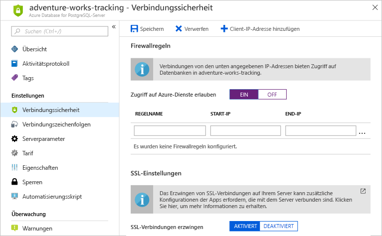

Angenommen, Sie arbeiten mit einer lokalen PostgreSQL-Datenbank. Sie verwalten sämtliche Sicherheitsaspekte und haben alle Zugriffe auf Ihre Server mit den Standardfirewallregeln auf PostgreSQL-Serverebene gesperrt. Sie wissen mittlerweile, wie Sie die gleichen Firewallregeln auf Serverebene in Azure konfigurieren.

Als Nächstes stellen wir eine Verbindung mit einem der zuvor erstellten Azure Database for PostgreSQL-Server her.

## <a name="allow-azure-service-access"></a>Zulassen des Zugriffs auf Azure-Dienste

Bevor Sie beginnen, müssen Sie den Zugriff auf Azure-Dienste zulassen, wenn Sie mithilfe von PowerShell und `psql` eine Verbindung mit Ihrem Server herstellen möchten. Zur Erinnerung: Der Zugriff kann auf zwei Arten zugelassen werden.

Die erste Möglichkeit besteht darin, **Zugriff auf Azure-Dienste erlauben** zu aktivieren. Wenn Sie den Zugriff zulassen, wird eine Firewallregel erstellt. Diese wird jedoch nicht in die Liste mit den benutzerdefinierten Regeln aufgenommen, die Sie erstellen.

Die zweite Möglichkeit besteht darin, eine Firewallregel zu erstellen, die den Zugriff auf alle IP-Adressen zulässt. Die Regel enthält die IP-Adresse für den Client, auf dem PowerShell ausgeführt wird und über den Sie `psql` ausführen.

Darüber hinaus müssen Sie die Option **SSL-Verbindung erzwingen** deaktivieren.

### <a name="create-a-firewall-rule"></a>Erstellen einer Firewallregel

1. Melden Sie sich beim [Azure-Portal](https://portal.azure.com/learn.docs.microsoft.com?azure-portal=true) mit dem gleichen Konto an, über das Sie die Sandbox aktiviert haben.

1. Navigieren Sie zu der Serverressource, für die Sie eine Firewallregel erstellen möchten.

1. Wählen Sie die Option **Verbindungssicherheit** aus, um auf der rechten Seite das entsprechende Blatt zu öffnen.

    

Zur Erinnerung: Sie möchten den Zugriff auf PowerShell-Clients zulassen, auf denen `psql` ausgeführt wird.

Verwenden Sie dazu eine der folgenden Methoden:

- Legen Sie **Zugriff auf Azure-Dienste erlauben** auf **EIN** fest.
- Legen Sie **SSL-Verbindung erzwingen** auf **DEAKTIVIERT** fest.
- Klicken Sie auf die Schaltfläche **Speichern**, um die Änderungen zu speichern.

Oder: Fügen Sie eine Firewallregel hinzu, um den Zugriff auf alle IP-Adressen zuzulassen. Verwenden Sie folgende Werte:

- Regelname: `AllowAll`
- Start-IP: `0.0.0.0`
- End-IP: `255.255.255.255`
- Legen Sie **SSL-Verbindung erzwingen** auf **DEAKTIVIERT** fest.
- Klicken Sie auf die Schaltfläche **Speichern**, um die Änderungen zu speichern.

> [!Warning]
> Wenn Sie diese Firewallregel erstellen, kann über jede IP-Adresse im Internet versucht werden, eine Verbindung mit Ihrem Server herzustellen. In Produktionsumgebungen sollte der Zugriff nur für bestimmte Client-IP-Adressen zugelassen werden.

### <a name="connect-to-the-database-with-psql"></a>Herstellen einer Datenbankverbindung mit psql

1. Stellen Sie auf der rechten Seite in Azure Cloud Shell mithilfe des folgenden Befehls eine Verbindung zwischen psql und Ihrem Server her. Ersetzen Sie dabei den Server- und den Administratornamen.

    ```bash
    psql --host=<server-name>.postgres.database.azure.com --username=<admin-user>@<server-name> --dbname=postgres
    ```

    Verwenden Sie die Werte, die Sie für `server-name` und `admin-user` gewählt haben.

1. **postgres** ist die standardmäßige Verwaltungsdatenbank, mit der jeder PostgreSQL-Server erstellt wird. Sie werden zur Eingabe des Kennworts aufgefordert, das Sie beim Erstellen des Servers angegeben haben.

1. Führen Sie nach erfolgreicher Verbindungsherstellung den Befehl <kbd>\l</kbd> aus, um alle Datenbanken aufzulisten. Daraufhin werden mindestens zwei Standarddatenbanken zurückgegeben.

1. Drücken Sie <kbd>q</kbd>, um die Liste zu schließen.

1. Sie können auch andere psql-Befehle ausprobieren.
    - <kbd>\?</kbd> dient zum Aufrufen der Hilfe.
    - <kbd>\dt</kbd> dient zum Auflisten der Tabellen.

1. Wenn Sie auf Ihrem Server keine weiteren psql-Vorgänge mehr ausführen möchten, führen Sie den Befehl <kbd>\q</kbd> aus, um psql zu beenden.
