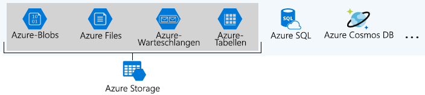
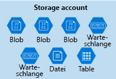
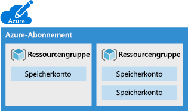
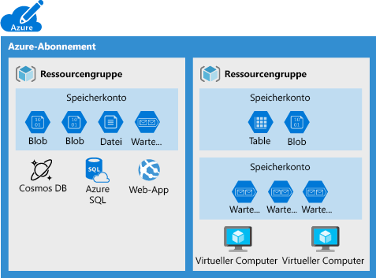
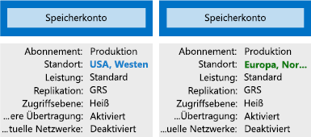

Organisationen verfügen häufig über mehrere Speicherkonten, um unterschiedliche Anforderungskataloge implementieren zu können.Organizations often have multiple storage accounts to let them implement different sets of requirements. In dem Beispiel eines Schokoladenherstellers ist jeweils ein Speicherkonto für die privaten Geschäftsdaten und die Dateien vorhanden, auf die der Kunde Zugriff hat.In the chocolate-manufacturer example, there would be one storage account for the private business data and one for the consumer-facing files. In diesem Artikel lernen Sie die Richtlinienfaktoren kennen, die von einem Speicherkonto gesteuert werden und Ihnen bei der Entscheidung helfen, wie viele Konten Sie benötigen.Here, you will learn the policy factors that are controlled by a storage account, which will help you decide how many accounts you need.

## Was ist Azure Storage?What is Azure Storage?

Azure bietet viele Möglichkeiten zum Speichern Ihrer Daten.Azure provides many ways to store your data. Es stehen mehrere Datenbankoptionen zur Verfügung, z.B. Azure SQL Server, Azure Cosmos DB und Azure Table Storage.There are multiple database options like Azure SQL Server, Azure Cosmos DB, and Azure Table Storage. Zudem bietet Azure diverse Möglichkeiten zum Speichern und Senden von Nachrichten, z.B. Azure Queue Storage und Event Hubs.Azure offers multiple ways to store and send messages, such as Azure Queues and Event Hubs. Sie können sogar lose Dateien mithilfe von Diensten wie Azure Files und Azure Blob Storage speichern.You can even store loose files using services like Azure Files and Azure Blobs.

Vier dieser Datendienste wurden unter dem Namen _Azure Storage_ zusammengefasst.Azure selected four of these data services and placed them together under the name _Azure Storage_. Zu diesen vier Diensten zählen Azure Blob Storage, Azure Files, Azure Queue Storage und Azure Table Storage.The four services are Azure Blobs, Azure Files, Azure Queues, and Azure Tables. Die folgende Abbildung zeigt die Elemente von Azure Storage.The following illustration shows the elements of Azure Storage.

Diesen vier Diensten wurde besondere Aufmerksamkeit geschenkt, da sie alle primitive, cloudbasierte Speicherdienste darstellen und häufig zusammen in derselben Anwendung verwendet werden.These four were given special treatment because they are all primitive, cloud-based storage services and are often used together in the same application.

## Was ist ein Speicherkonto?What is a storage account?

Ein _Speicherkonto_ ist ein Container, der eine Reihe von Azure Storage-Diensten zusammen gruppiert.A _storage account_ is a container that groups a set of Azure Storage services together. Nur Datendienste von Azure Storage können in einem Speicherkonto enthalten sein (Azure Blob Storage, Azure Files, Azure Queue Storage und Azure Table Storage).Only data services from Azure Storage can be included in a storage account (Azure Blobs, Azure Files, Azure Queues, and Azure Tables). Die folgende Abbildung zeigt ein Speicherkonto mit mehreren Datendiensten.The following illustration shows a storage account containing several data services.

Durch die Kombination von Datendiensten in einem Speicherkonto können Sie diese als Gruppe verwalten.Combining data services into a storage account lets you manage them as a group. Die Einstellungen, die Sie bei der Erstellung des Kontos angeben, oder die Sie nach der Erstellung ändern, werden auf sämtliche Bereiche im Konto angewendet.The settings you specify when you create the account, or any that you change after creation, are applied to everything in the account. Beim Löschen des Speicherkontos werden alle darin gespeicherten Daten gelöscht.Deleting the storage account deletes all of the data stored inside it.

Ein Speicherkonto ist eine Azure-Ressource, die in einer Ressourcengruppe enthalten ist.A storage account is an Azure resource and is included in a resource group. Die folgende Abbildung zeigt ein Azure-Abonnement, das mehrere Ressourcengruppen enthält, wobei jede Gruppe mindestens ein Speicherkonto umfasst.The following illustration shows an Azure subscription containing multiple resource groups, where each group contains one or more storage accounts.

Andere Azure-Datendienste wie Azure SQL-Datenbank und Azure Cosmos DB werden als unabhängige Azure-Ressourcen verwaltet und können nicht in einem Speicherkonto enthalten sein.Other Azure data services like Azure SQL and Cosmos DB are managed as independent Azure resources and cannot be included in a storage account. Die folgende Abbildung zeigt eine typische Anordnung: In Speicherkonten sind zwar Azure Blob Storage, Azure Files, Azure Queue Storage und Azure Table Storage, aber keine weiteren Dienste enthalten.The following illustration shows a typical arrangement: Blobs, Files, Queues, and Tables are inside storage accounts, while other services are not.

## SpeicherkontoeinstellungenStorage account settings

Ein Speicherkonto definiert eine Richtlinie, die auf alle Speicherdienste im Konto angewendet wird.A storage account defines a policy that applies to all the storage services in the account. Beispielsweise können Sie angeben, dass alle enthaltenen Dienste im Rechenzentrum in „USA, Westen“ gespeichert werden, auf die nur über HTTPS zugegriffen werden kann und die im Rahmen des Abonnements der Vertriebsabteilung abgerechnet werden.For example, you could specify that all the contained services will be stored in the West US datacenter, accessible only over https, and billed to the sales department's subscription.

Zu den von einem Speicherkonto gesteuerten Einstellungen zählen Folgende:The settings that are controlled by a storage account are:

- **Abonnement**: Das Azure-Abonnement, das für die Dienste im Konto abgerechnet wird.**Subscription**: The Azure subscription that will be billed for the services in the account.

- **Standort**: Das Rechenzentrum, in dem die Dienste im Konto gespeichert werden.**Location**: The datacenter that will store the services in the account.

- **Leistung**: Bestimmt die Datendienste, die in Ihrem Speicherkonto enthalten sein können, und den Typ der Hardware, die zum Speichern der Daten verwendet wird.**Performance**: Determines the data services you can have in your storage account and the type of hardware disks used to store the data. Mit **Standard** können Sie beliebige Datendienste (Azure Blob Storage, Azure Files, Azure Queue Storage und Azure Table Storage) sowie magnetische Laufwerke verwenden.**Standard** allows you to have any data service (Blob, File, Queue, Table) and uses magnetic disk drives. Bei **Premium** sind Sie auf einen bestimmten Typ von Blob, nämlich _Seitenblobs_, beschränkt. Zudem werden bei diesem Angebot Solid State Drives (SSD) für die Speicherung verwendet.**Premium** limits you to one specific type of blob called a _page blob_ and uses solid-state drives (SSD) for storage.

- **Replikation**: Bestimmt die zum Kopieren Ihrer Daten verwendete Strategie, um vor Hardwareausfällen oder Naturkatastrophen zu schützen.**Replication**: Determines the strategy used to make copies of your data to protect against hardware failure or natural disaster. Azure behält automatisch mindestens eine Kopie Ihrer Daten innerhalb des Rechenzentrums bei, das dem Speicherkonto zugeordnet ist.At a minimum, Azure will automatically maintain a copy of your data within the data center associated with the storage account. Dies wird als lokal redundanter Speicher (LRS) bezeichnet und schützt zwar vor Hardwareausfällen, aber nicht vor einem Ereignis, mit dem das gesamte Rechenzentrum außer Betrieb gesetzt wird.This is called locally-redundant storage (LRS), and guards against hardware failure but does not protect you from an event that incapacitates the entire datacenter. Sie können ein Upgrade auf eine der anderen Optionen wie georedundanten Speicher (GRS) durchführen, um Replikationen in verschiedenen Rechenzentren auf der ganzen Welt durchführen zu können.You can upgrade to one of the other options such as geo-redundant storage (GRS) to get replication at different datacenters across the world.

- **Zugriffsebene**: Steuert, wie schnell Sie auf die Blobs in diesem Speicherkonto zugreifen können.**Access tier**: Controls how quickly you will be able to access the blobs in this storage account. Die heiße Speicherebene bietet zwar schnelleren Zugriff als die kalte Speicherebene, verursacht jedoch auch höhere Kosten.Hot gives quicker access than Cool, but at increased cost. Dies gilt nur für Blobs und dient als Standardwert für neue Blobs.This applies only to blobs, and serves as the default value for new blobs.

- **Sichere Übertragung erforderlich**: Ein Sicherheitsfeature, mit dem die unterstützten Protokolle für den Zugriff ermittelt werden.**Secure transfer required**: A security feature that determines the supported protocols for access. Für den aktivierten Zustand ist HTTPS erforderlich, während im deaktivierten Zustand HTTP zulässig ist.Enabled requires HTTPs, while disabled allows HTTP.

- **Virtuelle Netzwerke**: Ein Sicherheitsfeature, das nur eingehende Zugriffsanforderungen der von Ihnen angegebenen virtuellen Netzwerken zulässt.**Virtual networks**: A security feature that allows inbound access requests only from the virtual network(s) you specify.

## Wie viele Speicherkonten benötigen Sie?How many storage accounts do you need?

Ein Speicherkonto stellt eine Sammlung von Einstellungen wie Standort, Replikationsstrategie und Abonnementbesitzer dar.A storage account represents a collection of settings like location, replication strategy, and subscription owner. Sie benötigen ein Speicherkonto für sämtliche Gruppen von Einstellungen, die auf Ihre Daten angewendet werden sollen.You need one storage account for every group of settings that you want to apply to your data. Die folgende Abbildung zeigt zwei Speicherkonten, die sich hinsichtlich einer Einstellung unterscheiden. Bereits ein Unterschied macht separate Speicherkonten erforderlich.The following illustration shows two storage accounts that differ in one setting; that one difference is enough to require separate storage accounts.

Die Anzahl von Speicherkonten, die Sie benötigen, wird in der Regel durch die Vielfalt Ihrer Daten, Kostensensitivität und Toleranz hinsichtlich des Verwaltungsaufwands bestimmt.The number of storage accounts you need is typically determined by your data diversity, cost sensitivity, and tolerance for management overhead.

### DatenvielfaltData diversity

Organisationen generieren oftmals Daten, die sich darin unterscheiden, wo sie genutzt werden, wie sensibel diese sind, welche Gruppe die Rechnungen begleicht etc. Bestehen bei diesen Vektoren Abweichungen, kann dies zu mehreren Speicherkonten führen.Organizations often generate data that differs in where it is consumed, how sensitive it is, which group pays the bills, etc. Diversity along any of these vectors can lead to multiple storage accounts. Sehen wir uns hierzu zwei Beispiele an:Let's consider two examples:

1. Verfügen Sie über Daten, die speziell für ein Land oder eine Region gelten?Do you have data that is specific to a country or region? In diesem Fall empfiehlt es sich aus Leistungs- bzw. Compliancegründen, diese Daten in einem Rechenzentrum im jeweiligen Land zu speichern.If so, you might want to locate it in a data center in that country for performance or compliance reasons. Sie benötigen ein Speicherkonto für jeden Standort.You will need one storage account for each location.

1. Besitzen Sie Daten, die einerseits proprietär und andererseits für die öffentliche Nutzung bestimmt sind?Do you have some data that is proprietary and some for public consumption? Wenn dies der Fall ist, können Sie virtuelle Netzwerke für die proprietären Daten implementieren und bei öffentlichen Daten andere Netzwerke verwenden.If so, you could enable virtual networks for the proprietary data and not for the public data. Hierfür sind zudem separate Speicherkonten erforderlich.This will also require separate storage accounts.

Eine höhere Diversität bedeutet im Allgemeinen eine höhere Anzahl von Speicherkonten.In general, increased diversity means an increased number of storage accounts.

### KostensensitivitätCost sensitivity

Ein Speicherkonto selbst bringt keine Kosten mit sich, allerdings wirken sich die Einstellungen, die Sie für das Konto festlegen, sehr wohl auf die Kosten für Dienste des Kontos aus.A storage account by itself has no financial cost; however, the settings you choose for the account do influence the cost of services in the account. Georedundante Speicher sind kostspieliger als lokal redundante Speicher.Geo-redundant storage costs more than locally-redundant storage. Durch Leistung auf Premium-Niveau und die heiße Zugriffsebene werden die Kosten für Blobs in die Höhe getrieben.Premium performance and the Hot access tier increase the cost of blobs.

Sie können mehrere Speicherkonten verwenden, um die Kosten zu reduzieren.You can use multiple storage accounts to reduce costs. Beispielsweise können Sie Ihre Daten in die Kategorien „Kritisch“ und „Nicht kritisch“ unterteilen.For example, you could partition your data into critical and non-critical categories. Sie könnten Ihre kritischen Daten in ein Speicherkonto mit georedundantem Speicher und nicht kritische Daten in ein anderes Speicherkonto mit lokal redundantem Speicher platzieren.You could place your critical data into a storage account with geo-redundant storage and put your non-critical data in a different storage account with locally-redundant storage.

### Toleranz hinsichtlich des VerwaltungsaufwandsTolerance for management overhead

Für die Erstellung und Verwaltung der einzelnen Speicherkonten muss ein Administrator ein gewisses Maß an Zeit und Aufmerksamkeit aufwenden.Each storage account requires some time and attention from an administrator to create and maintain. Zudem wird es für alle Benutzer komplexer, Daten Ihrem Cloudspeicher hinzuzufügen. Alle Benutzer in dieser Rolle müssen sich über den Zweck der einzelnen Speicherkonten im Klaren sein, um neue Daten dem richtigen Konto hinzuzufügen.It also increases complexity for anyone who adds data to your cloud storage; everyone in this role needs to understand the purpose of each storage account so they add new data to the correct account.

Speicherkonten stellen ein leistungsstarkes Tool dar, mit dem Sie die erforderliche Leistung und Sicherheit erhalten und gleichzeitig die Kosten senken können.Storage accounts are a powerful tool to help you get the performance and security you need while minimizing costs. Eine typische Strategie besteht darin, mit einer Analyse Ihrer Daten zu beginnen und Partitionen zu erstellen, die Eigenschaften wie Standort, Abrechnung und Replikationsstrategie aufweisen, und anschließend ein Speicherkonto für jede Partition zu erstellen.A typical strategy is to start with an analysis of your data and create partitions that share characteristics like location, billing, and replication strategy, and then create one storage account for each partition.