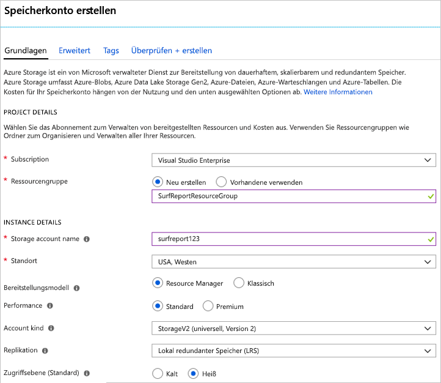
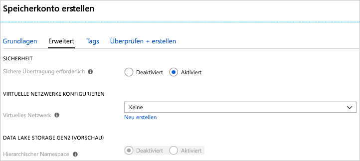

In dieser Einheit erstellen Sie über das Azure-Portal ein Speicherkonto für eine Web-App, mit der fiktive Surfberichte für Südkalifornien bereitgestellt werden.In this unit, you will use the Azure portal to create a storage account that is appropriate for a fictitious southern California surf report web app.

Auf einer Website mit Surfberichten können Benutzer Fotos und Videos von den Surfbedingungen an Stränden hochladen.The surf report site lets users upload photos and videos of their local beach conditions. Andere Personen können sich diese Inhalte ansehen und sich dann für einen geeigneten Strand zum Surfen entscheiden.Viewers will use the content to help them choose the beach with the best surfing conditions. Sie verfolgen die folgenden Ziele im Hinblick auf die Features und das Design:Your list of design and feature goals is:

- Videoinhalte müssen schnell geladen werden.Video content must load quickly
- Die Website muss mit unerwarteten Lastspitzen beim Upload umgehen können.The site must handle unexpected spikes in upload volume
- Veraltete Inhalte werden entfernt, wenn sich die Surfbedingungen ändern. Damit wird sichergestellt, dass immer die aktuellen Bedingungen auf der Website angezeigt werden.Outdated content will be removed as surf conditions change so the site always shows current conditions

Sie entscheiden sich für eine Implementierung, die hochgeladene Inhalte in einer Azure Queue Storage-Warteschlange für die Verarbeitung puffert und diese anschließend zur Speicherung in Azure Blob Storage verschiebt.You decide on an implementation that buffers uploaded content in an Azure Queue for processing and then moves it into an Azure Blob for storage. Sie benötigen nun ein Speicherkonto, das sowohl Warteschlangen als auch Blobs aufnehmen kann, und müssen gleichzeitig Inhalte mit niedriger Latenz übertragen.You need a storage account that can hold both queues and blobs while delivering low-latency access to your content.

## Erstellen eines Speicherkontos über das Azure-PortalUse the Azure portal to create a storage account

[!include]

1. Melden Sie sich beim [Azure-Portal](https://portal.azure.com/?azure-portal=true)an.Sign in to the [Azure Portal](https://portal.azure.com/?azure-portal=true).

1. Klicken Sie oben links im Azure-Portal auf **Ressource erstellen**.In the top left of the Azure Portal, select **Create a resource**.

1. Klicken Sie im angezeigten Auswahlbereich auf **Storage**.In the selection panel that appears, select **Storage**.

1. Klicken Sie rechts in diesem Bereich auf **Speicherkonto – Blob, Datei, Tabelle, Warteschlange**.On the right side of that pane, select **Storage account - blob, file, table, queue**.

    

### Konfigurieren der grundlegenden OptionenConfigure the basic options

[!include]

Führen Sie unter **PROJEKTDETAILS** die folgenden Aktionen aus:Under **PROJECT DETAILS**:

1. Wählen Sie das entsprechende **Abonnement** aus.Select the appropriate **Subscription**.

1. Wählen Sie die vorhandene Ressourcengruppe <rgn>[Sandbox resource group name]</rgn> (Sandbox Ressourcengruppenname) aus der Dropdownliste aus.Select the existing Resource Group <rgn>[Sandbox resource group name]</rgn> from the drop-down list.

    > [!NOTE]
    > Diese kostenlose Ressourcengruppe wurde von Microsoft für das Lernprogramm zur Verfügung gestellt.This free Resource Group has been provided by Microsoft as part of the learning experience. Wenn Sie ein Konto für eine reale Anwendung erstellen, müssen Sie eine neue Ressourcengruppe in Ihrem Abonnement erstellen, um alle Ressourcen für die App zu speichern.When you create an account for a real application, you will want to create a new Resource Group in your subscription to hold all the resources for the app.

Führen Sie unter **INSTANZDETAILS** die folgenden Aktionen aus:Under **INSTANCE DETAILS**:

1. Geben Sie den **Speicherkontonamen** ein.Enter a **Storage account name**. Dieser wird zum Generieren der öffentlichen URL verwendet, mit der auf Kontodaten zugegriffen wird.The name will be used to generate the public URL used to access the data in the account. Dieser Name muss unter allen vorhandenen Speicherkontonamen in Azure eindeutig sein.It must be unique across all existing storage account names in Azure. Er muss 3 bis 24 Zeichen lang sein und darf nur Kleinbuchstaben und Ziffern enthalten.It must be 3 to 24 characters long and can contain only lowercase letters and numbers.

1. Wählen Sie einen **Standort** in Ihrer Nähe aus.Select a **Location** near to you. 

1. Übernehmen Sie für _Resource Manager_ die Standardoption **Bereitstellungsmodell**.Leave the **Deployment model** as _Resource manager_. Dies ist das bevorzugte Modell für die Bereitstellung von Ressourcen in Azure und ermöglicht es Ihnen, alle Ressourcen für Ihre App in einer _Ressourcengruppe_ zu gruppieren, sodass Sie Ressourcen leichter verwalten können.This is the preferred model for all resource deployments in Azure and allows you to group all the related resources for your app into a _resource group_ for easier management.

1. Wählen Sie für die Option **Leistung** den Eintrag _Standard_ aus.Select _Standard_ for the **Performance** option. Damit wird der Typ des Datenträgerspeichers festgelegt, auf dem Daten innerhalb des Speicherkontos abgelegt werden.This decides the type of disk storage used to hold the data in the Storage account. Bei Auswahl von „Standard“ werden übliche Festplatten verwendet. Bei „Premium“ werden SSD-Datenträger (Solid State Drive) genutzt, die einen schnelleren Zugriff ermöglichen.Standard uses traditional hard disks, and Premium uses solid-state drives (SSD) for faster access. Beachten Sie jedoch, dass bei Auswahl von„Premium“ nur _Seitenblobs_ unterstützt werden. Sie benötigen jedoch Blockblobs für Ihre Videos und eine Warteschlange für die Pufferung. Beides ist nur verfügbar, wenn Sie die Option _Standard_ auswählen.However, remember that Premium only supports _page blobs_ and you will need block blobs for your videos, and a queue for buffering - both of which are only available with the _Standard_ option.

1. Wählen Sie als _Kontoart_ den Eintrag **StorageV2 (general purpose v2)** (StorageV2 (universell, Version 2)) aus.Select _StorageV2 (general purpose v2)_ for the **Account kind**. Dies ermöglicht den Zugriff auf die neuesten Features und Preise.This provides access to the latest features and pricing. Blobspeicherkonten verfügen bei Auswahl dieser Kontoart über weitere Optionen.In particular, Blob storage accounts have more options available with this account type. Sie benötigen sowohl Blobs als auch eine Warteschlange. Die Option _Blobspeicher_ kann daher nicht verwendet werden.You need a mix of blobs and a queue, so the _Blob storage_ option will not work. Für diese Anwendung ergäben sich beim Auswählen der Kontoart _Storage (general purpose v1)_ (Speicher (universell, Version 1)) keine Vorteile, da hierdurch die Anzahl der verfügbaren Features beschränkt würde. Außerdem wäre es unwahrscheinlich, dass Sie so die Kosten für die erwartete Arbeitsauslastung reduzieren können.For this application, there would be no benefit to choosing a _Storage (general purpose v1)_ account, since that would limit the features you could access and would be unlikely to reduce the cost of your expected workload.

1. Übernehmen Sie für **Replikation** die Standardeinstellung _Lokal redundanter Speicher (LRS)_.Leave the **Replication** as _Locally-redundant storage (LRS)_. Daten in Azure-Speicherkonten werden stets repliziert, um Hochverfügbarkeit sicherzustellen. Mit dieser Option können Sie auswählen, bis zu welcher Distanz die Replikation erfolgt, sodass Anforderungen an die Dauerhaftigkeit erfüllt werden können.Data in Azure storage accounts are always replicated to ensure high availability - this option lets you choose how far away the replication occurs to match your durability requirements. In unserem Fall veralten die Bilder und Videos schnell und werden dann von der Website entfernt.In our case, the images and videos quickly become out-of-date and are removed from the site. Die Zusatzkosten globaler Redundanz würden hier zu keinem Mehrwert führen.This means there is little value to paying extra for global redundancy. Wenn es durch einen Notfall zu einem Datenverlust käme, könnten Sie die Website mit neuen Benutzerinhalten neu starten.If a catastrophic event results in data loss, you can restart the site with fresh content from your users.

1. Legen Sie für die **Zugriffsebene** die Einstellung _Hot_ (Heiße Ebene) fest.Set the **Access tier** to _Hot_. Diese Einstellung wird nur für den Blobspeicher verwendet.This setting is only used for Blob storage. Die **heiße Zugriffsebene** ist ideal für häufig verwendete Daten. Die **kalte Zugriffsebene** eignet sich hingegen besser für selten genutzte Daten.The **Hot Access Tier** is ideal for frequently accessed data, and the **Cool Access Tier** is better for infrequently accessed data. Beachten Sie, dass dadurch nur der _Standardwert_ festgelegt wird: Wenn Sie einen Blob erstellen, können Sie einen anderen Wert für die Daten festlegen.Note that this only sets the _default_ value - when you create a Blob, you can set a different value for the data. In unserem Fall sollen Videos schnell geladen werden. Daher muss die Hochleistungsoption für Blobs ausgewählt werden.In our case, we want the videos to load quickly, so you will use the high-performance option for your blobs.
   
Auf dem folgenden Screenshot werden alle vorgenommenen Einstellungen für die Registerkarte **Basics** (Grundeinstellungen) angezeigt. Beachten Sie, dass für die Ressourcengruppe, das Abonnement und den Namen unterschiedliche Werte festgelegt werden.The following screenshot shows the completed settings for the **Basics** tab. Note that the resource group, subscription, and name will have different values.

### Konfigurieren der erweiterten OptionenConfigure the advanced options

1. Klicken Sie auf **Next: Advanced >** (Weiter: Erweitert >), um die Registerkarte **Erweitert** aufzurufen, oder klicken Sie am oberen Bildschirmrand auf die Registerkarte **Erweitert**.Click the **Next: Advanced >** button to move to the **Advanced** tab, or select the **Advanced** tab at the top of the screen.

1. Mit der Einstellung **Sichere Übertragung erforderlich** wird festgelegt, ob REST-APIs über **HTTP** auf Daten im Speicherkonto zugreifen können.The **Secure transfer required** setting controls whether **HTTP** can be used for the REST APIs used to access data in the Storage account. Wenn diese Option _Aktiviert_ ist, müssen alle Clients SSL (**HTTPS**) verwenden.Setting this option to _Enabled_ will force all clients to use SSL (**HTTPS**). In den meisten Fällen sollte diese Einstellung _Aktiviert_ sein, da die Verwendung von HTTPS für Netzwerkübertragungen als bewährte Methode betrachtet wird.Most of the time you will want to set this to _Enabled_ as using HTTPS over the network is considered a best practice.

    > [!WARNING]
    > Wenn diese Option aktiviert ist, werden einige zusätzliche Einschränkungen erzwungen.If this option is enabled, it will enforce some additional restrictions. Unverschlüsselte Verbindungen über den Dienst Azure Files schlagen fehl. Dies gilt auch für Szenarios, in denen SMB 2.1 oder 3.0 unter Linux verwendet wird.Azure files service connections without encryption will fail, including scenarios using SMB 2.1 or 3.0 on Linux. Diese Option kann nicht zusammen mit Namen benutzerdefinierter Domänen verwendet werden, da Azure Storage SSL für diese nicht unterstützt.Because Azure storage doesn’t support SSL for custom domain names, this option cannot be used with a custom domain name.

1. Legen Sie für die Option **Virtuelle Netzwerke** die Einstellung _Keine_ fest.Set the **Virtual networks** option to _None_. Mit dieser Option können Sie das Speicherkonto in einem virtuellen Azure-Netzwerk isolieren.This option allows you to isolate the storage account on an Azure virtual network. Wir wollen in unserem Szenario einen öffentlichen Zugriff über das Internet unterstützen.We want to use public Internet access. Da der Inhalt öffentlich verfügbar sein soll, müssen Sie den Zugriff über öffentliche Clients zulassen.Our content is public facing and you need to allow access from public clients.

1. Übernehmen Sie für die Option **Data Lake Storage Gen2** die Standardeinstellung _Deaktiviert_.Leave the **Data Lake Storage Gen2** option as _Disabled_. Diese Option ist für Big Data-Anwendungen relevant, die allerdings in diesem Modul keine Rolle spielen.This is for big-data applications that aren't relevant to this module.

Auf dem folgenden Screenshot werden alle vorgenommenen Einstellungen für die Registerkarte **Erweitert** angezeigt.The following screenshot shows the completed settings for the **Advanced** tab.

### ErstellenCreate

1. Sie können sich die Einstellungen für **Tags** bei Bedarf genauer ansehen.You can explore the **Tags** settings if you like. Damit können Sie Ihrem Konto Schlüssel-Wert-Paare für die Kategorisierung zuordnen. Dieses Feature ist für alle Azure-Ressourcen verfügbar.This lets you associate key/value pairs to the account for your categorization and is a feature available to any Azure resource.

1. Klicken Sie auf **Überprüfen + erstellen**, um die Einstellungen zu überprüfen.Click **Review + create** to review the settings. Dadurch wird überprüft, ob alle Pflichtfelder ausgewählt wurden.This will do a quick validation of your options to make sure all the required fields are selected. Wenn Probleme vorliegen, werden diese hier angezeigt.If there are issues, they'll be reported here. Klicken Sie anschließend auf **Erstellen**, um das Speicherkonto bereitzustellen.Once you've reviewed the settings, click **Create** to provision the storage account.

Die Bereitstellung des Kontos dauert einige Minuten.It will take a few minutes to deploy the account. Während dieser Vorgang von Azure ausgeführt wird, sehen wir uns die APIs an, die wir im Folgenden für dieses Konto verwenden werden.While Azure is working on that, let's explore the APIs we'll use with this account.

### ÜberprüfenVerify

1. Klicken Sie in der linken Randleiste auf den Link **Speicherkonten**.Select the **Storage accounts** link in the left sidebar.

1. Suchen Sie das neue Speicherkonto in der Liste, um zu überprüfen, ob die Erstellung erfolgreich war.Locate the new storage account in the list to verify that creation succeeded.

<!-- Cleanup sandbox -->
[!include]

Wenn Sie in Ihrem eigenen Abonnement arbeiten, können Sie die folgenden Schritte im Azure-Portal zum Löschen der Ressourcengruppe und aller zugehörigen Ressourcen ausführen.When you are working in your own subscription, you can the following steps in the Azure portal to delete the resource group and all associated resources.

1. Klicken Sie in der linken Randleiste auf den Link **Ressourcengruppen**.Select the **Resource groups** link in the left sidebar.

1. Such Sie die erstellte Ressourcengruppe in der Liste.Locate the resource group you created in the list.

1. Klicken Sie mit der rechten Maustaste auf den Eintrag für die Ressourcengruppe und anschließend im Kontextmenü auf **Ressourcengruppe löschen**.Right-click on the resource group entry and select **Delete resource group** from the context menu. Dasselbe Kontextmenü können Sie aufrufen, indem Sie rechts neben dem Eintrag auf das Menüelement „...“ klicken.You can also click the "..." menu element on the right side of the entry to get to the same context menu.

1. Geben Sie den Namen der Ressourcengruppe in das Bestätigungsfeld ein.Type the resource group name into the confirmation field.

1. Klicken Sie auf die Schaltfläche **Löschen**.Click the **Delete** button.

## ZusammenfassungSummary

Sie haben ein Speicherkonto erstellt und die zugehörigen Einstellungen an Ihre geschäftlichen Anforderungen angepasst.You created a storage account with settings driven by your business requirements. Beispielsweise haben Sie für das Rechenzentrum die Region „USA, Westen“ ausgewählt, weil Ihre Kunden sich in erster Linie in Südkalifornien befinden.For example, you might have selected a West US datacenter because your customers were primarily located in southern California. Dieser Ablauf ist typisch: Zunächst analysieren Sie Ihre Daten und Ziele, und anschließend konfigurieren Sie die entsprechenden Optionen für das Speicherkonto.This is a typical flow: first analyze your data and goals, and then configure the storage account options to match.