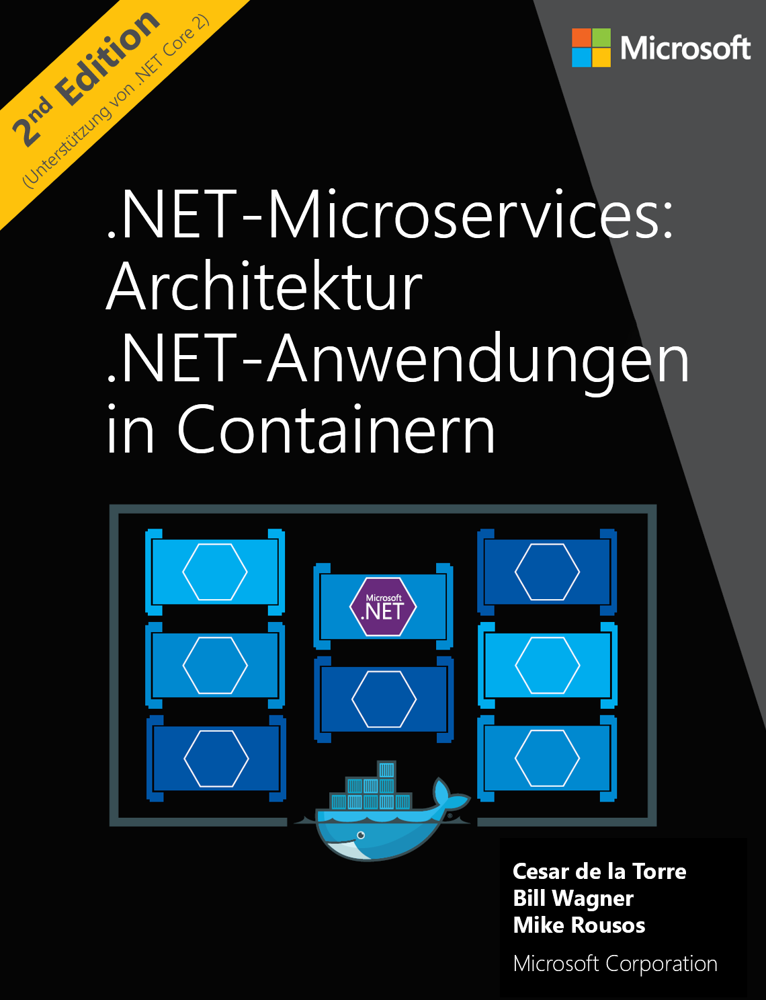

In this unit, you will extract text from an image with the Computer Vision API service that we created previously.

# Extracting the text from an image

Execute the `az cognitiveservices account keys list` command to retrieve a key used to authenticate against the API. Store the output of that command within the `key` variable.

```azurecli
key=$(az cognitiveservices account keys list -g ComputerVisionRG --name ComputerVisionService --query key1 -o tsv)
```

Execute a `curl` command to do an HTTP request against the Computer Vision API and reuse the previously declared variable `key`.

The image we're going to be using for Optical Character Recognition (OCR) is the cover from the book [.NET Microservices: Architecture for Containerized .NET Applications](/dotnet/standard/microservices-architecture/).



```azurecli
curl -H "Ocp-Apim-Subscription-Key: $key" -H "Content-Type: application/json" "https://westus2.api.cognitive.microsoft.com/vision/v1.0/ocr" -d "{\"url\":\"https://docs.microsoft.com/en-us/learn/modules/create-computer-vision-service/ebook.png\"}" | jq '.'
```

The first three properties are the language, the orientation, and the text angle. Then, the `regions` properties will contain a list of values used to show where the text is, its position in the picture, and the actual words it contains.

```json
{
  "language": "en",
  "orientation": "Up",
  "textAngle": 0,
  "regions" : [
        /*... snipped*/
        {
          "boundingBox": "766,1419,302,33",
          "words": [
            {
              "boundingBox": "766,1419,126,25",
              "text": "Microsoft"
            },
            {
              "boundingBox": "903,1420,165,32",
              "text": "Corporation"
            }
          ]
        }]
}
```

Experiment with other images to get different results by changing the URL used in the sample above.