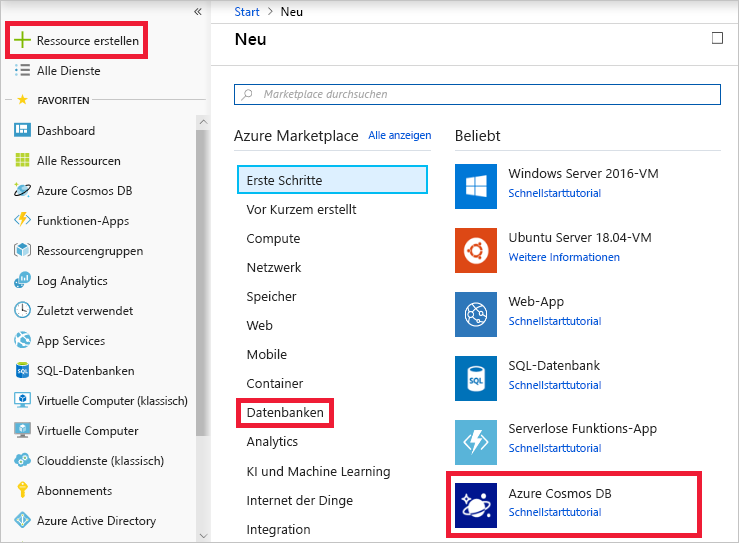

Ihr Unternehmen hat sich für Azure Cosmos DB entschieden, um die Anforderungen seines wachsenden Kundenstamms und Produktangebots zu erfüllen.Your company has chosen Azure Cosmos DB to meet the demands of their expanding customer and product base. Sie wurden mit der Erstellung der Datenbank beauftragt.You have been tasked with creating the database.

Der erste Schritt ist das Erstellen eines Azure Cosmos DB-Kontos.The first step is to create an Azure Cosmos DB account.

## Was ist ein Azure Cosmos DB-Konto?What is an Azure Cosmos DB account?

Ein Azure Cosmos DB-Konto ist eine Azure-Ressource, die als organisatorische Entität für Ihre Datenbanken fungiert.An Azure Cosmos DB account is an Azure resource that acts as an organizational entity for your databases. Es verknüpft zu Abrechnungszwecken Ihre Nutzung mit Ihrem Azure-Abonnement.It connects your usage to your Azure subscription for billing purposes.

Jedes Azure Cosmos DB-Konto ist mit einem der verschiedenen Datenmodelle verbunden, die Azure Cosmos DB unterstützt, und Sie können so viele Konten erstellen, wie Sie brauchen.Each Azure Cosmos DB account is associated with one of the several data models Azure Cosmos DB supports, and you can create as many accounts as you need. 

Die SQL-API ist das bevorzugte Datenmodell, wenn Sie eine neue Anwendung erstellen.SQL API is the preferred data model if you are creating a new application. Wenn Sie mit Graphen oder Tabellen arbeiten oder Ihre MongoDB- oder Cassandra-Daten zu Azure migrieren, erstellen Sie zusätzliche Konten, und wählen Sie entsprechende Datenmodelle aus.If you're working with graphs or tables, or migrating your MongoDB or Cassandra data to Azure, create additional accounts and select relevant data models.

Wählen Sie beim Anlegen eines Kontos eine für Sie aussagekräftige ID, anhand derer Sie Ihr Konto identifizieren.When creating an account, choose an ID that is meaningful to you; it is how you identify your account. Erstellen Sie außerdem das Konto in der Azure-Region, die Ihren Benutzern am nächsten ist, um die Wartezeit zwischen dem Rechenzentrum und Ihren Benutzern zu minimieren.Further, create the account in the Azure region that's closest to your users to minimize latency between the datacenter and your users.

Sie können bei der Erstellung eines Kontos optional virtuelle Netzwerke und Georedundanz einrichten, was aber auch nachträglich erfolgen kann.You can optionally set up virtual networks and geo-redundancy during account creation, but this can also be done later. In diesem Modul werden wir diese Einstellungen nicht aktivieren.In this module we will not enable those settings.

[!include]

## Erstellen eines Azure Cosmos DB-Kontos im PortalCreating an Azure Cosmos DB account in the portal

1. Melden Sie sich am [Azure-Portal für die Sandbox](https://portal.azure.com/triplecrownlabs.onmicrosoft.com?azure-portal=true) mit dem gleichen Konto an, über das Sie die Sandbox aktiviert haben.Sign into the [Azure portal for Sandbox](https://portal.azure.com/triplecrownlabs.onmicrosoft.com?azure-portal=true) using the same account you activated the sandbox with.

    > [!IMPORTANT]
    > Melden Sie sich am Azure-Portal über den Link oben an, um sicherzustellen, dass Sie mit der Sandbox verbunden sind, die Zugriff auf ein Concierge-Abonnement ermöglicht.Login to the Azure portal using the link above to ensure you are connected to the sandbox, which provides access to a Concierge Subscription.

1. Klicken Sie auf **Ressource erstellen** > **Datenbanken** > **Azure Cosmos DB**.Click **Create a resource** > **Databases** > **Azure Cosmos DB**.
   
   

1. Geben Sie auf der Seite **Azure Cosmos DB-Konto erstellen** die Einstellungen für das neue Azure Cosmos DB-Konto einschließlich des Standorts ein.On the **Create Azure Cosmos DB Account** page, enter the settings for the new Azure Cosmos DB account, including the location.

    [!INCLUDE]
 
    EinstellungSetting|WertValue|BeschreibungDescription
    ---|---|---
    AbonnementSubscription|*Concierge-Abonnement**Concierge Subscription*|Wählen Sie das Concierge-Abonnement aus.Select the Concierge Subscription. Wenn das Concierge-Abonnement nicht aufgelistet wird, haben Sie mehrere Mandanten in Ihrem Abonnement aktiviert und müssen die Mandanten wechseln.If you do not see the Concierge Subscription listed, you have multiple tenants enabled on your subscription, and you need to change tenants. Hierzu melden Sie sich erneut über den folgenden Link beim Portal an: [Azure-Portal für Sandbox](https://portal.azure.com/triplecrownlabs.onmicrosoft.com?azure-portal=true).To do so, login again using the following portal link: [Azure portal for Sandbox](https://portal.azure.com/triplecrownlabs.onmicrosoft.com?azure-portal=true).
    RessourcengruppeResource Group|Vorhandene verwendenUse existing  **<rgn>[Name der Sandbox-Ressourcengruppe]</rgn>****<rgn>[Sandbox resource group name]</rgn>**|Hier erstellen Sie eine neue Ressourcengruppe oder wählen eine vorhandene Ressourcengruppe Ihres Abonnements aus.Here you would either create a new resource group, or select an existing one in your subscription. 
    KontonameAccount Name|*Ein eindeutiger Name**Enter a unique name*|Geben Sie einen eindeutigen Namen ein, der das Azure Cosmos DB-Konto identifiziert.Enter a unique name to identify this Azure Cosmos DB account. Da *documents.azure.com* an die ID angefügt wird, die Sie bereitstellen, um Ihren URI zu erstellen, sollten Sie eine eindeutige, aber identifizierbare ID verwenden.Because *documents.azure.com* is appended to the ID that you provide to create your URI, use a unique but identifiable ID.  Die ID darf nur Kleinbuchstaben, Zahlen und einen Bindestrich (-) enthalten, und sie muss zwischen 3 und 50 Zeichen lang sein.The ID can contain only lowercase letters, numbers, and the hyphen (-) character, and it must contain 3 to 50 characters.
    APIAPI|SQLSQL|Die API bestimmt den Typ des zu erstellenden Kontos.The API determines the type of account to create. Azure Cosmos DB stellt fünf APIs bereit, die Sie für Ihre Anwendung auswählen können: SQL (Dokumentdatenbank), Gremlin (Diagrammdatenbank), MongoDB (Dokumentdatenbank), Azure Table und Cassandra. Für jede ist derzeit ein separates Konto erforderlich.Azure Cosmos DB provides five APIs to suit the needs of your application: SQL (document database), Gremlin (graph database), MongoDB (document database), Azure Table, and Cassandra, each of which currently requires a separate account.   Wählen Sie **SQL** aus, da Sie in diesem Modul eine Dokumentdatenbank erstellen, die mit SQL-Syntax abgefragt werden kann und für die SQL-API zugänglich ist.Select **SQL** because in this module you are creating a document database that is queryable using SQL syntax and accessible with the SQL API.|
    StandortLocation|*Auswählen der Region, die Ihnen am nächsten liegt, aus der Liste oben**Select the region closest to you from the list above*|Wählen Sie den Standort aus, an dem die Datenbank gespeichert werden soll.Select the location where the database should be located.
    GeoredundanzGeo-Redundancy| DeaktivierenDisable | Durch diese Einstellung wird eine replizierte Version Ihrer Datenbank in einer zweiten (zugeordneten) Region erstellt.This setting creates a replicated version of your database in a second (paired) region. Lassen Sie diese Option jetzt deaktiviert, da die Datenbank später repliziert werden kann.Leave this set to disabled for now, as the database can be replicated later.
    MultimasterMulti Master | DeaktivierenDisable | Durch diese Einstellung können Sie in mehreren Regionen gleichzeitig schreiben.This setting enables you to write to multiple regions at the same time. Diese Einstellung kann nur bei der Kontoerstellung konfiguriert werden.This setting can only be configured during account creation. Lassen Sie diese Option jetzt für diese Einheit deaktiviert.Leave this set to disabled for now for this unit.
    Virtuelles NetzwerkVirtual Network|Nicht ausfüllenLeave blank|Lassen Sie das Feld für virtuelle Netzwerke vorerst leer.Leave virtual networks blank for now. Dies kann später konfiguriert werden.This can be configured later.

1. Klicken Sie auf **Überprüfen + erstellen**.Click **Review + Create**.

    

1. Nach Überprüfung der Einstellungen klicken Sie auf **Erstellen**, um das Konto zu erstellen.After the settings are validated, click **Create** to create the account. 

1. Die Kontoerstellung dauert einige Minuten.The account creation takes a few minutes. Warten Sie, bis das Portal die Benachrichtigung anzeigt, dass die Bereitstellung erfolgreich war, und klicken Sie auf die Benachrichtigung.Wait for the portal to display the notification that the deployment succeeded and click the notification. 

    

1. Klicken Sie im Benachrichtigungsfenster auf **Zu Ressource wechseln**.In the notification window, click **Go to resource**.

    

    Im Portal wird **Glückwunsch! Ihr Azure Cosmos DB-Konto wurde erstellt** angezeigt.The portal displays the **Congratulations! Your Azure Cosmos DB account was created** page.

    

## ZusammenfassungSummary

Sie haben ein Azure Cosmos DB-Konto erstellt, was der erste Schritt zur Erstellung einer Azure Cosmos DB-Datenbank ist.You have created an Azure Cosmos DB account, which is the first step in creating an Azure Cosmos DB database. Sie haben die entsprechenden Einstellungen für Ihre Datentypen ausgewählt und den Speicherort des Kontos festgelegt, um die Wartezeit für Ihre Benutzer zu minimieren.You selected appropriate settings for your data types and set the account location to minimize latency for your users.
