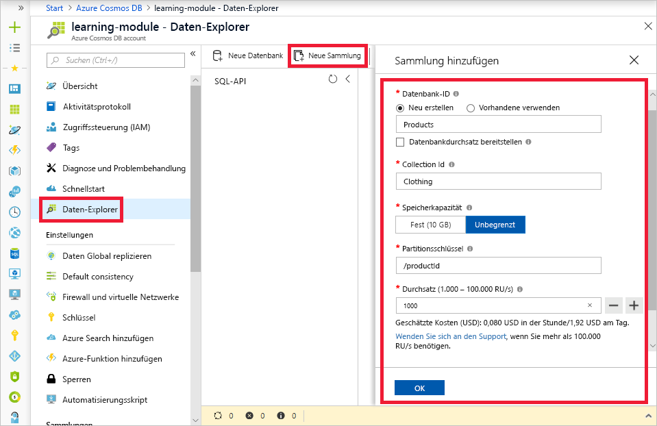
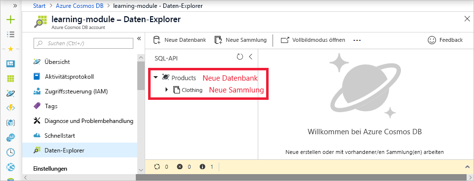

Da Sie nun wissen, wie mit Anforderungseinheiten der Datenbankdurchsatz ermittelt wird und wie mit dem Partitionsschlüssel die Strategie für horizontales Skalieren Ihrer Datenbank erstellt wird, können Sie Ihre Datenbank und Ihre Sammlung erstellen.Now that you understand how request units are used to determine database throughput and how the partition key creates the scale-out strategy for your database, you're ready to create your database and collection. Die Durchsatz- und Partitionsschlüsselwerte müssen bei der Erstellung der Sammlung festgelegt werden. Daher wird empfohlen, diese Konzepte vor der Erstellung einer Datenbank zu verstehen.Throughput and partition key values need to be set at collection creation, so understanding those concepts before creating a database is recommended.

## Erstellen der Datenbank und der SammlungCreating your database and collection

1. Wählen Sie im Azure-Portal in Ihrer Cosmos DB-Ressource **Daten-Explorer** aus, und klicken Sie auf der Symbolleiste auf die Schaltfläche **Neue Sammlung**.In the Azure Portal, select **Data Explorer** from your Cosmos DB resource and then click the **New Collection** button in the toolbar.
    
    Der Bereich **Sammlung hinzufügen** wird ganz rechts angezeigt.The **Add Collection** area is displayed on the far right. Sie müssen möglicherweise nach rechts scrollen, um ihn zu sehen.You may need to scroll right to see it.

    

1. Geben Sie auf der Seite **Sammlung hinzufügen** die Einstellungen für die neue Sammlung ein.In the **Add collection** page, enter the settings for the new collection.

    EinstellungSetting | Empfohlener WertSuggested value | BESCHREIBUNGDescription
    --------|-----------------|-------------
    Datenbank-IDDatabase id      | ProdukteProducts         | Geben Sie *Products* als Namen für die neue Datenbank ein.Enter *Products* as the name for the new database. Datenbanknamen müssen zwischen 1 und 255 Zeichen lang sein und dürfen weder /, \\, #, ? noch nachgestellte Leerzeichen enthalten.Database names must be 1 to 255 characters in length, and must not contain /, \\, #, ?, or a trailing space.
    Sammlungs-IDCollection id    | KleidungClothing  | Geben Sie *Kleidung* als Namen für die neue Sammlung ein.Enter *Clothing* as the name for your new collection. Für Sammlungs-IDs gelten dieselben Zeichenanforderungen wie für Datenbanknamen.Collection ids have the same character requirements as database names.
    SpeicherkapazitätStorage capacity | UnbegrenztUnlimited     | Übernehmen Sie den Standardwert **Unbegrenzt**.Use the default value of **Unlimited**. Dieser Wert ist die Speicherkapazität der Datenbank, und damit kann Ihre Datenbank nach Bedarf horizontal skaliert werden.This value is the storage capacity of the database, and it enables your database to scale out as needed.
    PartitionsschlüsselPartition key    | productIdproductId        | „productId“ ist ein guter Partitionsschlüssel für ein Onlinehändlerszenario, da sich viele Abfragen auf die Produkt-ID beziehen.productId is a good partition key for an online retail scenario, as so many queries are based around the product ID.
    DurchsatzThroughput       |1000 RU1000 RU        | Ändern Sie den Durchsatz in 1000 Anforderungseinheiten pro Sekunde (RU/s).Change the throughput to 1000 request units per second (RU/s). 1000 ist der Mindestwert für RU/s, den Sie festlegen können, um die automatische Skalierung zu aktivieren.1000 is the minimum RU/s value you can set to enable automatic scaling.
    
    Aktivieren Sie erst einmal nicht die Option für den **Durchsatz der Bereitstellungsdatenbank**, und fügen Sie der Sammlung keine eindeutigen Schlüssel hinzu.For now, don't check the **Provision database throughput** option, and don't add any unique keys to the collection.
    
1. Klicken Sie auf **OK**.Click **OK**. Im Daten-Explorer werden die neue Datenbank und die neue Sammlung angezeigt.The Data Explorer displays the new database and collection.

    

## ZusammenfassungSummary

In dieser Einheit haben Sie Ihre Kenntnisse im Hinblick auf Partitionsschlüssel und Anforderungseinheiten genutzt, um eine Datenbank und eine Sammlung mit Durchsatz- und Skalierungseinstellungen zu erstellen, die für Ihre Geschäftsanforderungen geeignet sind.In this unit, you used your knowledge of partition keys and request units to create a database and collection with throughput and scaling settings appropriate for your business needs.