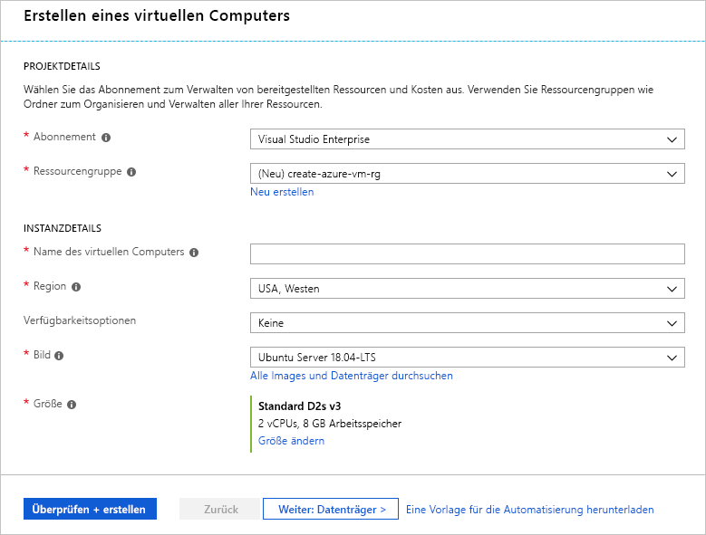
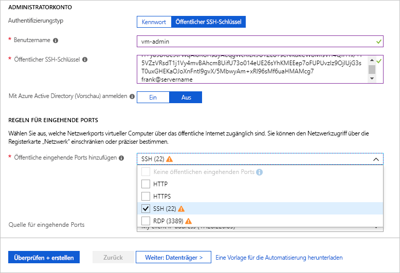
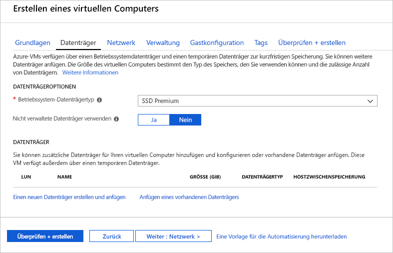
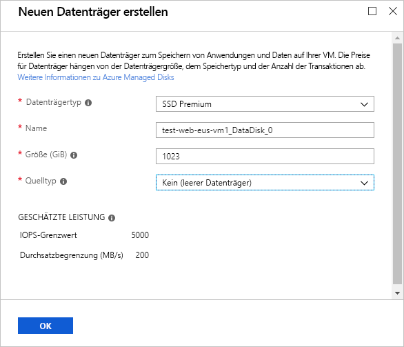
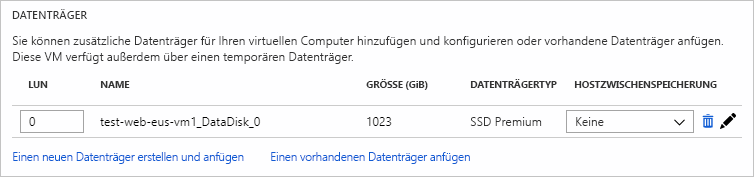

Zur Erinnerung: Wir möchten einen vorhandenen Linux-Server, auf dem Apache ausgeführt wird, zu Azure migrieren. Dazu erstellen wir zunächst einen Ubuntu Linux-Server.

## Erstellen eines neuen virtuellen Linux-Computers

Wir können virtuelle Linux-Computer mit dem Azure-Portal, Azure-Befehlszeilenschnittstelle oder Azure PowerShell erstellen. Die einfachste Vorgehensweise, wenn Sie mit Azure starten ist Sie das Portal verwenden, da es Sie durch die erforderlichen Informationen führt und Hinweise sowie nützliche Nachrichten während der Erstellung:

1. Melden Sie sich im [Azure-Portal](https://portal.azure.com?azure-portal=true) an.

1. Klicken Sie auf **erstellen Sie eine Ressource** in der oberen linken Ecke des Azure-Portals.

1. Geben Sie **Ubuntu Server** in das Suchfeld ein, um die verfügbaren Versionen anzuzeigen. Wählen Sie **Ubuntu Server 18.04 LTS** aus der angezeigten Liste.

1. Klicken Sie auf die Schaltfläche **Erstellen**, um mit dem Konfigurieren des virtuellen Computers zu beginnen.

## Konfigurieren der Einstellungen für den virtuellen Computer

Die Umgebung für die Erstellung des virtuellen Computers im Portal wird in einem Assistenten-Format für den virtuellen Computer alle Konfigurationsbereiche erläutert angezeigt. Klicken auf die **Weiter** Schaltfläche gelangen Sie zum nächsten Abschnitt konfiguriert. Sie können allerdings auch über die Registerkarten im oberen Bereich beliebig zwischen den einzelnen Bereichen wechseln.

Nach aller erforderlichen Optionen ausfüllen (mit einem roten Sternchen gekennzeichnet) können Sie diese überspringen Sie den Rest der Assistenten-Benutzeroberfläche und anfangen, Erstellen des virtuellen Computers über die **überprüfen + erstellen** unten auf die Schaltfläche.

Beginnen Sie mit dem Abschnitt **Grundlagen**.

### Konfigurieren der Grundeinstellungen für den virtuellen Computer

[!include]

1. Wählen Sie das **Abonnement** aus, über das die VM-Stunden abgerechnet werden sollen.

1. Für **Ressourcengruppe**Option **vorhandene** , und wählen Sie die Ressourcengruppe mit dem Namen  **<rgn>[Ressourcengruppennamen Sandkasten]</rgn>**.

    > [!NOTE]
    > Wenn Sie Einstellungen und den Wechsel jedes Felds ändern, wird Azure überprüfen jeden Wert automatisch und platzieren ein grünes Häkchen daneben aus, wenn er in Ordnung ist. Sie können mit der Maus auf Fehlerindikatoren zeigen, um weitere Informationen zu gefundenen Problemen zu erhalten.

#### Standort auswählen

<!-- Resource selection -->
[!include]

1. In der **INSTANZDETAILS** Geben Sie einen Namen für Ihre Webserver-VM wie z. B. **Test-Web-Eus-vm1**. Dies weist darauf hin, die Umgebung (**testen**), die Rolle (**Web**), Ort (**USA, Osten**), Dienst (**Vm**), und der Instanznummer (**1**).
    - Es ist eine bewährte Methode, Ressourcennamen, zu standardisieren, damit Sie ihren Zweck schnell identifizieren können. Namen für Linux-VMs dürfen maximal 64 Zeichen umfassen und müssen sich aus Zahlen, Buchstaben und Bindestrichen zusammensetzen.

1. Wählen Sie eine Region in Ihrer Nähe aus. Stellen Sie sicher, dass eine aus der verfügbaren Standorte, die oben aufgeführten auswählen.

1. Lassen Sie **Verfügbarkeitsoptionen** als **keine**. Diese Option wird verwendet, um sicherzustellen, dass die VM hoch verfügbar ist, durch das Gruppieren mehrerer virtueller Computer als einen Satz mit geplanten verarbeiten oder ungeplante Wartungsereignisse oder Ausfälle.

1. Stellen Sie sicher, dass das Bild, um festgelegt wird **Ubuntu Server 18.04 LTS**. Sie können die Dropdownliste öffnen, um alle verfügbaren Optionen anzuzeigen.

1. Die **Größe** Feld kann nicht direkt bearbeitet werden und verfügt über eine **DS2_v3** Standardgröße, dies ist einer der allgemeinen computing Auswahl. Diese Option ist für einen öffentlichen Webserver optimal. Klicken Sie aber trotzdem auf den Link **Größe ändern**, um sich die anderen VM-Größen anzusehen. Im daraufhin angezeigten Dialogfeld können Sie Filtern basierend auf **Anzahl von CPUs**, **Namen**, und **Datenträgertyp**. Wählen Sie den gleichen **DS2_v3** Wahl, wodurch Sie die zwei vCPUs mit 8 GB RAM.

    > [!TIP]
    > Da auf der rechten Seite ein neues Fenster geöffnet und über das vorherige Fenster geschoben wurde, um es anzuzeigen, können Sie die Ansicht auch nach links verschieben, um wieder zu den VM-Einstellungen zu gelangen.

1. Wählen Sie im Abschnitt **ADMINISTRATORZUGRIFF** für **Authentifizierungstyp** die Option „Öffentlicher SSH-Schlüssel“ aus.

1. Geben Sie unter **Benutzername** einen Benutzernamen für die SSH-Anmeldung ein.

1. Kopieren Sie den SSH-Schlüssel aus Ihrer Datei mit dem öffentlichen Schlüssel, und fügen Sie ihn in das Feld **Öffentlicher SSH-Schlüssel** ein.

> [!IMPORTANT]
> Wenn Sie den öffentlichen Schlüssel in das Azure-Portal kopieren, stellen Sie sicher, dass keine zusätzlichen Leerzeichen oder Zeilenvorschubzeichen hinzufügen.

1. In der **eingehende PORTREGELN** Abschnitt, öffnen Sie die Liste, und deaktivieren Sie **keine öffentlichen Eingangsports**. Da es sich hier um eine Linux-VM handelt, soll die Möglichkeit bestehen, per SSH-Remoteverbindung auf die VM zuzugreifen. Bei Bedarf die Liste blättern, bis Sie finden **SSH (22)** und wählen Sie ihn. In der Benutzeroberfläche wird der Hinweis angezeigt, dass auch nach dem Erstellen des virtuellen Computers die Netzwerkports geändert werden können.

    

## Konfigurieren von Datenträgern für den virtuellen Computer

1. Klicken Sie auf **weiter: Datenträger >** zum Verschieben der **Datenträger** Abschnitt.

    

1. Wählen Sie **Premium-SSD** für die **Betriebssystem-Datenträgertyp**.

1. Verwenden Sie verwaltete Datenträger, um nicht mit Speicherkonten arbeiten zu müssen. Wenn Sie wissen möchten, welche unterschiedlichen Informationen Azure jeweils benötigt, können Sie die Einstellung über die grafische Benutzeroberfläche ändern.

### Erstellen eines Datenträgers

Denken Sie daran, dass wir einen Betriebssystem-Datenträger (/ Dev/Sda) und einen temporären Datenträger (/ Dev/Sdb) erhält. Fügen Sie einen Datenträger für Daten auch an:

1. Klicken Sie auf den Link **Create and attach a new disk** (Neuen Datenträger erstellen und anfügen) im Abschnitt **DATA DISKS** (DATENTRÄGER).

    

1. Sie können die Standardeinstellungen übernehmen: Premium-SSD, 1023 GB und **keine** (leerer Datenträger), obwohl Beachten Sie, dass hier ist, in dem wir eine Momentaufnahme- oder der Azure-Blob-Speicher verwenden können, um eine virtuelle Festplatte erstellen.

1. Klicken Sie auf **OK**, um den Datenträger zu erstellen, und navigieren Sie zurück zum Abschnitt **DATA DISKS** (DATENTRÄGER).

1. Es sollte nun ein neuer Datenträger in der ersten Zeile angezeigt werden.

    

## Konfigurieren des Netzwerks

1. Klicken Sie auf **weiter: Netzwerk >** zum Verschieben der **Networking** Abschnitt.

1. In einem Produktionssystem, in dem bereits andere Komponenten vorhanden sind, sollten Sie ein _vorhandenes_ virtuelles Netzwerk verwenden. Auf diese Weise kann der virtuellen Computer mit anderen Cloud-Dienste in unserer Lösung kommunizieren. Wenn für diesen Speicherort noch kein Netzwerk definiert ist, können Sie es hier erstellen und die folgenden Bestandteile konfigurieren:
    - **Adressraum**: den gesamten IPV4-Adressraum dieses Netzwerk zur Verfügung steht.
    - **Adressbereich des Subnetzes**: das erste Subnetz den Adressraum - unterteilen sie muss innerhalb der definierten Adressraum passen. Nach der Erstellung des VNET können Sie weitere Subnetze hinzufügen.

> [!NOTE]
> Azure erstellt standardmäßig ein virtuelles Netzwerk, eine Netzwerkschnittstelle und eine öffentliche IP-Adresse für Ihren virtuellen Computer. Es ist nicht trivial, ändern die Netzwerkoptionen, nachdem der virtuelle Computer erstellt wurde, überprüfen Sie daher immer die netzwerkzuweisungen für Dienste, die Sie in Azure erstellen.

## Abschließen der Konfiguration des virtuellen Computers und Erstellen des Images

Die restlichen Optionen weisen passende Standardeinstellungen auf, die nicht geändert werden müssen. Bei Interesse können sich die anderen Registerkarten genauer ansehen. Die einzelnen Optionen haben eine `(i)` Symbol neben dem Namen, der anzeigt, ein Trinkgeld "Hilfe" Erläutern Sie die Option. Dies ist eine hervorragende Möglichkeit, die die verschiedenen Optionen erfahren Sie, dass Sie zum Konfigurieren des virtuellen Computers verwenden können:

1. Klicken Sie im unteren Bereich auf die Schaltfläche **Überprüfen und erstellen**.

1. Das System überprüft Ihre Optionen und zeigt Details zur Erstellung des virtuellen Computers an.

1. Klicken Sie auf **Erstellen**, um den virtuellen Computer zu erstellen und bereitzustellen. Im Azure-Dashboard wird der virtuelle Computer angezeigt, der aktuell bereitgestellt wird. Dieser Vorgang kann einige Minuten in Anspruch nehmen.

Währenddessen erfahren Sie in der nächsten Einheit, wozu Sie diesen virtuellen Computer verwenden können.