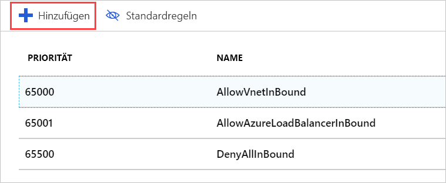

Wenden Sie eine Netzwerksicherheitsgruppe lassen Sie uns mit unserem Netzwerk, sodass wir HTTP-Datenverkehr nur über unsere Server zuzulassen.

## Erstellen einer Netzwerksicherheitsgruppe

Aufgrund der Angabe, dass wir SSH-Zugriff benötigen, sollte Azure eine Sicherheitsgruppe für uns erstellt haben. Jedoch erstellen wir eine neue Sicherheitsgruppe aus, damit Sie den gesamten Prozess durchlaufen können. Das ist besonders wichtig, wenn Sie Ihr virtuelles Netzwerk _vor_ Ihren virtuellen Computern erstellen möchten. Zur Erinnerung: Sicherheitsgruppen sind _optional_ und werden nicht unbedingt zusammen mit dem Netzwerk erstellt.

1. In der [Azure-Portal](https://portal.azure.com?azure-portal=true), klicken Sie auf die **erstellen Sie eine Ressource** Schaltfläche in der Randleiste linken Ecke, um die ressourcenerstellung eines neuen zu starten.

1. Typ **Netzwerksicherheitsgruppe** in das Feld "Filter" und wählen Sie das übereinstimmende Element in der Liste.

1. Vergewissern Sie sich, dass das Bereitstellungsmodell **Resource Manager** ausgewählt ist, und klicken Sie auf **Erstellen**.

1. Geben Sie unter **Name** einen Namen für Ihre Sicherheitsgruppe an. Benennungskonventionen für sind eine gute Idee. Verwenden wir **Test-Web-Eus-nsg1** für **testen Web Network Security Group 1 in USA, Osten**. Sie sollten sich wahrscheinlich so ändern Sie den Speicherort Teil den Namen, um anzugeben, fügen Sie die Sicherheitsgruppe hinzu.

1. Wählen Sie das richtige **Abonnement** aus, und verwenden Sie Ihre bereits vorhandene **Ressourcengruppe**.

1. Platzieren Sie es abschließend in der gleichen **Speicherort** wie der virtuelle Computer / virtuelles Netzwerk. Andernfalls können Sie diese Ressource nicht anwenden.

1. Klicken Sie auf **Erstellen**, um die Gruppe zu erstellen.

## Fügen Sie eine neue eingehende Regel auf unserer Netzwerksicherheitsgruppe

Die Bereitstellung sollte schnell abgeschlossen sein. Wenn sie abgeschlossen ist, können wir unsere Sicherheitsgruppe neue Regeln hinzufügen:

1. Suchen Sie im Azure-Portal nach der neuen Sicherheitsgruppenressource, und wählen Sie sie aus.

1. Auf der Übersichtsseite sehen Sie, dass einige Standardregeln zum Sperren des Netzwerks erstellt wurden.

    Eingangsseite:

    - Sämtlicher eingehender Datenverkehr zwischen zwei VNETs wird zugelassen. So können Ressourcen im VNET miteinander kommunizieren.
    - Der Azure Load Balancer **Test** Anforderungen, um sicherzustellen, dass den virtuelle Computer aktiv ist.
    - Anderer eingehender Datenverkehr wird vollständig unterbunden.  

    Ausgangsseite:  
    - Der gesamte eingehende Netzwerkdatenverkehr im VNET wird zugelassen.
    - Alle ausgehenden Datenverkehr an das Internet ist zulässig.
    - Jeglicher andere ausgehende Datenverkehr wird unterbunden.

    > [!NOTE]  
    > Mit hoher Priorität Werten diese Standardregeln festgelegt sind, was bedeutet, dass sie ausgewertet _letzten_. Diese Regeln können weder geändert noch gelöscht werden. Sie können die Regeln aber _überschreiben_, indem Sie spezifischere Regeln für Ihren Datenverkehr mit einem niedrigeren Prioritätswert erstellen.

1. Klicken Sie im Bereich **Einstellungen** für die Sicherheitsgruppe auf den Abschnitt **Eingangssicherheitsregeln**.

1. Klicken Sie auf **+ Hinzufügen**, um eine neue Sicherheitsregel hinzuzufügen.

    

    Es gibt zwei Optionen für die Eingabe der Informationen für eine Sicherheitsregel: im einfachen oder im erweiterten Modus. Sie können zwischen diesen wechseln durch Klicken auf die Schaltfläche am oberen Rand der **hinzufügen** Bereich.

    

    Der erweiterte Modus bietet die Möglichkeit, die die Regel vollständig anpassen. Wenn Sie ein bekanntes Protokoll konfigurieren müssen, ist der Standardmodus jedoch etwas einfacher zu verwenden.

1. Wechseln Sie zu der Standardmodus.

1. Fügen Sie die Informationen für die HTTP-Regel hinzu:

    - Legen Sie den **Dienst** auf „HTTP“ fest. Dadurch wird der Portbereich automatisch eingerichtet.
    - Legen Sie die **Priorität** zu **1000**. Der Wert muss niedriger sein als der Wert der Regel **Verweigern**. Sie können den Bereich auf einen beliebigen Wert starten, aber es wird empfohlen, dass Sie sich etwas Platz geben für den Fall, dass eine Ausnahme, die später erstellt werden muss.
    - Benennen Sie der Regel; Wir verwenden **-http-Datenverkehr zulassen**.
    - Geben Sie eine Beschreibung für die Regel ein.

1. Kehren Sie zum Modus **Erweitert** zurück. Wie Sie sehen, sind unsere Einstellungen immer noch vorhanden. In diesem Bereich können Sie differenziertere Einstellungen erstellen. Sie können beispielsweise die **Quelle** auf eine bestimmte IP-Adresse oder auf einen bestimmten IP-Adressbereich für die Kameras beschränken. Wenn Sie die aktuelle IP-Adresse Ihres lokalen Computers kennen, können Sie das ausprobieren. Andernfalls lassen Sie die Einstellung **alle**, damit Sie die Regel testen können.

1. Klicken Sie auf **Hinzufügen**, um die Regel zu erstellen. Dadurch wird die Eingangsregelliste aktualisiert. Die Regeln werden nach Priorität sortiert und in der angezeigten Reihenfolge ausgewertet.

## Anwenden der Sicherheitsgruppe

Denken Sie daran, dass wir die Sicherheitsgruppe anwenden können, auf eine Netzwerkschnittstelle auf einen einzelnen virtuellen Computer zu schützen oder zu einem Subnetz, in dem auf Ressourcen in diesem Subnetz angewendet werden. Der zweite Ansatz ist meist der am häufigsten verwendete und lassen Sie uns dies. Wir können auf diese Ressource in Azure entweder über virtual Network-Ressource bzw. indirekt über den virtuellen Computer, der mit dem virtuellen Netzwerk.

1. Wechseln Sie zum Bereich **Übersicht** für den virtuellen Computer. Den virtuellen Computer finden Sie unter **Alle Ressourcen**.

1. Klicken Sie im Abschnitt **Einstellungen** auf das Element **Netzwerk**.

1. In den Eigenschaften des Netzwerken finden Sie Informationen über das Netzwerk auf dem virtuellen Computer angewendet, einschließlich der **virtuellen Netzwerk/Subnetz**. Hierbei handelt es sich um einen klickbaren Link, über den Sie zu der Ressource gelangen. Klicken Sie auf den Link, um das virtuelle Netzwerk zu öffnen. Dieser Link steht _auch_ im Bereich **Übersicht** des virtuellen Computers zur Verfügung. Beide Links öffnen die **Übersicht** des virtuellen Netzwerks.

1. Klicken Sie im Abschnitt **Einstellungen** auf das Element **Subnetze**.

1. Hier sollte ein einzelnes Subnetz (Standard) definiert sein, das zuvor zusammen mit dem virtuellen Computer und dem virtuellen Netzwerk erstellt wurde. Klicken Sie auf das Listenelement, um die Details zu öffnen.

1. Klicken Sie auf den Eintrag **Netzwerksicherheitsgruppe**.

1. Wählen Sie Ihre neue Sicherheitsgruppe (**test-web-eus-nsg1**) aus. Hier sollte sich noch eine weitere Gruppe befinden, die zusammen mit dem virtuellen Computer erstellt wurde.

1. Klicken Sie auf **Speichern**, um die Änderung zu speichern. Die Anwendung auf das Netzwerk nimmt etwas Zeit in Anspruch.

## Überprüfen der Regeln

Lassen Sie uns die Änderung zu überprüfen:

1. Kehren Sie zum Bereich **Übersicht** für den virtuellen Computer zurück. Den virtuellen Computer finden Sie unter **Alle Ressourcen**.

1. Klicken Sie im Abschnitt **Einstellungen** auf das Element **Netzwerk**.

1. In den Netzwerk-Schnittstelle Details finden Sie einen Link für **effektiven Sicherheitsregeln** , die schnell erfahren Sie, wie Regeln ausgewertet werden sollen. Klicken Sie auf den Link, um die Analyse zu öffnen, und überprüfen Sie, ob die neue Regel vorhanden ist.

    

1. Ob alles funktioniert, lässt sich natürlich am besten überprüfen, indem eine HTTP-Anforderung an den Server gesendet wird. Es sollte jetzt funktionieren.

    

## Anmerkung:

Die richtige Implementierung von Sicherheitsregeln ist nicht immer ganz einfach. Beim Anwenden dieser neuen Sicherheitsgruppe ist uns ein Fehler unterlaufen: Wir haben den SSH-Zugriff verloren. Zur Behebung dieses Problems können Sie der Sicherheitsgruppe eine weitere Regel hinzufügen, um den SSH-Zugriff zu unterstützen. Achten Sie darauf, die eingehenden TCP/IP-Adressen für die Regel auf Ihre eigenen Adressen zu beschränken.

> [!WARNING]  
> Denken Sie immer daran, für den Administratorzugriff verwendete Ports zu sperren. Noch besser: Erstellen Sie ein VPN, um das virtuelle Netzwerk mit Ihrem privaten Netzwerk zu verbinden, und lassen Sie nur RDP- oder SSH-Anforderungen aus diesem Adressbereich zu. Sie können auch die Standardeinstellung für den von SSH verwendeten Port ändern. Bedenken Sie, dass die Änderung des Ports ist nicht ausreichend, Angriffe zu beenden. Hierdurch wird einfach ein wenig schwieriger zu ermitteln.