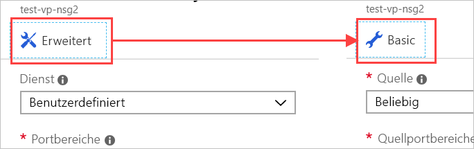

Wenden wir nun eine Netzwerksicherheitsgruppe auf unser Netzwerk an, um ausschließlich HTTP-Datenverkehr über unseren Server zuzulassen.

## Erstellen einer Netzwerksicherheitsgruppe

Aufgrund der Angabe, dass wir SSH-Zugriff benötigen, sollte Azure eine Sicherheitsgruppe für uns erstellt haben. Wir erstellen hier jedoch eine neue Sicherheitsgruppe, damit Sie sich mit dem gesamten Prozess vertraut machen können. Das ist besonders wichtig, wenn Sie Ihr virtuelles Netzwerk _vor_ Ihren virtuellen Computern erstellen möchten. Zur Erinnerung: Sicherheitsgruppen sind _optional_ und werden nicht notwendigerweise zusammen mit dem Netzwerk erstellt.

1. Klicken Sie im [Azure-Portal](https://portal.azure.com/triplecrownlabs.onmicrosoft.com?azure-portal=true) auf der linken Randleiste auf die Schaltfläche **Ressource erstellen**, um die Ressourcenerstellung zu starten.

1. Geben Sie **Netzwerksicherheitsgruppe** in das Filterfeld ein, und wählen Sie das entsprechende Element in der Liste aus.

1. Vergewissern Sie sich, dass das Bereitstellungsmodell **Resource Manager** ausgewählt ist, und klicken Sie auf **Erstellen**.

1. Geben Sie einen **Namen** für Ihre Sicherheitsgruppe an. Auch hier ist eine Namenskonvention sinnvoll. Wir verwenden **test-web-eus-nsg1** für die **erste Web-Netzwerksicherheitsgruppe zu Testzwecken in der Region „USA, Osten“**. Ändern Sie bei Bedarf den Standortteil des Namens, um den Standort Ihrer Sicherheitsgruppe anzugeben.

1. Wählen Sie das richtige **Abonnement** aus, und verwenden Sie Ihre bereits vorhandene **Ressourcengruppe**.

1. Platzieren Sie sie abschließend am gleichen **Standort** wie den virtuellen Computer bzw. das virtuelle Netzwerk. Andernfalls können Sie diese Ressource nicht anwenden.

1. Klicken Sie auf **Erstellen**, um die Gruppe zu erstellen.

## Hinzufügen einer neuen Regel für eingehenden Datenverkehr zur Netzwerksicherheitsgruppe

Die Bereitstellung sollte schnell abgeschlossen sein. Danach können wir unserer Sicherheitsgruppe neue Regeln hinzufügen:

1. Suchen Sie im Azure-Portal nach der neuen Sicherheitsgruppenressource, und wählen Sie sie aus.

1. Auf der Übersichtsseite sehen Sie, dass einige Standardregeln zum Sperren des Netzwerks erstellt wurden.

    Eingangsseite:

    - Sämtlicher eingehender Datenverkehr zwischen zwei VNets wird zugelassen. Auf diese Weise können Ressourcen im VNet miteinander kommunizieren.
    - **Testanforderungen** des Azure Load Balancer, um zu überprüfen, ob der virtuelle Computer aktiv ist
    - Anderer eingehender Datenverkehr wird vollständig unterbunden.  

    Ausgangsseite:  
    - Sämtlicher interner Netzwerkdatenverkehr im VNet wird zugelassen.
    - Sämtlicher ausgehender Datenverkehr an das Internet wird zugelassen.
    - Anderer ausgehender Datenverkehr wird vollständig unterbunden.

    > [!NOTE]  
    > Da diese Standardregeln mit hohen Prioritätswerten festgelegt sind, werden sie _zuletzt_ ausgewertet. Diese Regeln können weder geändert noch gelöscht werden. Sie können die Regeln aber _überschreiben_, indem Sie spezifischere Regeln für Ihren Datenverkehr mit einem niedrigeren Prioritätswert erstellen.

1. Klicken Sie im Bereich **Einstellungen** für die Sicherheitsgruppe auf den Abschnitt **Eingangssicherheitsregeln**.

1. Klicken Sie auf **+ Hinzufügen**, um eine neue Sicherheitsregel hinzuzufügen.

    

    Die Eingabe der Informationen für eine Sicherheitsregel kann auf zwei Arten erfolgen: im einfachen oder im erweiterten Modus. Zwischen diesen beiden Modi kann mithilfe der Schaltfläche oben im Bereich **Hinzufügen** gewechselt werden.

    

    Im erweiterten Modus können die Regeln beliebig angepasst werden. Wenn Sie allerdings ein bekanntes Protokoll konfigurieren müssen, ist dies im einfachen Modus etwas leichter.

1. Wechseln Sie in den einfachen Modus.

1. Fügen Sie die Informationen für die HTTP-Regel hinzu:

    - Legen Sie den **Dienst** auf „HTTP“ fest. Dadurch wird automatisch der Portbereich eingerichtet.
    - Legen Sie die **Priorität** auf **1000** fest. Der Wert muss niedriger sein als der Wert der Standardregel **Verweigern**. Der Bereich kann bei einem beliebigen Wert beginnen. Allerdings wird empfohlen, einen gewissen Puffer zu integrieren, falls später eine Ausnahme erstellt werden muss.
    - Benennen Sie die Regel. Wir verwenden hier den Namen **allow-http-traffic**.
    - Geben Sie eine Beschreibung für die Regel ein.

1. Kehren Sie zum Modus **Erweitert** zurück. Wie Sie sehen, sind unsere Einstellungen immer noch vorhanden. In diesem Bereich können wir differenziertere Einstellungen erstellen. Wir können beispielsweise die **Quelle** auf eine bestimmte IP-Adresse oder auf einen bestimmten IP-Adressbereich für die Kameras beschränken. Wenn Sie die aktuelle IP-Adresse Ihres lokalen Computers kennen, können Sie das ausprobieren. Behalten Sie andernfalls die Einstellung **Beliebig** bei, um die Regel zu testen.

1. Klicken Sie auf **Hinzufügen**, um die Regel zu erstellen. Dadurch wird die Eingangsregelliste aktualisiert. Die Regeln werden nach Priorität sortiert und in der angezeigten Reihenfolge ausgewertet.

## Anwenden der Sicherheitsgruppe

Zur Erinnerung: Eine Sicherheitsgruppe lässt sich auf eine Netzwerkschnittstelle anwenden, um einen einzelnen virtuellen Computer zu schützen, oder auf ein Subnetz, um alle Ressourcen dieses Subnetzes zu schützen. Da der zweite Ansatz häufiger verwendet wird, greifen wir hier auf diesen zurück. Zu der Ressource in Azure gelangen wir entweder über die Ressource des virtuellen Netzwerks oder indirekt über den virtuellen Computer, der das virtuelle Netzwerk verwendet.

1. Wechseln Sie zum Bereich **Übersicht** für den virtuellen Computer. Den virtuellen Computer finden Sie unter **Alle Ressourcen**.

1. Klicken Sie im Abschnitt **Einstellungen** auf **Netzwerk**.

1. In den Netzwerkeigenschaften finden Sie Informationen zum Netzwerk des virtuellen Computers – einschließlich **Virtuelles Netzwerk/Subnetz**. Hierbei handelt es sich um einen Link, den Sie anklicken können, um zur Ressource zu gelangen. Klicken Sie auf den Link, um das virtuelle Netzwerk zu öffnen. Dieser Link steht _auch_ im Bereich **Übersicht** des virtuellen Computers zur Verfügung. Beide Links öffnen die **Übersicht** des virtuellen Netzwerks.

1. Klicken Sie im Abschnitt **Einstellungen** auf **Subnetze**.

1. Hier sollte ein einzelnes Subnetz (Standard) definiert sein, das zuvor zusammen mit dem virtuellen Computer und dem virtuellen Netzwerk erstellt wurde. Klicken Sie auf das Listenelement, um die Details zu öffnen.

1. Klicken Sie auf den Eintrag **Netzwerksicherheitsgruppe**.

1. Wählen Sie Ihre neue Sicherheitsgruppe (**test-web-eus-nsg1**) aus. Hier sollte sich noch eine weitere Gruppe befinden, die zusammen mit dem virtuellen Computer erstellt wurde.

1. Klicken Sie auf **Speichern**, um die Änderung zu speichern. Die Anwendung auf das Netzwerk nimmt etwas Zeit in Anspruch.

## Aktualisieren der NSG für die Netzwerkschnittstelle

In der auf das Subnetz angewendeten NSG ist zwar der Port 80 geöffnet, er wird jedoch weiterhin blockiert, da er in der auf die Netzwerkschnittstelle angewendeten NSG nicht zugelassen wurde. Nachdem wir das behoben haben, sollten wir eine Verbindung herstellen können.

1. Kehren Sie zum Bereich **Übersicht** für den virtuellen Computer zurück. Den virtuellen Computer finden Sie unter **Alle Ressourcen**.

1. Klicken Sie im Abschnitt **Einstellungen** auf **Netzwerk**.

1. Im Abschnitt **Regeln für eingehende Ports** werden die NSG-Regeln für das Subnetz und direkt darunter die NSG-Regeln für die Netzwerkschnittstelle angezeigt. Klicken Sie in den NSG-Regeln für die Netzwerkschnittstelle auf **Regel für eingehenden Port hinzufügen**.

1. Wechseln Sie in den einfachen Modus.

1. Fügen Sie die Informationen für die HTTP-Regel hinzu:

    - Legen Sie den **Dienst** auf „HTTP“ fest. Dadurch wird der Portbereich automatisch eingerichtet.
    - Legen Sie die **Priorität** auf **310** fest.
    - Benennen Sie die Regel. Wir verwenden hier den Namen **allow-http-traffic**.
    - Geben Sie eine Beschreibung für die Regel ein.

1. Klicken Sie auf **Hinzufügen**, um die Regel zu erstellen.

## Überprüfen der Regeln

Im nächsten Schritt überprüfen wir die Änderung:

1. Kehren Sie zum Bereich **Übersicht** für den virtuellen Computer zurück. Den virtuellen Computer finden Sie unter **Alle Ressourcen**.

1. Klicken Sie im Abschnitt **Einstellungen** auf **Netzwerk**.

1. In den Details der Netzwerkschnittstelle finden Sie den Link **Effektive Sicherheitsregeln**, über den Sie schnell überprüfen können, wie Regeln ausgewertet werden. Klicken Sie auf den Link, um die Analyse zu öffnen, und vergewissern Sie sich, dass Ihre neuen Regeln vorhanden sind.

    

1. Ob alles funktioniert, können wir natürlich am besten überprüfen, indem wir eine HTTP-Anforderung an unseren Server senden. Dies sollte nun funktionieren.

    

## Noch etwas...

Die korrekte Implementierung von Sicherheitsregeln ist nicht immer ganz einfach. Bei der Anwendung dieser neuen Sicherheitsgruppe ist uns ein Fehler unterlaufen: Wir haben unseren SSH-Zugriff verloren. Zur Behebung dieses Problems können Sie der auf das Subnetz angewendeten Sicherheitsgruppe eine weitere Regel hinzufügen, um SSH-Zugriff zuzulassen. Achten Sie darauf, die eingehenden TCP/IP-Adressen für die Regel auf Ihre eigenen Adressen zu beschränken.

> [!WARNING]  
> Denken Sie immer daran, für den Administratorzugriff verwendete Ports zu sperren. Noch besser: Erstellen Sie ein VPN, um das virtuelle Netzwerk mit Ihrem privaten Netzwerk zu verbinden, und lassen Sie nur RDP- oder SSH-Anforderungen aus diesem Adressbereich zu. Sie können auch die Standardeinstellung für den von SSH verwendeten Port ändern. Denken Sie aber daran, dass eine Portänderung noch keine ausreichende Angriffsabwehr darstellt. Sie erschwert lediglich die Portermittlung.