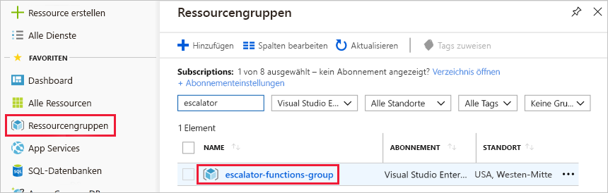

Sie können nun damit beginnen, den Temperaturdienst zu implementieren.You are now ready to start implementing the temperature service. In der vorherigen Einheit haben Sie festgestellt, dass eine serverlose Lösung Ihren Anforderungen am besten entsprechen würde.In the previous unit, you determined that a serverless solution would best fit your needs. Deshalb erstellen wir nun für unsere Azure-Funktion eine Funktions-App.Let's start by creating a function app to hold our Azure Function.

## Was ist eine Funktions-App?What is a function app?

Funktionen werden in einem Ausführungskontext gehostet, der als **Funktions-App** bezeichnet wird.Functions are hosted in an execution context called a **function app**. Sie definieren Funktions-Apps in Azure, um Ihre Funktionen und eine Computeressource logisch in Azure zu gruppieren und zu strukturieren.You define function apps to logically group and structure your functions and a compute resource in Azure. In unserem Aufzugsbeispiel würden Sie eine Funktions-App zum Hosten des Temperaturdiensts der Aufzugsantriebseinheit erstellen.In our elevator example, you would create a function app to host the escalator drive gear temperature service. Vor dem Erstellen der Funktions-App müssen verschiedene Entscheidungen getroffen werden: Sie müssen einen Serviceplan und ein kompatibles Speicherkonto auswählen.There are a few decisions that need to be made to create the function app; you need to choose a service plan and select a compatible storage account.

### Auswählen eines ServiceplansChoosing a service plan

Funktions-Apps können eine von zwei Arten von Serviceplänen nutzen.Function apps may use one of two types of service plans. Der erste Serviceplan ist der **verbrauchsbasierte Serviceplan**.The first service plan is the **Consumption service plan**. Dies ist der Plan, den Sie auswählen, wenn Sie die serverlose Azure-Anwendungsplattform verwenden.This is the plan that you choose when using the Azure serverless application platform. Der verbrauchsbasierte Serviceplan bietet automatische Skalierung und stellt Ihnen die Ausführung Ihrer Funktionen in Rechnung.The Consumption service plan provides automatic scaling and bills you when your functions are running. Der verbrauchsbasierte Serviceplan ermöglicht die Konfiguration eines Zeitlimits für die Ausführung einer Funktion.The Consumption plan comes with a configurable timeout period for the execution of a function. Standardmäßig beträgt dessen Dauer 5 Minuten, Sie können jedoch ein Timeout von bis zu 10 Minuten konfigurieren.By default, it is 5 minutes, but may be configured to have a timeout as long as 10 minutes.

Der zweite Plan wird als **Azure App Service-Plan** bezeichnet.The second plan is called the **Azure App Service plan**. Dieser Plan ermöglicht Ihnen, Zeitüberschreitungen zu vermeiden, indem Sie Ihre Funktion kontinuierlich auf einer von Ihnen definierten VM ausführen lassen.This plan allows you to avoid timeout periods by having your function run continuously on a VM that you define. Bei Verwendung eines App Service-Plans sind Sie für die Verwaltung der App-Ressourcen zuständig, auf denen die Funktion ausgeführt wird, sodass es sich hierbei technisch gesehen nicht um einen serverlosen Plan handelt.When using an App Service plan, you are responsible for managing the app resources the function runs on, so this is technically not a serverless plan. Allerdings kann es eine bessere Wahl sein, wenn Ihre Funktionen kontinuierlich genutzt werden oder Funktionen mehr Verarbeitungsleistung oder Ausführungszeit benötigen als im verbrauchsbasierten Serviceplan vorgesehen.However, it may be a better choice if your functions are used continuously or if your functions require more processing power or execution time than the Consumption plan can provide.

### Anforderungen an das SpeicherkontoStorage account requirements

Erstellen Sie eine Funktions-App, und verbinden Sie sie mit einem Speicherkonto.When you create a function app, it must be linked to a storage account. Sie können ein vorhandenes Konto auswählen oder ein neues erstellen.You can select an existing account or create a new one. Die Funktions-App verwendet dieses Speicherkonto für interne Vorgänge wie z.B. das Protokollieren von Funktionsausführungen und Verwalten von Ausführungstriggern.The function app uses this storage account for internal operations such as logging function executions and managing execution triggers. Im verbrauchsbasierten Serviceplan werden auch der Funktionscode und die Konfigurationsdateien gespeichert.On the Consumption service plan, this is also where the function code and configuration file are stored.

## Erstellen einer Funktions-AppCreate a function app

Lassen Sie uns eine Funktions-App im Azure-Portal erstellen.Let's create a function app in the Azure portal.

1. Melden Sie sich mit Ihrem Azure-Konto beim [Azure-Portal](https://portal.azure.com?azure-portal=true) an.Sign in to the [Azure portal](https://portal.azure.com?azure-portal=true) using your Azure account.

1. Klicken Sie links oben im Azure-Portal auf die Schaltfläche **Ressource erstellen** und dann auf **Erste Schritte > Serverless Function App** (Serverlose Funktions-App), um das Blatt *Erstellen* der Funktions-App zu öffnen.Select the **Create a resource** button found on the upper left-hand corner of the Azure portal, and then select **Get started > Serverless Function App** to open the Function App *Create* blade. Alternativ können Sie auch die Option **Compute > Funktions-App** wählen, um das gleiche Blatt zu öffnen.Alternatively, you can use the **Compute > Function App** option, which will open the same blade.

  

1. Wählen Sie einen global eindeutigen App-Namen aus.Choose a globally unique app name. Dieser dient als Basis-URL Ihres Dienstes.This will serve as the base URL of your service. Sie können beispielsweise den Namen **escalator-functions-xxxxxxx** wählen, wobei „xxxxxxx“ durch Ihre Initialen und Ihr Geburtsjahr ersetzt werden kann.For example, you can name it **escalator-functions-xxxxxxx**, where the x's can be replaced with your initials and your birth year. Wenn dies nicht global eindeutig ist, können Sie eine beliebige andere Kombination versuchen.If this isn't globally unique, you can try any other combination. Gültige Zeichen sind „a-z“, „0-9“ und „-“.Valid characters are a-z, 0-9 and -.

1. Wählen Sie das Azure-Abonnement aus, in dem die Funktions-App gehostet werden soll.Select the Azure subscription where you would like the function app hosted.

1. Erstellen Sie eine neue Ressourcengruppe namens **escalator-functions-group**.Create a new resource group called **escalator-functions-group**. Das Verwenden eine Ressourcengruppe zum Speichern aller Ressourcen, die in diesem Modul verwendet werden, erleichtert das spätere Bereinigen.Using a resource group to hold all resources used in this module will help with clean-up later.

1. Wählen Sie **Windows** als Betriebssystem aus.Select **Windows** for OS.

1. Wählen Sie für **Hostingplan** die Option **Verbrauchstarif** aus, die die serverlose Hostingoption darstellt.For **Hosting Plan**, select **Consumption Plan**, which is the serverless hosting option.

1. Wählen Sie den für Sie (oder Ihre Kunden) nächstgelegenen geografischen Standort aus.Select the geographical location closest to you (or your customers).

1. Erstellen Sie ein neues Speicherkonto.Create a new storage account. Azure benennt es basierend auf dem App-Namen.Azure will give it a name based on the app name. Sie können ihn nach Belieben ändern, er muss aber auf jeden Fall eindeutig sein.You can change it if you like, but it must also be unique.

1. Vergewissern Sie sich, das Azure Application Insights auf **Ein** festgelegt ist, und wählen Sie die Ihnen (oder Ihren Kunden) nächstgelegene Region aus.Make sure that Azure Application Insights is **On** and select the region closest to you (or your customers).
  Wenn Sie fertig sind, sollte Ihre Konfiguration wie die Konfiguration im folgenden Screenshot aussehen.When you're finished, your configuration should look like the config in the following screenshot.

  

1. Wählen Sie **Erstellen** aus. Die Bereitstellung dauert einige Minuten.Select **Create**; deployment will take a few minutes. Sie erhalten eine Benachrichtigung, sobald sie abgeschlossen ist.You'll receive a notification once it's complete.

## Überprüfen Ihrer Azure-Funktions-AppVerify your Azure function app

1. Wählen Sie im linken Menü des Azure-Portals **Ressourcengruppen** aus.From the Azure portal left-hand menu, select **Resource groups**. Dann sollte Ihnen die Gruppe **escalator-functions-group** in der Liste der verfügbaren Gruppen angezeigt werden.You should then see the **escalator-functions-group** in the list of available groups.

  

1. Wählen Sie die Gruppe **escalator-functions-group** aus.Select the **escalator-functions-group**. Es sollte dann eine Ressourcenliste ähnlich der folgenden angezeigt werden.You should then see a resource list like the following list.

  

Das als App Service aufgelistete Element mit dem Blitzsymbol ist Ihre neue Funktions-App.The item with the lightning bolt Function icon, listed as an App Service, is your new function app. Sie können auf sie klicken, um die Details zur neuen Funktion zu öffnen, der eine öffentliche URL zugewiesen ist. Wenn Sie sie in einem Browser öffnen, sollte eine Standardwebseite angezeigt werden, die angibt, dass Ihre Funktions-App ausgeführt wird.You can click on it to open the details about the new function - it has a public URL assigned to it, if you open that in a browser, you should get a default web page that indicates your Function App is running.
