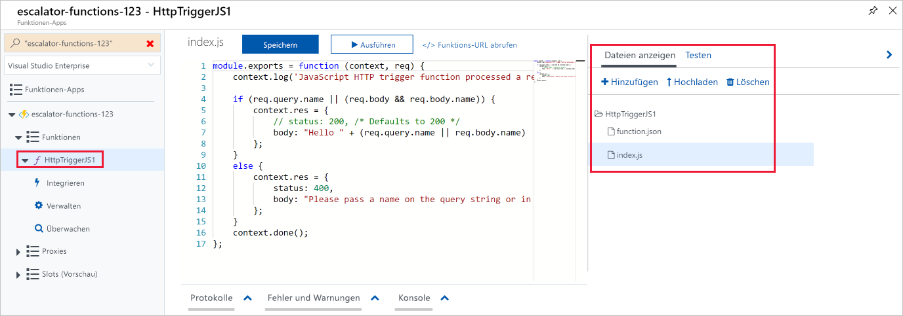
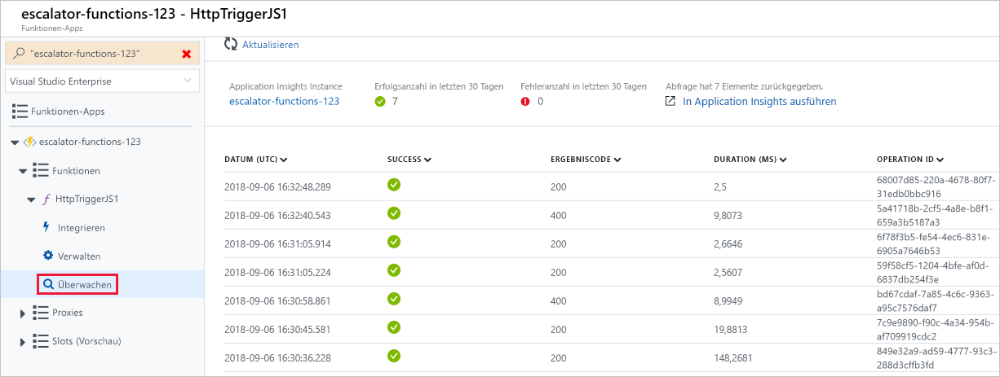

<span data-ttu-id="a5965-101">Nachdem Sie die Funktions-App erstellt haben, lassen Sie uns einen Blick darauf werfen, wie eine Azure-Funktion erstellt, konfiguriert und ausgeführt wird.</span><span class="sxs-lookup"><span data-stu-id="a5965-101">Now that we have a function app created, let's look at how to build, configure, and execute a function.</span></span>

### <a name="triggers"></a><span data-ttu-id="a5965-102">Trigger</span><span class="sxs-lookup"><span data-stu-id="a5965-102">Triggers</span></span>

<span data-ttu-id="a5965-103">Funktionen sind ereignisgesteuert, d.h., sie werden als Reaktion auf ein Ereignis ausgeführt.</span><span class="sxs-lookup"><span data-stu-id="a5965-103">Functions are event driven, which means they run in response to an event.</span></span>

<span data-ttu-id="a5965-104">Die Art von Ereignis, die die Funktion startet, wird als **Trigger** bezeichnet.</span><span class="sxs-lookup"><span data-stu-id="a5965-104">The type of event that starts the function is called a **trigger**.</span></span> <span data-ttu-id="a5965-105">Sie müssen eine Funktion mit genau einem Trigger konfigurieren.</span><span class="sxs-lookup"><span data-stu-id="a5965-105">You must configure a function with exactly one trigger.</span></span>

<span data-ttu-id="a5965-106">Azure unterstützt Trigger für die folgenden Dienste.</span><span class="sxs-lookup"><span data-stu-id="a5965-106">Azure supports triggers for the following services.</span></span>

| <span data-ttu-id="a5965-107">Dienst</span><span class="sxs-lookup"><span data-stu-id="a5965-107">Service</span></span>                 | <span data-ttu-id="a5965-108">Beschreibung des Triggers</span><span class="sxs-lookup"><span data-stu-id="a5965-108">Trigger description</span></span>  |
|-------------------------|---------|
| <span data-ttu-id="a5965-109">Blob-Speicher</span><span class="sxs-lookup"><span data-stu-id="a5965-109">Blob storage</span></span>            | <span data-ttu-id="a5965-110">Startet eine Funktion, wenn ein neues oder aktualisiertes Blob erkannt wird.</span><span class="sxs-lookup"><span data-stu-id="a5965-110">Start a function when a new or updated blob is detected.</span></span>       |
| <span data-ttu-id="a5965-111">Cosmos DB</span><span class="sxs-lookup"><span data-stu-id="a5965-111">Cosmos DB</span></span>               | <span data-ttu-id="a5965-112">Startet eine Funktion, wenn Einfügungen und Aktualisierungen erkannt werden.</span><span class="sxs-lookup"><span data-stu-id="a5965-112">Start a function when inserts and updates are detected.</span></span>      |
| <span data-ttu-id="a5965-113">Event Grid</span><span class="sxs-lookup"><span data-stu-id="a5965-113">Event Grid</span></span>              | <span data-ttu-id="a5965-114">Startet eine Funktion, wenn ein Ereignis von Event Grid empfangen wird.</span><span class="sxs-lookup"><span data-stu-id="a5965-114">Start a function when an event is received from Event Grid.</span></span>       |
| <span data-ttu-id="a5965-115">HTTP</span><span class="sxs-lookup"><span data-stu-id="a5965-115">HTTP</span></span>                    | <span data-ttu-id="a5965-116">Startet eine Funktion mit einer HTTP-Anforderung.</span><span class="sxs-lookup"><span data-stu-id="a5965-116">Start a function with an HTTP request.</span></span>      |
| <span data-ttu-id="a5965-117">Microsoft Graph-Ereignisse</span><span class="sxs-lookup"><span data-stu-id="a5965-117">Microsoft Graph Events</span></span>  | <span data-ttu-id="a5965-118">Startet eine Funktion als Reaktion auf einen von Microsoft Graph eingehenden Webhook.</span><span class="sxs-lookup"><span data-stu-id="a5965-118">Start a function in response to an incoming webhook from the Microsoft Graph.</span></span> <span data-ttu-id="a5965-119">Jede Instanz dieses Triggers kann auf einen Microsoft Graph-Ressourcentyp reagieren.</span><span class="sxs-lookup"><span data-stu-id="a5965-119">Each instance of this trigger can react to one Microsoft Graph resource type.</span></span>       |
| <span data-ttu-id="a5965-120">Queue Storage</span><span class="sxs-lookup"><span data-stu-id="a5965-120">Queue storage</span></span>           | <span data-ttu-id="a5965-121">Startet eine Funktion, wenn ein neues Element in einer Warteschlange eingeht.</span><span class="sxs-lookup"><span data-stu-id="a5965-121">Start a function when a new item is received on a queue.</span></span> <span data-ttu-id="a5965-122">Die Warteschlangennachricht wird als Eingabe für die Funktion bereitgestellt.</span><span class="sxs-lookup"><span data-stu-id="a5965-122">The queue message is provided as input to the function.</span></span>      |
| <span data-ttu-id="a5965-123">Service Bus</span><span class="sxs-lookup"><span data-stu-id="a5965-123">Service Bus</span></span>             | <span data-ttu-id="a5965-124">Startet eine Funktion als Reaktion auf Nachrichten aus einer Service Bus-Warteschlange.</span><span class="sxs-lookup"><span data-stu-id="a5965-124">Start a function in response to messages from a Service Bus queue.</span></span>       |
| <span data-ttu-id="a5965-125">Timer</span><span class="sxs-lookup"><span data-stu-id="a5965-125">Timer</span></span>                   | <span data-ttu-id="a5965-126">Startet eine Funktion gemäß einem Zeitplan.</span><span class="sxs-lookup"><span data-stu-id="a5965-126">Start a function on a schedule.</span></span>       |

### <a name="bindings"></a><span data-ttu-id="a5965-127">Bindungen</span><span class="sxs-lookup"><span data-stu-id="a5965-127">Bindings</span></span>

<span data-ttu-id="a5965-128">Bindungen sind eine deklarative Möglichkeit, Daten und Dienste mit Ihrer Funktion zu verbinden.</span><span class="sxs-lookup"><span data-stu-id="a5965-128">Bindings are a declarative way to connect data and services to your function.</span></span> <span data-ttu-id="a5965-129">Bindungen sind in der Lage, mit verschiedenen Diensten zu kommunizieren. Das bedeutet, dass Sie keinen Code in Ihrer Funktion schreiben müssen, um sich mit Datenquellen zu verbinden und Verbindungen zu verwalten.</span><span class="sxs-lookup"><span data-stu-id="a5965-129">Bindings know how to talk to different services, which means you don't have to write code in your function to connect to data sources and manage connections.</span></span> <span data-ttu-id="a5965-130">Die Plattform nimmt Ihnen diese komplexen Aufgaben als Teil des Bindungscodes ab.</span><span class="sxs-lookup"><span data-stu-id="a5965-130">The platform takes care of that complexity for you as part of the binding code.</span></span> <span data-ttu-id="a5965-131">Jede Bindung hat eine Richtung. Ihr Code liest Daten aus *Eingabe*bindungen und schreibt Daten in *Ausgabe*bindungen.</span><span class="sxs-lookup"><span data-stu-id="a5965-131">Each binding has a direction - your code reads data from *input* bindings and writes data to *output* bindings.</span></span> <span data-ttu-id="a5965-132">Jede Funktion kann null oder mehr Bindungen haben, um die von der Funktion verarbeiteten Ein- und Ausgabedaten zu verwalten.</span><span class="sxs-lookup"><span data-stu-id="a5965-132">Each function can have zero or more bindings to manage the input and output data processed by the function.</span></span>

<span data-ttu-id="a5965-133">Technisch gesehen ist ein Trigger eine spezielle Art von Eingabebindung, die zusätzlich die Möglichkeit bietet, die Ausführung einzuleiten.</span><span class="sxs-lookup"><span data-stu-id="a5965-133">A trigger is a special type of input binding that has the additional capability of initiating execution.</span></span>

<span data-ttu-id="a5965-134">Azure bietet eine [große Anzahl von Bindungen](https://docs.microsoft.com/azure/azure-functions/functions-triggers-bindings#supported-bindings) zum Herstellen von Verbindungen mit anderen Speicher- und Messagingdiensten.</span><span class="sxs-lookup"><span data-stu-id="a5965-134">Azure provides a [large number of bindings](https://docs.microsoft.com/azure/azure-functions/functions-triggers-bindings#supported-bindings) to connect to different storage and messaging services.</span></span>

### <a name="a-sample-binding-definition"></a><span data-ttu-id="a5965-135">Beispieldefinition einer Bindung</span><span class="sxs-lookup"><span data-stu-id="a5965-135">A sample binding definition</span></span>

<span data-ttu-id="a5965-136">Sehen wir uns ein Beispiel zum Konfigurieren einer Funktion mit einer Eingabebindung (Trigger) und einer Ausgabebindung an.</span><span class="sxs-lookup"><span data-stu-id="a5965-136">Let's look at an example of configuring a function with an input binding (trigger) and an output binding.</span></span> <span data-ttu-id="a5965-137">Angenommen, wir möchten Daten aus Blob Storage lesen, sie in unserer Funktion verarbeiten und dann eine Nachricht in eine Warteschlange schreiben.</span><span class="sxs-lookup"><span data-stu-id="a5965-137">Let's say we want to read data from Blob storage, process it in our function, and then write a message to a queue.</span></span> <span data-ttu-id="a5965-138">Konfigurieren Sie eine _Eingabebindung_ des Typs *Blob* und eine _Ausgabebindung_ des Typs *Warteschlange*.</span><span class="sxs-lookup"><span data-stu-id="a5965-138">You would configure an _input binding_ of type *blob* and an _output binding_ of type *queue*.</span></span>

<span data-ttu-id="a5965-139">Bindungen können im Azure-Portal definiert werden und werden als JSON-Dateien gespeichert, die Sie auch direkt bearbeiten können.</span><span class="sxs-lookup"><span data-stu-id="a5965-139">Bindings can be defined in the Azure portal, and are stored as JSON files, which you can also edit directly.</span></span> <span data-ttu-id="a5965-140">Der folgende JSON-Code ist eine Beispieldefinition eines Triggers und einer Bindung für eine Funktion.</span><span class="sxs-lookup"><span data-stu-id="a5965-140">The following JSON is sample definition of a trigger and binding for a function.</span></span>

```json
{
  "bindings": [
    {
      "name": "order",
      "type": "queueTrigger",
      "direction": "in",
      "queueName": "myqueue-items",
      "connection": "MY_STORAGE_ACCT_APP_SETTING"
    },
    {
      "name": "$return",
      "type": "table",
      "direction": "out",
      "tableName": "outTable",
      "connection": "MY_TABLE_STORAGE_ACCT_APP_SETTING"
    }
  ]
}
```

<span data-ttu-id="a5965-141">Dieses Beispiel zeigt eine Funktion, die durch eine Nachricht ausgelöst wird, die der Warteschlange namens **myqueue-items** hinzugefügt wird.</span><span class="sxs-lookup"><span data-stu-id="a5965-141">This example shows a function that is triggered by a message being added to a queue named **myqueue-items**.</span></span> <span data-ttu-id="a5965-142">Danach wird der Rückgabewert der Funktion an die Tabelle **outTable** in Azure Table Storage gesendet.</span><span class="sxs-lookup"><span data-stu-id="a5965-142">It then sends the return value of the function to the **outTable** table in Azure Table storage.</span></span> <span data-ttu-id="a5965-143">Dies ist ein sehr einfaches Beispiel. Wir könnten die Ausgabe mithilfe einer SendGrid-Bindung in eine E-Mail umwandeln. Oder wir könnten ein Ereignis in einer Service Bus-Instanz ablegen, um eine andere Komponente in unserer Architektur zu benachrichtigen, oder sogar mehrere Ausgabebindungen einrichten, um Daten an verschiedene Dienste weiterzuleiten.</span><span class="sxs-lookup"><span data-stu-id="a5965-143">This is a very simple example, we could change the output to be an email using a SendGrid binding, or put an event onto a Service Bus to notify some other component in our architecture, or even have multiple output bindings to push data to various services.</span></span>

## <a name="creating-a-function-in-the-azure-portal"></a><span data-ttu-id="a5965-144">Erstellen einer Funktion im Azure-Portal</span><span class="sxs-lookup"><span data-stu-id="a5965-144">Creating a function in the Azure portal</span></span>

<span data-ttu-id="a5965-145">Azure bietet für gängige Szenarien mehrere vorgefertigte Funktionsvorlagen.</span><span class="sxs-lookup"><span data-stu-id="a5965-145">Azure provides several pre-made function templates for common scenarios.</span></span>

### <a name="quickstart-templates"></a><span data-ttu-id="a5965-146">Schnellstartvorlagen</span><span class="sxs-lookup"><span data-stu-id="a5965-146">Quickstart templates</span></span>

<span data-ttu-id="a5965-147">Wenn Sie zum ersten Mal eine Funktion hinzufügen, wird Ihnen ein Bildschirm für den Schnellstart angezeigt.</span><span class="sxs-lookup"><span data-stu-id="a5965-147">When adding your first function, you are presented with the Quickstart screen.</span></span> <span data-ttu-id="a5965-148">Auf diesem Bildschirm können Sie einen Triggertyp (HTTP, Timer oder Daten) und die Programmiersprache (C#, JavaScript, F# oder Java) auswählen.</span><span class="sxs-lookup"><span data-stu-id="a5965-148">This screen allows you to choose a trigger type (HTTP, Timer, or Data) and programming language (C#, JavaScript, F# or Java).</span></span> <span data-ttu-id="a5965-149">Auf der Grundlage Ihrer Auswahl generiert Azure anschließend den Funktionscode und die Konfiguration für Sie mit einem Beispielcode, um die im Protokoll empfangenen Eingabedaten anzuzeigen.</span><span class="sxs-lookup"><span data-stu-id="a5965-149">Then, based on your selections, Azure will generate the function code and configuration for you with some sample code provided to display out the input data received in the log.</span></span>

### <a name="custom-function-templates"></a><span data-ttu-id="a5965-150">Benutzerdefinierte Funktionsvorlagen</span><span class="sxs-lookup"><span data-stu-id="a5965-150">Custom function templates</span></span>

<span data-ttu-id="a5965-151">Die Auswahl von Schnellstartvorlagen ermöglicht einen einfachen Zugriff auf die gängigsten Szenarien.</span><span class="sxs-lookup"><span data-stu-id="a5965-151">The selection of Quickstart templates provides easy access to the most common scenarios.</span></span> <span data-ttu-id="a5965-152">Azure bietet jedoch mehr als 30 zusätzliche Vorlagen, mit denen Sie loslegen können.</span><span class="sxs-lookup"><span data-stu-id="a5965-152">However, Azure provides over 30 additional templates you can start with.</span></span> <span data-ttu-id="a5965-153">Diese können auf dem Bildschirm mit der Vorlagenliste ausgewählt werden, während Sie weitere Funktionen erstellen oder indem Sie auf dem Schnellstartbildschirm die Option **Benutzerdefinierte Funktion** auswählen.</span><span class="sxs-lookup"><span data-stu-id="a5965-153">These can be selected from the template list screen when creating subsequent functions or be selected by using the **Custom function** option on the Quickstart screen.</span></span>

- <span data-ttu-id="a5965-154">HTTP-Trigger mit C#, F# oder JavaScript</span><span class="sxs-lookup"><span data-stu-id="a5965-154">HTTP trigger w/ C#, F#, or JavaScript</span></span>
- <span data-ttu-id="a5965-155">Timertrigger mit C#, F# oder JavaScript</span><span class="sxs-lookup"><span data-stu-id="a5965-155">Timer trigger w/ C#, F#, or JavaScript</span></span>
- <span data-ttu-id="a5965-156">Warteschlangentrigger mit C#, F# oder JavaScript</span><span class="sxs-lookup"><span data-stu-id="a5965-156">Queue trigger w/ C#, F#, or JavaScript</span></span>
- <span data-ttu-id="a5965-157">Service Bus-Warteschlangentrigger mit C#, F# oder JavaScript</span><span class="sxs-lookup"><span data-stu-id="a5965-157">Service Bus Queue trigger w/ C#, F#, or JavaScript</span></span>
- <span data-ttu-id="a5965-158">Cosmos DB-Trigger mit C# oder JavaScript</span><span class="sxs-lookup"><span data-stu-id="a5965-158">Cosmos DB trigger w/ C# or JavaScript</span></span>
- <span data-ttu-id="a5965-159">IoT Hub (Event Hub) mit C#, F# oder JavaScript</span><span class="sxs-lookup"><span data-stu-id="a5965-159">IoT Hub (Event Hub) w/ C#, F#, or JavaScript</span></span>
- <span data-ttu-id="a5965-160">... und viele mehr</span><span class="sxs-lookup"><span data-stu-id="a5965-160">... and many more</span></span>

## <a name="navigating-to-your-function-and-files"></a><span data-ttu-id="a5965-161">Navigieren zu Ihrer Funktion und Ihren Dateien</span><span class="sxs-lookup"><span data-stu-id="a5965-161">Navigating to your function and files</span></span>

<span data-ttu-id="a5965-162">Nachdem Sie eine Funktion anhand einer Vorlage erstellt haben, werden mehrere Dateien generiert.</span><span class="sxs-lookup"><span data-stu-id="a5965-162">When you create a function from a template, several files are created.</span></span> <span data-ttu-id="a5965-163">Wenn Sie z.B. den Schnellstart „Webhook + API“ mit JavaScript gewählt haben, sind die generierten Dateien eine Konfigurationsdatei, **function.json**, und eine Quellcodedatei, **index.js**.</span><span class="sxs-lookup"><span data-stu-id="a5965-163">For example, if you opted to use the Webhook + API Quickstart using JavaScript, the files generated would be a configuration file, **function.json**, and a source code file, **index.js**.</span></span> <span data-ttu-id="a5965-164">Die Funktionen, die Sie in einer Funktions-App erstellen, werden im Portal für Funktions-Apps unter dem Menüpunkt **Funktionen** angezeigt.</span><span class="sxs-lookup"><span data-stu-id="a5965-164">The functions you create in a function app appear under the **Functions** menu item in the function app portal.</span></span>

<span data-ttu-id="a5965-165">Wenn Sie eine Funktion in Ihrer Funktions-App auswählen, wird ein Code-Editor geöffnet, in dem – wie im folgenden Screenshot – der Code für Ihre Funktion angezeigt wird.</span><span class="sxs-lookup"><span data-stu-id="a5965-165">When you select a function in your function app, a code editor opens and displays the code for your function, as illustrated in the following screenshot.</span></span>



<span data-ttu-id="a5965-167">Wie Sie im vorherigen Screenshot sehen können, gibt es auf der rechten Seite ein Flyoutmenü, das die Registerkarte **Dateien anzeigen** enthält.</span><span class="sxs-lookup"><span data-stu-id="a5965-167">As you can see in the preceding screenshot, there's a flyout menu on the right that includes a tab to **View files**.</span></span> <span data-ttu-id="a5965-168">Wenn Sie diese Registerkarte auswählen, wird die Dateistruktur angezeigt, aus der sich Ihre Funktion zusammensetzt.</span><span class="sxs-lookup"><span data-stu-id="a5965-168">Selecting this tab shows the file structure that makes up your function.</span></span>

## <a name="testing-your-azure-function"></a><span data-ttu-id="a5965-169">Testen der Azure-Funktion</span><span class="sxs-lookup"><span data-stu-id="a5965-169">Testing your Azure function</span></span>

<span data-ttu-id="a5965-170">Nachdem Sie eine Funktion erstellt haben, sollten Sie es testen.</span><span class="sxs-lookup"><span data-stu-id="a5965-170">Once you've created a function, you'll want to test it.</span></span> <span data-ttu-id="a5965-171">Es gibt verschiedene Verfahren dafür: manuelles Ausführen und Testen im Azure-Portal selbst.</span><span class="sxs-lookup"><span data-stu-id="a5965-171">There are a couple of approaches: manual execution and testing from within the Azure portal itself.</span></span>

### <a name="manual-execution"></a><span data-ttu-id="a5965-172">Manuelle Ausführung</span><span class="sxs-lookup"><span data-stu-id="a5965-172">Manual execution</span></span>

<span data-ttu-id="a5965-173">Sie können eine Funktion starten, indem Sie den konfigurierten Trigger manuell auslösen.</span><span class="sxs-lookup"><span data-stu-id="a5965-173">You can start a function by manually triggering the configured trigger.</span></span> <span data-ttu-id="a5965-174">Wenn Sie z.B. einen HTTP-Trigger verwenden, können Sie ein Tool wie Postman oder cURL einsetzen, um eine HTTP-Anforderung an die URL Ihres Funktionsendpunkts auszulösen, die in der Definition des HTTP-Triggers verfügbar ist (**Funktions-URL abrufen**).</span><span class="sxs-lookup"><span data-stu-id="a5965-174">For instance, if you are using an HTTP trigger - you can use a tool such as Postman or cURL to initiate an HTTP request to your function endpoint URL, which is available from the HTTP trigger definition (**Get function URL**).</span></span>

### <a name="testing-in-the-azure-portal"></a><span data-ttu-id="a5965-175">Testen im Azure-Portal</span><span class="sxs-lookup"><span data-stu-id="a5965-175">Testing in the Azure portal</span></span>

<span data-ttu-id="a5965-176">Das Azure-Portal bietet auch eine praktische Möglichkeit, Ihre Funktionen zu testen.</span><span class="sxs-lookup"><span data-stu-id="a5965-176">The portal also provides a convenient way to test your functions.</span></span> <span data-ttu-id="a5965-177">Auf der rechten Seite des Codefensters finden Sie ein Flyoutmenü mit Registerkartennavigation.</span><span class="sxs-lookup"><span data-stu-id="a5965-177">On the right side of the code window, there is a flyout tabbed navigation menu.</span></span> <span data-ttu-id="a5965-178">Dieses Menü enthält ein Element **Test**.</span><span class="sxs-lookup"><span data-stu-id="a5965-178">This menu contains a **Test** item.</span></span> <span data-ttu-id="a5965-179">Das Erweitern des Menüs und Auswählen dieser Registerkarte ist eine weitere Möglichkeit, Ihre Funktion auszuführen und das Ergebnis anzuzeigen.</span><span class="sxs-lookup"><span data-stu-id="a5965-179">Expanding the menu and selecting this tab gives you another way to execute your function and view the result.</span></span> <span data-ttu-id="a5965-180">Wenn Sie in diesem Testfenster auf **Ausführen** klicken, werden die Ergebnisse zusammen mit einem Statuscode im Ausgabefenster angezeigt.</span><span class="sxs-lookup"><span data-stu-id="a5965-180">When you click **Run** in this test window, the results are displayed in the output window, along with a status code.</span></span>

## <a name="monitoring-dashboard"></a><span data-ttu-id="a5965-181">Überwachungsdashboard</span><span class="sxs-lookup"><span data-stu-id="a5965-181">Monitoring dashboard</span></span>

<span data-ttu-id="a5965-182">Die Fähigkeit, Ihre Funktionen zu überwachen, ist während der Entwicklung und in der Produktion unerlässlich.</span><span class="sxs-lookup"><span data-stu-id="a5965-182">The ability to monitor your functions is critical during development and in production.</span></span> <span data-ttu-id="a5965-183">Das Azure-Portal bietet ein Überwachungsdashboard, wenn Sie die Application Insights-Integration aktivieren.</span><span class="sxs-lookup"><span data-stu-id="a5965-183">The Azure portal provides a monitoring dashboard available if you turn on the Application Insights integration.</span></span> <span data-ttu-id="a5965-184">Wenn Sie im Navigationsmenü der Funktions-App den Funktionsknoten erweitern, sehen Sie das Menüelement **Monitor**.</span><span class="sxs-lookup"><span data-stu-id="a5965-184">In the function app navigation menu, once you expand the function node you'll see a **Monitor** menu item.</span></span> <span data-ttu-id="a5965-185">Dieses Dashboard „Monitor“ bietet eine schnelle Möglichkeit, den Verlauf der Funktionsausführungen anzuzeigen, und zeigt den Zeitstempel, den Ergebniscode, die Dauer und die Vorgangs-ID, die von Application Insights aufgefüllt werden.</span><span class="sxs-lookup"><span data-stu-id="a5965-185">This monitor dashboard provides a quick way to view the history of function executions and displays the timestamp, result code, duration, and operation ID populated by Application Insights.</span></span>



## <a name="streaming-log-window"></a><span data-ttu-id="a5965-187">Fenster mit dem Streamingprotokoll</span><span class="sxs-lookup"><span data-stu-id="a5965-187">Streaming log window</span></span>

<span data-ttu-id="a5965-188">Zu Debugzwecken können Sie Ihrer Funktion im Azure-Portal auch Protokollierungsanweisungen hinzufügen.</span><span class="sxs-lookup"><span data-stu-id="a5965-188">You're also able to add logging statements to your function for debugging in the Azure portal.</span></span> <span data-ttu-id="a5965-189">Die aufgerufenen Methoden für jede Sprache werden mit einem Protokollierungsobjekt übergeben, das verwendet werden kann, um Informationen im Protokollfenster zu protokollieren. Dieses befindet sich in einem Flyoutmenü mit Registerkarten am unteren Rand des Codefensters.</span><span class="sxs-lookup"><span data-stu-id="a5965-189">The called methods for each language are passed a "logging" object, which may be used to log information to the log window located in a tabbed flyout menu located at the bottom of the code window.</span></span>

<span data-ttu-id="a5965-190">Der folgende JavaScript-Codeausschnitt zeigt, wie eine Nachricht mit der `context.log`-Methode protokolliert wird (das `context`-Objekt wird an den Ereignishandler übergeben).</span><span class="sxs-lookup"><span data-stu-id="a5965-190">The following JavaScript code snippet shows how to log a message using the `context.log` method (the `context` object is passed to the handler).</span></span>

```javascript
  context.log('Enter your logging statement here');
```

<span data-ttu-id="a5965-191">In C# ist dasselbe mit der `log.Info`-Methode möglich.</span><span class="sxs-lookup"><span data-stu-id="a5965-191">We could the same thing in C# using the `log.Info` method.</span></span> <span data-ttu-id="a5965-192">In diesem Fall wird das `log`-Objekt an die C#-Methode übergeben, die die Funktion verarbeitet.</span><span class="sxs-lookup"><span data-stu-id="a5965-192">In this case, the `log` object is passed ot the C# method processing the function.</span></span>

```csharp
  log.Info("Enter your logging statement here");
```

### <a name="errors-and-warnings-window"></a><span data-ttu-id="a5965-193">Fenster „Fehlern und Warnungen“</span><span class="sxs-lookup"><span data-stu-id="a5965-193">Errors and warnings window</span></span>

<span data-ttu-id="a5965-194">Sie finden die Registerkarte für das Fenster mit Fehlern und Warnungen im gleichen Flyoutmenü wie das Protokollfenster.</span><span class="sxs-lookup"><span data-stu-id="a5965-194">You can locate the errors and warnings window tab in the same flyout menu as the log window.</span></span> <span data-ttu-id="a5965-195">Dieses Fenster zeigt Kompilierungsfehler und -warnungen innerhalb Ihres Codes.</span><span class="sxs-lookup"><span data-stu-id="a5965-195">This window will show compilation errors and warnings within your code.</span></span>
