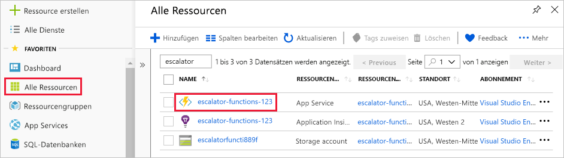
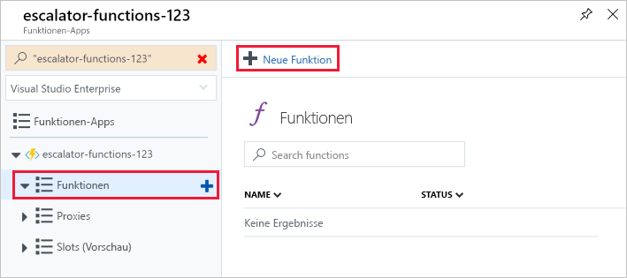
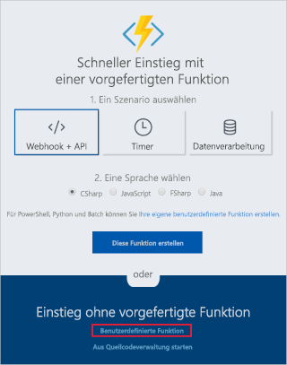
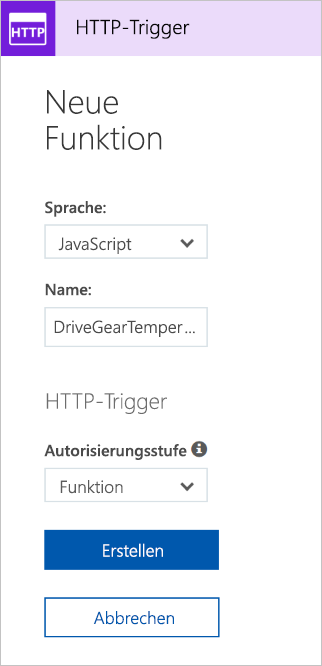
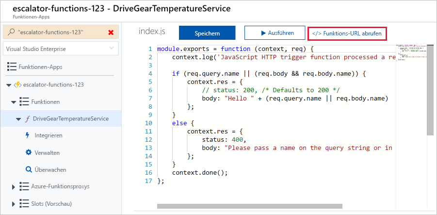
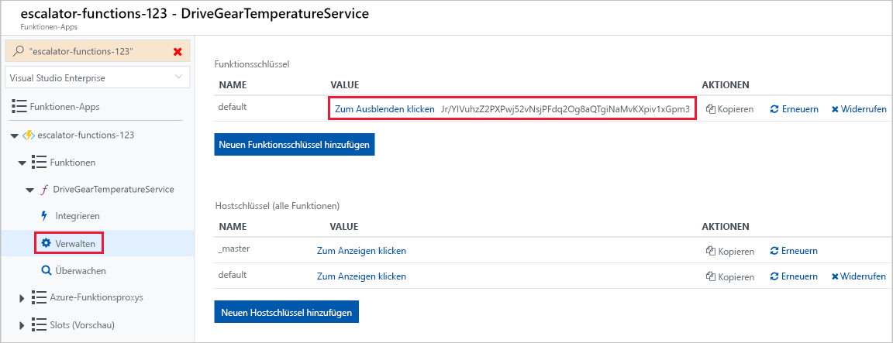
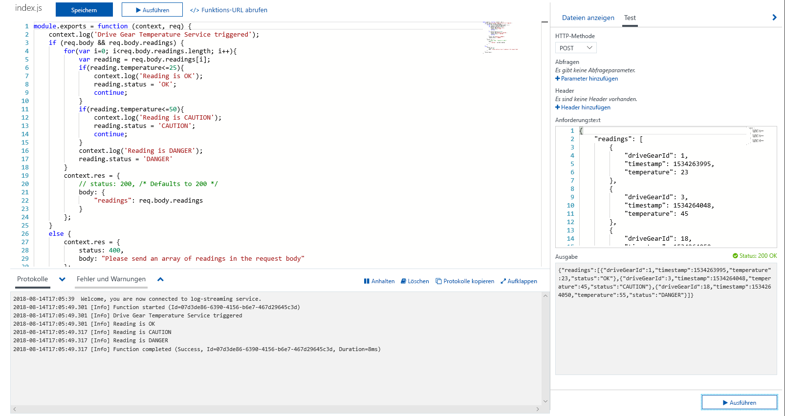
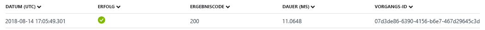

Lassen Sie uns mit unserem Zahnradsteuerungs-Beispiel fortfahren und die Logik für den Temperaturdienst hinzufügen. Insbesondere werden wir Daten von einer HTTP-Anforderung empfangen.

## <a name="function-requirements"></a>Anforderungen an die Funktion

Zunächst müssen wir einige Anforderungen an unsere Logik definieren:

- Temperaturen von 0 bis 25 sollen mit **OK** gekennzeichnet werden.
- Temperaturen von 26 bis 50 sollen mit **CAUTION** gekennzeichnet werden.
- Temperaturen über 50 sollen mit **DANGER** gekennzeichnet werden.

## <a name="add-a-function-to-our-function-app"></a>Hinzufügen einer Funktion zu unserer Funktions-App

Wie in der vorherigen Einheit bereits erläutert wurde, verfügt Azure über Vorlagen, die Ihnen das Erstellen von Funktionen erleichtern. In dieser Einheit verwenden wir die Vorlage `HttpTrigger`, um den Temperaturdienst zu implementieren.

1. Melden Sie sich beim [Azure-Portal](https://portal.azure.com?azure-portal=true) an.

1. Wählen Sie die Ressourcengruppe durch Auswahl aus der ersten Übung **alle Ressourcen** im linken Menü, und klicken Sie dann auswählen <rgn>[Ressourcengruppennamen Sandkasten]</rgn>.

3. Die Ressourcen für die Gruppe werden angezeigt. Klicken Sie auf den Namen der Funktions-app, die Sie in der vorherigen Übung erstellt haben, durch Auswählen der **eskalationsverantwortlicher-Funktionen – Xxxxxxx** Element (auch gekennzeichnet durch das Blitzsymbol Symbol "Funktion").

  

4. Das linke Menü enthält den Namen Ihrer Funktions-App und ein Untermenü mit drei Punkten: *Funktionen*, *Proxys* und *Slots*.  Wählen Sie zum Starten erstellen unsere erste Funktion **Funktionen** , und klicken Sie auf die **neue Funktion** Schaltfläche am oberen Rand der resultierende Seite.

  

5. Klicken Sie auf dem Bildschirm „Schnellstart“ im Abschnitt **Selbstständig einsteigen** auf den Link **Benutzerdefinierte Funktion** (siehe den folgenden Screenshot). Wenn Sie die Schnellstart-Bildschirm nicht angezeigt wird, klicken Sie auf die **wechseln Sie in der schnellstartanleitung** Link am oberen Rand der Seite.

  

6. Wählen Sie aus der Liste der Vorlagen, die auf dem Bildschirm angezeigt, die **JavaScript** Implementierung der **HTTP-Trigger** Vorlage wie im folgenden Screenshot gezeigt.

7. Geben Sie **DriveGearTemperatureService** in das Feld „Name“ des eingeblendeten Dialogfelds **Neue Funktion** ein. Belassen Sie die Autorisierungsstufe auf „Funktion“, und klicken Sie auf die Schaltfläche **Erstellen**, um die Funktion zu erstellen.

  

8. Wenn die Erstellung Ihrer Funktion abgeschlossen ist, öffnet sich der Code-Editor mit dem Inhalt der Codedatei *index.js*. Der Standardcode, den die Vorlage für uns generiert hat, wird im folgenden Codeausschnitt aufgeführt.

```javascript
module.exports = function (context, req) {
    context.log('JavaScript HTTP trigger function processed a request.');

    if (req.query.name || (req.body && req.body.name)) {
        context.res = {
            // status: 200, /* Defaults to 200 */
            body: "Hello " + (req.query.name || req.body.name)
        };
    }
    else {
        context.res = {
            status: 400,
            body: "Please pass a name on the query string or in the request body"
        };
    }
    context.done();
};
```

Unsere-Funktion erwartet einen Namen, der entweder über die Abfragezeichenfolge der HTTP-Anforderung oder als Teil des Anforderungstexts übergeben wird. Die Funktion antwortet mit der Meldung **Hello, {Name}**, die den in der Anforderung gesendeten Namen wiedergibt.

Auf der rechten Seite der Quellansicht sehen Sie zwei Registerkarten. Die **Ansichtsdateien** Registerkarte werden den Code und Config-Datei für Ihre Funktion aufgelistet.  Wählen Sie **"Function.JSON"** zum Anzeigen von der Konfiguration der Funktion, die wie folgt aussehen sollte:

```javascript
{
    "disabled": false,
    "bindings": [
    {
        "authLevel": "function",
        "type": "httpTrigger",
        "direction": "in",
        "name": "req"
    },
    {
        "type": "http",
        "direction": "out",
        "name": "res"
    }
    ]
}
```

Diese Konfiguration deklariert, dass die Funktion ausgeführt wird, sobald sie eine HTTP-Anforderung empfängt. Die Ausgabebindung deklariert, dass die Antwort als HTTP-Antwort gesendet wird.

## <a name="test-the-function-using-curl"></a>Testen der Funktion mit cURL

> [!TIP]
> **cURL** ist ein Befehlszeilentool, das zum Senden und Empfangen von Dateien verwendet werden kann. Es ist in Linux, MacOS und Windows 10 enthalten und kann für die meisten anderen Betriebssysteme heruntergeladen werden. cURL unterstützt zahlreiche Protokolle wie HTTP, HTTPS, FTP, FTPS, SFTP, LDAP, TELNET, SMTP, POP3 usw. Weitere Informationen finden Sie unter den unten angegebenen Links:
>
>- <https://en.wikipedia.org/wiki/CURL>
>- <https://curl.haxx.se/docs/>

Zum Testen der Funktion können Sie über die Befehlszeile mit cURL eine HTTP-Anforderung an die Funktions-URL senden. Um die Endpunkt-URL der Funktion zu finden, kehren Sie zu Ihrem Funktionscode zurück, und wählen Sie den Link **Funktions-URL abrufen** aus (siehe den folgenden Screenshot). Speichern Sie diesen Link vorübergehend.

 

### <a name="securing-http-triggers"></a>Schützen von HTTP-Triggern

Mit HTTP-Triggern können Sie API-Schlüssel verwenden, um unbekannte Aufrufer zu blockieren, indem Sie verlangen, dass der Schlüssel bei jeder Anforderung vorhanden ist. Wenn Sie eine Funktion erstellen, wählen Sie die _Autorisierungsstufe_. In der Standardeinstellung "Function", das einen funktionsspezifischen API-Schlüssel erforderlich ist, wird festgelegt, aber es kann auch auf "Admin" festgelegt werden, verwenden Sie einen Schlüssel für globale "master" oder "Anonymous", um anzugeben, dass kein Schlüssel erforderlich ist. Sie können die Autorisierungsstufe auch nach dem Erstellen über die Funktionseigenschaften ändern.

Da wir bei der Erstellung dieser Funktion „Funktion“ angegeben haben, müssen wir beim Senden der HTTP-Anforderung den Schlüssel angeben. Sie können ihn als Parameter mit einer Abfragezeichenfolge mit dem Namen `code` oder als HTTP-Header (bevorzugt) mit dem Namen `x-functions-key` senden.

Funktions- und Masterschlüssel finden Sie im Abschnitt **Verwalten**, wenn die Funktion erweitert wird. Standardmäßig sind sie ausgeblendet, sodass Sie sie einblenden müssen.

1. Erweitern Sie Ihre Funktion, und wählen Sie die **verwalten** im Abschnitt, der Standard-Funktion-Schlüssel anzeigen und kopieren Sie ihn in die Zwischenablage.



1. Formatieren Sie anschließend einen cURL-Befehl mit der URL Ihrer Funktion und dem Funktionsschlüssel.

    - Verwenden Sie eine `POST`-Anforderung.
    - Fügen Sie einen Headerwert für `Content-Type` des Typs `application/json` hinzu.
    - Achten Sie darauf, dass Sie die URL durch Ihre eigene ersetzen.
    - Übergeben Sie den Funktionsschlüssel als den Headerwert `x-functions-key`.

    ```bash
    curl --header "Content-Type: application/json" --header "x-functions-key: <your-function-key>" --request POST --data "{\"name\": \"Azure Function\"}" https://<your-url-here>/api/DriveGearTemperatureService
    ```

Die Funktion antwortet mit dem Text `"Hello Azure Function"`.

## <a name="add-business-logic-to-the-function"></a>Hinzufügen von Geschäftslogik zur Funktion

Als Nächstes fügen wir die Logik zur Funktion hinzu, die die empfangenen Temperaturmesswerte überprüft und für jeden einen Status festlegt.

Unsere Funktion erwartet ein Array von Temperaturmesswerten. Der folgende JSON-Codeausschnitt ist ein Beispiel für den Anforderungstext, den wir an unsere Funktion senden. Jeder `reading`-Eintrag verfügt über ID, Zeitstempel und Temperatur.

```json
{
    "readings": [
        {
            "driveGearId": 1,
            "timestamp": 1534263995,
            "temperature": 23
        },
        {
            "driveGearId": 3,
            "timestamp": 1534264048,
            "temperature": 45
        },
        {
            "driveGearId": 18,
            "timestamp": 1534264050,
            "temperature": 55
        }
    ]
}
```

Als Nächstes ersetzen wir den Standardcode in unserer Funktion durch den folgenden Code, der unsere Geschäftslogik implementiert.

1. Öffnen Sie die Datei **index.js**, und ersetzen Sie sie durch den folgenden Code.

```javascript
module.exports = function (context, req) {
    context.log('Drive Gear Temperature Service triggered');
    if (req.body && req.body.readings) {
        req.body.readings.forEach(function(reading) {

            if(reading.temperature<=25) {
                reading.status = 'OK';
            } else if (reading.temperature<=50) {
                reading.status = 'CAUTION';
            } else {
                reading.status = 'DANGER'
            }
            context.log('Reading is ' + reading.status);
        });

        context.res = {
            // status: 200, /* Defaults to 200 */
            body: {
                "readings": req.body.readings
            }
        };
    }
    else {
        context.res = {
            status: 400,
            body: "Please send an array of readings in the request body"
        };
    }
    context.done();
};
```

Die Logik, die wir hinzugefügt haben, ist einfach. Wir iterieren über das Array der Messwerte und überprüfen das Temperaturfeld. Abhängig vom Wert dieses Felds wird der Status **OK**, **CAUTION** oder **DANGER** festgelegt. Wir senden dann das Array der Messwerte mit einem zu jedem Eintrag hinzugefügten Statusfeld zurück.

Beachten Sie die `log`-Anweisungen. Wenn die Funktion ausgeführt wird, fügen diese Anweisungen Meldungen im Protokollfenster hinzu.

## <a name="test-our-business-logic"></a>Testen der Geschäftslogik

In diesem Fall verwenden wir den Bereich **Test** im Portal, um unsere Funktion zu testen.

1. Öffnen Sie das Fenster **Test** im rechten Flyoutmenü.

1. Fügen Sie das Beispiel für eine Anforderung in die Anforderung Text-Textfeld ein.

    ```json
    {
        "readings": [
            {
                "driveGearId": 1,
                "timestamp": 1534263995,
                "temperature": 23
            },
            {
                "driveGearId": 3,
                "timestamp": 1534264048,
                "temperature": 45
            },
            {
                "driveGearId": 18,
                "timestamp": 1534264050,
                "temperature": 55
            }
        ]
    }
    ```

1. Wählen Sie **Ausführen** aus, und zeigen Sie die Antwort im Ausgabebereich an. Um Protokollmeldungen anzuzeigen, öffnen Sie die Registerkarte **Protokolle** im Flyoutmenü unten auf der Seite. Der folgende Screenshot zeigt eine Beispielantwort im Ausgabebereich und Meldungen im Bereich **Protokolle**.



Im Ausgabebereich sehen Sie, dass unser Statusfeld korrekt zu jedem Messwert hinzugefügt wurde.

Sie können auch auf dem Dashboard **Monitor** prüfen, ob die Anforderung in Application Insights protokolliert wurde.


