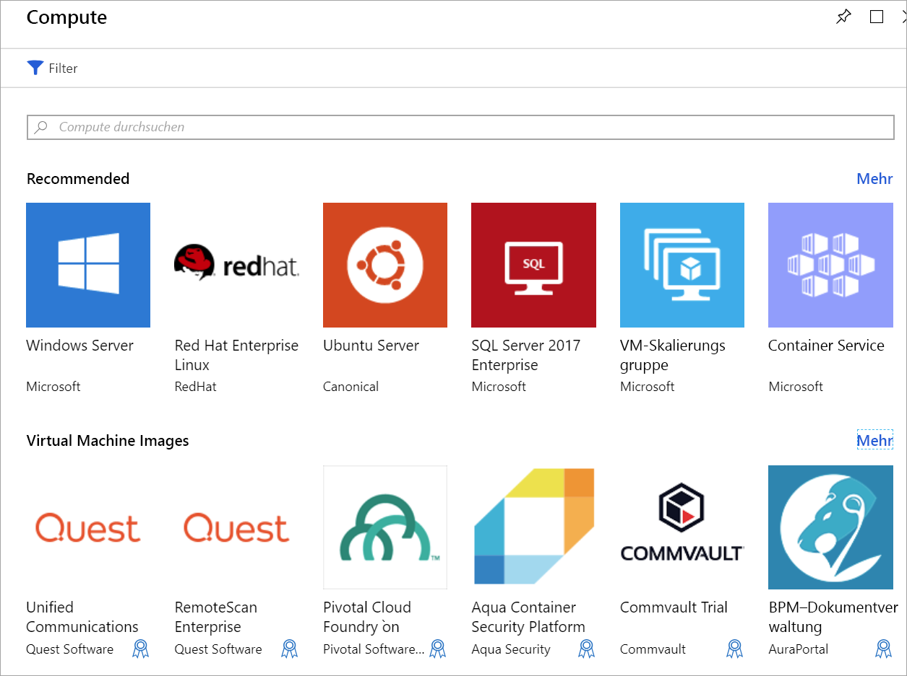

Ihr Unternehmen hat sich dazu entschlossen, die Videodaten seiner Verkehrskameras in Azure mithilfe von VMs zu verwalten. Um die verschiedenen Codecs auszuführen, müssen zuerst die VMs erstellt werden. Außerdem muss eine Verbindung mit den VMs hergestellt und mit diesen interagiert werden. In dieser Einheit erfahren Sie, wie Sie einen virtuellen Computer über das Azure-Portal erstellen. Es wird erläutert, wie Sie die VM für den Remotezugriff konfigurieren und ein VM-Image sowie die entsprechende Speicheroption auswählen.

## Einführung in virtuelle Windows-Computer in Azure

Azure-VMs sind skalierbare bedarfsgesteuerte Cloud Computing-Ressourcen. Diese sind mit virtuellen Computern vergleichbar, die in Windows Hyper-V gehostet werden. Sie umfassen einen Prozessor, den Arbeitsspeicher, den Speicher und Netzwerkressourcen. Sie können virtuelle Computer wie bei Hyper-V beliebig starten und beenden sowie über das Azure-Portal oder die Azure CLI verwalten. Sie können auch einen RDP-Client (Remotedesktopprotokoll) verwenden, um direkt eine Verbindung mit der Windows-Desktopbenutzeroberfläche herzustellen und die VM so zu verwenden, als wären Sie bei einem lokalen Windows-Computer angemeldet.

## Erstellen eines virtuellen Azure-Computers

Es gibt verschiedene Möglichkeiten, virtuelle Computer in Azure zu definieren und bereitzustellen: das Azure-Portal, ein Skript (über die Azure CLI oder PowerShell) oder eine Azure Resource Manager-Vorlage. In allen Fällen müssen Sie die verschiedenen informationsbestandteilen, bereitstellen, die wir bald eingehe.

Außerdem stellt der Azure Marketplace vorkonfigurierte Images zur Verfügung, die sowohl ein Betriebssystem als auch beliebte Softwaretools umfassen, die für bestimmte Szenarios installiert sind.

## In einem virtuellen Windows-Computer verwendete Ressourcen

Beim Erstellen eines virtuellen Windows-Computers in Azure können Sie auch Ressourcen zum Hosten des virtuellen Computers erstellen. Diese Ressourcen arbeiten zusammen, um einen virtuellen Computer zu erstellen und das Windows-Betriebssystem auszuführen. Sie sind entweder bereits vorhanden (und werden während der Erstellung der VM ausgewählt), oder sie werden gemeinsam mit der VM erstellt. Folgende Ressourcen müssen vorhanden sein:

- Ein virtueller Computer, der CPU und Speicherressourcen bereitstellt.
- Ein Azure Storage-Konto, in dem die virtuellen Festplatten gespeichert werden.
- Virtuelle Datenträger, auf denen das Betriebssystem, die Anwendungen und Daten gespeichert werden.
- Ein virtuelles Netzwerk (VNET), über das der virtuelle Computer mit anderen Azure-Diensten oder Ihrer eigenen lokalen Hardware verbunden wird.
- Eine Netzwerkschnittstelle, die zur Kommunikation mit dem VNET dient.
- Eine öffentliche IP-Adresse, damit Sie auf den virtuellen Computer zugreifen können. Dies ist optional.

Wie bei anderen Azure-Diensten auch benötigen Sie eine **Ressourcengruppe**, in der der virtuelle Computer gespeichert wird. Sie sollten diese Ressourcen zu Verwaltungszwecken optional in einer Gruppe zusammenfassen. Bei der Erstellung einer neuen VM können Sie entweder eine vorhandene Ressourcengruppe verwenden oder eine neue erstellen.

## Auswählen des VM-Image

Das Auswählen eines Images ist eine der wichtigsten Entscheidungen, die Sie beim Erstellen einer VM berücksichtigen müssen. Ein Image ist eine Vorlage, die zum Erstellen einer VM verwendet wird. Diese Vorlagen enthalten ein Betriebssystem und häufig auch andere Software, z.B. Entwicklungstools oder Webhostingumgebungen.

Alle Komponenten, die auf einem Computer installiert werden können, können auch in einem Image enthalten sein. Sie können eine VM über ein Image erstellen, das genau für die Aufgaben vorkonfiguriert ist, die Sie benötigen, z.B. zum Hosten einer ASP.NET Core-App.

> [!TIP]
> Sie können außerdem auch Ihre eigenen Images erstellen und hochladen. Weitere Informationen dazu finden Sie in der Dokumentation.

## Ändern der Größe Ihrer VM
Ein virtueller Computer weist wie ein physischer Computer eine bestimmte Menge an Arbeitsspeicher und CPU-Leistung auf. Azure bietet eine Reihe von VMs mit unterschiedlichen Größen zu unterschiedlichen Preisen an. Die Größe, die Sie auswählen, bestimmt die Verarbeitungsleistung, den Arbeitsspeicher und die maximale Speicherkapazität Ihrer VMs.

> [!WARNING]
> Es gelten Kontingentgrenzen für die einzelnen Abonnements, die sich auf die Erstellung der VM auswirken können. Standardmäßig dürfen Ihre VMs innerhalb einer Region insgesamt nicht mehr als 20 virtuelle _Kerne_ aufweisen. Sie können die VMs entweder auf mehrere Regionen aufteilen oder einen [Onlineantrag](https://docs.microsoft.com/azure/azure-supportability/resource-manager-core-quotas-request) stellen, damit die Grenzen erhöht werden.

Die VM-Größen werden in Kategorien unterteilt, angefangen bei der B-Serie für grundlegende Tests, bis hin zur H-Serie für große Computingtasks. Wählen Sie die Größe des virtuellen Computers anhand der Workload aus, die Sie ausführen möchten. Sie können die Größe eines virtuellen Computers zwar ändern, nachdem Sie ihn erstellt haben, aber Sie müssen ihn zu diesem Zweck beenden. Daher ist es besser, wenn Sie direkt zu Beginn die richtige Größe auswählen.

#### Nachfolgend werden einige Anweisungen aufgeführt.

| Vorgehensweise | Prüfen Sie die folgenden Größen:
|-------|------------------|
| **Allgemeine Verwendung für das Computing bzw. Web:** für Test- und Entwicklungsaufgaben, für kleine bis mittlere Datenbanken oder für Webserver mit geringer bis mittlerer Auslastung. | B, Dsv3, Dv3, DSv2, Dv2 |
| **Schwierige Rechenaufgaben:** Für Webserver, Netzwerkappliances, Batchverarbeitungsvorgänge und Anwendungsserver mit mittlerer Auslastung. | Fsv2, Fs, F |
| **Hohe Speicherauslastung**: Für relationale Datenbankserver, mittlere bis große Caches und In-Memory-Analysen. | Esv3, Ev3, M, GS, G, DSv2, Dv2 |
| **Die datenspeicherung und-Verarbeitung** Big Data, SQL- und NoSQL-Datenbanken, die hoher Durchsatz und e/a-benötigen. | Ls |
| **Aufwendiges Grafikrendering** oder Videobearbeitung sowie Modelltraining und Rückschlüsse (ND) mit Deep Learning. | NV, NC, NCv2, NCv3, ND |
| **High Performance Computing (HPC)**: Wenn Sie virtuelle Computer mit den schnellsten und leistungsstärksten CPUs benötigen, die optional über Netzwerkschnittstellen mit hohem Durchsatz verfügen. | H |

## Auswählen von Speicheroptionen

Der nächste Satz von Entscheidungen dreht sich um Speicher. Zunächst können Sie die Datenträgertechnologie auswählen. Zu den Optionen zählt ein konventionelles Festplattenlaufwerk (HDD) oder ein moderneres Solid State Drive (SSD). Genau wie die Hardware, die Sie erwerben, kostet SSD-Speicher mehr, bietet aber eine bessere Leistung.

> [!TIP]
> Es sind zwei SSD-Speicherebenen verfügbar: Standard und Premium. Wählen Sie SSD Standard-Datenträger aus, wenn Sie normale Workloads verwenden, aber eine bessere Leistung wünschen. Wählen Sie SSD Premium-Datenträger aus, wenn Sie über E/A-intensive Workloads oder unternehmenskritische Systeme verfügen, die Daten sehr schnell verarbeiten müssen.

### Zuordnen von Speicher zu Datenträgern

Azure verwendet virtuelle Festplatten (VHDs), um physische Datenträger für die VM darzustellen. VHDs replizieren das logische Format und die Daten eines Festplattenlaufwerks, werden aber als Seitenblobs in einem Azure Storage-Konto gespeichert. Sie können pro Datenträger auswählen, welche Art von Speicher verwendet werden soll (SSD oder HDD). Dies ermöglicht es Ihnen, die Leistung der einzelnen Datenträger zu steuern, wahrscheinlich basierend auf der E/A, die Sie auf ihm ausführen möchten.

Standardmäßig werden zwei VHDs für Ihren virtuellen Windows-Computer erstellt:

1. Der **Betriebssystemdatenträger**. Dabei handelt es sich um das primäre Laufwerk (Laufwerk C:), das eine maximale Kapazität von 2.048 GB aufweist.

1. Ein **temporärer Datenträger**. Dieser dient als temporärer Speicher für das Betriebssystem oder Apps. Er wird standardmäßig als Laufwerk D: konfiguriert und ist basierend auf der VM-Größe dimensioniert, was ihn zu einem idealen Speicherort für die Windows-Auslagerungsdatei macht.

> [!WARNING]
> Der temporäre Datenträger ist nicht persistent. Sie sollten nur Daten auf diesen Datenträger schreiben, deren Verlust in Kauf genommen werden kann.

#### Wie sieht es mit dem Einsatz von Daten aus?

Sie können Daten zusammen mit dem Betriebssystem auf dem Laufwerk C: speichern, aber ein besserer Ansatz ist es, dedizierte _Datenträger_ zu erstellen. Sie können weitere Datenträger erstellen und an den virtuellen Computer anfügen. Jeder Datenträger kann bis zu 4.095 GB Daten enthalten. Die maximale Speicherkapazität wird durch die Größe der VM bestimmt, die Sie auswählen.

> [!NOTE]
> Eine interessante Möglichkeit stellt die Erstellung eines VHD-Images über einen echten Datenträger dar. Dies ermöglicht die einfache Migration _vorhandener_ Informationen von einem lokalen Computer in die Cloud.

### Nicht verwaltete Datenträger und verwaltete Datenträger

Die letzte Entscheidung, die Sie im Hinblick auf den Speicher treffen müssen, bezieht sich darauf, ob Sie **nicht verwaltete** oder **verwaltete** Datenträger verwenden möchten.

Mit nicht verwalteten Datenträgern sind Sie für die Speicherkonten verantwortlich, die verwendet werden, um die VHDs zu speichern, die den Datenträgern Ihrer VM entsprechen. Sie zahlen die Speicherkontogebühren für die Menge an Speicherplatz, die Sie verwenden. Ein einzelnes Speicherkonto verfügt über ein festes Ratenlimit von 20.000 E/A-Vorgängen pro Sekunde. Dies bedeutet, dass ein einzelnes Speicherkonto 40 virtuelle Standardfestplatten mit voller Auslastung unterstützen kann. Wenn Sie horizontal hochskalieren müssen, benötigen Sie mehrere Speicherkonten. Dies kann kompliziert sein.

Die Verwendung von verwalteten Datenträgern stellt das neuere Datenträgerspeichermodell dar und wird empfohlen. Sie lösen dieses komplexe Problem elegant, indem Sie die Last der Verwaltung der Speicherkonten an Azure übertragen. Geben Sie den Datenträgertyp (Premium oder Standard) und die Größe des Datenträgers an. Dann erstellt und verwaltet Azure den Datenträger _und_ den verwendeten Speicher. Sie müssen sich keine Gedanken um die Grenzwerte für Speicherkonten machen. Dies erleichtert deren horizontale Hochskalierung. Sie bieten auch einige weitere Vorteile:

- **Erhöhte Zuverlässigkeit:** Azure stellt sicher, dass VHDs, die hochzuverlässigen virtuellen Computern zugeordnet sind, in verschiedenen Teilen des Azure-Speichers platziert werden, um ein ähnliches Maß an Ausfallsicherheit zu gewährleisten.
- **Größere Sicherheit**: Verwaltete Datenträger sind echte verwaltete Ressourcen in der Ressourcengruppe. Dies bedeutet, dass sie rollenbasierte Zugriffssteuerung verwenden können, um einzuschränken, wer mit den VHD-Daten arbeiten kann.
- **Unterstützung von Momentaufnahmen**: Momentaufnahmen können verwendet werden, um eine schreibgeschützte Kopie einer VHD zu erstellen. Sie müssen die übergeordnete VM herunterfahren, aber das Erstellen der Momentaufnahme dauert nur wenige Sekunden. Wenn dieser Vorgang abgeschlossen ist, können Sie die VM aktivieren und die Momentaufnahme verwenden, um die VM zu duplizieren, damit Sie die Problembehandlung eines Produktionsproblems ausführen oder ein Rollback der VM zum Zeitpunkt erstellen können, zu dem die Momentaufnahme erstellt wurde.
- **Sicherungsunterstützung**: Verwaltete Datenträger können ohne Auswirkungen auf den Dienst der VM automatisch in verschiedenen Regionen für die Notfallwiederherstellung mit Azure Backup gesichert werden.

## Netzwerkkommunikation

Virtuelle Computer kommunizieren mit externen Ressourcen über ein virtuelles Netzwerk (VNET). Das VNET stellt ein privates Netzwerk in einer einzelnen Region dar, in der Ihre Ressourcen kommunizieren. Ein virtuelles Netzwerk verhält sich wie die Netzwerke, die Sie lokal verwalten. Sie können es in Subnetze zum Isolieren von Ressourcen unterteilen, eine Verbindung mit anderen Netzwerken (einschließlich Ihrer lokalen Netzwerke) herstellen und Regeln für den Datenverkehr zum Steuern von eingehenden und ausgehenden Verbindungen anwenden.

### Planen des Netzwerks

Wenn Sie einen neuen virtuellen Computer erstellen, besteht die Option, ein neues virtuelles Netzwerk zu erstellen oder ein vorhandenes VNet in Ihrer Region zu verwenden.

Es ist zwar einfach, Azure das Netzwerk zusammen mit dem virtuellen Computer erstellen zu lassen, aber es ist wahrscheinlich für die meisten Szenarios nicht ideal. Es ist besser, Ihre Netzwerkanforderungen _im Voraus_ für alle Komponenten Ihrer Architektur zu planen und die VNet-Struktur separat zu erstellen. Erstellen Sie dann die VMs, und platzieren Sie sie in den bereits erstellten VNETs.

Später in diesem Modul erhalten Sie ausführlichere Informationen zu virtuellen Netzwerken. Sie können nun Ihr Wissen anwenden und einen virtuellen Computer in Azure erstellen.